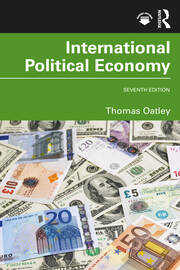
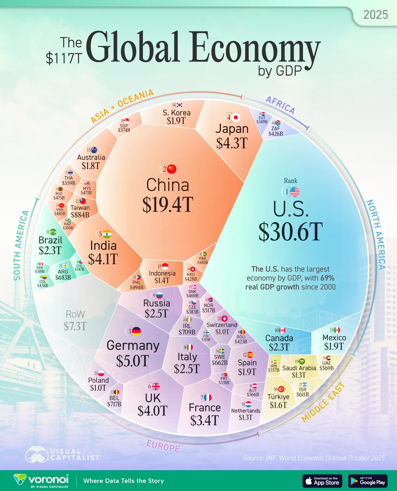
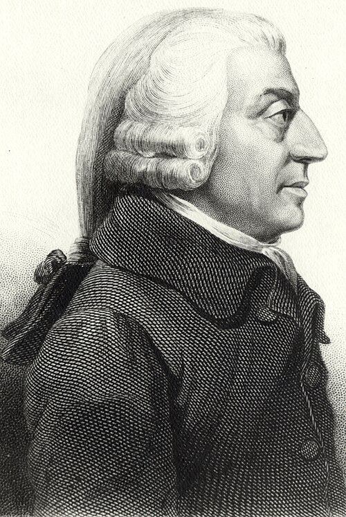
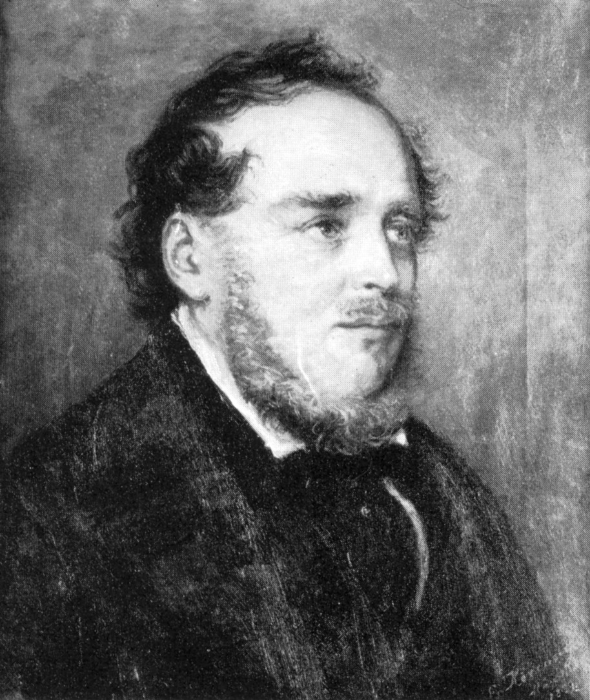
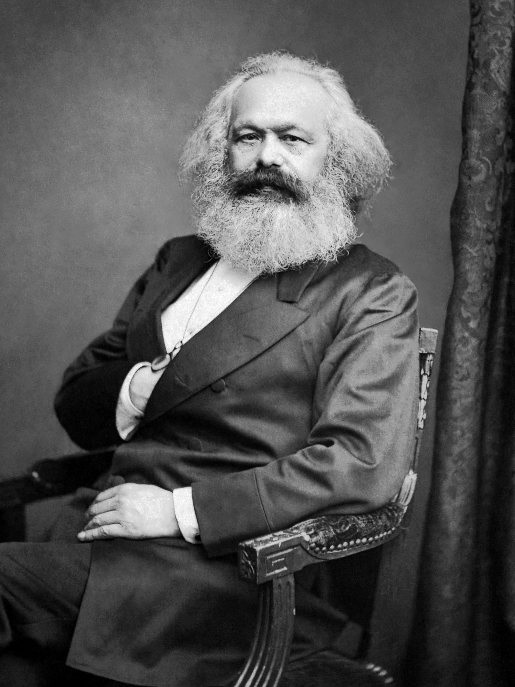

```{r}
#| label: setup
#| include: false

library(ggplot2)
library(dplyr)
library(scales)
library(knitr)
library(kableExtra)

# IU color palette
iu_crimson <- "#990000"
iu_cream <- "#EDEBEB"
iu_gray <- "#535054"
iu_light_gray <- "#7E7E7E"
iu_dark_text <- "#2C3E50"

# Custom theme for all plots
theme_ipe <- function(base_size = 14) {
  theme_minimal(base_size = base_size) +
    theme(
      plot.title = element_text(color = iu_crimson, face = "bold", size = rel(1.2),
                                margin = margin(t = 5, b = 5)),
      plot.subtitle = element_text(color = iu_gray, size = rel(0.9),
                                   margin = margin(b = 10)),
      plot.caption = element_text(color = iu_light_gray, size = rel(0.7),
                                  hjust = 0, margin = margin(t = 10)),
      axis.title = element_text(color = iu_dark_text, size = rel(0.9)),
      axis.title.x = element_text(margin = margin(t = 8)),
      axis.title.y = element_text(margin = margin(r = 8)),
      axis.text = element_text(color = iu_gray, size = rel(0.8)),
      panel.grid.minor = element_blank(),
      panel.grid.major = element_line(color = "#E5E5E5", linewidth = 0.4),
      legend.position = "bottom",
      legend.title = element_text(size = rel(0.85)),
      legend.text = element_text(size = rel(0.8)),
      plot.margin = margin(t = 8, r = 12, b = 20, l = 12)
    )
}
```

# Course Logistics {background-color="#990000"}

## Welcome to INTL 503!

::: {.columns}
::: {.column width="50%"}

**International Political Economy**

- Intensive 4-week format
- Daily meetings M/Tu/Th/F
- Lecture, discussion, and application
- Foundations through contemporary challenges

:::
::: {.column width="50%"}

::: {.callout-note appearance="minimal"}
## Summer 2026

Two readings per session (chapter + article) | ~2 hours per class
:::

:::
:::

## Your Instructor

::: {.columns}
::: {.column width="30%"}

{fig-alt="Professor Sarah Bauerle Danzman" width="90%"}

:::
::: {.column width="70%"}

**Professor Sarah Bauerle Danzman**

**Research interests:**

- Multinational Firms as Political Actors
- The Politics \& Welfare Effects of Investment Regulation
- National Security and Economic Policy (especially investment screening)
- Innovation Systems
- Political Business Connections

**Office Hours:** Wednesdays on Teams — book via [Microsoft Bookings](https://bookings.cloud.microsoft/book/ProfBDsOfficeHours@bookings.iu.edu/?ismsaljsauthenabled=true)

**Best way to reach me:** Canvas messages or sbauerle@iu.edu

:::
:::

## Course Materials

::: {.columns}
::: {.column width="22%"}

{fig-alt="Cover of Oatley, International Political Economy, 7th edition" width="95%"}

:::
::: {.column width="78%"}

**Required Text:**

Oatley, Thomas. *International Political Economy*. 7th edition. Routledge, 2023.

Available through the IU Library (e-book), campus bookstore, or online retailers.

**Scholarly Articles (Reading 2):**

One peer-reviewed article paired with the chapter on most class days. All articles posted to Canvas as PDFs or linked through the IU Library.

:::
:::

## Assignments Overview

```{r}
#| label: tbl-assignments

assignments <- data.frame(
  Component = c("Quizzes (3)", "Final Exam", "Participation & Engagement",
                "In-Class Writing Prompts", "Article Presentation & Discussion"),
  Weight = c("30%", "25%", "20%", "15%", "10%"),
  Dates = c("July 10, 17, 24", "July 31",
            "Ongoing — every class",
            "Mon/Tue/Thu — every class",
            "One per student — sign up today")
)

kable(assignments, col.names = c("Component", "Weight", "Key Dates"),
      align = c("l", "c", "l")) %>%
  kable_styling(font_size = 26, full_width = TRUE) %>%
  row_spec(0, bold = TRUE, color = "white", background = iu_crimson) %>%
  column_spec(1, bold = TRUE, width = "40%") %>%
  column_spec(2, width = "15%") %>%
  column_spec(3, width = "45%")
```

## What a Typical Class Looks Like

```{r}
#| label: tbl-session

session <- data.frame(
  Segment = c("Writing prompt", "Article presentation",
              "Lecture & concept review", "Discussion & Q&A", "Quiz"),
  Duration = c("~10 min", "~20 min", "45–60 min", "30–45 min", "~30 min"),
  Purpose = c("Mon/Tue/Thu — credit/no-credit on the day's reading",
              "Student-led discussion of the day's article (most days)",
              "The day's chapter — frameworks, applications, debates",
              "Cases, examples, and your questions",
              "Fridays of weeks 1–3 only — covers that week's material")
)

kable(session, col.names = c("Segment", "Time", "Purpose"),
      align = c("l", "c", "l")) %>%
  kable_styling(font_size = 22, full_width = TRUE) %>%
  row_spec(0, bold = TRUE, color = "white", background = iu_crimson) %>%
  column_spec(1, bold = TRUE, width = "22%") %>%
  column_spec(2, width = "13%") %>%
  column_spec(3, width = "65%")
```

*Not every segment happens every day — writing prompts skip Friday, quizzes happen only on Fridays of weeks 1–3, and presentations are most but not all days.*

## How to Read IPE Scholarship (the Articles)

::: {.columns}
::: {.column width="45%"}

**Undergraduate reading is to inform. Graduate reading is to assess** Reading and note taking for articles is synthetic.

A practical order:

1. **Abstract** — what's the claim?
2. **Conclusion** — what does the author say they showed?
3. **Introduction** — why does it matter? what gap?
4. **Lit review** — what is the 'argument space'?
5. **Findings** — what's the evidence?
6. **Methodology** — how do they find their evidence?

:::
::: {.column width="50%"}

::: {.callout-tip appearance="minimal"}
## What to write down

For every article, jot a one-page note:

- The puzzle or research question
- The main claim/proposition
- The argument space
- The kind of evidence the author uses & what they find
- The implication of the findings
- Most important/useful ways the article changed your mind
- Most important things you found unconvincing or confusing
- How the article relates to concepts being discussed in class

You will use these for quizzes, the final, and your presentation. Don't try to memorize. Synthesize.
:::

:::
:::

## Article Presentation: Sign Up Today

::: {.columns}
::: {.column width="55%"}

**Each student presents one scholarly article (Reading 2) over the term.**

Your 15–20 minute slot:

- Summarize the article — argument, evidence, conclusion (~5 min)
- Connect it to the day's Oatley chapter
- Pose 2–3 discussion questions
- Facilitate the resulting conversation

**Worth 10% of your final grade.**

:::
::: {.column width="45%"}

::: {.callout-important appearance="minimal"}
## Action items today

1. Sign up on the Canvas sheet by end of class
2. Wednesday is a reading day — use it to start reading your article early
3. **I'll model the first presentation tomorrow (Day 2)** with the WTO article so you have a clear example
:::

:::
:::

## Expectations

::: {.columns}
::: {.column width="50%"}

**From you:**

- Complete readings before class
- Engage actively and respectfully
- Submit work on time
- Communicate about challenges

:::
::: {.column width="50%"}

**From me:**

- Clear explanations and organization
- Timely feedback
- Availability for support
- Flexibility when appropriate

:::
:::

## Today's Plan

::: {.callout-important appearance="minimal" icon=false}
## Today's Big Question
**How does the global economy shape your life — and how do you shape it back?**
:::

```{r}
#| label: tbl-plan

plan <- data.frame(
  Section = c("1 · Defining IPE",
              "2 · The Stakes",
              "3 · Model of Analysis",
              "4 · Three Ways of Seeing",
              "5 · Rise, Fall, Rebuild, Rupture?",
              "6 · Writing & Discussion"),
  Cover = c("Why politics and economics can't be studied separately",
            "A $117 trillion global economy — vast, uneven, integrated",
            "Who gains, who loses, and which institutions decide",
            "Smith, List, and Marx on the politics of trade",
            "Four eras of globalization since 1815",
            "Apply the framework to a recent policy debate")
)

kable(plan, col.names = c("Section", "What we'll cover"),
      align = c("l", "l")) %>%
  kable_styling(font_size = 22, full_width = TRUE) %>%
  row_spec(0, bold = TRUE, color = "white", background = iu_crimson) %>%
  column_spec(1, bold = TRUE, color = iu_crimson, width = "32%") %>%
  column_spec(2, width = "68%")
```

# Defining IPE {background-color="#990000"}

## What is International Political Economy?

> "IPE examines the interaction between politics and economics in the international system."

**Three core questions:**

1. How do **political factors** shape international economic outcomes?
2. How do **economic factors** shape international political outcomes?
3. How do these interactions affect global **welfare and distribution**?

## The Interdependence of Politics and Economics

```{r}
#| label: fig-oil-shocks
#| fig-width: 11
#| fig-height: 2.8
#| out-width: "92%"

oil_prices <- data.frame(
  year  = c(1960, 1965, 1970, 1972, 1973, 1974, 1975, 1976,
            1977, 1978, 1979, 1980, 1981, 1982, 1983, 1985, 1986),
  price = c(1.90, 1.80, 1.80, 2.48, 3.29, 11.58, 11.53, 12.80,
            13.92, 14.02, 31.61, 36.83, 35.93, 32.38, 29.04, 27.01, 14.43)
)

ggplot(oil_prices, aes(x = year, y = price)) +
  # Highlight bands for the two shocks
  annotate("rect", xmin = 1973, xmax = 1974, ymin = 0, ymax = 42,
           fill = iu_crimson, alpha = 0.08) +
  annotate("rect", xmin = 1979, xmax = 1980, ymin = 0, ymax = 42,
           fill = iu_crimson, alpha = 0.08) +
  geom_line(color = iu_crimson, linewidth = 1.3) +
  geom_point(color = iu_crimson, size = 2) +
  # Annotations for each shock
  annotate("text", x = 1973.5, y = 36,
           label = "Oct 1973\nOPEC embargo\n(Yom Kippur War)",
           size = 3.2, color = iu_dark_text, hjust = 0.5,
           fontface = "bold", lineheight = 0.95) +
  annotate("text", x = 1979.5, y = 42,
           label = "1979\nIranian Revolution",
           size = 3.2, color = iu_dark_text, hjust = 0.5,
           fontface = "bold", lineheight = 0.95) +
  annotate("text", x = 1986, y = 20,
           label = "1986\nprice collapse",
           size = 3.0, color = iu_gray, hjust = 0.5,
           fontface = "italic", lineheight = 0.95) +
  scale_y_continuous(labels = dollar_format(), limits = c(0, 45)) +
  scale_x_continuous(breaks = c(1960, 1970, 1973, 1979, 1986),
                     limits = c(1960, 1987)) +
  labs(
    title = "Oil prices were stable for decades — then politics intervened",
    subtitle = "Crude oil price, USD per barrel, annual average",
    x = NULL, y = NULL,
    caption = "Source: BP Statistical Review of World Energy (Arabian Light 1960–1983; Brent 1984+)"
  ) +
  theme_ipe() +
  theme(plot.title.position = "plot",
        plot.caption.position = "plot")
```

::: {.columns}
::: {.column width="32%"}

**Economics alone**

Supply and demand fundamentals barely changed in October 1973. Prices quadrupled anyway.

:::
::: {.column width="32%"}

**Politics alone**

OPEC's embargo was retaliation for U.S. support of Israel in the Yom Kippur War — but political acts don't move *global prices* unless…

:::
::: {.column width="36%"}

**IPE**

…market structure makes them possible. **Politics + cartel power + Western dependence** produced a shock neither lens explains on its own.

:::
:::

::: {.notes}
This case is foundational to IPE as a field. Keohane & Nye's *Power and Interdependence* (1977) and Susan Strange's earlier work on monetary politics were direct responses to the 1973 shock — they argued that economists and political scientists each had only half the story. The October 1973 embargo was launched by Arab members of OPEC in response to U.S. resupply of Israel during the Yom Kippur War; it ended in March 1974 but the price quadrupling held. The 1979 shock was different in mechanism — uncertainty after the Iranian Revolution rather than coordinated cartel action — but had the same political-economy logic: a political event, transmitted through market structure, produced a macroeconomic crisis. The 1986 collapse is worth noting: prices can fall as well as rise, and what fell was political solidarity inside OPEC (Saudi Arabia abandoned its swing-producer role), again showing that "the price of oil" is not a market-determined number alone.
:::

# What Are the Stakes? {background-color="#990000"}

## A $117 Trillion System

::: {.columns}
::: {.column width="35%"}

**Scale:**

- 80x larger than 1960
- Top 10 economies = 67% of total

**Inequality:**

- All of Africa (54 countries) ≈ Texas
- India (1.4B) ≈ UK (67M) in GDP — despite ~20x the population

*Source: IMF World Economic Outlook (Oct 2025)*

:::
::: {.column width="65%"}



:::
:::

## Trade: The Engine of Integration

```{r}
#| label: fig-trade-explosion
#| fig-width: 10
#| fig-height: 4.5
#| out-width: "85%"

trade_data <- data.frame(
  year = c(1800, 1850, 1900, 1950, 1970, 1990, 2010, 2024),
  index = c(1, 5, 30, 100, 300, 800, 1500, 2000)
)

ggplot(trade_data, aes(x = year, y = index)) +
  geom_area(fill = "#1565C0", alpha = 0.2) +
  geom_line(color = "#1565C0", linewidth = 1.5) +
  geom_point(color = "#1565C0", size = 3) +
  annotate("text", x = 1920, y = 600,
           label = "Trade volume today is\n2,000x the 1800 level",
           size = 4.5, color = iu_dark_text, fontface = "italic") +
  scale_y_continuous(labels = comma_format()) +
  scale_x_continuous(breaks = c(1800, 1850, 1900, 1950, 1980, 2024)) +
  labs(
    title = "World Trade Volume Has Exploded Since 1800",
    subtitle = "Index of global merchandise trade (1800 = 1)",
    x = "Year",
    y = "Trade Volume Index",
    caption = "Source: Our World in Data (2024)"
  ) +
  theme_ipe()
```

## Trade as Share of the Economy

```{r}
#| label: fig-trade-gdp
#| fig-width: 10
#| fig-height: 4.5
#| out-width: "85%"

trade_gdp <- data.frame(
  year = c(1800, 1870, 1913, 1945, 1970, 1990, 2008, 2024),
  share = c(5, 10, 14, 6, 12, 19, 30, 22)
)

ggplot(trade_gdp, aes(x = year, y = share)) +
  geom_area(fill = "#2E7D32", alpha = 0.2) +
  geom_line(color = "#2E7D32", linewidth = 1.5) +
  geom_point(color = "#2E7D32", size = 3) +
  annotate("rect", xmin = 1914, xmax = 1945, ymin = 0, ymax = 32,
           fill = iu_crimson, alpha = 0.1) +
  annotate("text", x = 1930, y = 28, label = "Wars &\nDepression",
           size = 3.5, color = iu_crimson, fontface = "italic") +
  geom_hline(yintercept = 20, linetype = "dashed", color = iu_light_gray) +
  annotate("text", x = 1850, y = 22, label = "20% threshold",
           size = 3, color = iu_light_gray) +
  scale_y_continuous(labels = percent_format(scale = 1), limits = c(0, 35)) +
  scale_x_continuous(breaks = c(1800, 1870, 1913, 1945, 1970, 1990, 2024)) +
  labs(
    title = "Trade as Share of GDP: Rise, Fall, and Rebuild",
    subtitle = "Value of exported goods as a share of GDP",
    x = "Year",
    y = "Exports (% of GDP)",
    caption = "Source: Our World in Data (2024)"
  ) +
  theme_ipe()
```

## Who Trades With Whom?

```{r}
#| label: fig-trade-partners
#| fig-width: 10
#| fig-height: 4.5
#| out-width: "85%"

partners <- data.frame(
  year = rep(c(1990, 2000, 2010, 2024), each = 3),
  category = rep(c("Rich-Rich", "Rich-Other", "Other-Other"), 4),
  share = c(55, 35, 10,
            50, 35, 15,
            40, 35, 25,
            30, 35, 35)
)

partners$category <- factor(partners$category,
                            levels = c("Other-Other", "Rich-Other", "Rich-Rich"))

ggplot(partners, aes(x = year, y = share, fill = category)) +
  geom_area(alpha = 0.8) +
  scale_fill_manual(values = c("Other-Other" = "#E65100",
                                "Rich-Other" = "#1565C0",
                                "Rich-Rich" = iu_crimson),
                    labels = c("Developing-Developing",
                               "Rich-Developing",
                               "Rich-Rich")) +
  scale_y_continuous(labels = percent_format(scale = 1)) +
  scale_x_continuous(breaks = c(1990, 2000, 2010, 2024)) +
  labs(
    title = "The Global South's Rising Role in Trade",
    subtitle = "Share of global exports by income level of trade partners",
    x = "Year",
    y = "Share of Global Exports",
    fill = "Trade Partners",
    caption = "Source: Our World in Data (2024)"
  ) +
  theme_ipe() +
  theme(legend.position = "right")
```

## China: The New Center of Global Trade

::: {.columns}
::: {.column width="30%"}

**Top import partner for ~2/3 of countries**

- 2000: China $474B vs. US $2T
- 2024: China $6.2T vs. US $5.3T
- Crossover: 2012

:::
::: {.column width="70%"}

```{r}
#| label: fig-china-growth
#| fig-width: 7
#| fig-height: 5
#| out-width: "98%"

china_trade <- data.frame(
  year = c(2000, 2005, 2010, 2015, 2020, 2024),
  china = c(0.47, 1.4, 3.0, 3.9, 4.7, 6.2),
  us = c(2.0, 2.6, 3.2, 3.7, 4.1, 5.3)
)

ggplot(china_trade, aes(x = year)) +
  geom_line(aes(y = china, color = "China"), linewidth = 1.3) +
  geom_line(aes(y = us, color = "United States"), linewidth = 1.3) +
  geom_point(aes(y = china), color = iu_crimson, size = 2.5) +
  geom_point(aes(y = us), color = "#1565C0", size = 2.5) +
  geom_vline(xintercept = 2012, linetype = "dashed", color = iu_light_gray) +
  annotate("text", x = 2012, y = 6.6, label = "Crossover 2012",
           size = 3.0, color = iu_gray, hjust = 0.5, fontface = "italic") +
  scale_color_manual(values = c("China" = iu_crimson,
                                "United States" = "#1565C0")) +
  scale_x_continuous(breaks = c(2000, 2005, 2010, 2015, 2020, 2024),
                     limits = c(2000, 2024)) +
  scale_y_continuous(labels = dollar_format(suffix = "T"),
                     limits = c(0, 7)) +
  labs(
    title = "China Overtakes the U.S.",
    subtitle = "Total trade volume, trillions USD",
    x = NULL, y = NULL,
    color = NULL,
    caption = "Source: Visual Capitalist (2024)"
  ) +
  theme_ipe() +
  theme(legend.position = "bottom",
        plot.title.position = "plot",
        plot.caption.position = "plot")
```

:::
:::

## Intra-Industry Trade: The Supply Chain Era

::: {.columns}
::: {.column width="50%"}

**Trade is no longer just "wine for cloth"**

Countries increasingly trade:

- **Intermediate goods** (parts, components)
- **Similar products** (German cars for Japanese cars)

**Why it matters:**

- Your iPhone contains parts from 43+ countries
- A car crosses borders 8 times during production
- Disruptions anywhere affect everywhere

:::
::: {.column width="50%"}

```{r}
#| label: fig-intra-industry
#| fig-width: 5
#| fig-height: 2.8
#| out-width: "98%"

intra_growth <- data.frame(
  year  = c(1962, 1970, 1980, 1990, 2000, 2010, 2020),
  share = c(26,   32,   39,   45,   50,   55,   53)
)

ggplot(intra_growth, aes(x = year, y = share)) +
  geom_area(fill = iu_crimson, alpha = 0.15) +
  geom_line(color = iu_crimson, linewidth = 1.3) +
  geom_point(color = iu_crimson, size = 2.5) +
  # Annotate the 2001 China–WTO moment (interpolated)
  geom_vline(xintercept = 2001, linetype = "dashed",
             color = iu_light_gray) +
  annotate("text", x = 2001.5, y = 18,
           label = "China joins WTO",
           size = 3.0, color = iu_gray, hjust = 0,
           fontface = "italic") +
  scale_y_continuous(labels = function(x) paste0(x, "%"),
                     limits = c(0, 60)) +
  scale_x_continuous(breaks = c(1962, 1980, 2000, 2020),
                     limits = c(1960, 2022)) +
  labs(
    title = "Supply-chain trade has doubled",
    subtitle = "Intermediate goods, share of world merchandise trade",
    x = NULL, y = NULL,
    caption = "Sources: OECD TiVA; World Bank WDI"
  ) +
  theme_ipe() +
  theme(panel.grid.major.x = element_blank(),
        plot.title.position = "plot",
        plot.caption.position = "plot")
```

:::
:::

# Model of Analysis {background-color="#990000"}

## The OEP Framework

Open Economy Politics — the dominant analytical framework in contemporary US-based IPE — traces policy outcomes through **interests** → **institutions** (domestic and international) → **policy**, and the **feedback** that re-shapes interests over time.

```{r}
#| label: fig-oep-framework
#| fig-width: 10
#| fig-height: 2.6
#| out-width: "92%"

oep <- data.frame(
  x     = c(1, 3, 5, 7),
  y     = c(1.5, 1.5, 1.5, 1.5),
  label = c("Interests", "Institutions", "Policy", "Outcomes"),
  desc  = c("Who wins?\nWho loses?",
            "Domestic &\ninternational",
            "Tariffs, treaties,\nregulations",
            "New winners,\nnew losers")
)

ggplot(oep) +
  # Forward arrows between boxes
  geom_segment(aes(x = 1.6, xend = 2.4, y = 1.5, yend = 1.5),
               arrow = arrow(length = unit(0.2, "cm"), type = "closed"),
               color = iu_light_gray, linewidth = 1) +
  geom_segment(aes(x = 3.6, xend = 4.4, y = 1.5, yend = 1.5),
               arrow = arrow(length = unit(0.2, "cm"), type = "closed"),
               color = iu_light_gray, linewidth = 1) +
  geom_segment(aes(x = 5.6, xend = 6.4, y = 1.5, yend = 1.5),
               arrow = arrow(length = unit(0.2, "cm"), type = "closed"),
               color = iu_light_gray, linewidth = 1) +
  # Feedback loop
  geom_curve(aes(x = 7, xend = 1, y = 0.85, yend = 0.85),
             arrow = arrow(length = unit(0.2, "cm"), type = "closed"),
             color = iu_crimson, linewidth = 0.8, curvature = 0) +
  annotate("text", x = 4, y = 0.65, label = "Feedback loop",
           size = 3.5, color = iu_crimson, fontface = "italic") +
  # Boxes and labels
  geom_label(aes(x = x, y = y, label = label),
             fill = iu_cream, color = iu_crimson, size = 5, fontface = "bold",
             label.padding = unit(0.4, "lines"), label.size = 1) +
  geom_text(aes(x = x, y = y + 0.45, label = desc),
            size = 3.2, color = iu_gray, lineheight = 0.85) +
  coord_cartesian(xlim = c(0, 8), ylim = c(0.5, 2.15)) +
  theme_void() +
  theme(plot.margin = margin(t = 4, r = 12, b = 4, l = 12))
```

::: {.callout-tip appearance="minimal" icon=false}
## In this course
Oatley's textbook is largely an **OEP text** — the society- and state-centered models you'll see throughout the term are its core machinery. OEP isn't the only approach (we'll incorporate constructivist and historical alternatives throughout), but it dominates the contemporary U.S. school, and so we'll build off its core tenets.
:::

::: {.notes}
This slide introduces OEP — Open Economy Politics — explicitly so students recognize the textbook's methodological commitments. Lake's "Open Economy Politics: A Critical Review" (*Review of International Organizations*, 2009) is the canonical statement; it's also been criticized (including later by Lake) for narrowing the field methodologically toward rational-choice micro-foundations.

**The puzzle that motivates OEP** (worth raising in lecture even though we've dropped the standalone slide): rich countries spend roughly $400B/year on agricultural subsidies despite 30+ years of objections from developing-country exporters. They have the power to ignore the complaints — instead they argue through WTO dispute settlement, accept adverse rulings, sometimes pay compensation. The same pattern runs through TRIPS and IP disputes. *Why does global economic conflict get channeled through legal institutions rather than raw power?* OEP's answer: institutional channels reduce the cost of recurrent disputes, lock in rich countries' preferred outcomes overall, and provide a venue where powerful states can lose specific cases while winning the system as a whole.

Develop the cotton dispute in lecture: Brazil challenged US cotton subsidies at the WTO starting in 2002 and won a series of rulings between 2004 and 2009. The US ultimately negotiated a settlement in 2014 that paid Brazil $300M (the "Brazilian cotton fund") while preserving most subsidy programs. The WTO system at work — but with limits.

The TRIPS story is similar in structure: developing countries accepted strong IP rules in 1995 as part of the WTO grand bargain. They then won the 2001 Doha Declaration allowing compulsory licensing for public health emergencies, which India and Brazil have used (HIV/AIDS drugs in the early 2000s) and which the COVID vaccine waiver debates (2020–2022) revisited.
:::

## The Lumber Tariff: A Case Study

::: {.columns}
::: {.column width="45%"}

::: {.callout-note appearance="minimal" icon=false}
## April 2017
Tariffs on Canadian softwood lumber: **0% → 20%**
:::

**Who wanted this?** U.S. Lumber Coalition

**Who opposed it?** Home builders and consumers

:::
::: {.column width="55%"}

```{r}
#| label: fig-lumber-winners-losers
#| fig-width: 5.5
#| fig-height: 2.8
#| out-width: "98%"

lumber_data <- data.frame(
  group = c("U.S. Lumber Mills", "Timberland Owners",
            "Home Builders", "Home Buyers", "Canadian Producers"),
  impact = c(3, 2.5, -2.5, -2, -3.5),
  category = c("Winner", "Winner", "Loser", "Loser", "Loser")
)

lumber_data$group <- factor(lumber_data$group,
                            levels = lumber_data$group[order(lumber_data$impact)])

ggplot(lumber_data, aes(x = impact, y = group, fill = category)) +
  geom_col(width = 0.6) +
  geom_vline(xintercept = 0, color = iu_dark_text, linewidth = 0.8) +
  scale_fill_manual(values = c("Loser" = iu_crimson, "Winner" = "#2E7D32")) +
  scale_x_continuous(limits = c(-4.5, 4),
                     breaks = c(-3, 0, 3),
                     labels = c("Loss", "Neutral", "Gain")) +
  labs(
    title = "Lumber Tariff: Winners and Losers",
    subtitle = "Every trade policy redistributes income",
    x = "Economic Impact", y = NULL,
    caption = "Source: Author analysis"
  ) +
  theme_ipe() +
  theme(panel.grid.major.y = element_blank(),
        legend.position = "none",
        plot.title.position = "plot",
        plot.caption.position = "plot")
```

:::
:::

## Why Did the Mills Win?

**Concentrated benefits, diffuse costs**

```{r}
#| label: fig-concentrated-diffuse
#| fig-width: 10
#| fig-height: 1.5
#| out-width: "95%"

# Two horizontal bars, UNEQUAL length — losers' bar is longer, showing
# aggregate welfare cost > aggregate welfare benefit (the "deadweight loss"
# is the difference). Segmentation contrast preserved: few large segments
# (winners) vs many small segments (losers).
bars <- rbind(
  data.frame(group = "Winners",
             xmin = seq(0, 60, by = 20),
             xmax = seq(20, 80, by = 20)),
  data.frame(group = "Losers",
             xmin = seq(0, 118, by = 2),
             xmax = seq(2, 120, by = 2))
)

ggplot(bars) +
  geom_rect(aes(xmin = xmin, xmax = xmax,
                ymin = ifelse(group == "Winners", 1.20, 0.05),
                ymax = ifelse(group == "Winners", 2.05, 0.90),
                fill = group),
            color = "white", linewidth = 0.6) +
  scale_fill_manual(values = c("Winners" = "#2E7D32",
                               "Losers"  = iu_crimson),
                    guide = "none") +
  # Dashed line at the end of winners' bar — shows the "extra" loss
  annotate("segment", x = 80, xend = 80, y = -0.1, yend = 2.25,
           linetype = "dashed", color = iu_dark_text, linewidth = 0.4) +
  annotate("text", x = -1, y = 1.625,
           label = "Few mills:\nbig gain each",
           size = 3.4, fontface = "bold",
           color = "#2E7D32", hjust = 1, lineheight = 0.95) +
  annotate("text", x = -1, y = 0.475,
           label = "Many buyers:\ntiny cost each",
           size = 3.4, fontface = "bold",
           color = iu_crimson, hjust = 1, lineheight = 0.95) +
  annotate("text", x = 100, y = -0.25,
           label = "Welfare loss exceeds welfare gain",
           size = 3.2, fontface = "italic",
           color = iu_crimson) +
  coord_cartesian(xlim = c(-22, 124), ylim = c(-0.6, 2.3),
                  expand = FALSE) +
  theme_void() +
  theme(plot.margin = margin(2, 6, 2, 6))
```

::: {style="font-size: 0.82em;"}

::: {.columns}
::: {.column width="50%"}

**Organization matters**

- Lumber Coalition: decades of lobbying
- Home buyers: no unified voice
- It pays mills to lobby; not worth $2 to any individual buyer

:::
::: {.column width="50%"}

**Institutions matter**

- Executive authority over trade remedies
- No Congressional vote required
- WTO allows "injury" findings

:::
:::

:::

::: {.callout-important appearance="minimal"}
## Core Insight
Concentrated, organized interests often beat diffuse, unorganized majorities **even if they impose aggregate welfare costs**. This is a *Collective Action Failure* (Mancur Olson, 1965).
:::

## Four Issue Areas of IPE

```{r}
#| label: tbl-four-areas

areas <- data.frame(
  Area = c("International Trade",
           "Monetary System",
           "Multinational Corporations",
           "Economic Development"),
  Question = c("Who benefits from trade? Why protect some industries?",
               "Who controls exchange rates? How do currencies interact?",
               "Why do firms go global? How do states regulate them?",
               "Why are some countries rich? What strategies work?"),
  Actors = c("Exporters, import-competing firms, consumers",
             "Central banks, finance ministries, traders",
             "MNCs, host & home governments",
             "Developing states, IFIs, NGOs"),
  check.names = FALSE
)

kable(areas, col.names = c("Issue Area", "Key Question", "Key Actors"),
      align = c("l", "l", "l")) %>%
  kable_styling(font_size = 20, full_width = TRUE) %>%
  row_spec(0, bold = TRUE, color = "white", background = iu_crimson) %>%
  column_spec(1, bold = TRUE, width = "18%", color = iu_crimson) %>%
  column_spec(2, width = "47%") %>%
  column_spec(3, width = "35%")
```

# Three Ways of Seeing {background-color="#990000"}

## The Founders of IPE Thought

IPE draws on three intellectual traditions, each asking a different question about the global economy.

::: {.columns}
::: {.column width="33%"}

::: {style="text-align: center; color: #2E7D32; font-size: 5em; margin: 0.4em 0 0.2em 0;"}

:::

### Liberalism
*How does trade serve individual welfare?*

:::
::: {.column width="33%"}

::: {style="text-align: center; color: #990000; font-size: 5em; margin: 0.4em 0 0.2em 0;"}

:::

### Economic Nationalism
*How does trade serve national power?*

:::
::: {.column width="34%"}

::: {style="text-align: center; color: #5E35B1; font-size: 5em; margin: 0.4em 0 0.2em 0;"}

:::

### Marxism
*How does trade distribute wealth between classes?*

:::
:::

## Adam Smith (1723--1790): The Liberal Vision

::: {.columns}
::: {.column width="35%"}

{width="85%"}

:::
::: {.column width="65%"}

### *The Wealth of Nations* (1776)

- Division of labor increases productivity
- Free markets allocate resources efficiently
- Trade benefits all parties---not zero-sum
- The state should protect property, not direct production

**Legacy:** Foundation of classical economics; "invisible hand" as metaphor for market coordination.

:::
:::

## Friedrich List (1789--1846): The Nationalist Response

::: {.columns}
::: {.column width="35%"}

{width="85%"}

:::
::: {.column width="65%"}

### *The National System of Political Economy* (1841)

- Free trade benefits the *already* powerful (Britain)
- Infant industries need temporary protection
- Manufacturing capability = national strength
- Individual gain ≠ national interest

**Legacy:** Influenced Germany, the U.S. (Hamilton), Japan, and modern industrial policy debates.

:::
:::

## Karl Marx (1818--1883): The Class Critique

::: {.columns}
::: {.column width="35%"}

{width="85%"}

:::
::: {.column width="65%"}

### *Das Kapital* (1867)

- Capitalism exploits workers (surplus value)
- The state serves the capitalist class
- Economic crises are systemic, not accidental
- Class conflict---not harmony---drives history

**Legacy:** Shaped labor movements, socialist states, and critical analysis of inequality in the global economy.

:::
:::

## Comparing the Three Schools

```{r}
#| label: tbl-schools

schools <- data.frame(
  Dimension = c("Key Actor", "View of Trade", "State's Role", "System Image"),
  Liberalism = c("Individuals", "Mutual benefit", "Protect rights", "Harmonious"),
  Nationalism = c("The State", "Tool of power", "Guide economy", "Competitive"),
  Marxism = c("Classes", "Exploitation", "Serves capital", "Conflictual")
)

kable(schools, col.names = c("", "Liberalism", "Economic Nationalism", "Marxism"),
      align = c("l", "c", "c", "c")) %>%
  kable_styling(font_size = 22, full_width = FALSE) %>%
  row_spec(0, bold = TRUE, color = "white", background = iu_crimson) %>%
  column_spec(1, bold = TRUE, color = iu_gray)
```

## How the Schools Align with Frameworks

::: {.columns}
::: {.column width="50%"}

**Societal explanations**

- *Liberalism* emphasizes individuals and interest groups
- Winners and losers organize politically
- Policy reflects aggregated preferences

**State/class explanations**

- *Economic nationalism* sees the state as autonomous actor
- *Marxism* sees class structure as determinative

:::
::: {.column width="50%"}

::: {.callout-note appearance="minimal"}
## What About Constructivism?

Constructivists ask: *Where do interests come from?*

- Ideas become "social facts"
- Shape how actors understand their interests
- Define what worlds seem possible

Example: "Free trade is good" became common sense---but wasn't always.
:::

:::
:::

::: {.callout-tip appearance="minimal"}
We draw on all three schools but focus on how **interests** and **institutions** interact---without assuming markets always work, states always seek power, or class conflict explains everything.
:::

# Rise, Fall, Rebuild, Rupture? {background-color="#990000"}

## Two Centuries of Globalization

```{r}
#| label: fig-timeline
#| fig-width: 12
#| fig-height: 3.4
#| out-width: "90%"
#| fig-align: center

# Era band colors
era_green  <- "#2E7D32"
era_blue   <- "#1565C0"

# Era definitions: bounds, label position, color
# Note: Rupture? era is stretched to 2032 visually so its labels
# have horizontal room — actual events span 2016–present
eras <- data.frame(
  era       = factor(c("Rise", "Fall", "Rebuild", "Rupture?"),
                     levels = c("Rise", "Fall", "Rebuild", "Rupture?")),
  xmin      = c(1815, 1914, 1945, 2018),
  xmax      = c(1914, 1945, 2018, 2032),
  era_color = c(era_green, iu_crimson, era_blue, iu_crimson),
  alpha     = c(0.10, 0.10, 0.10, 0.06)
)
eras$xmid <- (eras$xmin + eras$xmax) / 2

# Date markers along the timeline — 1944/45 combined to avoid label collision
dates <- data.frame(
  year  = c(1815, 1914, 1929, 1944.5, 1995, 2008, 2018),
  label = c("1815", "1914", "1929", "1944–45", "1995", "2008", "2018")
)

# Event bullets per era — \n becomes a line break
events <- data.frame(
  xmid = eras$xmid,
  text = c("Railroads\nGold standard\nCorn Laws repeal",
           "WWI\nDepression\nSmoot-Hawley",
           "Bretton Woods\nGATT → WTO\nEmbedded liberalism",
           "Trade wars\nBrexit\nDecoupling")
)

# Stylized Trade/GDP curve — rises in Rise, collapses in Fall,
# recovers in Rebuild, dips in Rupture
trade_curve <- data.frame(
  year  = c(1815, 1870, 1914, 1929, 1945, 1980, 2008, 2018, 2030),
  trade = c(-1.4, -0.7, -0.5, -1.6, -1.7, -0.8, -0.3, -0.6, -1.1)
)

ggplot() +
  # Era bands
  geom_rect(data = eras,
            aes(xmin = xmin, xmax = xmax, ymin = -2.1, ymax = 2.4,
                fill = era, alpha = alpha)) +
  scale_fill_manual(values = setNames(eras$era_color, eras$era),
                    guide = "none") +
  scale_alpha_identity() +
  # Timeline axis
  geom_hline(yintercept = 0, color = iu_gray, linewidth = 0.9) +
  # Era titles
  geom_text(data = eras,
            aes(x = xmid, y = 2.0, label = era, color = era),
            size = 6, fontface = "bold") +
  scale_color_manual(values = setNames(eras$era_color, eras$era),
                     guide = "none") +
  # Event bullets
  geom_text(data = events,
            aes(x = xmid, y = 1.0, label = text),
            size = 3.4, color = iu_gray, lineheight = 0.95) +
  # Date markers (vertical ticks + labels)
  geom_segment(data = dates,
               aes(x = year, xend = year, y = -0.25, yend = 0.25),
               color = iu_dark_text, linewidth = 0.7) +
  geom_text(data = dates,
            aes(x = year, y = -0.6, label = label),
            size = 3.5, color = iu_dark_text, fontface = "bold") +
  # Stylized Trade/GDP curve
  geom_line(data = trade_curve,
            aes(x = year, y = trade),
            color = iu_crimson, linewidth = 1.3) +
  annotate("text", x = 2030, y = -1.5,
           label = "Trade / GDP", color = iu_crimson,
           fontface = "italic", size = 3.5, hjust = 1) +
  coord_cartesian(xlim = c(1808, 2034), ylim = c(-2.3, 2.5),
                  expand = FALSE) +
  labs(
    title    = "Two Centuries of Globalization",
    subtitle = "Trade-as-share-of-GDP rises, collapses, rebuilds — and now?"
  ) +
  theme_void() +
  theme(
    plot.title    = element_text(color = iu_crimson, face = "bold",
                                 size = 18, hjust = 0.5,
                                 margin = margin(t = 4, b = 2)),
    plot.subtitle = element_text(color = iu_gray, size = 12, hjust = 0.5,
                                 margin = margin(b = 10)),
    plot.margin   = margin(t = 8, r = 14, b = 12, l = 14)
  )
```

## The First Globalization (1815--1914)

::: {.columns}
::: {.column width="50%"}

```{r}
#| label: fig-shipping-costs
#| fig-width: 5
#| fig-height: 2.6
#| out-width: "98%"

shipping <- data.frame(
  year = c(1830, 1850, 1870, 1900),
  cost = c(30, 18, 10, 5)
)

ggplot(shipping, aes(x = year, y = cost)) +
  geom_line(color = iu_crimson, linewidth = 1.2) +
  geom_point(color = iu_crimson, size = 2.5) +
  geom_text(aes(label = paste0("$", cost)), vjust = -1, size = 3.5,
            color = iu_dark_text) +
  scale_y_continuous(limits = c(0, 38), labels = dollar_format()) +
  scale_x_continuous(breaks = c(1830, 1850, 1870, 1900)) +
  labs(title = "Shipping Costs Collapsed",
       subtitle = "Cost per ton of grain, 300 miles",
       x = NULL, y = NULL,
       caption = "Source: Frieden (2006)") +
  theme_ipe() +
  theme(plot.title.position = "plot",
        plot.caption.position = "plot")
```

:::
::: {.column width="50%"}

**Technology made it possible:**

- Railroads, steamships slashed costs
- Telegraph enabled coordination

**Politics made it real:**

- Britain repeals Corn Laws (1846)
- Gold standard stabilizes currencies

:::
:::

## The Collapse (1914--1945)

::: {.columns}
::: {.column width="50%"}

**WWI:** Gold standard abandoned, trade controls imposed

**Depression:** U.S. output falls 30%, Smoot-Hawley, beggar-thy-neighbor

**Result:** World fragments into hostile blocs.

:::
::: {.column width="50%"}

```{r}
#| label: fig-depression
#| fig-width: 5
#| fig-height: 2.6
#| out-width: "95%"

depression <- data.frame(
  country = c("Germany", "USA", "UK", "France"),
  unemployment = c(30, 25, 22, 5)
)

depression$country <- factor(depression$country,
                             levels = c("France", "UK", "USA", "Germany"))

ggplot(depression, aes(x = country, y = unemployment,
                       fill = country == "Germany")) +
  geom_col(width = 0.6) +
  geom_text(aes(label = paste0(unemployment, "%"),
                color = country == "Germany"),
            vjust = -0.5, size = 4, fontface = "bold") +
  scale_fill_manual(values = c("FALSE" = "#B8B8B8",
                               "TRUE"  = iu_crimson),
                    guide = "none") +
  scale_color_manual(values = c("FALSE" = iu_gray,
                                "TRUE"  = iu_crimson),
                     guide = "none") +
  scale_y_continuous(limits = c(0, 40)) +
  labs(title = "Depression Unemployment",
       subtitle = "Peak unemployment rate, ~1932–33",
       x = NULL, y = NULL,
       caption = "Sources: Maddison; Mitchell, Intl. Historical Statistics") +
  theme_ipe() +
  theme(panel.grid.major.x = element_blank(),
        plot.title.position = "plot",
        plot.caption.position = "plot")
```

:::
:::

## The Reconstruction: Bretton Woods (1944) and Beyond

**Lessons learned:** economic collapse fueled fascism and war; American leadership was essential. Bretton Woods created the **IMF** and **IBRD (World Bank)**; the trade pillar — originally envisioned as the ITO at Havana — emerged separately as **GATT (1947)** after the ITO failed in the U.S. Senate. Together these three institutions form what we now call the postwar economic order.

```{r}
#| label: fig-bretton-woods
#| fig-width: 10
#| fig-height: 2.4
#| out-width: "95%"

institutions <- data.frame(
  x       = c(1.5, 4.0, 6.5),
  y       = c(1.5, 1.5, 1.5),
  name    = c("IMF", "World Bank", "GATT → WTO"),
  founded = c("(1944)", "(1944)", "(1947 → 1995)"),
  purpose = c("Stabilize\ncurrencies",
              "Finance\nreconstruction & development",
              "Reduce\ntrade barriers")
)

ggplot(institutions) +
  # Top header connecting line
  annotate("segment", x = 0.6, xend = 7.4, y = 2.55, yend = 2.55,
           color = iu_crimson, linewidth = 0.7) +
  annotate("text", x = 4, y = 2.85,
           label = "The Postwar Economic Order",
           fontface = "bold", color = iu_crimson, size = 6.5) +
  # Institution boxes
  geom_label(aes(x = x, y = y, label = name),
             fill = iu_cream, color = iu_crimson,
             size = 6, fontface = "bold",
             label.padding = unit(0.55, "lines"),
             label.size = 1) +
  # Founded years
  geom_text(aes(x = x, y = y - 0.42, label = founded),
            size = 3.2, color = iu_gray, fontface = "italic") +
  # Purpose descriptions
  geom_text(aes(x = x, y = y - 0.95, label = purpose),
            size = 3.7, color = iu_dark_text, lineheight = 0.95) +
  coord_cartesian(xlim = c(0, 8), ylim = c(0.2, 3.1), expand = FALSE) +
  theme_void() +
  theme(plot.margin = margin(2, 4, 2, 4))
```

::: {.callout-important appearance="minimal"}
## Embedded Liberalism
The postwar bargain: free trade **between** countries, policy autonomy **within** countries, safety nets permitted. This compromise held for 40 years.
:::

## {background-color="#000000"}



*The signing of the Bretton Woods Agreement, 1944*

## Today's Challenges

::: {.columns}
::: {.column width="33%"}

### Populism

<div style="background: #EDEBEB; border-left: 4px solid #990000; padding: 0.5em 0.7em; margin: 0.4em 0 0.6em 0;">
<strong style="color: #990000; font-size: 1.15em;">1.5% → 15–25%*</strong><br>
<span style="font-size: 0.85em; color: #535054;">US avg. tariff rate, 2017 → 2026<br><em>*figure remains in flux after</em> Learning Resources v. Trump <em>(Feb 2026)</em></span>
</div>

- Trump tariffs (2018--)
- Brexit (2016)
- Industrial policy revival

:::
::: {.column width="33%"}

### Great Power Rivalry

<div style="background: #EDEBEB; border-left: 4px solid #990000; padding: 0.5em 0.7em; margin: 0.4em 0 0.6em 0;">
<strong style="color: #990000; font-size: 1.15em;">22% → 13%</strong><br>
<span style="font-size: 0.85em; color: #535054;">China's share of US imports, 2018 → 2024</span>
</div>

- Technology decoupling
- Supply chain "reshoring"
- Economic statecraft

:::
::: {.column width="34%"}

### Climate Crisis

<div style="background: #EDEBEB; border-left: 4px solid #990000; padding: 0.5em 0.7em; margin: 0.4em 0 0.6em 0;">
<strong style="color: #990000; font-size: 1.15em;">$369 billion</strong><br>
<span style="font-size: 0.85em; color: #535054;">IRA green-industrial subsidies, US (2022)</span>
</div>

- Carbon border taxes
- Green subsidies race
- New governance gaps

:::
:::

# A Precipice? {background-color="#990000"}


## {background-color="#000000"}



*Mark Carney at World Economic Forum, Davos --- January 2026*


# Key Takeaways {background-color="#990000"}

## What to Remember

1. **IPE = Politics + Economics** --- neither in isolation

2. **Every policy creates winners and losers** --- they organize and fight (these are Distributional Consequences)

3. **Interests + Institutions** = our analytical framework (Open Economy Politics)

4. **Three traditions, different lenses** --- Liberalism, Mercantilism, Marxism

5. **Understand empirical trends** --- cycles of globalization, size of economy, trade, and its nature/composition.

6. **We're living through a potential rupture** --- how will IPE have to adjust?

## Looking Ahead

### Next Class (Tuesday, July 7): The WTO and the World Trade System

- What is the WTO and how does it work?
- Why do countries voluntarily limit their sovereignty?
- Are regional agreements friends or foes of global trade?

**Preparation — two readings:**

1. Oatley, Chapter 2
2. The scholarly article posted on Canvas (Reading 2)

*I will model the article presentation tomorrow — come ready to see how it's done before your own slot comes up.*

*Guiding question: If free trade benefits everyone, why is it so politically difficult?*

# Writing Activity {background-color="#990000"}

## In-Class Writing (~10 minutes)

::: {.callout-important appearance="minimal" icon=false}
## Prompt

Pick **one recent economic policy debate** in the news (a tariff, an investment screening, a subsidy, a sanction — anything).

In a few short paragraphs:

1. Who **wins** and who **loses** from the policy?
2. Which of the three schools — **liberalism, nationalism, or Marxism** — best explains the government's rationale?
:::

**No AI. Submit in the Canvas assignment for today.**

## Share-Out (~15 minutes)

::: {.columns}
::: {.column width="50%"}

### Pair (6 min)

- Share your case (3 min each)
- Identify one similarity, one difference

:::
::: {.column width="50%"}

### Class (9 min)

- What patterns emerged?
- Were certain schools more common?
- What surprised you?

:::
:::

# Questions? {background-color="#990000"}

## Contact

**Office Hours:** Wednesdays on Teams — book via [Microsoft Bookings](https://bookings.cloud.microsoft/book/ProfBDsOfficeHours@bookings.iu.edu/?ismsaljsauthenabled=true)

**Email:** sbauerle@iu.edu

**Canvas:** Announcements, readings, assignments
