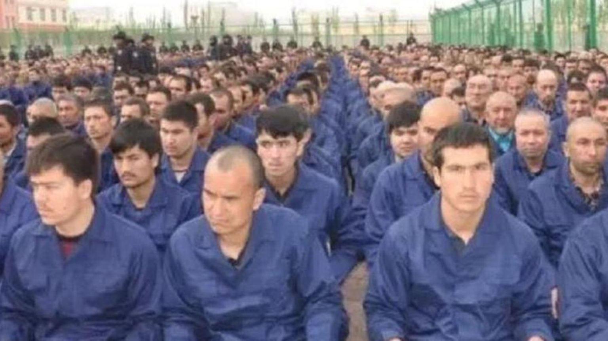

```{r}
#| label: setup
#| include: false

library(ggplot2)
library(dplyr)
library(scales)
library(knitr)
library(kableExtra)

# IU color palette
iu_crimson <- "#990000"
iu_cream <- "#EDEBEB"
iu_gray <- "#535054"
iu_light_gray <- "#7E7E7E"
iu_dark_text <- "#2C3E50"

# Custom theme for all plots
theme_ipe <- function(base_size = 20) {
  theme_minimal(base_size = base_size) +
    theme(
      plot.title = element_text(color = iu_crimson, face = "bold", size = rel(1.2),
                                margin = margin(t = 5, b = 5)),
      plot.subtitle = element_text(color = iu_gray, size = rel(0.9),
                                   margin = margin(b = 10)),
      plot.caption = element_text(color = iu_light_gray, size = rel(0.7),
                                  hjust = 0, margin = margin(t = 10)),
      axis.title = element_text(color = iu_dark_text, size = rel(0.9)),
      axis.title.x = element_text(margin = margin(t = 8)),
      axis.title.y = element_text(margin = margin(r = 8)),
      axis.text = element_text(color = iu_gray, size = rel(0.8)),
      panel.grid.minor = element_blank(),
      panel.grid.major = element_line(color = "#E5E5E5", linewidth = 0.4),
      legend.position = "bottom",
      legend.title = element_text(size = rel(0.85)),
      legend.text = element_text(size = rel(0.8)),
      plot.margin = margin(t = 8, r = 12, b = 20, l = 12)
    )
}
```

## Today's Plan

::: {.callout-important appearance="minimal" icon=false}
## Today's Big Question
**How did the world build a rules-based system to keep markets open — and what has that system made possible?**
:::

```{r}
#| label: tbl-plan

plan <- data.frame(
  Section = c("1 · The Leader's Dilemma",
              "2 · What Is the WTO?",
              "3 · Who Pays for Open Trade?",
              "4 · The System Under Pressure",
              "5 · What the WTO Made Possible",
              "6 · Article presentation (instructor models)",
              "7 · Writing & Discussion"),
  Cover = c("Why open trade needs rules to survive domestic politics",
            "Principles, the legal nuts and bolts, S&DT, dispute settlement",
            "Hegemonic stability and the public-goods problem",
            "Doha stalemate, regional trade agreements, values clash",
            "Global value chains — from Toyota to ASML",
            "Today's Reading 2 article — see modeled structure",
            "Apply the framework to a current case")
)

kable(plan, col.names = c("Section", "What we'll cover"),
      align = c("l", "l")) %>%
  kable_styling(font_size = 22, full_width = TRUE) %>%
  row_spec(0, bold = TRUE, color = "white", background = iu_crimson) %>%
  column_spec(1, bold = TRUE, color = iu_crimson, width = "32%") %>%
  column_spec(2, width = "68%")
```


# The Empirical Background {background-color="#990000"}


## Trade Has Been Transformed - Because of the Post-War, U.S.-led System

::: {.columns}
::: {.column width="33%"}

### Bigger

<p style="font-size: 1.8em; font-weight: 700; color: #990000; margin: 0.2em 0;">$84B → $25T</p>

World merchandise trade, **1953 → 2022**. Roughly **6% annual growth** — consistently outpacing GDP across the same period.

:::
::: {.column width="33%"}

### Different geography

<p style="font-size: 1.8em; font-weight: 700; color: #990000; margin: 0.2em 0;"><1% → ~15%</p>

China's share of world exports, **1980 → today**. Emerging markets now account for nearly **half** of world trade — a fundamental shift in who's in the system.

:::
::: {.column width="34%"}

### Qualitatively complex

<p style="font-size: 1.8em; font-weight: 700; color: #990000; margin: 0.2em 0;">~55% intermediates</p>

Trade is no longer "wine for cloth." More than half of world trade is now in **components, parts, and semi-finished goods** crossing borders multiple times.

:::
:::

::: {.callout-important appearance="minimal" icon=false}
Economic globalization occurs because of international rules. Trade at this scale and complexity depends on the certainty that components won't be arbitrarily blocked at borders. Rapid economic development through export-led growth (like China) requires that other countries open their borders to your goods.
:::

::: {.notes}
Three empirical claims from the chapter opening. (1) Trade grew from $84B in 1953 to roughly $25T in 2022 — about 6% per year, consistently outpacing GDP growth. (Note: Oatley's text uses the COVID-depressed 2020 endpoint of $17T; I'm using the 2022 figure for currency.) (2) The geographic composition shifted dramatically: emerging markets, especially China (under 1% of world exports in 1980 to ~15% today), now account for nearly half of global trade. The WTO was designed when advanced economies generated ~80% of trade; that assumption no longer holds. (3) Trade is qualitatively different: ~55% of trade is now in intermediate goods — components moving across borders before reaching consumers. None of this happens without stable rules, which is the puzzle the rest of the lecture addresses.
:::

# The Leader's Dilemma {background-color="#990000"}

## A Reminder from Day 1

::: {.callout-tip appearance="minimal" icon=false}
## Why governments need *external* rules
Every tariff redistributes income — **few winners with big gains, many losers with small costs.** Concentrated, organized interests outweigh diffuse, unorganized majorities: this is a **collective action failure** (Olson, 1965). 

Governments need *external* rules — and a mechanism to enforce them — to keep each other honest. The WTO exists to **set expectations for behavior**, **lower transaction costs to negotiating agreements**, **make clear when countries are abided by or evading their commitments**, and to **bind their hands**.
:::

```{r}
#| label: fig-steel-asymmetry
#| fig-width: 11
#| fig-height: 2.3
#| out-width: "95%"
#| fig-alt: "Bar chart showing the asymmetry of U.S. steel tariffs (Section 232, 2018): $2.4 billion in producer benefits saving roughly 8,700 steel jobs, against $5.6 billion in costs to 128 million U.S. households — about $44 per household, but roughly $650,000 in consumer cost per saved steel job."

steel <- data.frame(
  group = c("Benefits to producers\n(~8,700 steel jobs saved)",
            "Costs to consumers\n(128 million households)"),
  value = c(2.4, 5.6),
  per_unit = c("concentrated gain",
               "~$44 per household · ~$650K per saved job"),
  type = c("Benefit", "Cost")
)

steel$group <- factor(steel$group, levels = steel$group)

ggplot(steel, aes(x = value, y = group, fill = type)) +
  geom_col(width = 0.55) +
  geom_text(aes(label = paste0("$", value, "B  ·  ", per_unit)),
            hjust = -0.05, size = 4.2, fontface = "bold",
            color = iu_dark_text) +
  scale_fill_manual(values = c("Benefit" = "#2E7D32",
                               "Cost"    = iu_crimson),
                    guide = "none") +
  scale_x_continuous(limits = c(0, 9.5),
                     labels = dollar_format(suffix = "B")) +
  labs(
    title = "U.S. steel tariffs: a concrete example",
    subtitle = NULL,
    x = NULL, y = NULL,
    caption = "Source: Hufbauer & Lu, Peterson Institute for International Economics (2018), 'Steel and Aluminum Tariffs'"
  ) +
  theme_ipe() +
  theme(panel.grid.major.y = element_blank(),
        plot.title.position = "plot",
        plot.caption.position = "plot",
        axis.text.x = element_blank(),
        axis.ticks.x = element_blank(),
        panel.grid.major.x = element_blank())
```

::: {.notes}
The Olson framing in the callout above is the core logic — now the chart makes it concrete with real numbers from PIIE's 2018 analysis of the Section 232 steel and aluminum tariffs (Hufbauer & Lu). The tariffs delivered roughly $2.4 billion in benefits to U.S. steel producers, preserving about 8,700 steel jobs that would otherwise have been lost. The same tariffs cost American households about $5.6 billion — spread over 128 million households, that's about $44 each. No individual household will fight over $44. So the policy passes — even though the aggregate welfare math is sharply *negative*: the cost to consumers per saved steel job worked out to roughly $650,000. That number is the killer. We are paying $650K in consumer cost to save a steel job that pays a fraction of that. This is exactly the collective-action failure Olson described. It's why governments build external rules: not because they don't know the math, but because their domestic politics make the math irrelevant.
:::


## What Happens Without Rules

```{r}
#| label: fig-trade-collapse
#| fig-width: 13
#| fig-height: 6.5
#| out-width: "95%"
#| fig-alt: "Bar chart showing world trade collapsing from $2,858 million per month in 1929 to $1,122 million in 1932 — a 61% decline in three years after Smoot-Hawley tariffs triggered retaliatory spirals."

collapse <- data.frame(
  year = c(1929, 1930, 1931, 1932),
  trade = c(2858, 2327, 1668, 1122)
)

ggplot(collapse, aes(x = factor(year), y = trade)) +
  geom_col(fill = iu_crimson, width = 0.55) +
  geom_text(aes(label = paste0("$", comma(trade))), vjust = -0.5, size = 7,
            fontface = "bold", color = iu_dark_text) +
  annotate("segment", x = 1.2, xend = 3.8, y = 2858, yend = 1122,
           linetype = "dashed", color = iu_light_gray, linewidth = 0.6) +
  annotate("text", x = 3.2, y = 2200, label = "−61%",
           size = 10, color = iu_crimson, fontface = "bold") +
  scale_y_continuous(limits = c(0, 3500), labels = comma_format()) +
  labs(
    title = "World Trade Collapsed in Three Years",
    subtitle = "Average monthly world trade ($US millions)",
    x = NULL, y = NULL,
    caption = "Source: Kindleberger (1973), The World in Depression"
  ) +
  theme_ipe() +
  theme(panel.grid.major.x = element_blank())
```

::: {.notes}
Smoot-Hawley, 1930. The U.S. raises tariffs on over 20,000 goods. Canada retaliates immediately. Britain abandons free trade in 1932. France and Germany impose quotas. World trade falls 61% in three years. This is the formative experience for the generation that built the postwar trading system. The lesson they took: without rules to constrain the political temptation to protect, the system unravels — and everyone loses. That lesson is the origin story of the GATT and ultimately the WTO.
:::


# What Is the WTO? {background-color="#990000"}


## The WTO at a Glance

::: {.columns}
::: {.column width="35%"}

::: {style="line-height: 2; font-size: 1.05em;"}
 &nbsp; Founded **1995** *(replacing GATT, 1947–94)*

 &nbsp; **Geneva**, Switzerland

 &nbsp; **166** members

 &nbsp; **~625** staff
:::

<div style="background: #EDEBEB; border-left: 5px solid #990000; padding: 0.7em 1em; margin: 0.9em 0 0.5em 0;">
<div style="font-size: 1.9em; font-weight: 700; color: #990000; line-height: 1;">~$240M / yr</div>
<div style="font-size: 0.78em; color: #535054; margin-top: 0.5em; line-height: 1.4;">
CHF 215M (2025 budget) <br>
&approx; <em>The Marvels</em> (2023): ~$270M
</div>
</div>

<p style="font-size: 0.78em; color: #535054; font-style: italic; line-height: 1.35;">A $25 trillion trading system, run on roughly the cost of one Marvel movie.</p>

:::
::: {.column width="65%"}

```{r}
#| label: fig-wto-functions
#| fig-width: 8
#| fig-height: 4.3
#| out-width: "98%"
#| fig-alt: "Diagram showing the WTO's three core functions — Forum (where members negotiate new rules), Administrator (of roughly 60 trade agreements), and Dispute resolver (issuing binding rulings on member conflicts) — with arrows converging downward into a single WTO Rules output box at the bottom."

ggplot() +
  # Header banner: rule + label
  annotate("segment", x = 0.5, xend = 7.5, y = 3.6, yend = 3.6,
           color = iu_crimson, linewidth = 0.7) +
  annotate("text", x = 4, y = 3.9,
           label = "What the WTO does",
           fontface = "bold", color = iu_crimson, size = 6) +
  # Three function boxes
  geom_label(data = data.frame(
               x = c(1.5, 4, 6.5),
               y = 2.9,
               label = c("Forum", "Administrator", "Dispute resolver")),
             aes(x = x, y = y, label = label),
             fill = iu_cream, color = iu_crimson, size = 5.5,
             fontface = "bold",
             label.padding = unit(0.55, "lines"), label.size = 1) +
  # Descriptions below each function box
  geom_text(data = data.frame(
              x = c(1.5, 4, 6.5),
              y = 2.15,
              desc = c("Members negotiate\nnew rules",
                       "~60 trade\nagreements",
                       "Binding rulings on\nmember disputes")),
            aes(x = x, y = y, label = desc),
            size = 3.4, color = iu_gray, lineheight = 0.95) +
  # Arrows converging downward to the Rules box
  geom_segment(data = data.frame(x = c(1.5, 4, 6.5)),
               aes(x = x, xend = 4, y = 1.55, yend = 0.95),
               arrow = arrow(length = unit(0.18, "cm"), type = "closed"),
               color = iu_light_gray, linewidth = 0.8) +
  # Rules output box (crimson)
  geom_label(aes(x = 4, y = 0.55,
                 label = "WTO Rules · ~30,000 pages of binding trade law"),
             fill = iu_crimson, color = "white", size = 4.5,
             fontface = "bold",
             label.padding = unit(0.5, "lines"), label.size = 0) +
  coord_cartesian(xlim = c(0, 8), ylim = c(0, 4.2), expand = FALSE) +
  theme_void() +
  theme(plot.margin = margin(2, 4, 2, 4))
```

<p style="text-align: center; font-size: 0.65em; font-style: italic; color: #535054; margin-top: 0.4em;">For the full institutional structure (Ministerial Conference, General Council, councils, committees), see the <a href="https://www.wto.org/english/thewto_e/whatis_e/tif_e/organigram_e.pdf">WTO organization chart</a>.</p>

:::
:::

::: {.notes}
The WTO is remarkably small for what it does. 625 people administering the rules of a $25 trillion global trading system. It does three things: provides a forum for governments to negotiate trade agreements, administers the roughly 60 agreements that already exist, and resolves disputes when governments disagree about whether someone is following the rules. It doesn't make trade policy — it provides the rules of the game.
:::


## Three Foundational Principles

::: {.columns}
::: {.column width="33%"}

::: {style="font-size: 1.18em;"}
::: {.callout-note appearance="minimal"}
## Market Liberalism

- Open trade raises the world's standard of living. Gains are greatest when goods flow freely across borders
- Does not imply tariffs are never acceptable, but that they should be exception

*Based on the logic of **comparative advantage** (Ch. 3).*
:::
:::

:::
::: {.column width="33%"}

::: {style="font-size: 1.18em;"}
::: {.callout-note appearance="minimal"}
## Nondiscrimination

Every WTO member faces identical trading opportunities with every other member.

- **Most Favored Nation (MFN)** — cut a tariff for one, cut it for all
- **National treatment** — foreign goods, once admitted, treated like domestic
:::
:::

:::
::: {.column width="34%"}

::: {style="font-size: 1.18em;"}
::: {.callout-note appearance="minimal"}
## Special & Differential Treatment

Developing countries get **non-reciprocal** access and **better-than-MFN** tariffs from richer members.

- Treaty basis: **GATT Part IV** (1965) + the **Enabling Clause** (1979)
- Lets developing countries join without matching concession-for-concession
:::
:::

:::
:::

::: {.notes}
Three principles, not two. Market liberalism is the economic rationale — the claim that open trade is beneficial, based on comparative advantage (which we'll do in Ch. 3). Nondiscrimination is the political architecture: MFN (whatever you give one member, you give all) and national treatment (foreign goods get the same domestic regulatory treatment as domestic goods). Special and Differential Treatment is the *parallel architecture* that runs alongside nondiscrimination: developing countries can deviate from MFN in two ways — they can receive *better-than-MFN* tariffs from developed countries (the GSP), and they aren't expected to match concessions in trade rounds. This isn't an "exception" to MFN; it's structurally co-equal, anchored in GATT Part IV (1965) and made permanent by the Enabling Clause (1979). The next slide unpacks the legal architecture in detail. Political point students should leave with: the WTO has two regimes operating simultaneously — universal MFN among the developed-country core, and permitted differential treatment between developed and developing countries. Some textbooks treat S&DT as a modification of MFN; the political-economy view we're taking here treats it as a third foundational principle.
:::


## Bound Tariffs — The Legal Architecture

Each WTO member commits — for every tariff line — to a **bound rate**: a legal *ceiling* it cannot exceed without renegotiating. The rate it actually charges (the **applied rate**) can be lower. Developing countries often have **high bound + low applied** rates — giving themselves *policy space* to raise tariffs without violating WTO commitments.

```{r}
#| label: fig-bound-applied
#| fig-width: 11
#| fig-height: 4.5
#| out-width: "95%"
#| fig-alt: "Grouped bar chart showing average bound versus applied MFN tariff rates for six WTO members. The U.S., EU, and Japan have bound and applied rates that are nearly identical (3-5%). China's bound rate (10%) is moderately higher than applied (7.5%). Brazil (bound 31%, applied 13%) and India (bound 51%, applied 16%) show very large gaps between bound and applied rates."

tariffs <- data.frame(
  country = rep(c("United States", "EU", "Japan", "China", "Brazil", "India"), 2),
  rate_type = rep(c("Bound (legal ceiling)", "Applied (actual)"), each = 6),
  rate = c(3.4, 5.1, 4.6, 10.0, 31.4, 50.8,
           3.3, 5.1, 4.3, 7.5, 13.2, 16.2)
)

tariffs$country <- factor(tariffs$country,
                          levels = c("United States", "EU", "Japan",
                                     "China", "Brazil", "India"))
tariffs$rate_type <- factor(tariffs$rate_type,
                            levels = c("Bound (legal ceiling)", "Applied (actual)"))

ggplot(tariffs, aes(x = country, y = rate, fill = rate_type)) +
  geom_col(position = position_dodge(width = 0.7), width = 0.6) +
  geom_text(aes(label = paste0(rate, "%")),
            position = position_dodge(width = 0.7),
            vjust = -0.5, size = 4, fontface = "bold", color = iu_dark_text) +
  scale_fill_manual(values = c("Bound (legal ceiling)" = "#D4A5A5",
                               "Applied (actual)"      = iu_crimson)) +
  scale_y_continuous(limits = c(0, 60),
                     labels = function(x) paste0(x, "%")) +
  labs(
    title = "Bound vs. applied tariff rates",
    subtitle = "Simple average across all products, 2022",
    x = NULL, y = NULL, fill = NULL,
    caption = "Source: WTO World Tariff Profiles (2023)"
  ) +
  theme_ipe() +
  theme(legend.position = "top",
        panel.grid.major.x = element_blank(),
        plot.title.position = "plot",
        plot.caption.position = "plot")
```


::: {.notes}
This is one of the most under-taught concepts in undergraduate IPE. WTO members commit to ceiling rates ("bindings"), not to specific applied rates. They can charge anything from zero up to the bound rate. The gap matters enormously: an Indian average bound of ~51% vs. applied of ~13% means India can quintuple some tariffs tomorrow without violating WTO rules. A U.S. gap of one-tenth of a point means the U.S. is fully committed — any raise would breach the WTO. This is why the Trump-era tariffs are legally fraught: the U.S. had bound itself near its applied rate. To raise bound rates a member must renegotiate, offering compensation to affected trading partners (Article XXVIII of GATT). This is also why "tariff binding" is the central currency of every trade round: the bindings, not the applied rates, are what's actually being negotiated.
:::


## Safeguards & Trade Remedies

The WTO allows members to **temporarily exceed bound tariffs** in three specific cases — built-in escape valves so domestic politics can push back without breaking the system.

::: {.columns}
::: {.column width="33%"}

### Safeguards
*GATT Art. XIX + Safeguards Agreement (1994)*

Temporary, **non-discriminatory** tariff increases when imports cause **serious injury** to a domestic industry. Must **compensate** affected exporters — or they may retaliate.

:::
::: {.column width="33%"}

### Antidumping (AD)
*GATT Art. VI + AD Agreement*

**Targeted** tariffs against specific firms / countries selling below **"fair value"** in your market. The most-used trade remedy globally.

:::
::: {.column width="34%"}

### Countervailing duties (CVD)
*SCM Agreement*

**Targeted** tariffs against imports benefiting from foreign government **subsidies**. Often paired with antidumping.

:::
:::

::: {.callout-important appearance="minimal" icon=false}
## Non-Market Economy treatment

When a country is designated a **non-market economy** (NME) — most prominently **China** — importers can use a different methodology to calculate AD and CVD duties: **surrogate country** prices instead of the NME's own (which are seen as distorted by state intervention). This typically produces *substantially higher* duties. China accepted NME status until 2016 at WTO accession; the U.S. and EU continue NME treatment despite Beijing's objections — and Beijing has filed WTO complaints in return. *Technically MFN-compliant; functionally targets specific rivals.*
:::

::: {.notes}
Three flavors of "legitimate" deviation from MFN bound rates. **Safeguards** (Art. XIX + Safeguards Agreement) are unusual in that they're non-discriminatory — when invoked, they apply to *all* imports of the product, regardless of source. The trade-off: invoking countries must compensate affected exporters with equivalent concessions elsewhere, or face authorized retaliation. Example: Obama's 2009 tire safeguard against China; Trump's 2018 solar safeguard. **Antidumping** (Art. VI) is the workhorse trade remedy — over 6,000 AD investigations have been initiated globally since 1995. It targets specific firms/countries that sell below "normal value" in the importing country. **Countervailing duties** target subsidies. AD and CVD are often combined in the same investigation.

The **NME callout** is critical for understanding US-China trade frictions. The legal architecture allows importing countries to designate certain economies as "non-market" — meaning their domestic prices can't be trusted to reflect competitive conditions. When that happens, AD calculations use "surrogate country" prices (often India, Thailand, or Brazil for China). This typically produces dumping margins 2–10x higher than market-economy methodology would. China's 2001 WTO accession protocol allowed members to continue NME treatment for 15 years; China argues this expired in 2016, but the US and EU have continued NME methodology, citing ongoing state intervention in Chinese industry. China filed WTO complaints (DS515, DS516) — neither has been definitively resolved due to Appellate Body paralysis. This is where the abstract rules become real politics: trade remedies are formally non-discriminatory but become highly targeted in practice through methodology choices.

Quick history note: until 2007, US Commerce Department maintained that you couldn't measure subsidies in a non-market economy because all prices were distorted, so CVD wasn't available against NMEs. The CIT reversed this in 2007 (the GPX Tire case), and DOC began applying CVD to China. This dramatically increased the number of trade remedy actions against Chinese imports.
:::


## Reciprocity in Negotiations

::: {.columns}
::: {.column width="55%"}

**The request–offer process.** Country A asks Country B for a tariff cut on a specific product. Negotiation proceeds in pairs — but the result is **bound at the MFN level**: it applies to *every* WTO member.

**Principal supplier rule.** Negotiate with whoever supplies the most of that product to your market. Other suppliers benefit automatically via MFN.

**Balance of concessions.** Negotiators measure "reciprocity" as roughly *trade flows × tariff cut × elasticity*. The math is approximate, but politically essential — constituencies want to see *what we got for what we gave*.

:::
::: {.column width="45%"}

::: {.callout-tip appearance="minimal" icon=false}
## A Hypothetical U.S.-Brazil Example

**① Request** (U.S. → Brazil):
"Cut your soybean tariff: **35% → 10%**."

**② Offer** (Brazil → U.S.):
"15% — but you cut your beef tariff: **25% → 8%**."

**③ Settlement:**
Brazil binds soybeans at **12%**.
U.S. binds beef at **9%**.

*By MFN, both new rates now apply to **all 166** WTO members.*
:::

:::
:::

::: {style="font-size: 0.85em; color: #535054; font-style: italic; margin-top: 0.6em;"}
Two negotiating modes: **item-by-item** (Geneva, Annecy, Torquay — one tariff line at a time) and **linear formula** (Kennedy Round onward — blanket % cuts across thousands of lines). Most modern rounds use a hybrid: formula cuts plus item-by-item carve-outs for politically sensitive sectors.
:::

::: {.notes}
The mechanics of how tariff cuts actually happen. The worked example shows the move in concrete form: a U.S.–Brazil hypothetical exchange where the U.S. requests a soybean tariff cut, Brazil counter-offers conditional on a beef-tariff cut, and they settle. The numbers are illustrative but realistic — U.S. soybeans face high tariffs in Brazil and Brazilian beef faces meaningful U.S. tariffs. The key pedagogical point: the negotiation is bilateral but the result is multilateral via MFN. Even though only the U.S. and Brazil sat at the table, the new bound rates apply to all 166 WTO members. The "principal supplier rule" determines who you negotiate with (whichever country accounts for the largest share of your imports of that product); MFN extends the result to everyone. The "balance of concessions" calculation — trade flows × tariff cut × elasticity — is rough but politically essential. Ministers need to be able to tell their domestic constituencies "we got X in exchange for Y," even if the elasticities are guesses.

Linear formula cutting (Kennedy Round, 1964–67) was a major innovation — instead of negotiating thousands of items one by one, members agreed on a percentage cut applying to whole tariff schedules. This dramatically accelerated tariff reduction but politicized the negotiating process because no one could hide sensitive sectors behind item-by-item bargaining anymore. Modern reality is a hybrid: most rounds use formula cuts with carve-outs negotiated item-by-item for politically sensitive sectors (e.g., agriculture, textiles).
:::

::: {.notes}
The mechanics of how tariff cuts actually happen. The request–offer process is bilateral but its results are multilateral via MFN. The "principal supplier rule" — that you negotiate with the biggest supplier — concentrates bargaining power but extends benefits broadly. The "balance of concessions" calculation is rough but politically real: ministers cannot sell domestic constituencies on a deal that looks asymmetric. Linear formula cutting (Kennedy Round, 1964–67) was a major innovation — instead of negotiating thousands of items one by one, members agreed on a percentage cut applying to whole tariff schedules. This dramatically accelerated tariff reduction but politicized the negotiating process because no one could hide sensitive sectors behind item-by-item bargaining anymore.
:::


## A Real Example: China's WTO Accession (2001)

**15 years of negotiation** (1986–2001). The U.S. led the bilateral talks; China's accession protocol included **hundreds of specific tariff bindings** plus services, IP, and rule commitments.

::: {.columns}
::: {.column width="55%"}

**Selected items from China's tariff schedule**

```{r}
#| label: tbl-china-bindings

china_acc <- data.frame(
  Product = c("Automobiles", "Auto parts", "IT products",
              "Beef", "Wine", "Wheat"),
  PreWTO  = c("80–100%", "50%", "~13% avg",
              "45%", "65%", "114%"),
  Bound   = c("**25%** (by 2006)", "**10%** (by 2006)",
              "**0%** (via ITA)", "**12%**", "**14%** (by 2006)",
              "**1%** in-quota TRQ")
)

kable(china_acc,
      col.names = c("Product", "Pre-WTO tariff", "Bound rate"),
      align = c("l", "c", "c"),
      escape = FALSE) %>%
  kable_styling(font_size = 21, full_width = TRUE) %>%
  row_spec(0, bold = TRUE, color = "white", background = iu_crimson) %>%
  column_spec(1, bold = TRUE, color = iu_crimson, width = "38%") %>%
  column_spec(2, width = "30%") %>%
  column_spec(3, width = "32%")
```

:::
::: {.column width="45%"}

**What the U.S. gave (and didn't)**

- **PNTR** — converted *conditional* MFN to *permanent*, ending the annual Congressional vote
- **No new tariff cuts** — U.S. simply applied existing Uruguay Round bound rates to Chinese imports
- **Retained tools:** China-specific safeguard (12 yrs) + NME treatment in AD/CVD (15 yrs)

**Why the U.S. led:** the largest export market China sought to lock down.

:::
:::

::: {.callout-important appearance="minimal" icon=false}
Once bound, China's new tariff rates applied to **all 142 other WTO members at the time** — Brazil, EU, Japan, India, etc. — through MFN. A bilateral deal became a multilateral commitment in one step.
:::

::: {.notes}
This is the cleanest large-scale real example of the request–offer process from the previous slide. China's WTO accession took 15 years (1986 application, 2001 accession) and is the largest tariff-binding exchange in WTO history. The U.S. and EU led bilateral talks; agreement with the U.S. came in November 1999 (the famous Zhu Rongji visit to Washington), agreement with the EU in May 2000. Once China had bilateral deals with all major trading partners, the accession protocol was finalized and approved at the November 2001 Doha Ministerial.

The China automobile commitment is one of the most striking: tariffs went from 80–100% in 1995 to 25% bound by 2006 — a remarkable opening of one of the world's largest auto markets. The IT zero-binding was achieved by China joining the Information Technology Agreement, which eliminated tariffs on IT products entirely. The agricultural commitments included tariff-rate quotas (TRQs) — low in-quota tariffs (1% on wheat) for a specified import volume, then higher out-of-quota tariffs.

The U.S. side of the bargain was Permanent Normal Trade Relations (PNTR), passed by Congress in October 2000 (H.R. 4444). Before PNTR, the U.S. had to vote annually under the Jackson-Vanik amendment to extend MFN to China; PNTR made that treatment automatic. This was the politically consequential U.S. concession — and it's important that it was a *legal* concession (no longer a unilateral US decision year-by-year) rather than a tariff cut, because U.S. average tariffs on Chinese goods were already low.

The MFN extension point is crucial. Even though the U.S. (and EU) did the heavy lifting in bilateral negotiations, every WTO member — Brazil, Japan, India, the African Group, etc. — got the same access to the Chinese market via MFN. That's why other developing countries paid close attention to the U.S.-China deal: their export industries benefited from concessions they didn't pay for. (This is also where the "China shock" began — Autor, Dorn, and Hanson trace U.S. manufacturing employment losses to this 2001 accession event.)
:::


## The Bargaining Rounds

```{r}
#| label: tbl-rounds

rounds <- data.frame(
  Round    = c("Geneva", "Annecy", "Torquay", "Geneva", "Dillon",
               "Kennedy", "Tokyo", "Uruguay", "Doha"),
  Year     = c("1947", "1949", "1951", "1956", "1960–1961",
               "1964–1967", "1973–1979", "1986–1994", "2001–2015"),
  Subjects = c("Tariffs",
               "Tariffs",
               "Tariffs",
               "Tariffs",
               "Tariffs",
               "Tariffs, antidumping",
               "Tariffs, NTBs, framework agreements",
               "Tariffs, NTBs, services, IP, dispute settlement, agriculture, textiles",
               "Agriculture, services, IP, S&DT for developing countries — *no overarching agreement*"),
  Members  = c(23, 13, 38, 26, 26, 62, 102, 123, "147+")
)

kable(rounds,
      col.names = c("Round", "Year", "Subjects covered", "Members"),
      align = c("l", "l", "l", "c")) %>%
  kable_styling(font_size = 22, full_width = TRUE) %>%
  row_spec(0, bold = TRUE, color = "white", background = iu_crimson) %>%
  column_spec(1, bold = TRUE, color = iu_crimson, width = "13%") %>%
  column_spec(2, width = "15%") %>%
  column_spec(3, width = "62%") %>%
  column_spec(4, width = "10%", bold = TRUE)
```

<div style="display: grid; grid-template-columns: 1fr 1fr 1fr; gap: 0.7em; margin-top: 0.5em;">

<div style="background: #EDEBEB; border-left: 4px solid #990000; padding: 0.5em 0.8em;">
<div style="font-weight: 600; color: #990000; font-size: 0.95em;">1 · More members</div>
<div style="font-size: 0.82em; color: #535054; margin-top: 0.2em;">23 (1947) &rarr; 147+ (Doha)</div>
</div>

<div style="background: #EDEBEB; border-left: 4px solid #990000; padding: 0.5em 0.8em;">
<div style="font-weight: 600; color: #990000; font-size: 0.95em;">2 · Rounds take longer</div>
<div style="font-size: 0.82em; color: #535054; margin-top: 0.2em;">1 yr (early) &rarr; 8 yrs (Uruguay) &rarr; 14 yrs (Doha, unfinished)</div>
</div>

<div style="background: #EDEBEB; border-left: 4px solid #990000; padding: 0.5em 0.8em;">
<div style="font-weight: 600; color: #990000; font-size: 0.95em;">3 · Subjects expand</div>
<div style="font-size: 0.82em; color: #535054; margin-top: 0.2em;">Tariffs only &rarr; tariffs + NTBs + services + IP + agriculture</div>
</div>

</div>

<p style="font-size: 0.7em; color: #7E7E7E; font-style: italic; margin-top: 0.5em;">Source: Oatley, *International Political Economy*, Table 2.1.</p>

::: {.notes}
Trade rules are created through bargaining rounds. Each round starts at a Ministerial Conference where governments set an agenda, then lower-level officials negotiate the details, and finally trade ministers conclude the deal. Two things to notice in the table. **First**, the rounds got *bigger* — from 23 members to 147+. **Second**, they got *harder* — the early rounds (Geneva, Annecy, Torquay, Geneva, Dillon) focused narrowly on tariffs and concluded in a year or two. The Kennedy Round took three years and added antidumping. The Tokyo Round took six years and produced the first NTB "codes." The Uruguay Round took eight years and created an entirely new institution (the WTO) plus the full suite of NTB agreements. The Doha Round took 14 years and never reached an overarching agreement. This isn't surprising: consensus among 147+ governments with very different interests is extraordinarily difficult. That difficulty is one of the defining challenges of the contemporary system — and it's a big part of why governments have turned to regional trade agreements as the alternative venue, which we'll see in a few slides.
:::


## Beyond Tariffs: Non-Tariff Barriers

```{r}
#| label: fig-tariff-decline
#| fig-width: 12
#| fig-height: 2.9
#| out-width: "95%"
#| fig-alt: "Line chart showing weighted-average world applied tariff rate falling from about 22% in 1947 to about 5% by 2010, with annotated milestones at the Tokyo Round (1979, first NTB codes) and the Uruguay Round (1994, TBT/SPS/GATS/TRIPS). A small uptick after 2018 reflects Trump-era tariffs."

tariffs_ts <- data.frame(
  year = c(1947, 1955, 1965, 1979, 1990, 1994, 2000, 2010, 2018, 2020, 2024),
  rate = c(22, 20, 15, 12, 9, 8, 6, 4.5, 4.8, 5.5, 7)
)

ggplot(tariffs_ts, aes(x = year, y = rate)) +
  geom_area(fill = iu_crimson, alpha = 0.12) +
  geom_line(color = iu_crimson, linewidth = 1.3) +
  geom_point(color = iu_crimson, size = 2.2) +
  # Round milestones
  geom_vline(xintercept = 1979, linetype = "dashed",
             color = iu_light_gray, linewidth = 0.5) +
  geom_vline(xintercept = 1994, linetype = "dashed",
             color = iu_light_gray, linewidth = 0.5) +
  annotate("text", x = 1980, y = 19,
           label = "1979 Tokyo Round\nfirst NTB codes",
           size = 3.1, color = iu_dark_text, fontface = "bold",
           hjust = 0, lineheight = 0.95) +
  annotate("text", x = 1995, y = 15,
           label = "1994 Uruguay Round\nTBT, SPS, GATS, TRIPS",
           size = 3.1, color = iu_dark_text, fontface = "bold",
           hjust = 0, lineheight = 0.95) +
  annotate("text", x = 2024, y = 10.5,
           label = "Trump-era\ntariff resurgence",
           size = 2.9, color = iu_gray, fontface = "italic",
           hjust = 1, lineheight = 0.95) +
  scale_y_continuous(labels = function(x) paste0(x, "%"),
                     limits = c(0, 24)) +
  scale_x_continuous(breaks = c(1947, 1979, 1994, 2010, 2024),
                     limits = c(1947, 2026)) +
  labs(
    title = "World tariffs fell — and NTBs became the frontier",
    subtitle = "Weighted-average applied tariff rate, %",
    x = NULL, y = NULL,
    caption = "Sources: WTO; World Bank WDI; Bown & Crowley"
  ) +
  theme_ipe() +
  theme(plot.title.position = "plot",
        plot.caption.position = "plot")
```

::: {style="font-size: 0.7em;"}

::: {.columns}
::: {.column width="50%"}

**Why NTBs matter**

As average tariffs fell from ~22% to ~5%, **non-tariff barriers** became the dominant focus of negotiation.

NTBs are politically harder than tariffs because they often have **legitimate regulatory purposes** — food safety, environment, consumer protection, IP.

The challenge: distinguishing genuine regulation from **disguised protectionism**.

:::
::: {.column width="50%"}

**Major NTB agreements** (all 1994 unless noted)

- **TBT** — Technical Barriers to Trade *(standards, labeling)*
- **SPS** — Sanitary & Phytosanitary measures *(food safety, animal/plant health)*
- **GATS** — General Agreement on Trade in Services
- **TRIPS** — Trade-Related Aspects of IP Rights
- **SCM** — Subsidies & Countervailing Measures
- **AoA** — Agreement on Agriculture

:::
:::

:::

::: {.notes}
The chapter mentions NTBs but doesn't really land the magnitude of the shift. This slide makes it concrete: average world tariffs dropped from ~22% (post-WWII) to ~5% (today), but that doesn't mean trade is "free." It means the *barriers* moved from tariffs to non-tariff measures — and that's where the action has been since the late 1970s.

The two round annotations are the structurally important ones. **Tokyo Round (1973–79)** was the first foray into NTBs — it produced "codes" on antidumping, subsidies, customs valuation, government procurement, and TBT. These codes were *plurilateral* (members opted in) and limited. The **Uruguay Round (1986–94)** is the big one: it converted the Tokyo codes into binding *multilateral* agreements applying to all WTO members, added the entirely new GATS (services) and TRIPS (IP) agreements, and produced the Agreement on Agriculture as a separate framework for agricultural trade (where NTBs are especially complex). Every major NTB agreement on the right column emerged from the Uruguay Round.

Why NTBs are harder: a tariff is a single number — you either raise it or lower it. A food safety regulation, an environmental standard, or an IP rule has substantive regulatory content. Striking it down means second-guessing a country's domestic regulatory choice. That's why most modern WTO disputes are about NTBs (EU GMO ban, US-Brazil cotton, the COOL labeling cases) and why values-laden trade conflicts (forced labor, carbon border taxes, data localization) increasingly dominate the agenda. The callout at the bottom of the slide is a forward pointer to the Uyghur/values slide three slides later — students should be primed to think about that case as the latest chapter in the NTB story.

Recent uptick: Trump-era tariffs reversed the long decline marginally for the U.S. (and by extension global averages). The bigger story for NTBs is the EU CBAM (carbon border adjustment), the US IRA (industrial subsidies), and US export controls (which use the dual-use export-control regime, not tariff law) — all of which are NTB-style instruments operating outside the classic tariff framework.
:::


## S&DT: The Legal Architecture

::: {.columns}
::: {.column width="55%"}

**Three instruments build the parallel system:**

1. **GATT Part IV (1965, Arts. XXXVI–XXXVIII)** — codifies **non-reciprocity**: developing countries are not expected to match concession-for-concession in trade rounds.

2. **The Enabling Clause (1979)** — a *permanent* exception to MFN. It is the legal basis for the **Generalized System of Preferences (GSP)**: developed countries may grant *better-than-MFN* tariffs to designated developing countries.

3. **S&DT provisions** — embedded in most WTO agreements: longer phase-in periods, lower commitments, technical assistance, weaker enforcement triggers.

:::
::: {.column width="45%"}

::: {.callout-important appearance="minimal" icon=false}
## Who counts as "developing"?

The WTO has **no formal definition**. Members **self-designate**.

*Graduation* is decided **unilaterally by the granting country**:

- U.S. graduated **Korea, Singapore, Taiwan, Hong Kong** from GSP in **1989**.
- **China** still self-designates as "developing" despite being the world's #2 economy — one of the live controversies in the WTO today.

:::

:::
:::

::: {.notes}
Sarah's emphasis: students need to know the legal scaffolding here. Three instruments matter. (1) **GATT Part IV** was added in 1965 (Articles XXXVI–XXXVIII), establishing that developing countries are not expected to provide reciprocal concessions in tariff negotiations — they can bind at higher rates while developed countries bind at lower ones. (2) The **Enabling Clause** (1979) — formally "Decision on Differential and More Favourable Treatment, Reciprocity and Fuller Participation of Developing Countries" — made GSP permanent. Before 1971 GSP existed under a 10-year waiver; after 1979 it had stable legal footing. (3) **S&DT** provisions are scattered across most WTO agreements (TRIPS gave developing countries longer phase-ins for IP rules; the Agreement on Agriculture gave them larger de minimis allowances for subsidies; etc.).

On determination: the WTO has no objective criteria. Self-designation is the rule. The U.S. has periodically tried to push this — under the first Trump administration, USTR proposed that countries above various thresholds (G20 membership, OECD membership, high-income World Bank status, share of world trade > 0.5%) should not be eligible to self-designate. This has gone nowhere formally, but it has produced bilateral graduations: the US graduated Korea, Singapore, Taiwan, and Hong Kong from its GSP program in 1989 by unilateral USTR decision. China is the canonical disputed case: self-designates as developing, claims S&DT in negotiations, but is the world's largest exporter and second-largest economy. The 2018-19 USTR push to deny China developing status was rebuffed in Geneva. This question is genuinely live.
:::


## Dispute Settlement

::: {.columns}
::: {.column width="45%"}

**The WTO's biggest innovation**

GATT: Any party could block a ruling.

WTO: Rulings adopted *unless all members reject*.

**Since 1995:** 600+ disputes filed.

**Major cases:** U.S. steel tariffs, EU GMO ban, Boeing-Airbus subsidies.

::: {.callout-important appearance="minimal" icon=false}
## ⚠ The crisis
The **Appellate Body has been paralyzed since December 2019.** The U.S. has blocked new appointments since 2017. Appeals now go into a void — the most important institutional crisis in the WTO today.
:::

:::
::: {.column width="55%"}

```{r}
#| label: fig-dispute-flow
#| fig-width: 5
#| fig-height: 6
#| out-width: "70%"
#| fig-alt: "Vertical flow diagram of WTO dispute settlement, four stages with arrows downward between them: Consultation (60 days), Panel ruling (up to 9 months), Appellate Body (up to 90 days, shown in crimson to mark the stage that is currently broken), and Compliance (or authorized retaliation)."

ds <- data.frame(
  y     = c(8, 6, 4, 2),
  label = c("Consultation\n(60 days)",
            "Panel ruling\n(up to 9 months)",
            "Appellate Body\n(up to 90 days)",
            "Compliance\n(or authorized retaliation)")
)

ggplot(ds) +
  # Vertical arrows between boxes (top-to-bottom flow)
  geom_segment(aes(x = 4, xend = 4, y = 7.3, yend = 6.7),
               arrow = arrow(length = unit(0.3, "cm"), type = "closed"),
               color = iu_light_gray, linewidth = 1.3) +
  geom_segment(aes(x = 4, xend = 4, y = 5.3, yend = 4.7),
               arrow = arrow(length = unit(0.3, "cm"), type = "closed"),
               color = iu_light_gray, linewidth = 1.3) +
  geom_segment(aes(x = 4, xend = 4, y = 3.3, yend = 2.7),
               arrow = arrow(length = unit(0.3, "cm"), type = "closed"),
               color = iu_light_gray, linewidth = 1.3) +
  # Cream boxes for stages 1, 2, 4 (the working machinery)
  geom_label(data = ds[c(1, 2, 4), ],
             aes(x = 4, y = y, label = label),
             fill = iu_cream, color = iu_crimson, size = 6.5,
             fontface = "bold",
             label.padding = unit(0.65, "lines"), label.size = 1,
             lineheight = 0.95) +
  # Crimson box for stage 3 (Appellate Body — the "broken" stage)
  geom_label(data = ds[3, ],
             aes(x = 4, y = y, label = label),
             fill = iu_crimson, color = "white", size = 6.5,
             fontface = "bold",
             label.padding = unit(0.65, "lines"), label.size = 0,
             lineheight = 0.95) +
  coord_cartesian(xlim = c(0, 8), ylim = c(0.8, 9),
                  expand = FALSE) +
  theme_void() +
  theme(plot.margin = margin(4, 4, 4, 4))
```

:::
:::

::: {.callout-tip appearance="minimal" icon=false}
**Coming up:** we'll examine dispute settlement in greater detail in **Chapter 3** — actual cases, compliance rates, and how the system works in practice.
:::

::: {.notes}
Dispute settlement is the WTO's teeth. Under the old GATT, the losing party could block a ruling — which made enforcement toothless. The WTO flipped this with "negative consensus": rulings are adopted unless every single member votes to reject. That made the system quasi-judicial. 600-plus disputes have been filed since 1995. But here's the crisis: the U.S. has blocked new Appellate Body appointments since 2017, and the body ceased functioning in December 2019. This is the most important institutional crisis in the WTO today. Appeals go into a void. We'll come back to this.
:::


# Who Pays for Open Trade? {background-color="#990000"}


## The Public Goods Problem

::: {.columns}
::: {.column width="50%"}

::: {.callout-note appearance="minimal" icon=false}
## Public Good

A good that is **non-excludable** (no one can be prevented from enjoying it) and **non-rival** (one person's use doesn't reduce availability for others). Classic example: a lighthouse.
:::

:::
::: {.column width="50%"}

::: {.callout-important appearance="minimal" icon=false}
## Free Riding

Actors benefit from a public good *without paying their share* of the cost of providing it. The temptation is greatest in **large groups** — where any one actor's contribution feels negligible.
:::

:::
:::

The open trading system is a public good. All governments benefit from stable rules and open markets — whether they contributed to building those rules or not.

**So who pays?** Everyone wants the system to exist; no one wants to bear the cost. In large groups, the free-rider problem is usually fatal.

::: {.notes}
The open trading system has public good characteristics. Stable rules, transparent markets, a reliable dispute settlement system — these benefit everyone, and you can't exclude countries from benefiting even if they didn't help create the rules. That creates a free-riding problem. Every government wants the system to exist, but each would prefer someone else to pay for it. In large groups, the temptation to free ride is overwhelming. So who pays?
:::


## Hegemonic Stability Theory

```{r}
#| label: fig-manufacturing-shares
#| fig-width: 13
#| fig-height: 6.5
#| out-width: "95%"
#| fig-alt: "Line chart showing shares of world manufacturing production from 1880 to 1928. The United States rises from 14.7% to 39.3%, becoming the dominant manufacturer. Great Britain declines from 22.9% to 9.9%. Germany and France remain relatively flat between 6% and 15%."

mfg <- data.frame(
  year = rep(c(1880, 1900, 1913, 1928), each = 4),
  country = rep(c("United States", "Great Britain", "Germany", "France"), 4),
  share = c(14.7, 22.9, 8.5, 7.8,
            23.6, 18.5, 13.2, 6.8,
            32.0, 13.6, 14.8, 6.1,
            39.3, 9.9, 11.6, 6.0)
)

mfg$country <- factor(mfg$country,
                       levels = c("United States", "Great Britain", "Germany", "France"))

ggplot(mfg, aes(x = year, y = share, color = country)) +
  geom_line(linewidth = 1.3) +
  geom_point(size = 3) +
  geom_text(data = filter(mfg, year == 1928),
            aes(label = paste0(share, "%")), hjust = -0.3, size = 6, fontface = "bold") +
  scale_color_manual(values = c("United States" = iu_crimson,
                                 "Great Britain" = "#1565C0",
                                 "Germany" = "#2E7D32",
                                 "France" = "#E65100")) +
  scale_y_continuous(labels = percent_format(scale = 1), limits = c(0, 45)) +
  scale_x_continuous(breaks = c(1880, 1900, 1913, 1928), limits = c(1880, 1940)) +
  labs(
    title = "The Rise of American Manufacturing Dominance",
    subtitle = "Shares of world manufacturing production",
    x = NULL, y = "Share of world manufacturing (%)",
    color = NULL,
    caption = "Source: Kennedy (1988, 259). Table 2.2 in Oatley."
  ) +
  theme_ipe() +
  theme(legend.position = "right")
```

::: {.notes}
Hegemonic stability theory argues that the free-riding problem is overcome when a hegemon exists — a country so dominant that it benefits enough from the system to pay for it alone. This chart shows the data. British hegemony in the 19th century — when Britain was the world's manufacturing workshop — underpinned the first era of open trade. As Britain declined and the U.S. rose, there was a period with no clear hegemon willing to lead. That's the interwar period: no rules, no leader, catastrophic collapse. After 1945, the U.S. stepped in — by then producing nearly 40% of the world's manufactured goods — and built the GATT, Bretton Woods, the Marshall Plan. American hegemony enabled the postwar trading system.
:::


## The Hegemonic Decline Puzzle

::: {.columns}
::: {.column width="50%"}

```{r}
#| label: fig-us-mfg-decline
#| fig-width: 6
#| fig-height: 4
#| out-width: "98%"
#| fig-alt: "Line chart showing the U.S. share of world manufacturing production declining from about 50% in 1945 to roughly 24% by 1987 and stabilizing around 20% in the 2020s."

us_mfg <- data.frame(
  year  = c(1945, 1960, 1970, 1980, 1987, 2000, 2010, 2024),
  share = c(50, 40, 36, 30, 24, 23, 19, 18)
)

ggplot(us_mfg, aes(x = year, y = share)) +
  geom_area(fill = iu_crimson, alpha = 0.12) +
  geom_line(color = iu_crimson, linewidth = 1.3) +
  geom_point(color = iu_crimson, size = 2.5) +
  annotate("text", x = 1948, y = 53, label = "~50%",
           size = 5.5, color = iu_crimson, fontface = "bold") +
  annotate("text", x = 2024, y = 22, label = "~18%",
           size = 5.5, color = iu_crimson, fontface = "bold") +
  scale_y_continuous(labels = function(x) paste0(x, "%"),
                     limits = c(0, 60)) +
  scale_x_continuous(breaks = c(1945, 1970, 1995, 2024)) +
  labs(
    title = "U.S. share of world manufacturing",
    subtitle = "From hegemon to one player among many",
    x = NULL, y = NULL,
    caption = "Source: UNIDO; Oatley Ch. 2"
  ) +
  theme_ipe() +
  theme(plot.title.position = "plot",
        plot.caption.position = "plot")
```

:::
::: {.column width="50%"}

::: {.callout-important appearance="minimal" icon=false}
## The puzzle

The U.S. built the GATT/WTO when it produced **~50%** of the world's manufactured goods. Today it produces **~18%**.

**Yet the WTO is still here.**

So either:

- the system *will* eventually collapse (we're just slow), **or**
- institutions, once built, have **staying power** independent of the hegemon's relative strength.

Which one is it?
:::

China has not sought to *lead* the WTO system — or to build an alternative. We're in unfamiliar territory.

:::
:::

::: {.notes}
The Oatley puzzle in its cleanest form. American hegemonic stability theory predicts the system should fragment as the hegemon declines — yet decades after the decline became visible, the WTO is still functioning (limping, but functioning). Two possible answers: (1) the decline-then-collapse story is just slow; the institutional erosion is happening, and the Appellate Body crisis + Doha collapse + 2018 tariff wars are all signs of accelerating breakdown. Or (2) institutions developed under hegemony acquire their own staying power because other states have invested in them, dispute settlement creates path-dependence, and the system continues to deliver value even with weakened US leadership. China complicates this picture: it's the world's largest exporter, but it has not tried to lead the WTO or build an alternative. The contemporary moment is unfamiliar — neither classic hegemonic continuity nor classic hegemonic transition.
:::


# The System Under Pressure {background-color="#990000"}


## Why No New Deal Since 1994?

```{r}
#| label: fig-doha-obstacles
#| fig-width: 13
#| fig-height: 6.5
#| out-width: "95%"
#| fig-alt: "Diagram showing the bargaining impasse in the Doha Round. Two bars face off: developed countries wanting services and IP liberalization, and developing countries wanting agricultural liberalization. A central barrier labeled 'Single Undertaking: all or nothing' blocks resolution. The number of WTO members (166) and the consensus requirement are shown as structural obstacles."

doha <- data.frame(
  group = c("Developed countries\nwant:", "Developing countries\nwant:"),
  x = c(1, 3),
  items = c("Services liberalization\nIP protection\nInvestment rules",
            "Agricultural liberalization\nReduced farm subsidies\nSpecial treatment")
)

ggplot(doha) +
  # Developed country demands (moved slightly outward to make room for wider barrier)
  geom_tile(aes(x = 0.6, y = 0), width = 1.2, height = 2.5, fill = "#1565C0", alpha = 0.15) +
  geom_text(aes(x = 0.6, y = 0.7), label = "Developed countries",
            size = 7, fontface = "bold", color = "#1565C0") +
  geom_text(aes(x = 0.6, y = -0.1),
            label = "Services liberalization\nIP protection\nInvestment rules",
            size = 5.5, color = iu_dark_text, lineheight = 1.1) +
  # Developing country demands
  geom_tile(aes(x = 3.4, y = 0), width = 1.2, height = 2.5, fill = "#E65100", alpha = 0.15) +
  geom_text(aes(x = 3.4, y = 0.7), label = "Developing countries",
            size = 7, fontface = "bold", color = "#E65100") +
  geom_text(aes(x = 3.4, y = -0.1),
            label = "Agricultural liberalization\nReduced farm subsidies\nSpecial treatment",
            size = 5.5, color = iu_dark_text, lineheight = 1.1) +
  # The barrier — widened to comfortably contain the phrase
  geom_tile(aes(x = 2, y = 0), width = 1.0, height = 2.8, fill = iu_crimson, alpha = 0.85) +
  geom_text(aes(x = 2, y = 0), label = "Single undertaking:\nall or nothing",
            size = 6, color = "white", fontface = "bold", lineheight = 1.0) +
  # Arrows showing tension
  annotate("segment", x = 1.2, xend = 1.5, y = 0, yend = 0,
           arrow = arrow(length = unit(0.3, "cm"), type = "closed"),
           color = "#1565C0", linewidth = 1.5) +
  annotate("segment", x = 2.8, xend = 2.5, y = 0, yend = 0,
           arrow = arrow(length = unit(0.3, "cm"), type = "closed"),
           color = "#E65100", linewidth = 1.5) +
  # Context
  annotate("text", x = 2, y = -1.6,
           label = "166 members × consensus requirement = gridlock",
           size = 7, color = iu_crimson, fontface = "italic") +
  coord_cartesian(xlim = c(-0.2, 4.2), ylim = c(-2, 1.5)) +
  labs(title = "The Doha Impasse",
       subtitle = "Why comprehensive multilateral agreement has become nearly impossible",
       caption = "Source: Author diagram based on Oatley Ch. 2") +
  theme_void() +
  theme(
    plot.title = element_text(color = iu_crimson, face = "bold", size = 24,
                              hjust = 0.5, margin = margin(b = 5)),
    plot.subtitle = element_text(color = iu_gray, size = 18, hjust = 0.5,
                                 margin = margin(b = 10)),
    plot.caption = element_text(color = iu_light_gray, size = 14, hjust = 0.5,
                                margin = margin(t = 12)),
    plot.margin = margin(t = 8, r = 12, b = 15, l = 12)
  )
```

::: {.notes}
The Doha Round was launched in 2001 with an ambitious agenda — agriculture, services, IP, development. It was treated as a "single undertaking," meaning everything had to be agreed or nothing was. The problem: developed and developing countries wanted fundamentally different things. Developed countries wanted liberalization in services and intellectual property. Developing countries wanted agricultural liberalization and reduced farm subsidies. Neither side would move first. Cancún 2003 collapsed in disarray. Multiple attempts to revive the round failed. It effectively ended at the 2015 Nairobi Ministerial with only limited agreements. With 166 members and a consensus requirement, comprehensive agreement has become nearly impossible. This is why governments have increasingly turned to regional alternatives.
:::


## The Regional Alternative

```{r}
#| label: fig-rta-growth
#| fig-width: 13
#| fig-height: 6.5
#| out-width: "95%"
#| fig-alt: "Area chart showing the explosive growth of cumulative RTA notifications to the WTO from about 2 in 1950 to nearly 600 by 2021, with the steepest growth occurring after the Doha Round stalled in the early 2000s. Roughly 360 of these are currently in force."

rta_data <- data.frame(
  year = c(1950, 1960, 1970, 1980, 1990, 1995, 2000, 2005, 2010, 2015, 2021),
  cumulative = c(2, 10, 25, 40, 70, 110, 180, 280, 400, 530, 580)
)

ggplot(rta_data, aes(x = year, y = cumulative)) +
  geom_area(fill = iu_crimson, alpha = 0.15) +
  geom_line(color = iu_crimson, linewidth = 1.5) +
  geom_point(color = iu_crimson, size = 2.5) +
  geom_vline(xintercept = 2001, linetype = "dashed", color = iu_light_gray) +
  annotate("text", x = 2003, y = 480,
           label = "Doha Round\nlaunched (2001)",
           size = 5.5, color = iu_light_gray, fontface = "italic", hjust = 0) +
  scale_y_continuous(labels = comma_format()) +
  scale_x_continuous(breaks = c(1950, 1970, 1990, 2000, 2010, 2021)) +
  labs(
    title = "The Explosion of Regional Trade Arrangements",
    subtitle = "Cumulative RTA notifications to the WTO, 1950–2021 (~360 currently in force)",
    x = NULL, y = "Cumulative RTA notifications",
    caption = "Source: WTO Secretariat, RTA Section (Jan 2022). Figure 2.1 in Oatley."
  ) +
  theme_ipe()
```

::: {.notes}
As the WTO has stalled, governments have turned to regional trade arrangements. The chart tells the story — notice the acceleration after the Doha Round launched in 2001. As it became clear the multilateral route wasn't producing results, governments pursued bilateral and regional deals instead. RTAs come in two forms: free-trade areas like NAFTA where members eliminate tariffs on each other but keep their own external tariffs, and customs unions like the EU where members also adopt a common external tariff. The problem: RTAs are inherently discriminatory — they give preferential access to some countries, violating the MFN principle. GATT Article XXIV permits this if the RTA reduces tariffs on "substantially all trade" within the bloc. The next slide unpacks the two big analytical debates: trade creation vs. diversion, and building blocs vs. stumbling blocs.
:::


## RTAs: Two Debates

::: {.columns}
::: {.column width="50%"}

### Two *welfare* effects

**Trade creation** — RTA members shift from inefficient *domestic* producers to more efficient *RTA partner* producers as tariffs come down. Welfare **gain**.

**Trade diversion** — RTA members shift from efficient *non-member* producers to less efficient *RTA partner* producers because of tariff preferences. Welfare **loss**.

*The net effect is empirical — and contested.*

:::
::: {.column width="50%"}

### Two *systemic* effects

**Building blocs** — RTAs deepen liberalization in smaller groups; the gains then spread multilaterally. NAFTA pioneered services and IP rules that diffused outward.

**Stumbling blocs** — RTAs are inherently discriminatory. As they multiply, governments lose appetite for the harder multilateral route. The system fragments.

*Oatley leaves it open. Empirics: mixed.*

:::
:::

::: {.notes}
Two distinct debates in the literature, often conflated. The welfare debate (Viner 1950) is about whether any given RTA increases or decreases world economic efficiency: trade creation is the efficiency gain from cutting tariffs among members; trade diversion is the efficiency loss from preferring less-efficient members over more-efficient non-members. Empirically it's case-by-case. The systemic debate (Bhagwati 1991) is about RTAs' long-term effect on the multilateral system: do they pave the way for broader liberalization (building blocs) or fragment the system into rival preferential blocs (stumbling blocs)? Bhagwati was a stumbling-blocs hawk; others (Baldwin) see building blocs. Empirics: still mixed. The chapter doesn't resolve this — but students should know the four terms.
:::


## Trade, Values, and the WTO's Limits

::: {.columns}
::: {.column width="42%"}

{fig-alt="Reported forced-labor facility in Xinjiang, China" width="100%"}

*A reported forced-labor facility in Xinjiang.*

:::
::: {.column width="58%"}

**The Uyghur case.** China's treatment of its Uyghur minority — forced labor in cotton, apparel, and electronics.

**U.S. response.** The Uyghur Forced Labor Prevention Act (2021) bans imports from Xinjiang unless companies prove no forced labor was involved.

*Inherently discriminatory under WTO rules.*

::: {.callout-important appearance="minimal" icon=false}
## The Growing Tension
The WTO was designed to regulate **tariffs and quotas**. Trade policy increasingly intersects with **values** — labor rights, environment, human rights — that the original system wasn't built to handle.
:::

:::
:::

::: {.notes}
This is the Policy Analysis and Debate box from the chapter. Should the U.S. ban goods produced by forced labor? The WTO was built around nondiscrimination — you can't single out a specific country's products for special treatment. But the Uyghur Forced Labor Prevention Act does exactly that, banning imports from Xinjiang unless companies prove no forced labor was involved. This highlights a growing tension: the WTO's rules were written for a world where trade disputes were about tariffs and quotas. Increasingly, trade policy intersects with human rights, labor standards, and environmental protection. The system doesn't have good answers for these questions yet. You might use this as the discussion prompt — should trade rules prevent governments from acting on human rights? What are the risks of allowing it?
:::


# What the WTO Made Possible {background-color="#990000"}


## From Finished Goods to Global Value Chains

::: {.columns}
::: {.column width="40%"}

::: {.callout-note appearance="minimal"}
## The Transformation

The rules-based trading system didn't just increase the *volume* of trade. It enabled a fundamental shift in *how goods are produced*.
:::

**Then:** Toyota made cars in Japan. Exported finished vehicles.

**Now:** Toyota sources components from producers worldwide, ships them to plants in roughly **28 countries**.

:::
::: {.column width="60%"}

```{r}
#| label: fig-intermediate-trade
#| fig-width: 8
#| fig-height: 5.5
#| out-width: "100%"
#| fig-alt: "Stacked area chart showing the composition of world trade from 1970 to 2024. Intermediate goods (parts and components) have risen from about 30% to 55% of total trade, while final goods have declined from 50% to 30%. Primary goods have remained stable around 15%."

trade_type <- data.frame(
  year = rep(c(1970, 1980, 1990, 2000, 2010, 2024), 3),
  type = rep(c("Intermediate goods", "Final goods", "Primary goods"), each = 6),
  share = c(30, 35, 40, 48, 53, 55,
            50, 45, 40, 35, 32, 30,
            20, 20, 20, 17, 15, 15)
)

trade_type$type <- factor(trade_type$type,
                           levels = c("Primary goods", "Final goods", "Intermediate goods"))

ggplot(trade_type, aes(x = year, y = share, fill = type)) +
  geom_area(alpha = 0.85) +
  scale_fill_manual(values = c("Primary goods" = "#2E7D32",
                                "Final goods" = "#1565C0",
                                "Intermediate goods" = iu_crimson)) +
  scale_y_continuous(labels = percent_format(scale = 1)) +
  scale_x_continuous(breaks = c(1970, 1990, 2010, 2024)) +
  labs(
    title = "The Rise of Intermediate Goods Trade",
    subtitle = "Share of global trade by type of good",
    x = NULL, y = NULL, fill = NULL,
    caption = "Source: OECD TiVA; World Bank estimates"
  ) +
  theme_ipe() +
  theme(legend.position = "right")
```

:::
:::

::: {.notes}
Here's the transformation the chapter opens with. Trade is no longer just wine for cloth. 55% of all world trade is now in intermediate goods — parts, components, semi-finished products moving between countries before becoming something a consumer buys. This is possible because the WTO's rules — nondiscrimination, tariff reduction, dispute settlement — make it safe for firms to spread production across borders. If a Japanese auto parts maker can be confident that its shipments to an American assembly plant won't be arbitrarily blocked by tariffs, it's willing to make the investment. If that confidence disappears, the whole system of global production unravels.
:::


## Nutella: One Product, Seven Countries

```{r}
#| label: fig-nutella-network
#| fig-width: 12
#| fig-height: 6.2
#| out-width: "92%"
#| fig-align: "center"
#| fig-alt: "Network diagram showing Nutella's global sourcing: cocoa from Côte d'Ivoire and Ghana, hazelnuts from Turkey, sugar from Brazil, vanillin from China, palm oil from Malaysia, all flowing to nine factories across four continents, managed from Alba, Italy."

nutella <- data.frame(
  x = c(1, 2, 3, 4, 5, 3, 3),
  y = c(3, 3, 3, 3, 3, 1.5, 0.5),
  label = c("Côte d'Ivoire\n& Ghana\n(cocoa)", "Turkey\n(hazelnuts)", "Brazil\n(sugar)",
            "China\n(vanillin)", "Malaysia\n(palm oil)",
            "9 factories\n4 continents", "Alba, Italy\n(HQ)"),
  type = c(rep("source", 5), "factory", "hq")
)

ggplot(nutella) +
  # Arrows from sources to factories
  geom_segment(data = nutella[1:5,],
               aes(x = x, xend = 3, y = 2.7, yend = 1.8),
               arrow = arrow(length = unit(0.25, "cm"), type = "closed"),
               color = iu_light_gray, linewidth = 1) +
  # Arrow from factories to HQ
  geom_segment(aes(x = 3, xend = 3, y = 1.2, yend = 0.8),
               arrow = arrow(length = unit(0.25, "cm"), type = "closed"),
               color = iu_light_gray, linewidth = 1) +
  # Source nodes
  geom_label(data = nutella[1:5,],
             aes(x = x, y = y, label = label),
             fill = iu_cream, color = iu_dark_text, size = 6.5,
             label.padding = unit(0.5, "lines"), label.size = 0.5) +
  # Factory node
  geom_label(data = nutella[6,],
             aes(x = x, y = y, label = label),
             fill = iu_crimson, color = "white", size = 7, fontface = "bold",
             label.padding = unit(0.6, "lines"), label.size = 0.8) +
  # HQ node
  geom_label(data = nutella[7,],
             aes(x = x, y = y, label = label),
             fill = iu_cream, color = iu_crimson, size = 6.5, fontface = "bold",
             label.padding = unit(0.5, "lines"), label.size = 0.5) +
  coord_cartesian(xlim = c(0.3, 5.7), ylim = c(0, 3.5)) +
  labs(title = "One Jar of Nutella. Seven Countries.",
       subtitle = "Ferrero's global production network",
       caption = "Source: Oatley Ch. 2 (p. 23)") +
  theme_void() +
  theme(
    plot.title = element_text(color = iu_crimson, face = "bold", size = 26,
                              hjust = 0.5, margin = margin(b = 6)),
    plot.subtitle = element_text(color = iu_gray, size = 18, hjust = 0.5,
                                 margin = margin(b = 14)),
    plot.caption = element_text(color = iu_light_gray, size = 13, hjust = 0.5,
                                margin = margin(t = 14)),
    plot.margin = margin(t = 8, r = 12, b = 15, l = 12)
  )
```

::: {.notes}
Oatley opens the chapter with this example and it's a good one to linger on. One jar of Nutella requires cocoa from Côte d'Ivoire and Ghana, hazelnuts from Turkey, sugar from Brazil, vanillin from China, palm oil from Malaysia. These ingredients are transformed in nine factories on four continents. The whole operation is coordinated from a small town in Italy. This isn't some exotic outlier — this is how consumer products work now. And it's only possible because of stable, predictable trade rules. If Turkey can't be sure its hazelnuts won't face arbitrary tariffs in Europe, the whole network breaks down. That's what the WTO protects.
:::


## How National Economies Have Transformed

```{r}
#| label: fig-export-sophistication
#| fig-width: 13
#| fig-height: 6.5
#| out-width: "95%"
#| fig-alt: "Slope chart showing four countries' transformation from primary commodity exporters in 1980 to complex manufacturing exporters in 2024. South Korea moved from textiles to semiconductors, Vietnam from crude oil to electronics assembly, Mexico from oil to auto manufacturing, and China from light manufactures to advanced electronics."

export_data <- data.frame(
  country = rep(c("South Korea", "Vietnam", "Mexico", "China"), each = 2),
  period = rep(c("1980", "2024"), 4),
  x = rep(c(1, 2), 4),
  y = c(2, 9.5, 1, 8, 2, 7, 1.5, 9),
  label_r = c("Semiconductors", "Electronics", "Auto parts", "Adv. electronics"),
  label_l = c("Textiles", "Crude oil", "Oil", "Light manufactures")
)

ggplot(export_data, aes(x = x, y = y, group = country, color = country)) +
  geom_line(linewidth = 1.5) +
  geom_point(size = 4) +
  # Right-side labels
  geom_text(data = filter(export_data, period == "2024"),
            aes(label = paste0(country, ": ", label_r)),
            hjust = -0.1, size = 5.5, fontface = "bold") +
  # Left-side labels
  geom_text(data = filter(export_data, period == "1980"),
            aes(label = label_l),
            hjust = 1.1, size = 5, color = iu_gray) +
  scale_color_manual(values = c("South Korea" = iu_crimson,
                                 "China" = "#1565C0",
                                 "Mexico" = "#2E7D32",
                                 "Vietnam" = "#E65100"),
                     guide = "none") +
  scale_x_continuous(breaks = c(1, 2), labels = c("1980", "2024"),
                     limits = c(0.5, 3.2)) +
  scale_y_continuous(limits = c(0, 10.5),
                     breaks = c(0, 5, 10),
                     labels = c("Primary\ncommodities", "Mixed", "High-tech\nmanufacturing")) +
  labs(
    title = "From Primary Commodities to Complex Manufacturing",
    subtitle = "How participation in global value chains transformed national economies",
    x = NULL, y = NULL,
    caption = "Source: Author illustration based on UNCTAD and Atlas of Economic Complexity data"
  ) +
  theme_ipe() +
  theme(panel.grid.major.x = element_blank())
```

::: {.notes}
The transformation is dramatic. South Korea in 1980 exported textiles. Today it's one of the world's leading semiconductor producers. Vietnam exported crude oil; now its largest factory is Samsung's smartphone assembly plant. Mexico was an oil exporter; now it's an integrated auto manufacturing powerhouse, deeply linked to U.S. supply chains. China moved from light manufactures to advanced electronics and machinery. The common thread: participation in global value chains, enabled by the stable, predictable rules of the WTO trading system. Countries didn't just trade more — they fundamentally changed WHAT they produce.
:::


## ASML's EUV Machine: The Pinnacle

::: {.columns}
::: {.column width="40%"}

**The most complex machine ever built.**

- **Cost:** ~$220 million per unit (standard EUV); $380M+ for new High-NA
- **Weight:** 180 tons
- **Suppliers:** ~5,000 across dozens of countries
- The **only** machine that can print the most advanced chips

::: {.callout-important appearance="minimal"}
## No Single Country Could Build This

Mirrors polished to sub-nanometer precision. Plasma at 500,000°C. **This machine is a product of the rules-based trading system.**
:::

:::
::: {.column width="60%"}

```{r}
#| label: fig-asml-supply
#| fig-width: 6
#| fig-height: 7
#| out-width: "85%"
#| fig-align: "center"
#| fig-alt: "Vertical supply chain diagram for ASML's EUV lithography machine. Three component suppliers at top — Carl Zeiss mirrors from Germany, Cymer light source from the United States, specialty optics from Japan — feed into ASML's Veldhoven, Netherlands assembly facility in the middle. Two customers at the bottom — TSMC in Taiwan and Samsung in South Korea — receive the finished machines."

asml <- data.frame(
  x = c(1, 3, 5, 3, 2, 4),
  y = c(6, 6, 6, 4, 1.8, 1.8),
  label = c("Germany\nCarl Zeiss\nmirrors",
            "United States\nCymer\nlight source",
            "Japan\nspecialty\noptics",
            "ASML\nVeldhoven, NL\nfinal assembly",
            "TSMC\nTaiwan",
            "Samsung\nS. Korea"),
  type = c(rep("source", 3), "hub", rep("customer", 2))
)

ggplot(asml) +
  # Arrows from sources to ASML hub
  geom_segment(aes(x = 1, xend = 3, y = 5.55, yend = 4.55),
               arrow = arrow(length = unit(0.3, "cm"), type = "closed"),
               color = iu_light_gray, linewidth = 1.1) +
  geom_segment(aes(x = 3, xend = 3, y = 5.55, yend = 4.55),
               arrow = arrow(length = unit(0.3, "cm"), type = "closed"),
               color = iu_light_gray, linewidth = 1.1) +
  geom_segment(aes(x = 5, xend = 3, y = 5.55, yend = 4.55),
               arrow = arrow(length = unit(0.3, "cm"), type = "closed"),
               color = iu_light_gray, linewidth = 1.1) +
  # Arrows from ASML hub to customers
  geom_segment(aes(x = 3, xend = 2, y = 3.45, yend = 2.3),
               arrow = arrow(length = unit(0.3, "cm"), type = "closed"),
               color = iu_light_gray, linewidth = 1.1) +
  geom_segment(aes(x = 3, xend = 4, y = 3.45, yend = 2.3),
               arrow = arrow(length = unit(0.3, "cm"), type = "closed"),
               color = iu_light_gray, linewidth = 1.1) +
  # Source nodes
  geom_label(data = asml[1:3, ],
             aes(x = x, y = y, label = label),
             fill = iu_cream, color = iu_dark_text, size = 6,
             label.padding = unit(0.5, "lines"), label.size = 0.5) +
  # ASML hub
  geom_label(data = asml[4, ],
             aes(x = x, y = y, label = label),
             fill = iu_crimson, color = "white", size = 7, fontface = "bold",
             label.padding = unit(0.65, "lines"), label.size = 0.8) +
  # Customer nodes
  geom_label(data = asml[5:6, ],
             aes(x = x, y = y, label = label),
             fill = iu_cream, color = iu_crimson, size = 6, fontface = "bold",
             label.padding = unit(0.5, "lines"), label.size = 0.5) +
  coord_cartesian(xlim = c(0.1, 5.9), ylim = c(0.8, 7)) +
  labs(title = "One Machine. Three Continents of Inputs.",
       subtitle = "ASML's EUV lithography supply chain",
       caption = "Source: ASML; Miller, Chip War (2022)") +
  theme_void() +
  theme(
    plot.title = element_text(color = iu_crimson, face = "bold", size = 20,
                              hjust = 0.5, margin = margin(b = 5)),
    plot.subtitle = element_text(color = iu_gray, size = 15, hjust = 0.5,
                                 margin = margin(b = 10)),
    plot.caption = element_text(color = iu_light_gray, size = 12, hjust = 0.5,
                                margin = margin(t = 12)),
    plot.margin = margin(t = 8, r = 12, b = 10, l = 12)
  )
```

:::
:::

::: {.notes}
ASML's Extreme Ultraviolet lithography system is the most complex machine ever built. The standard Low-NA EUV (NXE:3800E) costs roughly $220 million; the newer High-NA EUV (EXE:5000) that just started shipping is around $380 million. It weighs 180 tons, and it is the ONLY machine in the world that can print the most advanced semiconductor chips — the ones in your phone, in AI data centers, in modern cars. Five thousand suppliers across dozens of countries. The mirrors come from Carl Zeiss in Germany, polished to an accuracy of a fraction of a nanometer — the flattest objects humans have ever made. The light source comes from Cymer in San Diego, generating plasma at 500,000 degrees. Specialty chemicals and optics from Japan. Assembly in the Netherlands. Customers in Taiwan and South Korea. No single country has all the capabilities needed to build this machine. It is the product of decades of specialized innovation across multiple national systems, made possible by the confidence that components would flow freely across borders. This is what the rules-based trading system made possible. And it's what's at stake if the system fractures.
:::


## When the System Fractures

```{r}
#| label: fig-disruptions
#| fig-width: 13
#| fig-height: 6.5
#| out-width: "95%"
#| fig-alt: "Horizontal bar chart showing the estimated economic cost of five major supply chain disruptions: COVID shutdowns ($4 trillion), Ukraine war ($1.6 trillion), Fukushima ($210 billion), Thailand floods ($45 billion), and Suez Canal blockage ($10 billion per day). The chart uses a log scale to accommodate the wide range."

disruptions <- data.frame(
  event = c("COVID shutdowns (2020)", "Ukraine war (2022, 1st yr)",
            "Fukushima (2011)", "Thailand floods (2011)",
            "Suez Canal blockage (2021, per day)"),
  cost_bn = c(4000, 1600, 210, 45, 10)
)

disruptions$event <- factor(disruptions$event,
                             levels = rev(disruptions$event))

ggplot(disruptions, aes(x = cost_bn, y = event)) +
  geom_col(fill = iu_crimson, width = 0.5) +
  geom_text(aes(label = ifelse(cost_bn >= 1000,
                                paste0("$", cost_bn/1000, "T"),
                                paste0("$", cost_bn, "B"))),
            hjust = -0.15, size = 7, fontface = "bold", color = iu_dark_text) +
  scale_x_log10(labels = dollar_format(suffix = "B"), limits = c(5, 8000)) +
  labs(
    title = "The Cost of Supply Chain Disruptions",
    subtitle = "Estimated economic impact (log scale)",
    x = NULL, y = NULL,
    caption = "Sources: World Bank, OECD, various industry estimates"
  ) +
  theme_ipe() +
  theme(panel.grid.major.y = element_blank())
```

::: {.notes}
The global production network is powerful but fragile. Each of these disruptions reveals how interdependent the system has become. The Thailand floods in 2011 shut down global hard drive production for months — because the world's hard drive supply was concentrated in a single flood plain. COVID shutdowns caused a semiconductor shortage that idled auto factories worldwide — cars couldn't be built because a tiny chip from Taiwan wasn't available. The Ukraine war disrupted neon gas supplies critical for semiconductor manufacturing. This is the frontier of contemporary trade policy debate: the same disaggregated supply chains that make ASML's machine possible also create vulnerabilities. How to balance the efficiency gains of global production networks against the resilience costs of dependence — that's the question policymakers are wrestling with right now, and it connects directly to your instructor's research on investment screening and supply chain security.
:::


# Article Presentation {background-color="#990000"}


## Article Presentation: Instructor Models

::: {.columns}
::: {.column width="55%"}

**Today's article:**

Rickard, Stephanie J. (2025). "International negotiations over the global commons." *Review of International Organizations* 20: 999–1021.

What I'll cover in this segment (~15–20 min):

1. The article's **central claim** in one sentence
2. The **evidence** — what data, what method, what cases?
3. How it **connects to today's chapter** and the OEP framework
4. **2–3 discussion questions** for the class

:::
::: {.column width="45%"}

::: {.callout-tip appearance="minimal" icon=false}
## Watch for the structure

This is the model for **your** article presentation. Notice:

- How I frame the claim before getting into evidence
- How I link the article to the analytical framework we built on Day 1
- How my discussion questions invite *analysis*, not just summary

You'll do this in week 2 or 3 of the term.
:::

:::
:::

::: {.notes}
This is the modeled article presentation — the one I promised on Day 1. Rickard's article is a near-perfect pairing with Oatley Ch. 2: she uses text-as-data on twenty years of WTO documents to trace the negotiations that produced the Agreement on Fisheries Subsidies (adopted MC12, June 2022; entered into force 15 September 2025 after 2/3 of members ratified), and shows that middle powers, small states, and Global South coalitions shaped the outcome more than the standard "big-powers-set-the-agenda" story would predict. It pushes back productively on the Doha-stalemate narrative we just covered. Keep the modeled presentation tight: ~15 minutes of presentation + ~5 minutes of class discussion. The point is twofold: (1) actually engage with the article's substance and connect it to the chapter, and (2) demonstrate the *structure* students should follow when their turn comes. The four-step structure (claim → evidence → connection → questions) is the rubric they'll be evaluated on. If they see me follow it explicitly today, they have a working template.
:::


# Writing & Discussion {background-color="#990000"}


## Writing & Discussion

Prompt to be drawn from the article presentation and today's chapter.

**15 minutes of writing. No laptops, no LLMs.**

Then a brief share-out and class discussion.

::: {.notes}
The writing prompt will be generated in the moment based on what surfaces during the article presentation and the questions students raised. Keep the prompt short, concrete, and tied to a decision or trade-off — not a summary task. Fifteen minutes of writing, then five to ten minutes of share-out. Look for disagreement to surface during the discussion.
:::


## Key Takeaways

1. The WTO exists because of a **political problem**: concentrated, organized producer interests will defeat diffuse consumer interests every time unless governments **bind their own hands** (Olson)
2. **Three foundational principles** structure the system: **market liberalism**, **nondiscrimination** (MFN + national treatment), and **special and differential treatment** for developing countries
3. The legal architecture includes: **bound tariffs**, **safeguards / AD / CVD** as escape valves, and a growing reach **beyond tariffs** into TBT, SPS, GATS, and TRIPS
4. **Hegemonic stability** explains durability — but the rules now constrain even the hegemon, and **dispute settlement is in crisis** (Appellate Body paralyzed since Dec 2019)
5. The system is under sustained pressure: **Doha stalemate**, the explosion of **RTAs**, and a values clash the WTO was never designed to handle (e.g., forced-labor imports, national security, "trade & issues")
6. These rules **made global value chains possible** — from Nutella to ASML — producing both marvels and the **fragility** we now see when the system fractures


# Looking Ahead {background-color="#990000"}


## Next Class (Thursday, July 9): Trade Cooperation

**Chapter 3: The Political Economy of International Trade Cooperation**

- What does economic theory say about gains from trade?
- Why is trade cooperation difficult to achieve?
- How do institutions help governments cooperate?

**Preparation — two readings:**

1. Oatley, Chapter 3
2. The scholarly article posted on Canvas (Reading 2)

*Guiding question: If trade benefits everyone in the aggregate, why do governments still fight about it?*
