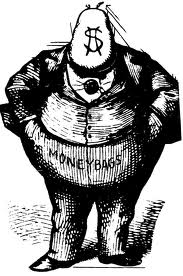
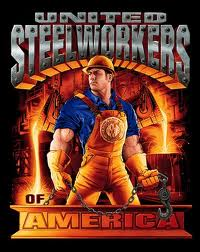

```{r}
#| label: setup
#| include: false

library(ggplot2)
library(dplyr)
library(scales)
library(knitr)
library(kableExtra)

# IU color palette
iu_crimson <- "#990000"
iu_cream <- "#EDEBEB"
iu_gray <- "#535054"
iu_light_gray <- "#7E7E7E"
iu_dark_text <- "#2C3E50"

# Custom theme for all plots
theme_ipe <- function(base_size = 20) {
  theme_minimal(base_size = base_size) +
    theme(
      plot.title = element_text(color = iu_crimson, face = "bold", size = rel(1.2),
                                margin = margin(t = 5, b = 5)),
      plot.subtitle = element_text(color = iu_gray, size = rel(0.9),
                                   margin = margin(b = 10)),
      plot.caption = element_text(color = iu_light_gray, size = rel(0.7),
                                  hjust = 0, margin = margin(t = 10)),
      axis.title = element_text(color = iu_dark_text, size = rel(0.9)),
      axis.title.x = element_text(margin = margin(t = 8)),
      axis.title.y = element_text(margin = margin(r = 8)),
      axis.text = element_text(color = iu_gray, size = rel(0.8)),
      panel.grid.minor = element_blank(),
      panel.grid.major = element_line(color = "#E5E5E5", linewidth = 0.4),
      legend.position = "bottom",
      legend.title = element_text(size = rel(0.85)),
      legend.text = element_text(size = rel(0.8)),
      plot.margin = margin(t = 8, r = 12, b = 20, l = 12)
    )
}
```

## Today's Plan

::: {.callout-important appearance="minimal" icon=false}
## Today's Big Question
[**If trade makes a country richer on net, why does anyone fight it — and what decides who wins that fight?**]{style="font-size: 1.5em; line-height: 1.4;"}
:::

```{r}
#| label: tbl-plan

plan <- data.frame(
  Section = c("1 · The Puzzle: Winners and Losers",
              "2 · The Factor Model: Trade as Class Conflict",
              "3 · The Sector Model: Trade as Industry Conflict",
              "4 · Which Model Is Right?",
              "5 · Collective Action: Preferences into Policy",
              "6 · Political Institutions and the Supply of Policy",
              "7 · Weaknesses + Handoff"),
  Cover = c("Trade gains on net, yet protection is everywhere — why?",
            "Stolper-Samuelson: trade pits the abundant factor against the scarce one",
            "Specific factors: trade pits export industries against import-competing ones",
            "The one assumption that flips the story — and what the evidence shows",
            "Why producers prevail over consumers, and why policy tilts protectionist",
            "Which institutions overcome the protectionist bias — and which entrench it",
            "What this approach cannot explain — and the bridge to Day 5")
)

kable(plan, col.names = c("Section", "What we'll cover"),
      align = c("l", "l")) %>%
  kable_styling(font_size = 22, full_width = TRUE) %>%
  row_spec(0, bold = TRUE, color = "white", background = iu_crimson) %>%
  column_spec(1, bold = TRUE, color = iu_crimson, width = "38%") %>%
  column_spec(2, width = "62%")
```

::: {.notes}
A brief orientation. Today is a quiz day, so we will keep the lecture to roughly seventy minutes; afterward our presenter will take us through the assigned article, and we will close the session with Quiz 1. The intellectual arc is straightforward. Chapter 3 established that trade is welfare-improving in the aggregate. That phrase — "in the aggregate" — conceals a great deal of conflict, and today we examine it directly: who gains, who loses, and how that distributional conflict is converted into policy. The lecture ascends a single pyramid, from individual economic interests, to organized blocs, to political institutions, and finally to policy. Each numbered section corresponds to one level of that pyramid.
:::


# The Puzzle: Winners and Losers {background-color="#990000"}


## Protectionism Is a Puzzle

::: {style="text-align: center; line-height: 1.8; margin-top: 4em; margin-bottom: 2em;"}
[**Trade enlarges the pie.**]{style="font-size: 1.4em;"}  [comparative advantage]{style="color:#7E7E7E; font-size: 0.8em;"}

[**Tariffs shrink it.**]{style="font-size: 1.4em;"}  [deadweight loss]{style="color:#7E7E7E; font-size: 0.8em;"}

[So why is protection *everywhere*?]{style="font-size: 1.55em; color:#990000; font-weight: bold;"}
:::

::: {.callout-important appearance="minimal" icon=false}
[Because trade creates winners and losers **within** a country — and the losers vote, lobby, and organize.]{style="font-size: 1.3em; line-height: 1.5;"}
:::

::: {.notes}
We need not re-derive Chapter 3; we simply recall its two results. Trade raises aggregate welfare, and tariffs impose a deadweight loss. Taken together, protection appears irrational, which makes its ubiquity a genuine puzzle. The resolution is the organizing premise of this entire chapter: the phrase "in the aggregate" does considerable analytical work. A country can be made better off as a whole while particular groups within it are made substantially worse off. Those groups are concentrated, identifiable, and motivated, and they turn to the political arena. The remainder of the lecture concerns who the winners and losers are — that is the work of the two models — whether they succeed in organizing, which is the collective action problem, and finally which side prevails, which is the work of institutions.
:::


## Same State, Opposite Fortunes

**North Carolina's economy grew over 2000–2024 — but the gains and losses were unevenly distributed across industries.**

```{r}
#| label: fig-nc-industry
#| fig-width: 12
#| fig-height: 5.2
#| out-width: "90%"
#| fig-alt: "Horizontal diverging bar chart of North Carolina job change by industry, 2000 to 2024. Manufacturing is deeply negative; education and health, professional and business services, leisure and hospitality, and others are positive."

if (file.exists("data/nc_industry.csv")) {
  nc <- read.csv("data/nc_industry.csv", stringsAsFactors = FALSE)
  names(nc) <- tolower(names(nc))
  nc$change <- nc$jobs_2024 - nc$jobs_2000
  nc <- nc[order(nc$change), ]
  nc$industry <- factor(nc$industry, levels = nc$industry)
  nc$dir <- ifelse(nc$change < 0, "loss", "gain")

  ggplot(nc, aes(x = change, y = industry, fill = dir)) +
    geom_col(width = 0.72) +
    geom_text(aes(label = paste0(ifelse(change > 0, "+", ""), round(change)),
                  hjust = ifelse(change < 0, 1.15, -0.15)),
              size = 4.6, fontface = "bold", color = iu_dark_text) +
    scale_fill_manual(values = c(loss = "#7B1E1E", gain = "#1B5E3F"), guide = "none") +
    scale_x_continuous(expand = expansion(mult = 0.20)) +
    labs(title = "North Carolina job change by industry, 2000–2024 (thousands)",
         x = NULL, y = NULL,
         caption = "Source: BLS Current Employment Statistics (State & Metro Area), annual averages.") +
    theme_ipe(base_size = 18) +
    theme(panel.grid.major = element_blank(),
          axis.text.x = element_blank(),
          plot.caption = element_text(color = iu_light_gray, size = 11, hjust = 0))
} else {
  ggplot() +
    annotate("text", x = 0, y = 0,
             label = "North Carolina industry figure renders\nonce data/nc_industry.csv is added",
             size = 5, color = iu_gray) +
    xlim(-1, 1) + ylim(-1, 1) + theme_void()
}
```

::: {.callout-tip appearance="minimal" icon=false}
Manufacturing — textiles and furniture above all — collapsed, while health, professional services, and finance grew. **Same state, opposite fortunes** — and it is the concentrated losers who organize.
:::

<!-- DROP-IN IMAGE: a still from *Norma Rae* (1979) — Sally Field holding the "UNION" sign in a North Carolina-style textile mill. A near-perfect cultural anchor for the import-competing losers and union organizing. You could place it beside the chart or on its own; e.g.:
{width="30%"} -->

::: {.notes}
This is Oatley's opening example, and it is a good one precisely because it holds the country and the trade shock constant while the outcomes diverge. The chart makes the divergence concrete: over 2000–2024 North Carolina added jobs overall, but manufacturing — textiles and furniture especially — fell sharply while education and health, professional services, and finance expanded. Oatley's own figures capture the acute phase: North Carolina's textile and apparel sector — long the way many lower-skill residents earned a living — contracted sharply, with roughly two hundred plants closed between 2000 and 2004 and on the order of forty-four thousand jobs disappearing in those years alone. In the same state, over the same period, pharmaceuticals and finance prospered, with rising wages and expanding employment. The decisive analytical move is what follows: these are not merely economic outcomes; they become political mobilization. The losers — the textile manufacturers' associations — press for protection. The winners — the service-industry associations — press to keep markets open. A protectionist bloc and a liberalizing bloc form. Hold onto North Carolina, because we will use it for both models. Note that it can be told as a story about classes — lower-skill labor loses — or as a story about an industry — apparel loses — which is exactly why we require both models to see the situation clearly. If you want a cultural reference point, *Norma Rae* — set in a Southern textile mill — is the canonical depiction of precisely this world, and it will return when we reach collective action.
:::


## The Geography of Gains — and Trade Losses

::: {.columns}
::: {.column width="50%"}

```{r}
#| label: fig-map-employment
#| fig-width: 7.5
#| fig-height: 6
#| out-width: "98%"
#| fig-alt: "U.S. choropleth: percent change in total nonfarm employment by state, 2000-2024 (red = decline, green = growth)."

have_usmap <- requireNamespace("usmap", quietly = TRUE)
f1 <- "data/state_jobs.csv"

if (have_usmap && file.exists(f1)) {
  d1 <- read.csv(f1, stringsAsFactors = FALSE)
  names(d1) <- tolower(names(d1))
  d1$pct <- (d1$jobs_2024 / d1$jobs_2000 - 1) * 100

  usmap::plot_usmap(data = d1, values = "pct", color = "white") +
    scale_fill_gradient2(
      low = "#7B1E1E", mid = "#F2EFEF", high = "#1B5E3F",
      midpoint = 0, name = NULL,
      labels = function(x) paste0(ifelse(x > 0, "+", ""), x, "%")
    ) +
    labs(title = "Total employment change, 2000–2024") +
    theme(
      legend.position = "bottom",
      plot.title = element_text(color = iu_crimson, face = "bold", size = 16, hjust = 0.5),
      legend.text = element_text(color = iu_gray, size = 11)
    )
} else {
  ggplot() +
    annotate("text", x = 0, y = 0,
             label = "Map renders once data/state_jobs.csv\nand {usmap} are present",
             size = 5, color = iu_gray) +
    xlim(-1, 1) + ylim(-1, 1) + theme_void()
}
```

::: {.callout-tip appearance="minimal" icon=false}
Employment grew almost everywhere — most states added jobs on net over two decades.
:::

:::
::: {.column width="50%"}

```{r}
#| label: fig-map-trade
#| fig-width: 7.5
#| fig-height: 6
#| out-width: "98%"
#| fig-alt: "U.S. choropleth: jobs lost to the U.S.-China trade deficit as a share of state employment, 2001-2018 (darker red = larger loss)."

have_usmap <- requireNamespace("usmap", quietly = TRUE)
f2 <- "data/epi_china_jobs.csv"

if (have_usmap && file.exists(f2)) {
  d2 <- read.csv(f2, stringsAsFactors = FALSE)
  names(d2) <- tolower(names(d2))

  usmap::plot_usmap(data = d2, values = "share_pct", color = "white") +
    scale_fill_gradient(
      low = "#F6E0E0", high = "#6E1212", name = NULL,
      labels = function(x) paste0(x, "%")
    ) +
    labs(title = "China-trade job losses, 2001–2018") +
    theme(
      legend.position = "bottom",
      plot.title = element_text(color = iu_crimson, face = "bold", size = 16, hjust = 0.5),
      legend.text = element_text(color = iu_gray, size = 11)
    )
} else {
  ggplot() +
    annotate("text", x = 0, y = 0,
             label = "Map renders once data/epi_china_jobs.csv\nand {usmap} are present",
             size = 5, color = iu_gray) +
    xlim(-1, 1) + ylim(-1, 1) + theme_void()
}
```

::: {.callout-tip appearance="minimal" icon=false}
Yet the U.S.–China trade deficit displaced jobs in *every* state — heaviest in manufacturing and tech-hardware states.
:::

:::
:::

::: {style="font-size: 0.45em; color: #7E7E7E; text-align: center;"}
Sources: total employment — BLS Current Employment Statistics (annual averages). Trade-related job loss — Economic Policy Institute (Scott & Mokhiber 2020): net jobs displaced by the growing U.S.–China goods trade deficit as a share of state employment, 2001–2018.
:::

::: {.notes}
These two maps, read together, are the heart of the chapter's puzzle. The map on the left is total nonfarm employment change from 2000 to 2024: the national economy added jobs on net, and most states are green — gains concentrated in the Sun Belt and Mountain West, with the older industrial Midwest flat or, in Michigan's case, slightly negative. In the aggregate, the story is growth. The map on the right shows the distributional story the aggregate conceals: the Economic Policy Institute's estimate of the jobs displaced specifically by the growing trade deficit with China, expressed as a share of each state's employment. Every state shows a loss — heaviest, around three to three-and-a-half percent of all jobs, in states with concentrated exposure to import-competing manufacturing and computer-hardware production: New Hampshire, Oregon, California, North Carolina, Minnesota, Wisconsin, Indiana. Notice that several states are green on the left and dark on the right at the same time — they grew overall while losing trade-exposed jobs in particular industries and communities. That juxtaposition is exactly the society-centered point: aggregate gains can coexist with concentrated, organized losses, and it is the losers, not the diffuse winners, who mobilize. Two honest cautions for students. The left map is total employment, so it reflects many forces — automation, energy, migration, demographics — not trade alone. The right map is a model-based estimate: it attributes employment to the bilateral goods deficit under specific assumptions, and other economists estimate the magnitude differently. Present it as a credible, widely-cited estimate, not a measured fact. The factor and sector models we turn to next give us the vocabulary for who, within these places, wins and loses.
:::


## The Society-Centered Pyramid

```{r}
#| label: fig-pyramid
#| fig-width: 11
#| fig-height: 5.6
#| out-width: "78%"
#| fig-alt: "A four-tier pyramid. From bottom to top: the open economy and trade policy interests; organized interests split into a protectionist bloc and a low-tariff bloc; political institutions; trade policy. Arrows point upward from each tier to the next."

tiers <- data.frame(
  ymin = c(0.2, 1.5, 2.8, 4.1),
  ymax = c(1.2, 2.5, 3.8, 5.1),
  half = c(5.0, 3.7, 2.5, 1.4),
  fill = c("#C98F8F", "#B96A6A", "#A94545", "#990000"),
  label = c("The Open Economy & Trade Policy Interests\n(factor ownership · sector of employment)",
            "Organized Interests\n(protectionist bloc  vs.  low-tariff bloc)",
            "Political Institutions\n(mediate competing demands)",
            "Trade Policy\n(protection or low tariffs)")
)

ggplot() +
  geom_rect(data = tiers,
            aes(xmin = -half, xmax = half, ymin = ymin, ymax = ymax, fill = fill)) +
  geom_text(data = tiers,
            aes(x = 0, y = (ymin + ymax)/2, label = label),
            color = "white", fontface = "bold", size = 4.6, lineheight = 0.95) +
  annotate("segment", x = 0, xend = 0, y = 1.2, yend = 1.5,
           arrow = arrow(length = unit(0.18, "cm"), type = "closed"), color = iu_gray, linewidth = 0.7) +
  annotate("segment", x = 0, xend = 0, y = 2.5, yend = 2.8,
           arrow = arrow(length = unit(0.18, "cm"), type = "closed"), color = iu_gray, linewidth = 0.7) +
  annotate("segment", x = 0, xend = 0, y = 3.8, yend = 4.1,
           arrow = arrow(length = unit(0.18, "cm"), type = "closed"), color = iu_gray, linewidth = 0.7) +
  scale_fill_identity() +
  scale_x_continuous(limits = c(-5.4, 5.4)) +
  scale_y_continuous(limits = c(0, 5.4)) +
  labs(caption = "Reproduces Oatley, Figure 4.1 — The Societal Model of Trade Politics") +
  theme_void(base_size = 18) +
  theme(plot.caption = element_text(color = iu_light_gray, size = 12, hjust = 0.5,
                                    margin = margin(t = 8)))
```

::: {.notes}
This pyramid is the map for the entire lecture; each level corresponds to a section. The base is the open economy. What one does in the economy — whether one owns capital or sells one's labor, and in which industry one is employed — shapes one's interest over trade policy. That is the formation of preferences, and it is where the two models reside. The second level: those individual interests aggregate into organized blocs, a protectionist bloc and a low-tariff bloc. Whether they in fact organize is the collective action problem. The third level: political institutions take these competing demands and mediate them, determining who may press claims upon whom, and whose demand becomes policy. The apex is the resulting trade policy. Causation runs upward, but there is also a feedback channel: as Chapter 3 showed, policy reshapes the economy. Sustained free trade drives specialization, which over time diminishes the size and political weight of the protected industries. The society-centered approach, stated compactly, holds that trade policy is the response of politicians to the demands of organized interests. We now fill in the levels, beginning at the base.
:::


# The Factor Model: Trade as Class Conflict {background-color="#990000"}


## The Factor Model: Assumptions

The **factor model** holds that trade politics is a contest between *factors of production* — **labor against capital**.

::: {.columns}
::: {.column width="58%"}

**Stylized Example:**

- Two countries: the **United States** and **China**
- Two goods: **computers** and **shirts**
- Two factors: **capital** and **labor** (let's hold land to the side)
- The U.S. is **capital-abundant**; China is **labor-abundant**

::: {.callout-important appearance="minimal" icon=false}
**The most important assumption:** factors are **perfectly mobile** across sectors. Labor and capital can move freely from shirts to computers.
:::

:::
::: {.column width="42%"}

{width=30%"}

{width="25%"}

:::
:::

::: {.notes}
The factor model is also termed the class model, because it arrays an entire class — workers — against another — owners of capital. The assumptions are simply the Chapter 3 trade model: two countries, the United States and China; two goods, computers and shirts; and two factors, capital and labor. The United States is capital-abundant; China is labor-abundant. Computers are capital-intensive; shirts are labor-intensive. The assumption to mark carefully — because we will deliberately relax it shortly — is factor mobility. The factor model assumes that labor and capital move freely between industries: a worker displaced from apparel can be absorbed into computer manufacturing, and capital withdrawn from textiles can be redeployed into electronics. That assumption is precisely what renders this a theory of classes rather than of industries. The two images on the right are the ones you have used before — Rosie the Riveter standing in for labor, and the figure of capital, the Monopoly man, "Mr. Moneybags." It is worth noting that the Monopoly man has himself become a recurring visual shorthand in American political life, appearing at congressional hearings as a symbol of concentrated wealth — a useful image to keep in reserve when we reach collective action.
:::


## What Trade Does to Factor Incomes

```{r}
#| label: fig-mismatch
#| fig-width: 11
#| fig-height: 4.6
#| out-width: "80%"
#| fig-alt: "Grouped bar chart. The shrinking shirt industry releases a lot of labor and little capital; the expanding computer industry demands a lot of capital and little labor. The mismatch raises the return to capital and lowers wages."

mm <- data.frame(
  industry = rep(c("Shirt industry\n(shrinks → releases)", "Computer industry\n(expands → demands)"), each = 2),
  factor = rep(c("Labor", "Capital"), times = 2),
  amount = c(85, 25, 30, 90)
)
mm$industry <- factor(mm$industry, levels = c("Shirt industry\n(shrinks → releases)", "Computer industry\n(expands → demands)"))

ggplot(mm, aes(x = industry, y = amount, fill = factor)) +
  geom_col(position = position_dodge(width = 0.7), width = 0.6) +
  geom_text(aes(label = factor), position = position_dodge(width = 0.7),
            vjust = -0.4, size = 5, fontface = "bold", color = iu_dark_text) +
  scale_fill_manual(values = c("Labor" = iu_gray, "Capital" = iu_crimson)) +
  scale_y_continuous(limits = c(0, 105)) +
  labs(
    title = "Trade releases and demands factors in different proportions",
    subtitle = "Excess demand for capital raises its price;  excess supply of labor lowers its price",
    x = NULL, y = "Relative quantity of factor",
    caption = "U.S. example following Oatley, Chapter 4"
  ) +
  theme_ipe() +
  theme(legend.position = "none", axis.text.y = element_blank())
```

::: {.notes}
This mechanism is the core intuition behind the Stolper-Samuelson theorem, and it rewards a deliberate pace, because it is where students most often lose the thread. Suppose the United States begins to import Chinese shirts. Domestic demand for American-made shirts falls, so American apparel firms contract. As they contract, they dismiss workers and liquidate capital — they release factors back into the economy. But apparel is labor-intensive, so it releases a great deal of labor and only a little capital; those are the two left-hand bars. Meanwhile, American computer firms expand to meet Chinese demand, and so they absorb factors. But computers are capital-intensive, so they demand a great deal of capital and only a little labor; those are the two right-hand bars. Observe the imbalance: the economy is releasing predominantly labor while demanding predominantly capital. That imbalance moves relative prices. Capital is in excess demand, so its return rises; labor is in excess supply, so the wage falls. China experiences the precise mirror image — wages rise, the return to capital falls. This change in relative factor prices is the crux of the result.
:::


## The Stolper-Samuelson Theorem

::: {.callout-important appearance="minimal" icon=false}
**Trade raises the income of a country's *abundant* factor and lowers the income of its *scarce* factor.**
:::

```{r}
#| label: tbl-ss

ss <- data.frame(
  Country = c("United States (capital-abundant)", "China (labor-abundant)"),
  Capital = c("WINNER — return to capital rises", "Loser — return to capital falls"),
  Labor = c("Loser — wages fall", "WINNER — wages rise")
)

kable(ss, col.names = c("", "Capital", "Labor"), align = c("l", "l", "l")) %>%
  kable_styling(font_size = 26, full_width = TRUE) %>%
  row_spec(0, bold = TRUE, color = "white", background = iu_crimson,
           extra_css = "padding-top: 16px; padding-bottom: 16px;") %>%
  row_spec(1:2, extra_css = "padding-top: 28px; padding-bottom: 28px; line-height: 1.5;") %>%
  column_spec(1, bold = TRUE, color = iu_crimson, width = "34%") %>%
  column_spec(2:3, width = "33%")
```

And if trade continues uninterrupted, **factor-price equalization**: American and Chinese wages converge, as do the returns to capital in the two countries.

::: {.callout-note appearance="minimal" icon=false}
[**Callback — Day 1 (Subramanian podcast):** China's exports have *not* shed their labor-intensive content the way factor-price equalization predicts. By not vacating the low rungs of the value chain, China keeps crowding the export niche other developing countries need to climb through — squeezing them.]{style="font-size: 1.5em; line-height: 1.4;"}
:::

::: {.notes}
We can now name the result: the Stolper-Samuelson theorem. Trade raises the income of the abundant factor and lowers the income of the scarce factor. In the United States, which is capital-abundant, capital gains and labor loses. In China, which is labor-abundant, labor gains and capital loses. This is a productive slide to build live: display the empty two-by-two and invite the room to complete it before revealing the answer. The common error is to suppose that labor always loses. It does not. Labor loses in the United States precisely because labor is the scarce factor here, whereas labor gains in China because it is abundant there. The second result is factor-price equalization: if trade is permitted to continue, the gains to the abundant factor and the losses to the scarce factor push factor prices in the two countries toward one another — American and Chinese wages converge, as do the returns to capital. This is the long-run tendency, and it also explains why the losers do not simply acquiesce. The pressure on their incomes is sustained, and so they organize politically.
:::


## From Incomes to Preferences -- Where Capital > Labor

::: {.columns}
::: {.column width="50%"}

::: {style="text-align: center;"}
{width="40%"}

[**LABOR** — the *scarce* factor]{style="font-size: 1.3em; color:#990000; font-weight: bold;"}

[income **falls** → wants **HIGH tariffs**]{style="font-size: 1.1em;"}

[AFL-CIO opposed NAFTA, the TPP, and fast-track]{style="color:#535054; font-size: 0.8em;"}
:::

:::
::: {.column width="50%"}

::: {style="text-align: center;"}
{width="26%"}

[**CAPITAL** — the *abundant* factor]{style="font-size: 1.3em; color:#990000; font-weight: bold;"}

[income **rises** → wants **LOW tariffs**]{style="font-size: 1.1em;"}

[Business Roundtable & NAM back liberalization]{style="color:#535054; font-size: 0.8em;"}
:::

:::
:::

::: {.callout-tip appearance="minimal" icon=false}
[The factor model predicts **class conflict** — labor against capital over the distribution of national income.]{style="font-size: 1.35em;"}
:::

::: {.notes}
Preferences follow directly from the income effects. If trade lowers your factor's income, you favor protection; if it raises your factor's income, you favor openness. In the United States, then, labor is the scarce factor and turns protectionist, while capital is abundant and turns toward openness. The model therefore predicts class conflict — a unified working class arrayed against a unified capitalist class, contesting the distribution of national income. The broad pattern of evidence is consistent with this. The AFL-CIO, representing some thirteen million workers, has been among the most prominent opponents of NAFTA, the Trans-Pacific Partnership, and fast-track authority. On the other side, the Business Roundtable — the chief executives of the largest American firms — and the National Association of Manufacturers have been dependable advocates of liberalization. Capital presses to open; labor presses to close. If you want the cultural register of the losing side, the deindustrialization ballads of the 1980s — Billy Joel's "Allentown," Bruce Springsteen's "Youngstown" and "My Hometown" — are essentially the factor model set to music: the scarce factor in a wealthy economy, watching its income erode.
:::


## Refining the Model: Skill

Labor isn't homogeneous. Split it by **skill** and the factor logic sharpens: in the skill-abundant U.S., **higher-skill workers gain** from trade while **lower-skill workers lose**.

```{r}
#| label: fig-skill
#| fig-width: 10
#| fig-height: 4.7
#| out-width: "70%"
#| fig-alt: "Line chart rising steeply from left to right: support for open trade is low among the least-educated and high among the most-educated."

hh <- data.frame(
  lvl = c("Junior\nhigh", "High\nschool", "Some\ncollege", "College\n(BA)", "Graduate"),
  eff = c(-0.024, 0.028, -0.109, -0.317, -0.315)
)
hh$lvl <- factor(hh$lvl, levels = hh$lvl)
hh$dir <- ifelse(hh$eff <= 0, "neg", "pos")

ggplot(hh, aes(x = lvl, y = eff, fill = dir)) +
  geom_col(width = 0.7) +
  geom_hline(yintercept = 0, color = iu_gray, linewidth = 0.5) +
  geom_text(aes(label = sprintf("%+.2f", eff), vjust = ifelse(eff < 0, 1.35, -0.5)),
            color = iu_dark_text, fontface = "bold", size = 4.6) +
  scale_fill_manual(values = c(neg = "#1B5E3F", pos = "#7B1E1E"), guide = "none") +
  scale_y_continuous(limits = c(-0.4, 0.1)) +
  labs(title = "Support for import limits drops sharply at college",
       subtitle = "Change in probability of favoring new import limits, vs. the least-educated  (↓ = more pro-trade)",
       x = NULL, y = NULL,
       caption = "Hainmueller & Hiscox (2006), Table 1 — NES 1992 (full sample).") +
  theme_ipe(base_size = 17) +
  theme(panel.grid.major.x = element_blank(),
        axis.text.y = element_blank(),
        plot.subtitle = element_text(color = iu_gray, size = rel(0.78)),
        plot.caption = element_text(color = iu_light_gray, size = 11, hjust = 0))
```

::: {.callout-important appearance="minimal" icon=false}
Education is the strongest correlate of pro-trade views — yet **Hainmueller & Hiscox (2006) argue the channel is economic *ideas* and cosmopolitan values, not skill or wages**: the effect holds even for people out of the labor force.
:::

[But skill is still a blunt proxy. The newest work asks a sharper question — *what do you actually do all day?*]{style="color:#535054;"}

::: {.notes}
The pure two-factor model treats all labor as identical, which is false. Split labor by skill — proxied by education — and the factor logic predicts that in the skill-abundant United States, more-educated workers favor trade while less-educated workers oppose it. The data are emphatic on the correlation. This chart, from Hainmueller and Hiscox's 2006 study of NES data, shows the change in the probability of favoring new import limits at each education level, relative to the least educated. Notice the shape: junior high and high school barely move, but a four-year degree cuts the probability of favoring import limits by about thirty-two percentage points, and graduate education by about the same. Now the twist, and it is why this paper matters. Hainmueller and Hiscox argue the education effect is *not* really about skill or wages. If it were the Stolper-Samuelson wage mechanism, it should be concentrated among people whose wages are exposed — those in the labor force — yet it holds just as strongly for the retired and others out of work, and it jumps discontinuously at college rather than accumulating year by year. They conclude the channel is ideational: exposure to the economic case for trade, and more cosmopolitan, less protectionist values. So education fits the skill prediction in its correlation but undercuts its mechanism — which is exactly why the field kept searching for a sharper *material* measure. That search leads to tasks, the next slide.
:::


## Beyond Skill: It's the Tasks

The newest evidence pushes past skill *and* industry: what predicts your preference is the **nature of your tasks** — how **routine** they are, and how easily they can be **offshored**.

```{r}
#| label: fig-tasks
#| fig-width: 10
#| fig-height: 5
#| out-width: "70%"
#| fig-alt: "A 2x2 matrix. Horizontal axis: offshorability (low to high). Vertical axis: task routineness (low to high). Bottom-left (non-routine, hard to offshore) is green and labeled pro-trade; top-right (routine and offshorable) is dark red and labeled most protectionist."

quad <- data.frame(
  xmin = c(0,1,0,1), xmax = c(1,2,1,2),
  ymin = c(0,0,1,1), ymax = c(1,1,2,2),
  fill = c("#1B5E3F", "#B5562A", "#B5562A", "#7B1E1E"),
  lab  = c("Non-routine,\nhard to offshore\n(nurse · electrician · chef)\n\nMOST PRO-TRADE",
           "Non-routine,\noffshorable\n(some analysis, design)",
           "Routine,\nhard to offshore\n(driver · cashier)",
           "Routine &\noffshorable\n(data entry · call center · assembly)\n\nMOST PROTECTIONIST")
)

ggplot(quad) +
  geom_rect(aes(xmin = xmin, xmax = xmax, ymin = ymin, ymax = ymax, fill = fill),
            color = "white", linewidth = 2) +
  geom_text(aes(x = (xmin+xmax)/2, y = (ymin+ymax)/2, label = lab),
            color = "white", size = 4.1, fontface = "bold", lineheight = 0.95) +
  scale_fill_identity() +
  scale_x_continuous(breaks = c(0.5, 1.5), labels = c("Low", "High"),
                     name = "Offshorability  →", limits = c(0, 2), expand = c(0,0)) +
  scale_y_continuous(breaks = c(0.5, 1.5), labels = c("Low", "High"),
                     name = "Task routineness  →", limits = c(0, 2), expand = c(0,0)) +
  labs(title = "What sets preferences isn't skill or industry — it's your tasks") +
  theme_ipe(base_size = 17) +
  theme(panel.grid = element_blank(), axis.ticks = element_blank())
```

::: {.callout-important appearance="minimal" icon=false}
Routine, offshorable jobs breed protectionism — whatever the worker's skill or sector. After education, **task routineness is the single labor-market trait most robustly tied to trade preferences.**
:::

::: {style="font-size: 0.5em; color:#7E7E7E; text-align:center;"}
Owen & Johnston, "Occupation and the Political Economy of Trade: Job Routineness, Offshorability, and Protectionist Sentiment," *International Organization* 71(4), 2017; Blonigen, "Task Routineness and Trade Policy Preferences," *Economics & Politics*, 2014. (Figure is an original schematic of their findings.)
:::

::: {.notes}
This is the frontier of the preferences literature, and it is worth giving students, because it reframes the whole "who loses from trade" question. The factor model says your fate depends on whether you own capital or labor; the sector model says it depends on your industry; the skill refinement says it depends on your education. Owen and Johnston, in International Organization in 2017, building on earlier work by Blonigen (2014), argue that the more powerful predictor is what your job actually consists of — your *tasks*. Two attributes matter: how routine your tasks are (codifiable, rule-based, repetitive) and how offshorable they are (deliverable from a distance). Workers whose jobs are both routine and offshorable are the most exposed to trade and the most protectionist, and this holds regardless of their formal skill level or the industry they sit in. A radiologist and a data-entry clerk might both be "high information" jobs, but the clerk's tasks are routine and offshorable and the radiologist's, mostly, are not — and their trade politics diverge accordingly. The striking empirical claim, from Blonigen, is that other than education, task routineness is the single labor-market characteristic most robustly correlated with stated trade preferences. The 2×2 is my own schematic, not their figure — the point is the diagonal: as you move from the green corner (non-routine, hard to offshore) to the red corner (routine and offshorable), protectionist sentiment rises. This also connects forward to automation and AI anxiety, since routine-task exposure is exactly what both offshoring and automation target. If you want to gesture at the very newest work, the same task/routineness lens now drives research on how trade and technology shocks feed political backlash and polarization.
:::


# The Sector Model: Trade as Industry Conflict {background-color="#990000"}


## A Single Change: Immobile Factors

The **sector model** (the *specific-factors*, or Ricardo-Viner, model) assumes factors are **immobile** — *specific* to the industry in which they are currently employed. (In the long run, we're all dead - John Maynard Keynes)

::: {.columns}
::: {.column width="58%"}

**Why factors become immobile:**

- Capital is sunk — a loom cannot produce microchips
- Workers possess **industry-specific skills**
- Relocation carries logistical, social, and psychological costs

::: {.callout-important appearance="minimal" icon=false}
When factors cannot move, **labor and capital in the same industry share its fate.** The cleavage is no longer class — it is **industry**.
:::

:::
::: {.column width="42%"}

{width="62%"}

:::
:::

::: {.notes}
The sector model — also called the specific-factors model, or the Ricardo-Viner model — alters one assumption and one only: factors are immobile, fixed in the industry where they presently reside. Why might that be so? Capital is frequently sunk in industry-specific form; a textile loom or a spinning machine cannot literally be repurposed to manufacture computers. Workers accumulate industry-specific skills that do not transfer; a master loom technician is not thereby a software engineer. And even where retraining is possible, relocation is arduous — one must sell a house in a depressed local economy and abandon a community and social network built over decades. Taken together, factors are, for practical purposes, locked into their sector. Once they are locked in, the logic shifts entirely: if you cannot leave the apparel industry, then your fortune is the apparel industry's fortune, whether you are a worker or an owner. The conflict is no longer labor against capital; it is industry against industry. The steelworker image captures the point — in the sector model, the worker and the firm stand together, bound by a common trade.
:::


## Winners and Losers by Industry

```{r}
#| label: fig-cleavages
#| fig-width: 12
#| fig-height: 5.0
#| out-width: "90%"
#| fig-alt: "Two squares. The factor model splits society horizontally into capital (top, winner) and labor (bottom, loser). The sector model splits society vertically into the export-oriented sector (left, winner) and the import-competing sector (right, loser)."

# Factor model: horizontal split (class)
fm <- data.frame(
  xmin = c(0, 0), xmax = c(2, 2),
  ymin = c(1, 0), ymax = c(2, 1),
  fill = c("#1B7A3D", "#A94545"),
  lab = c("CAPITAL — wins", "LABOR — loses")
)
# Sector model: vertical split (industry)
sm <- data.frame(
  xmin = c(0, 1), xmax = c(1, 2),
  ymin = c(0, 0), ymax = c(2, 2),
  fill = c("#1B7A3D", "#A94545"),
  lab = c("EXPORT-\nORIENTED\nwins", "IMPORT-\nCOMPETING\nloses")
)

p_fm <- ggplot(fm) +
  geom_rect(aes(xmin = xmin, xmax = xmax, ymin = ymin, ymax = ymax, fill = fill), color = "white", linewidth = 1.5) +
  geom_text(aes(x = (xmin+xmax)/2, y = (ymin+ymax)/2, label = lab), color = "white", fontface = "bold", size = 5.4, lineheight = 0.9) +
  scale_fill_identity() + coord_equal() +
  labs(title = "Factor model: split by CLASS") +
  theme_void(base_size = 16) +
  theme(plot.title = element_text(color = iu_crimson, face = "bold", hjust = 0.5, size = 18, margin = margin(b = 6)))

p_sm <- ggplot(sm) +
  geom_rect(aes(xmin = xmin, xmax = xmax, ymin = ymin, ymax = ymax, fill = fill), color = "white", linewidth = 1.5) +
  geom_text(aes(x = (xmin+xmax)/2, y = (ymin+ymax)/2, label = lab), color = "white", fontface = "bold", size = 5.0, lineheight = 0.9) +
  scale_fill_identity() + coord_equal() +
  labs(title = "Sector model: split by INDUSTRY") +
  theme_void(base_size = 16) +
  theme(plot.title = element_text(color = iu_crimson, face = "bold", hjust = 0.5, size = 18, margin = margin(b = 6)))

gridExtra::grid.arrange(p_fm, p_sm, ncol = 2)
```

In the U.S., the **export-oriented sector** (capital-intensive, high-technology: computers, pharmaceuticals, biotechnology) gains; the **import-competing sector** (labor-intensive: apparel, footwear) loses.

::: {.notes}
This is the single most clarifying figure in the lecture, and it merits a moment's attention. The same society is partitioned in two different ways. On the left, the factor model cuts horizontally, by class: capital above, the winner; labor below, the loser. The dividing line runs across industries — all owners of capital on one side, all workers on the other. On the right, the sector model cuts vertically, by industry: the export-oriented sector on the left is the winner; the import-competing sector on the right is the loser. Now the line runs across classes — within the winning export sector, labor and capital gain together; within the losing import-competing sector, labor and capital lose together. In the American case specifically, the export-oriented winners are the capital-intensive, high-technology industries — computers, pharmaceuticals, biotechnology — and the import-competing losers are labor-intensive industries such as apparel and footwear. The same economy, the same trade shock; the only thing that has changed is whether factors can move. That assumption alone determines whether trade politics resembles class conflict or industry conflict.
:::


## Cases and Coalitions

::: {.columns}
::: {.column width="56%"}

### Milliken and Dell
- **Roger Milliken** (textile magnate) loses from trade — *and so do his apparel workers.*
- **Michael Dell** (computers) gains from trade — *and so do his engineers.*

Owner and worker stand on the **same side**, because they are bound to the same industry.

### Empirical Support - Coalition Patterns
- **UNITE** (apparel union) *and* **ATMI** (textile firms) **both** opposed liberalization.
- High-technology business associations *and* their workers **both** supported it.

::: {.callout-tip appearance="minimal" icon=false}
The models assume factors are immobile *internationally*. True of labor, less true of capital, which erodes labor's power in a globalized economy.
:::

:::
::: {.column width="44%"}

{width="62%"}

:::
:::

::: {.notes}
Render the point concrete through individuals. Roger Milliken directed one of the largest privately held textile firms in the country. He was, unambiguously, a capitalist; yet because his capital was sunk in textiles, he lost from trade, alongside the workers in his mills. Michael Dell, in computers, gained from trade, as did the engineers in his employ. The owner and the worker thus found themselves on the same side of the trade question, so long as they were bound to the same industry. The real-world coalitions confirm the sector model with some elegance. UNITE, the apparel workers' union, and the American Textile Manufacturers Institute, an association of textile firms — a labor organization and a capital organization — both lobbied against NAFTA and fast-track authority. Labor and capital, ordinarily adversaries in the factor account, here align because they share an industry. On the other side, high-technology firms and their higher-skilled workers both pressed for openness. The image is a Charlotte, North Carolina export-promotion campaign — a useful reminder that the very state whose textile sector we watched collapse also contains the export-oriented winners. When you observe labor and capital within an industry lobbying in concert, that is the sector model at work.
:::


# Which Model Is Right? {background-color="#990000"}


## Two Models, One Difference

```{r}
#| label: tbl-41

t41 <- data.frame(
  dim = c("Principal actors", "Are factors mobile?", "Winner from trade", "Loser from trade", "Central cleavage"),
  factor = c("Factors of production / classes",
             "Yes — perfectly mobile across sectors",
             "Abundant factor (U.S.: capital)",
             "Scarce factor (U.S.: labor)",
             "Protectionist labor vs. liberalizing capital"),
  sector = c("Industries / sectors",
             "No — immobile, specific to a sector",
             "Labor + capital in export-oriented industries",
             "Labor + capital in import-competing industries",
             "Protectionist import-competing vs. liberalizing export sectors")
)

kable(t41, col.names = c("", "The Factor Model", "The Sector Model"), align = c("l","l","l")) %>%
  kable_styling(font_size = 30, full_width = TRUE) %>%
  row_spec(0, bold = TRUE, color = "white", background = iu_crimson) %>%
  column_spec(1, bold = TRUE, color = iu_crimson, width = "22%") %>%
  column_spec(2:3, width = "39%")
```

::: {.callout-tip appearance="minimal" icon=false}
[**Hiscox's (2002) resolution:** mobility is itself variable. High inter-industry mobility yields class politics; low mobility yields industry politics. The applicable model depends on the economy and the time horizon.]{style="font-size: 1.5em; line-height: 1.4;"}
:::

::: {.notes}
This is Table 4.1 from the chapter — the clean side-by-side comparison. Read down the rows: the principal actors are classes versus industries; factors are mobile versus immobile; the winner is the abundant factor versus the export sector; the loser is the scarce factor versus the import-competing sector; and the central cleavage is labor against capital versus industry against industry. The essential point to stress is that these are not rival theories of different worlds. They differ in exactly one assumption — factor mobility — and that single assumption propagates into entirely different predicted coalitions. Which, then, is correct? Hiscox's (2002) answer, which is the standard one, declines the either/or: mobility is itself a variable. In economies and periods where factors move readily between industries, trade politics organizes around class; where factors are fixed, it organizes around industry. The two models are thus the endpoints of a continuum, and where a given case falls depends on how mobile factors actually are.
:::


## Do Preferences Track Material Interest?

Often **not**. What you believe trade does to the **country** (sociotropic considerations), and how you regard **out-groups** (status concerns), dominate.

```{r}
#| label: fig-sociotropic
#| fig-width: 11
#| fig-height: 4
#| out-width: "82%"
#| fig-alt: "Horizontal bar chart of OLS coefficients predicting pro-trade attitudes. Material self-interest variables (own wage, household income, import-competing or export industry) are near zero and not significant; the sociotropic perception that trade helps the U.S. is large and positive; isolationism and ethnocentrism are significant and negative."

mm <- data.frame(
  var = c("Trade is good for the U.S. (sociotropic)",
          "Trade is good for me (pocketbook)",
          "In an import-competing industry",
          "Household income",
          "Own wage",
          "In an export industry",
          "Ethnocentrism",
          "Isolationism"),
  coef = c(0.249, 0.075, 0.030, 0.005, 0.000, -0.029, -0.029, -0.099),
  sig  = c(TRUE, TRUE, FALSE, FALSE, FALSE, FALSE, TRUE, TRUE)
)
mm <- mm[order(mm$coef), ]
mm$var <- factor(mm$var, levels = mm$var)
mm$grp <- ifelse(mm$sig, "Perceptions & values (significant)", "Personal self-interest (not significant)")

ggplot(mm, aes(x = coef, y = var, fill = grp)) +
  geom_col(width = 0.72) +
  geom_vline(xintercept = 0, color = iu_gray, linewidth = 0.5) +
  scale_fill_manual(values = c("Perceptions & values (significant)" = "#990000",
                               "Personal self-interest (not significant)" = "#BDBABA"),
                    name = NULL) +
  scale_x_continuous(limits = c(-0.14, 0.30)) +
  labs(title = "What predicts support for trade? Not your wallet.",
       subtitle = "Effect on a pro-trade attitude index (OLS coefficients)",
       x = NULL, y = NULL,
       caption = "Mansfield & Mutz (2009), Table 3, full model. Gray bars are statistically insignificant.") +
  theme_ipe(base_size = 16) +
  theme(legend.position = "top",
        panel.grid.major.y = element_blank(),
        plot.subtitle = element_text(color = iu_gray, size = rel(0.8)),
        plot.caption = element_text(color = iu_light_gray, size = 10, hjust = 0))
```

::: {.callout-important appearance="minimal" icon=false}
**Brexit, the hard case:** education and income predicted the vote — *but so did* immigration attitudes, identity, and sovereignty (a "left-behind" coalition; Sampson 2017).
:::

::: {style="font-size: 0.5em; color:#7E7E7E; text-align:center;"}
Mansfield & Mutz (2009); see also Rho & Tomz (2017), Mutz & Kim (2017), Naoi (2020).
:::

::: {.notes}
This is the complication the contemporary literature is working through, and it bears directly on today's article. The factor and sector models assume people know their material interest and act on it. Mansfield and Mutz, in International Organization in 2009, put that assumption to a direct test, and the figure shows what they found. The gray bars are objective self-interest — your own wage, your household income, whether you work in an import-competing or an export industry. In their full model, every one of them is statistically indistinguishable from zero. The crimson bars are perceptions and values, and they carry the action: the strongest single predictor is the sociotropic perception that trade is good for the United States as a whole; beliefs about the effect on oneself matter far less; and isolationism and ethnocentrism — out-group anxiety, the phrase in the article's title — are both significant. The lesson is not that economics is irrelevant, but that what moves opinion is what people believe about the national interest and how they feel about foreigners, far more than their own pocketbook. Brexit is the canonical hard case: education and income predicted Leave versus Remain as the trade models expect, but immigration attitudes, identity, and sovereignty predicted it at least as well — Sampson's (2017) "left behind" coalition, economic and cultural grievance together. That open question — if perceptions, geopolitics, and identity drive trade preferences, what becomes of the tidy factor and sector predictions — is exactly the terrain of the Carnegie and Gaikwad article our presenter takes up after the lecture.
:::


# Collective Action: Preferences into Policy {background-color="#990000"}


## The Collective Action Problem

A shared preference is inert until a group **organizes** — and organizing is a public-goods problem (Olson 1965): the few with a large stake mobilize, the many with a trivial stake **free-ride**.

```{r}
#| label: fig-concdiff
#| fig-width: 11
#| fig-height: 4.4
#| out-width: "80%"
#| fig-alt: "Two panels. A tariff delivers large concentrated benefits to a few producers (a few tall bars) and small diffuse costs spread across many consumers (many short bars)."

prod <- data.frame(who = paste0("P", 1:4), val = c(9, 8.5, 9.5, 8))
cons <- data.frame(who = factor(1:40), val = rep(0.9, 40))

p_prod <- ggplot(prod, aes(x = who, y = val)) +
  geom_col(fill = iu_crimson, width = 0.7) +
  scale_y_continuous(limits = c(0, 10)) +
  labs(title = "A few PRODUCERS", subtitle = "Large stake each → they organize", x = NULL, y = NULL) +
  theme_ipe(base_size = 16) +
  theme(axis.text = element_blank(), panel.grid = element_blank(),
        plot.subtitle = element_text(color = iu_gray))

p_cons <- ggplot(cons, aes(x = who, y = val)) +
  geom_col(fill = iu_gray, width = 0.85) +
  scale_y_continuous(limits = c(0, 10)) +
  labs(title = "Millions of CONSUMERS", subtitle = "Trivial stake each → they free-ride", x = NULL, y = NULL) +
  theme_ipe(base_size = 16) +
  theme(axis.text = element_blank(), panel.grid = element_blank(),
        plot.subtitle = element_text(color = iu_gray))

gridExtra::grid.arrange(p_prod, p_cons, ncol = 2)
```

::: {.callout-important appearance="minimal" icon=false}
A tariff's **concentrated benefits** (a few producers) beat its **diffuse costs** (all consumers). Policy tilts toward **protection** — numbers do not equal power.
:::

::: {.notes}
This is the pyramid's second tier — turning preferences into organized pressure — and it rests on Mancur Olson's logic of collective action, from 1965. Lobbying is a public good: if the apparel lobby wins protection, every apparel firm benefits whether or not it paid in, so there is an incentive to free-ride. Compare the two sides. Consumers number some two hundred million; each would gain a little from free trade, but each individual's share is tiny while organizing is costly, so each waits for others and no consumers' free-trade lobby ever forms. Producers are few, each with a large concentrated stake, so they clear the bar easily. The figure is the payoff. Take a tariff on sugar, a real and lasting U.S. case: the benefits are concentrated on a few producers — the tall crimson bars — while the costs are spread as a few dollars a year across hundreds of millions of consumers — the short gray bars. The concentrated side organizes and defends the program; the diffuse side never mobilizes. Multiply across every protected industry and you get a systematic protectionist bias — not because protection is good policy, but because of the asymmetry in who can organize. The lesson recurs in monetary, environmental, and security cooperation later in the course: political influence depends on the capacity to organize, not on the number who share an interest.
:::


# Political Institutions and the Supply of Policy {background-color="#990000"}


## What Institutions Help Overcome Protectionist Pressure?

Collective action biases policy toward protection. Some institutions **counteract** that bias; others merely **shape — or entrench — it**.

```{r}
#| label: tbl-institutions

inst <- data.frame(
  Channel = c("Delegate trade authority to the executive  (RTAA, 1934)",
              "Electoral system: majoritarian vs. PR",
              "Veto players  (Tsebelis 2002)"),
  How = c("Lets the president negotiate reciprocal deals that tie U.S. tariff cuts to foreign-market opening → mobilizes EXPORTERS as a pro-trade lobby. The classic cure for the protectionist bias.",
          "Shapes who organizes — narrow SECTORS (majoritarian; single-member districts, U.S./U.K.) vs. broad CLASS / FACTOR coalitions (PR; Norway). Net effect on the level of protection is contested.",
          "Any actor whose assent is needed to change policy. More veto players → the status quo is STICKY; tariffs, high or low, resist change.")
)

kable(inst, col.names = c("Institution", "Effect on protectionist pressure"),
      align = c("l", "l")) %>%
  kable_styling(font_size = 25, full_width = TRUE) %>%
  row_spec(0, bold = TRUE, color = "white", background = iu_crimson) %>%
  row_spec(1:3, extra_css = "padding-top: 14px; padding-bottom: 14px; line-height: 1.35;") %>%
  column_spec(1, bold = TRUE, color = iu_crimson, width = "34%") %>%
  column_spec(2, width = "66%")
```

::: {.callout-tip appearance="minimal" icon=false}
[On electoral systems the evidence is inconclusive/mixed (Rogowski 1987; Evans 2009; Hatfield & Hauk 2004; Mansfield & Busch 1995; Rickard 2015) — they clearly matter, but we cannot sign the effect on the *level* of protection.]{style="font-size: 1.5em; line-height: 1.4;"}
:::

::: {.notes}
This slide answers a sharper question than "how do institutions aggregate demands": which institutional features actually help overcome the protectionist bias that collective action builds in, and which merely shape or entrench it. The clearest cure is delegating trade authority to the executive. Recall the puzzle — unilateral liberalization hands consumers a diffuse benefit no one organizes around, so it never happens on its own. The Reciprocal Trade Agreements Act of 1934 changed the game: before it, Congress set tariffs line by line, captured by protectionist logrolling; the Act let the president negotiate reciprocal deals that tied U.S. tariff cuts to foreign-market opening. That created a concentrated benefit for exporters, who became an organized pro-trade lobby — the institution manufactured a constituency for openness, and it is widely credited with enabling the entire postwar trading order. The other two institutions are more ambiguous. Electoral systems shape how groups organize: majoritarian single-member districts (U.S., U.K.) push organization around narrow sectors — think Detroit and autos — while proportional systems push broad class or factor coalitions, as in Norway. But their net effect on the level of protection is genuinely contested — Rogowski (1987) and Evans (2009) find majoritarian systems more protectionist, while Hatfield and Hauk (2004) and Mansfield and Busch (1995) find the reverse, and Rickard (2015) and Oatley (2017) conclude there is no consistent finding. Honest uncertainty is itself worth teaching. Finally, veto players, in Tsebelis's (2002) sense: any actor whose assent is needed to change policy. More veto players make the status quo stickier — they entrench whatever tariff regime exists rather than overcome it — which is why protection tends to rise in recessions mainly where veto players are few. The old "I'm Just a Bill" cartoon is a children's illustration of a multi-veto-player system. The headline to land: executive delegation through reciprocal-trade authority is the institutional fix that overcomes the protectionist bias.
:::


# Weaknesses + Handoff {background-color="#990000"}


## Three Weaknesses — and the Bridge to Day 5

::: {.columns}
::: {.column width="58%"}

1. **It does not explain *outcomes*.** It identifies the winners and losers, but not which side *prevails*. To infer power from the policy itself is **tautological**.
2. **It assumes politicians are passive** — mere conduits for interest-group pressure, with no objectives of their own.
3. **It neglects non-economic actors** — environmental and human-rights groups that shape trade politics on grounds other than income.

:::
::: {.column width="42%"}

::: {.callout-tip appearance="minimal" icon=false}
Oatley's defense: a theory's worth lies in its usefulness, not its completeness. The enduring feature of trade politics *is* the contest over the distribution of income.
:::

**Weakness #2 is the thesis of Day 5** — the **state-centered approach.**

:::
:::

::: {.notes}
Let us close by being clear-eyed about what this framework cannot do. Oatley names three weaknesses. The first, and the most consequential: the society-centered approach identifies the winners and losers admirably, but it cannot tell us which side actually prevails in the political contest. To do so would require an independent measure of the relative power of the competing groups, and the approach supplies none. If one simply infers power from the outcome — the winners must have been more powerful, since they won — the reasoning is circular, tautological. The second weakness: the approach treats politicians as passive conduits for interest-group pressure, with no agenda of their own. That is almost certainly mistaken, and correcting it is precisely the business of our next meeting — the state-centered approach, in which politicians possess independent objectives and can even shape which groups organize. The second weakness is, in other words, the thesis of Day 5, and it is worth flagging explicitly. The third weakness: by assuming that all trade preferences are grounded in income, the approach has nothing to say about environmental or human-rights groups. Oatley's defense is a fair one: no theory captures everything, and the appropriate test is usefulness. By this measure the approach succeeds, for it correctly identifies that trade politics is, at bottom, a continual contest over the distribution of income.
:::


## Next: Presentation, Discussion, and Quiz 1

::: {.callout-important appearance="minimal" icon=false}
We have built the framework. Our presenter will now show it under strain — what moves trade preferences when material self-interest is not the whole story.
:::

::: {.columns}
::: {.column width="55%"}

### Questions to hold during the presentation
- Do people prefer to trade with **allies** rather than rivals, even at an economic cost?
- How does framing trade as a **security** question change preferences?
- What does this imply for the factor and sector models we built today?

:::
::: {.column width="45%"}

### Student-led article presentation
Carnegie, A. & Gaikwad, N. (2022). "Public Opinion on Geopolitics and Trade: Theory and Evidence." *World Politics* 74(2): 167–204.

### Then
**Quiz 1 — Chapters 1–4**

:::
:::

::: {.notes}
This is the single handoff, and it comes after the full lecture. We have constructed the society-centered framework in its entirety. The remaining piece — what moves trade preferences when material self-interest is not the whole story — is exactly what our presenter will examine, and it follows naturally from the sociotropic research we reviewed a few minutes ago. Carnegie and Gaikwad ask a sharp version of that question: does geopolitics — the identity of one's country's friends and rivals — shape whether ordinary people wish to trade? Give the room three questions to carry through the presentation: whether people prefer to trade with allies even at some economic cost; whether framing trade as a matter of national security shifts opinion; and what either finding would imply for the factor and sector predictions we developed today. After the presentation and our discussion, we will close the session with Quiz 1, covering Chapters 1 through 4. I will now turn the floor over to our presenter.
:::
