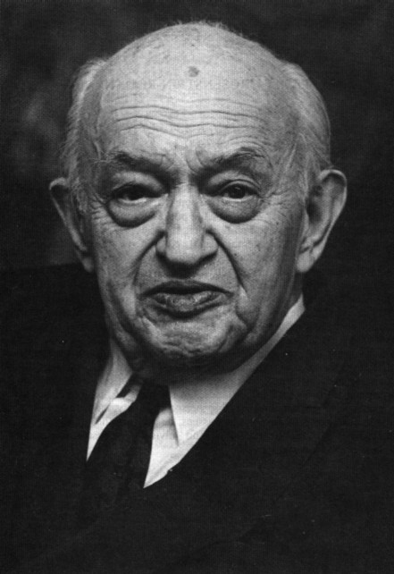

```{r}
#| label: setup
#| include: false

library(ggplot2)
library(dplyr)
library(scales)
library(knitr)
library(kableExtra)

# IU color palette
iu_crimson <- "#990000"
iu_cream <- "#EDEBEB"
iu_gray <- "#535054"
iu_light_gray <- "#7E7E7E"
iu_dark_text <- "#2C3E50"
iu_green <- "#1B5E3F"
iu_navy <- "#1F3A5F"

theme_ipe <- function(base_size = 20) {
  theme_minimal(base_size = base_size) +
    theme(
      plot.title = element_text(color = iu_crimson, face = "bold", size = rel(1.2),
                                margin = margin(t = 5, b = 5)),
      plot.subtitle = element_text(color = iu_gray, size = rel(0.9),
                                   margin = margin(b = 10)),
      plot.caption = element_text(color = iu_light_gray, size = rel(0.7),
                                  hjust = 0, margin = margin(t = 10)),
      axis.title = element_text(color = iu_dark_text, size = rel(0.9)),
      axis.title.x = element_text(margin = margin(t = 8)),
      axis.title.y = element_text(margin = margin(r = 8)),
      axis.text = element_text(color = iu_gray, size = rel(0.8)),
      panel.grid.minor = element_blank(),
      panel.grid.major = element_line(color = "#E5E5E5", linewidth = 0.4),
      legend.position = "bottom",
      legend.title = element_text(size = rel(0.85)),
      legend.text = element_text(size = rel(0.8)),
      plot.margin = margin(t = 8, r = 12, b = 20, l = 12)
    )
}
```

## Today's Plan

::: {.callout-important appearance="minimal" icon=false}
## Today's Big Question
[**How should developing countries approach global market integration?**]{style="font-size: 1.4em; line-height: 1.4;"}
:::

```{r}
#| label: tbl-plan

plan <- data.frame(
  Section = c("1 · The Development Problem and the State",
              "2 · Import-Substituting Industrialization",
              "3 · The Political Economy of ISI",
              "4 · The Rise and Fall of ISI",
              "5 · EOI and the East Asian Model",
              "6 · The Neoliberal Turn",
              "7 · Geoeconomic Statecraft"),
  Cover = c("Why structuralists thought that market discipline kept poor countries poor",
            "The logic and toolkit of import substitution — and the G77 push to rewrite trade rules",
            "Who benefits and loses from ISI?",
            "Rapid early growth, then twin deficits, rent-seeking, and stagnation",
            "Export discipline, the developmental state, and China's success",
            "Debt crisis, the Washington Consensus, and the retreat of the state",
            "Beijing vs. Washington, strategic resilience")
)

kable(plan, col.names = c("Section", "What we'll cover"),
      align = c("l", "l")) %>%
  kable_styling(font_size = 21, full_width = TRUE) %>%
  row_spec(0, bold = TRUE, color = "white", background = iu_crimson) %>%
  column_spec(1, bold = TRUE, color = iu_crimson, width = "40%") %>%
  column_spec(2, width = "60%")
```

::: {.notes}
This is a combined session covering two chapters, and the arc is a complete pendulum swing. The first three sections build the world of state-led development: the structuralist case that markets fail poor countries, the import-substitution strategy that case justified, and the domestic political coalitions that made it durable. Section four shows that strategy running into the wall — rapid early growth giving way to fiscal and trade deficits and entrenched rent-seeking. Sections five and six are the counter-swing: the East Asian export model and then the debt-crisis-driven turn to the Washington Consensus that dismantled ISI across the developing world. The seventh section brings it to the present — China's state-guided rise, the "Beijing Consensus" debate, and the live revival of selective protection under the banner of "strategic resilience," which loops us straight back to the economic-security material from Chapter 5. Two throughlines to flag now. First, almost everything we discuss is Chapter 5's state-centered, strategic-trade logic applied at the scale of an entire economy — infant industry, rents, the developmental state. Second, today's article, Irwin's "Rise and Fall of Import Substitution," is the student presentation, so I'll set the stage but leave the article itself for our presenter.
:::


# The Development Problem and the State {background-color="#990000"}


## Mexico, 1985 → Mexico, 1995

::: {.columns}
::: {.column width="37%"}

### Closed → open in a decade

**Into the mid-1980s** — among the world's most protected economies: tariffs to 100%, **~1,200 state-owned enterprises**, not even in the GATT.

**Then, fast** — joined **GATT (1987)** and **NAFTA (1994)**; privatized, deregulated, integrated into world markets.

:::
::: {.column width="63%"}

```{r}
#| label: fig-mexico
#| fig-width: 9.5
#| fig-height: 5.0
#| out-width: "95%"
#| fig-alt: "Mexico real GDP per capita, 1960 to 2023. It rises rapidly during the ISI era to a 1981 peak (about 3.7 percent per year), falls through the 1982 debt crisis and 'lost decade', and after opening (GATT 1986, NAFTA 1994) grows only about 0.6 percent per year, regaining its 1981 level only around 2000."

mx <- read.csv("data/mexico_gdppc.csv")

ggplot(mx, aes(year, gdppc)) +
  annotate("rect", xmin = 1982, xmax = 1988, ymin = -Inf, ymax = Inf, fill = "#7B1E1E", alpha = 0.08) +
  geom_vline(xintercept = c(1986, 1994), linetype = "dashed", color = iu_navy, linewidth = 0.7) +
  geom_line(color = iu_crimson, linewidth = 1.4) +
  annotate("text", x = 1986, y = 10550, label = "GATT '86", color = iu_navy, fontface = "bold", size = 3.6, hjust = 1.05) +
  annotate("text", x = 1994, y = 10550, label = "NAFTA '94", color = iu_navy, fontface = "bold", size = 3.6, hjust = -0.05) +
  annotate("text", x = 1969, y = 7950, label = "ISI era\n+3.7%/yr", color = iu_dark_text, fontface = "bold", size = 4, lineheight = 0.9) +
  annotate("text", x = 1985, y = 5650, label = "debt crisis +\n\"lost decade\"\n-2.1%/yr", color = "#7B1E1E", fontface = "bold", size = 3.5, lineheight = 0.9) +
  annotate("text", x = 2010, y = 7350, label = "post-NAFTA\n+0.6%/yr", color = iu_dark_text, fontface = "bold", size = 4, lineheight = 0.9) +
  scale_x_continuous(breaks = seq(1960, 2020, 20), limits = c(1960, 2026)) +
  scale_y_continuous(limits = c(4000, 10900), labels = scales::dollar) +
  labs(title = "Opening ended the slump — but never fully recovered growth rates",
       subtitle = "Mexico: real GDP per capita (constant 2015 US$)",
       x = NULL, y = NULL,
       caption = "Source: World Bank, GDP per capita, constant 2015 US$ (NY.GDP.PCAP.KD). Growth rates annualized between period endpoints.") +
  theme_ipe(base_size = 15)
```

:::
:::

::: {.callout-important appearance="minimal" icon=false}
Mexico's reversal was the rule, not the exception — India, China, most of Latin America and Africa did the same. **Why did nearly every poor country first turn *away* from world markets, then turn back?**
:::

::: {.notes}
Oatley opens both chapters with Mexico because it compresses the whole story into one country. Into the mid-1980s Mexico was among the most closed economies on earth — imports needed government permission, tariffs averaged twenty-five percent and reached a hundred, it wasn't even in the GATT, and the state directly owned roughly twelve hundred enterprises that absorbed a third of all industrial investment. Then, in barely a decade, it reversed course completely: GATT in 1987, NAFTA in 1994, privatization, deregulation, deep integration. And Mexico was utterly typical. India, China, most of Latin America, almost all of sub-Saharan Africa followed the same trajectory — opt out of the world trade system after the war, build a protected state-led economy, then dismantle it from the 1980s on. That double reversal is the puzzle organizing today. The first half of the lecture explains the turn inward; the second half explains the turn back out. And the chart is worth dwelling on, because the real data refuse to flatter either side of the debate. Mexico's GDP per capita, in constant dollars from the World Bank, shows three distinct regimes. From 1960 to the 1981 peak — the ISI decades — Mexico grew fast, about 3.7 percent a year per person, more than doubling living standards. Then the 1982 debt crisis detonates, and the shaded "lost decade" follows: per capita income actually falls, roughly two percent a year, and doesn't regain its 1981 level until the late 1990s. Opening happens right in the middle of that wreckage — GATT in 1986, NAFTA in 1994. And here is the honest, deflating punchline: after opening, growth resumes but only crawls, about 0.6 percent a year per person. So liberalization ended the catastrophic slump, but it never came close to restoring the ISI-era growth rate. That is the "Mexican puzzle," and it is exactly why the simple story — closed bad, open good — won't survive contact with the data, and why the whole development debate is still live. And keep one question alive the whole time, because it's where we end: now that China has risen on a heavily state-guided model, is the pendulum swinging back toward the state again?
:::


## The Structuralist Diagnosis: Markets Fail the Poor

The dominant development economics of the 1950s — **structuralism** — held that markets alone *would not* industrialize a poor country. Two domestic **coordination problems** stood in the way:

::: {.columns}
::: {.column width="50%"}

### Complementary demand
*(Rosenstein-Rodan)* No single factory can sell its output if few others exist to buy it. Investment only pays **if many industries start at once** — but no firm moves first.

:::
::: {.column width="50%"}

### Pecuniary external economies
*(Scitovsky)* A bigger steel plant lowers input costs for carmakers — who would then expand and buy more steel. But neither invests **unless the other does too**.

:::
:::

::: {.columns}
::: {.column width="50%"}
::: {style="text-align:center;"}
{style="height:200px; width:auto; border:1px solid #ccc;"}

[**Paul Rosenstein-Rodan** · complementary demand]{style="font-size:0.5em; color:#535054;"}
:::
:::
::: {.column width="50%"}
::: {style="text-align:center;"}
{style="height:200px; width:auto; border:1px solid #ccc;"}

[**Tibor Scitovsky** · pecuniary external economies]{style="font-size:0.5em; color:#535054;"}
:::
:::
:::

::: {.callout-tip appearance="minimal" icon=false}
The market is stuck in a low-level trap. The structuralist fix: a **state-led "big push"** — the government plans and coordinates the investments the market cannot. (This is Ch. 5's market-failure logic, but focused on developing/under-industrialized economies specifically.)
:::

::: {.notes}
Why would anyone deliberately close their economy? Not on a whim — on a theory. The dominant development economics of the postwar decades was structuralism, and its core claim was that markets, left alone, will not move a poor agrarian economy into manufacturing. The reason is two coordination problems. The first, from Rosenstein-Rodan, is complementary demand: imagine pulling a hundred people out of subsistence farming to make shoes — who buys the shoes, when almost no one else earns a wage? A single factory fails; investment only pays off if many industries start simultaneously so workers can buy each other's products. But no individual entrepreneur will move first, so the market produces no investment at all. The second, from Scitovsky, is pecuniary external economies: if the steel plant expands, steel gets cheaper, which would make carmaking more profitable and induce the car plant to expand and buy more steel — a virtuous circle that raises national income. But the steel firm won't expand unless it's sure the car firm will, and vice versa, so again nothing happens. Both are classic coordination failures, and the structuralist solution is a state-led "big push": the government plans and either makes or coordinates the investments the market won't. Notice this is exactly the market-failure reasoning from Chapter 5 — the case for intervention rests on naming a failure the market can't fix on its own — only here it's applied to the structural transformation of an entire economy.
:::


## Singer-Prebisch and the Super-Cycle Reality

**The Prebisch-Singer hypothesis:** the *periphery* (commodity exporters) faces a steadily **declining terms of trade** against the *core* (manufactures) — because as the world grows richer, demand for raw materials lags demand for manufactures (**low income-elasticity**). The structuralist conclusion: don't stay a commodity exporter — **industrialize.** Does the real evidence hold up?

```{r}
#| label: fig-supercycle
#| fig-width: 12
#| fig-height: 4.0
#| out-width: "80%"
#| fig-alt: "Real non-fuel commodity price index, 1900-2016. A line shows four super-cycles peaking around 1917, 1951, 1973, and 2011, while dashed cycle-average segments step down across the four cycles, indicating a mild long-run decline."

# Super-cycle windows (trough-to-trough) and peaks: Erten & Ocampo (2013, Table 2)
cyc <- data.frame(
  start = c(1894, 1932, 1971, 1999),
  end   = c(1932, 1971, 1999, 2010),
  peak  = c(1917, 1951, 1973, 2010),
  plab  = c("1917\nUS rise", "1951\nEurope +\nJapan rebuild",
            "1973\noil & commodity\nboom", "2010\nCHINA"))

datafile <- "data/gycpi.csv"   # drop a real annual series here for an exact swap

if (file.exists(datafile)) {
  raw <- read.csv(datafile, stringsAsFactors = FALSE)
  names(raw) <- tolower(names(raw))
  icol <- intersect(c("index", "real_nonfuel", "real", "gycpi_real", "gycpi", "value"), names(raw))[1]
  if (is.na(icol)) icol <- names(raw)[2]
  ser <- data.frame(year = raw$year, idx = raw[[icol]])
  ser <- ser[!is.na(ser$idx) & !is.na(ser$year), ]
  # cycle averages computed from the real data within each documented window
  means <- do.call(rbind, lapply(seq_len(nrow(cyc)), function(i) {
    sub <- ser[ser$year >= cyc$start[i] & ser$year < cyc$end[i], ]
    data.frame(x1 = max(min(sub$year, na.rm = TRUE), cyc$start[i]),
               x2 = min(max(sub$year, na.rm = TRUE) + 1, cyc$end[i]),
               m  = mean(sub$idx, na.rm = TRUE))
  }))
  peaks <- data.frame(year = cyc$peak,
                      idx  = sapply(cyc$peak, function(py) ser$idx[which.min(abs(ser$year - py))]),
                      lab  = cyc$plab)
  src_note <- "Real non-fuel Grilli–Yang Commodity Price Index (annual data); super-cycle windows from Erten & Ocampo (2013, Table 2)."
} else {
  # Fallback: faithful reconstruction anchored to Erten & Ocampo's documented turning points
  anchors <- data.frame(
    year = c(1865, 1885, 1894, 1917, 1932, 1951, 1971, 1973, 1999, 2010),
    idx  = c(150,  152,  125,  190,  85,   146,  83,   115,  55,   99))
  ser <- as.data.frame(approx(anchors$year, anchors$idx, xout = 1865:2010))
  names(ser) <- c("year", "idx")
  means <- data.frame(x1 = cyc$start, x2 = cyc$end, m = c(157.3, 119.4, 86.2, 82.2))
  peaks <- data.frame(year = cyc$peak, idx = c(190, 146, 115, 99), lab = cyc$plab)
  src_note <- "Grilli–Yang index, extended by Ocampo & Parra (2010); peaks and cycle means from Erten & Ocampo (2013, Table 2). Line interpolated between documented turning points."
}

xr <- range(ser$year); yr <- range(ser$idx)

ggplot() +
  geom_line(data = ser, aes(year, idx), color = iu_crimson, linewidth = 1.15) +
  geom_segment(data = means, aes(x = x1, xend = x2, y = m, yend = m),
               color = iu_navy, linewidth = 1.0, linetype = "longdash") +
  geom_text(data = means, aes(x = (x1 + x2) / 2, y = m + 0.06 * diff(yr), label = round(m)),
            color = iu_navy, fontface = "bold", size = 4.2) +
  geom_point(data = peaks, aes(year, idx), color = iu_crimson, size = 2.8) +
  geom_text(data = peaks, aes(year, idx, label = lab), vjust = -0.3, size = 3.3,
            color = iu_dark_text, lineheight = 0.9, fontface = "bold") +
  annotate("text", x = xr[1] + 0.27 * diff(xr), y = yr[1] + 0.04 * diff(yr),
           label = "navy dashed = super-cycle average",
           color = iu_navy, size = 3.8, hjust = 0, fontface = "italic") +
  scale_x_continuous(breaks = scales::breaks_width(25), limits = c(xr[1] - 2, xr[2] + 6)) +
  scale_y_continuous(limits = c(yr[1] - 0.08 * diff(yr), yr[2] + 0.12 * diff(yr))) +
  labs(title = "Four super-cycles around a gently falling trend",
       subtitle = "Real non-fuel commodity price index (1977–79 = 100)",
       x = NULL, y = "Index", caption = src_note) +
  theme_ipe(base_size = 16)
```

::: {.callout-important appearance="minimal" icon=false}
**Partly.** (1) **Super-cycles dominate** — four decades-long waves, each riding a rising power's industrialization (the US, postwar Europe/Japan, the 1970s, and most recently **China**). (2) **A mild Prebisch-Singer drift** — each super-cycle's *average* (navy) steps **below** the last. Economists reject a smooth secular decline — **but developing-country governments *believed* in it, and that belief drove the turn to ISI.**
:::

::: {.notes}
This slide does double duty: it states the Prebisch-Singer hypothesis and immediately tests it against real data, which I much prefer to drawing a stylized schematic. First the hypothesis — the second structuralist argument, from Raúl Prebisch and Hans Singer. Divide the world into an industrial core and a commodity-exporting periphery and look at the terms of trade, the price of what you export relative to what you import. They argued the periphery's terms of trade decline steadily, and the mechanism is income elasticity of demand: as the world grows richer, people spend a shrinking share of income on raw materials and food and a growing share on manufactures, so commodity prices lag and the exporter must give up more and more exports to buy the same imports. The radical implication — trading on commodity terms is a trap, so you must industrialize. Now the data, and this is the real, deflated Grilli-Yang non-fuel commodity price index, Pfaffenzeller's updated annual series from 1900 to 2016, the same index family Erten and Ocampo decompose in their 2013 super-cycle study. Two findings pull in opposite directions. First, the dominant feature is not a trend but super-cycles: four decades-long waves, each driven by the industrialization and urbanization of a rising power that sucks in raw materials — the United States around 1917, European reconstruction and Japan peaking about 1951, the 1973 oil-and-commodity boom, and most recently China, building through the 2000s and peaking around 2011, which is a lovely bridge to the China growth model we debate in the second half. Second, and here the structuralists get partial vindication: the navy dashed line, the average of each successive super-cycle, steps down — from roughly 140 in the first cycle to about 70 in the most recent. That sequential decline in the cycle means is the Prebisch-Singer effect, expressed through super-cycles rather than as one smooth line. So the honest verdict, and it's the political-economy one: most economists reject a smooth secular decline, but the objective truth almost doesn't matter — what mattered is that developing-country governments believed in the decline, and that belief, combined with the coordination argument, gave them a complete intellectual license to turn inward. And this is genuinely real annual data — the Pfaffenzeller GYCPI deflated by the manufactures unit-value index — so the line and the cycle averages are computed directly from it, not reconstructed.
:::


# Import-Substituting Industrialization {background-color="#990000"}


## The Logic of ISI: Make It Here Instead

**Import substitution industrialization (ISI):** industrialize by producing domestically the manufactured goods you used to import. Conceived as a **two-stage** strategy.

```{r}
#| label: tbl-stages

st <- data.frame(
  stage = c("Commodity Exports\n(1880–1930)", "Primary / \"Easy\" ISI\n(1930–1955)", "Secondary ISI\n(1955–1968)"),
  ind = c("Precious metals, oil, coffee, rubber, cotton — primary commodities",
          "Simple consumer goods: textiles, food, cement, apparel, shoes",
          "Consumer durables + capital goods: autos, machinery, petrochemicals, pharma"),
  orient = c("World market", "Domestic market", "Domestic market")
)

kable(st, col.names = c("Stage", "Main industries", "Orientation"),
      align = c("l","l","l")) %>%
  kable_styling(font_size = 22, full_width = TRUE) %>%
  row_spec(0, bold = TRUE, color = "white", background = iu_crimson) %>%
  row_spec(1:3, extra_css = "padding-top: 14px; padding-bottom: 14px; line-height: 1.35;") %>%
  column_spec(1, bold = TRUE, color = iu_crimson, width = "24%") %>%
  column_spec(2, width = "56%") %>%
  column_spec(3, width = "20%")
```

::: {.callout-tip appearance="minimal" icon=false}
**Easy ISI** is "imitation": large existing demand, mature technology, low-skill labor. 


When the domestic market for simple goods is exhausted, governments faced a fork 

— **export** (East Asia) or 

— go **deeper into ISI** (most of the rest).
:::

::: {.notes}
Import substitution industrialization is a simple idea: instead of importing manufactured goods, produce them at home behind a protective wall, and let domestic industry grow into the space imports used to fill. Oatley, following Gereffi, lays it out as stages, and this is Table 6.3 rebuilt from the reading. You start as a commodity exporter selling to the world market. Then comes the first stage of ISI — "easy" ISI — focused on simple consumer goods: textiles, food, cement, shoes, apparel. It's called easy because it's imitation: there's already large domestic demand currently met by imports, the technology is mature and can be bought off the shelf, and production uses abundant low-skill labor. Easy ISI tends to work at first and even builds useful management and labor skills. But it exhausts itself — the domestic market for simple goods is finite. At that point governments hit a genuine fork in the road, and which branch they took is the hinge of the whole lecture. One option is to take those now-established light industries and push them to export — the path East Asia chose, which we'll get to in section five. The other is secondary ISI: go deeper, into consumer durables and the capital goods needed to make them — automobiles, machinery, petrochemicals. Most of the developing world outside East Asia took this second road, and that choice is what eventually generated the crisis.
:::


## ISI Requires Protective Tariffs

Secondary ISI grew **backward linkages** (Hirschman): make cars → demand parts → demand steel, glass, rubber. Governments pushed it with **planning**, **state investment** (SOEs + nationalized finance), and, above all, **trade barriers** with a signature shape — **tariff escalation.**

```{r}
#| label: fig-tariffs
#| fig-width: 11
#| fig-height: 4.7
#| out-width: "86%"
#| fig-alt: "Grouped bar chart of nominal protection (percent) circa 1960 by good category, comparing the average of six Latin American countries with the European Economic Community. Latin American tariffs are highest on nondurable and durable consumer goods (about 191 and 160 percent) and fall to roughly 48 to 64 percent on inputs and capital goods, while the EEC stays under 20 percent throughout."

goods <- c("Nondurable\nconsumer", "Durable\nconsumer", "Semi-\nmanufactures",
           "Industrial\nraw materials", "Capital\ngoods")
tar <- data.frame(
  country = c("Argentina", "Brazil", "Chile", "Colombia", "Mexico", "Uruguay", "EEC"),
  nd  = c(176, 260, 328, 247, 114, 23, 17),
  dur = c(266, 328, 90, 108, 147, 24, 19),
  sm  = c(95, 80, 98, 28, 28, 23, 7),
  rm  = c(55, 106, 111, 57, 38, 14, 1),
  cap = c(98, 84, 45, 18, 14, 27, 13)
)
latam <- colMeans(tar[tar$country != "EEC", c("nd", "dur", "sm", "rm", "cap")])
eec   <- unlist(tar[tar$country == "EEC", c("nd", "dur", "sm", "rm", "cap")])

pd <- data.frame(
  good   = factor(rep(goods, 2), levels = goods),
  region = factor(rep(c("Latin America (avg. of 6)", "EEC"), each = 5),
                  levels = c("Latin America (avg. of 6)", "EEC")),
  val    = c(latam, eec)
)

ggplot(pd, aes(good, val, fill = region)) +
  geom_col(position = position_dodge(width = 0.78), width = 0.7) +
  geom_text(aes(label = round(val)), position = position_dodge(width = 0.78),
            vjust = -0.35, fontface = "bold", size = 4.3, color = iu_dark_text) +
  scale_fill_manual(values = c("Latin America (avg. of 6)" = iu_crimson, "EEC" = iu_navy),
                    name = NULL) +
  scale_y_continuous(limits = c(0, 215)) +
  labs(title = "Tariff escalation — and how far Latin America ran above Europe",
       subtitle = "Nominal protection (%), c. 1960: average of 6 Latin American countries vs. the EEC",
       x = NULL, y = NULL,
       caption = "Computed from Oatley Table 6.4 (Argentina, Brazil, Chile, Colombia, Mexico, Uruguay; EEC benchmark), after Bulmer-Thomas (1994).") +
  theme_ipe(base_size = 15) +
  theme(panel.grid.major.x = element_blank(), axis.text.y = element_blank())
```

::: {.callout-tip appearance="minimal" icon=false}
Two things at once: **escalation** — Latin American tariffs tower over **consumer goods** (~190% / ~160%) and fall sharply on the **inputs and capital goods** industry had to import (~48–64%); and **scale** — every category dwarfs the **EEC**, which never tops 19%. Wall off the home market; keep imported inputs cheap.
:::

::: {.notes}
Secondary ISI had a clear logic — backward linkages, Hirschman's term. If you make domestic producers assemble cars and steadily raise the share of locally made parts, you create demand for a domestic parts industry; the parts industry creates demand for steel, glass, rubber; and industrialization ripples backward from final goods to intermediate inputs to capital goods. Governments pursued this with three instruments. First, planning — typically five-year plans that chose which industries to target. Remember, structuralism said the market couldn't coordinate investment, so the plan was meant to be the coordination device. Second, investment policy: governments nationalized or tightly controlled finance to steer credit to targeted sectors, and where private capital wouldn't go — big, lumpy, technically demanding projects like steel and autos, and infrastructure — they invested directly through state-owned enterprises. The state became, in many countries, the largest owner of productive capacity. Third, trade barriers, and the chart captures their signature shape: tariff escalation. Averaged across the six Latin American countries, protection ran about 191 percent on nondurable consumer goods and 160 on durables, but fell to roughly 50 to 65 percent on the semi-manufactures, raw materials, and capital goods that industry had to import — wall off the output, cheapen the input. And the comparison bars make the second point: the European Economic Community, an advanced economy, never exceeded 19 percent on anything, so Latin America's barriers didn't just escalate internally, they towered over the rich world's. Brazil and India went further with the "law of similars," simply prohibiting imports of anything with a domestic equivalent, regardless of price or quality. The structure tells you the goal: wall off the home market for your manufacturers while keeping their imported inputs cheap.
:::


## Who Paid for It? Agriculture Did

ISI **redistributed income from countryside to city** — taxing the export sector to subsidize industry.

::: {.columns}
::: {.column width="55%"}

- **Marketing boards** bought crops from farmers below world prices and sold at world prices — the gap was a tax on farmers
- Tariffs raised the price of the manufactures farmers had to buy
- In **Ghana**, farmers received only ~**40%** of the free-trade value of their crops; real farm incomes could have **risen 2.5×** under free trade

:::
::: {.column width="45%"}

::: {.callout-important appearance="minimal" icon=false}
ISI was a giant *distributional* transfer: **export-oriented producers lost, import-competing producers won.** Thus, ISI was only politically possible when domestic institutions favored urban capital/labor groups and marginalized agricultural interests.
:::

:::
:::

::: {.callout-tip appearance="minimal" icon=false}
Rapid early payoff: developing economies grew **6–7.6%/yr** in the 1960s–70s, led by manufacturing. ISI *appeared* to work.
:::

::: {.notes}
Every protective strategy has someone paying the bill, and under ISI it was agriculture. The mechanism was partly explicit and partly hidden. Explicitly, governments ran marketing boards — often the sole legal buyer of a crop — that purchased from domestic farmers well below the world price and resold at the world price, pocketing the difference as a tax to finance industry. Implicitly, the tariff wall raised the price of the manufactured goods farmers had to buy. The magnitudes were enormous: a World Bank study found Ghanaian farmers received only about forty percent of what they'd have earned under free trade — their real incomes could have been two-and-a-half times higher. So ISI was, at bottom, a vast distributional transfer: income flowed from export-oriented agriculture to import-competing manufacturing and the urban economy. Hold onto that, because it's the bridge to the next section — a policy that systematically benefits urban industry and labor at the expense of rural landowners and farmers is not just an economic strategy, it's a political coalition. And here's the seduction: for a while it looked like it was working. Developing economies grew six to seven-and-a-half percent a year in the 1960s and 70s, with manufacturing leading. The bill, and the imbalances, came later.
:::


## ISI and International Trade Architecture

ISI challenged **Free Trade** ideology that developing countries should specialize in primary production. Because it required high tariffs on final goods, late industrializers sought to shift rules to provide preferences for developing countries (remember this was happening during Cold War).

::: {.columns}
::: {.column width="50%"}

### 1960s — UNCTAD & the Group of 77
Through **UNCTAD** (est. 1964), the **G77** pressed three demands:

1. **Commodity price stabilization** — price floors + buffer funds to halt the Singer-Prebisch slide
2. **Financial transfers** to offset declining terms of trade
3. **Preferential market access** — the **GSP** and **GATT Part IV** (non-reciprocity)

:::
::: {.column width="50%"}

### 1970s — the NIEO, and its collapse
The **1973 oil shock** showed "commodity power." Emboldened, the G77 escalated to the **New International Economic Order** (1974): control over MNCs, cheaper technology, debt relief, more aid, a louder voice in the IMF/World Bank.

It **died by the mid-1980s** — the G77 fractured, OPEC wouldn't lend its oil leverage, and the **debt crisis** drove countries to the IMF/World Bank, flipping power back to the North.

:::
:::

::: {.callout-important appearance="minimal" icon=false}
The international winners/losers: **redistribute the gains from trade** — at home from farm to factory, abroad from North to South. Both collapsed together in the **1980s debt crisis** — which sets up the neoliberal turn.
:::

::: {.notes}
This slide restores the half of Chapter 6 I'd dropped, and it matters because ISI was never only a domestic program — it had an international arm, and Oatley treats the two as mirror images. The logic follows directly from structuralism: if you believe the existing GATT order is biased against late industrializers, then reforming your own economy isn't enough — you also have to change the rules of the global game. So from the early 1960s, developing countries organized. The vehicle was UNCTAD, the UN Conference on Trade and Development, founded in 1964, and the coalition was the Group of 77. Through the sixties they pressed three demands, all aimed at capturing a larger share of the gains from trade. First, commodity price stabilization — price floors and buffer-stock financing, funded largely by the rich countries, to halt the terms-of-trade slide that Prebisch and Singer had diagnosed. Second, direct financial transfers to compensate for the purchasing power lost to declining terms of trade. Third, preferential market access, and here they won two real concessions — the Generalized System of Preferences, the GSP, giving developing-country manufactures preferential entry, and GATT Part IV, which freed them from strict reciprocity in tariff bargaining. But both were thin in practice: the GSP capped quantities and excluded sensitive sectors, and Part IV delivered few concrete gains. Then 1973 changed the mood. The oil shock was a demonstration of commodity power — OPEC used its control of oil to transform its own terms of trade — and the G77, emboldened, escalated to the New International Economic Order, adopted by the UN General Assembly in 1974: a sweeping agenda of control over multinationals, cheaper technology transfer, debt relief, more aid, and a bigger role in running the IMF and World Bank. It went nowhere, dead by the mid-1980s, for three reasons — and the third ties the whole lecture together. The coalition fractured, because the G77 was too heterogeneous and the advanced countries could peel members off with selective concessions. OPEC declined to use its oil leverage on behalf of the broader group. And most decisively, the early-1980s debt crisis sent country after country to the IMF and World Bank for rescue, which flipped the balance of power back to the advanced economies and let them dictate rather than negotiate terms. So the international struggle and the domestic strategy collapsed at the same moment and for the same reason — and that collapse is exactly the hinge into the second half of today: the debt crisis, the Washington Consensus, and the neoliberal turn.
:::


# The Political Economy of ISI {background-color="#990000"}


## Trade Politics Coalition

Trade strategy tracked **who held domestic power** — and global shocks shifted that.

```{r}
#| label: fig-coalition
#| fig-width: 12.5
#| fig-height: 4.2
#| out-width: "92%"
#| fig-alt: "A left-to-right arrow. On the left, pre-WWI: landowners dominate, export agriculture, liberal trade. World War I, the Depression, and World War II in the middle. On the right, postwar: urban manufacturers and labor dominate, import-competing industry, protection."

ggplot() +
  annotate("segment", x = 0.6, xend = 4.4, y = 1, yend = 1, linewidth = 2.2,
           color = iu_light_gray, arrow = arrow(length = unit(0.3, "cm"), type = "closed")) +
  annotate("rect", xmin = 0.5, xmax = 1.9, ymin = 1.25, ymax = 1.95, fill = "#1B5E3F", alpha = 0.92) +
  annotate("text", x = 1.2, y = 1.6, color = "white", fontface = "bold", size = 4.4, lineheight = 0.95,
           label = "Pre-1914\nLandowners rule\nExport agriculture\n→ LIBERAL TRADE") +
  annotate("rect", xmin = 1.95, xmax = 3.05, ymin = 0.55, ymax = 1.0, fill = iu_crimson, alpha = 0.9) +
  annotate("text", x = 2.5, y = 0.77, color = "white", fontface = "bold", size = 4.0, lineheight = 0.95,
           label = "WWI · Depression · WWII\nimports cut off →\nbuild domestic industry") +
  annotate("rect", xmin = 3.1, xmax = 4.5, ymin = 1.25, ymax = 1.95, fill = iu_navy, alpha = 0.92) +
  annotate("text", x = 3.8, y = 1.6, color = "white", fontface = "bold", size = 4.4, lineheight = 0.95,
           label = "Postwar\nUrban industry + labor\nImport-competing\n→ PROTECTION") +
  scale_x_continuous(limits = c(0.4, 4.6)) +
  scale_y_continuous(limits = c(0.5, 2.0)) +
  theme_void()
```

::: {.callout-tip appearance="minimal" icon=false}
Before WWI, landowners ran "oligarchic democracies" (~5% participation) and chose openness. Global shocks forced domestic manufacturing into being — creating an **urban coalition** that then demanded permanent protection.
:::

::: {.notes}
This is the heart of the chapter and the part your political-economy instincts should latch onto: trade policy in the developing world tracked which domestic coalition held power. Before the First World War, power sat with landowners — in Latin America through what's been called "oligarchic democracy," constitutional in form but with participation restricted to maybe five percent of the population, and in Asia and Africa through colonial structures built around export agriculture. Landowners earned their living selling primary commodities to the world, so they wanted open trade, and they got it. Then came a sequence of global shocks — the First World War, the Great Depression, the Second World War — that did something specific: they cut off the flow of manufactured imports and collapsed commodity export markets. Countries were forced into self-reliance, and out of necessity they began manufacturing at home. That accidental industrialization created something new and permanent: an urban coalition of industrialists, a managerial and professional middle class, and organized labor, whose incomes now depended on the protected home market. Once that coalition existed and was organized, it didn't want the protection to end when the wars did. The arrow on the slide is the whole story — power shifted from rural landowners who wanted openness to urban manufacturers and workers who wanted walls, and trade policy followed.
:::


## Two Roads to the ISI Coalition

The coalition formed differently across regions — which shaped how durable and how nationalist ISI became.

::: {.columns}
::: {.column width="20%"}

::: {style="text-align:center;"}
{style="height:550px; width:auto; border:1px solid #ccc;"}

[Peronist poster: Argentina's **Second Five-Year Plan** (1952)]{style="font-size:0.5em; color:#535054;"}
:::

:::
::: {.column width="80%"}

```{r}
#| label: tbl-roads

rd <- data.frame(
  region = c("Latin America", "Former colonies (Asia, Africa)"),
  who = c("ISI benefits urban labor + industrial capital; hurts landowners. Tied to deep class cleavages in highly unequal societies — Perón (Argentina), Vargas (Brazil) rise on urban + labor support.",
          "ISI benefits the indigenous elite taking over the state as colonial powers leave. Tied to a nationalist, anti-colonial orientation — India's autonomous industrialization; land reform shifts power to urban sectors in Korea/Taiwan."),
  cleav = c("Class conflict (urban vs. rural)", "Nationalism (indigenous vs. colonial)")
)

kable(rd, col.names = c("", "How the coalition forms", "Underlying cleavage"),
      align = c("l","l","l")) %>%
  kable_styling(font_size = 20, full_width = TRUE) %>%
  row_spec(0, bold = TRUE, color = "white", background = iu_crimson) %>%
  row_spec(1:2, extra_css = "padding-top: 14px; padding-bottom: 14px; line-height: 1.5;") %>%
  column_spec(1, bold = TRUE, color = iu_crimson, width = "20%") %>%
  column_spec(2, width = "54%") %>%
  column_spec(3, width = "26%")
```

:::
:::

::: {.notes}
The coalition that demanded ISI formed by two different routes, and the difference shaped the politics. In Latin America, the cleavage was class. ISI benefited urban industrial capital and urban labor and hurt the landed export elite, in societies that were already among the most unequal in the world. So ISI got bound up with populist class politics — Perón in Argentina rising on a coalition of labor, industrialists, and the military; Vargas in Brazil on industrialists, civil servants, and urban workers. In the former colonies of Asia and Africa, the cleavage was nationalism. Here ISI benefited the indigenous elite who inherited the state as the colonial powers withdrew, and it became fused with the anti-colonial project: economic self-sufficiency as the economic arm of political independence. India emerged from forced wartime self-reliance committed to autonomous industrialization as a nationalist goal; in Korea and Taiwan, postwar land reforms broke the power of landowners and handed influence to the urban-industrial sector. The takeaway: ISI wasn't just an economic doctrine that happened to be adopted. In Latin America it was the economic program of a class coalition; in the post-colonial world it was the economic program of nationalism. That's why it was so politically entrenched and, as we'll see, so hard to reverse. The poster is propaganda for Argentina's Second Five-Year Plan — a reminder that under Perón, ISI planning wasn't a dry technocratic exercise but a mass-mobilizing nationalist spectacle, which is part of why it was so durable.
:::


## So Why Didn't Everyone Just Export?

If East Asian export-led growth worked so well, why did most of the developing world choose ISI instead? **Initial conditions and politics.**

::: {.columns}
::: {.column width="55%"}

**EOI tended to emerge where:**

- Markets were **small** (forcing an outward orientation)
- **Inequality was low**; land was not dominated by a large rural elite
- Agriculture was small-scale — no powerful landowning bloc to tax or appease

**ISI tended to emerge where:**

- Self-sufficiency was **politically popular** (nationalism, class reform)
- Powerful urban coalitions could **capture** protection

:::
::: {.column width="45%"}

::: {.callout-important appearance="minimal" icon=false}
Initial conditions shaped the **political institutions** that arose, and in turn, how interests where aggregated.
:::

```{r}
#| label: fig-rogowski
#| fig-width: 5.6
#| fig-height: 4.3
#| out-width: "96%"
#| fig-alt: "Rogowski's 2x2 of factor endowments. Rows are advanced versus backward economies; columns are land-abundant versus land-scarce. Under expanding trade each cell predicts a trade coalition; the backward, land-abundant cell (Latin America) pits landowners who favor free trade against scarce urban capital and labor, producing the protectionist ISI coalition."

rq <- data.frame(
  xmin = c(0, 1, 0, 1), xmax = c(1, 2, 1, 2),
  ymin = c(1, 1, 0, 0), ymax = c(2, 2, 1, 1),
  hl   = c("no", "no", "yes", "no"),
  lab  = c("Advanced · land-rich\n(US, Canada, Australia)\nCLASS:\nland + capital  vs  labor",
           "Advanced · land-poor\n(W. Europe, Japan)\nURBAN-RURAL:\ncapital + labor  vs  land",
           "Backward · land-rich\n(LATIN AMERICA)\nland  vs  capital + labor\n= the ISI coalition",
           "Backward · land-poor\n(China, India)\nCLASS:\nlabor  vs  capital + land")
)

ggplot(rq) +
  geom_rect(aes(xmin = xmin, xmax = xmax, ymin = ymin, ymax = ymax, fill = hl),
            color = "white", linewidth = 2.5) +
  geom_text(aes(x = (xmin + xmax) / 2, y = (ymin + ymax) / 2, label = lab),
            color = ifelse(rq$hl == "yes", "white", iu_dark_text),
            fontface = "bold", size = 2.85, lineheight = 0.96) +
  scale_fill_manual(values = c(yes = iu_crimson, no = "#EDE7E7"), guide = "none") +
  scale_x_continuous(breaks = c(0.5, 1.5), labels = c("Land\nabundant", "Land\nscarce"),
                     position = "top", limits = c(0, 2), expand = c(0, 0)) +
  scale_y_continuous(breaks = c(0.5, 1.5), labels = c("Backward", "Advanced"),
                     limits = c(0, 2), expand = c(0, 0)) +
  labs(title = "Rogowski (1989): endowments → coalitions",
       subtitle = "pro-trade vs. protectionist factors, under expanding trade",
       x = NULL, y = NULL) +
  theme_ipe(base_size = 13) +
  theme(panel.grid = element_blank(), axis.ticks = element_blank(),
        plot.subtitle = element_text(size = rel(0.78)))
```

:::
:::

::: {.notes}
The obvious question, once you know East Asia's export model outperformed, is why the rest of the developing world didn't simply copy it. The answer the chapter and your I203 framing give is that the choice wasn't free — it was conditioned by initial structures and the politics they generated. Export-oriented industrialization tended to emerge in places with small domestic markets, which essentially forced an outward orientation because there was no big home market to hide in; with relatively low inequality; and without a dominant large-landowning rural elite, because agriculture was small-scale. Import substitution tended to emerge where self-sufficiency was politically popular — for nationalist or class-reform reasons — and where powerful, concentrated urban coalitions could capture and defend the protection. The deeper point, and it's a nice connection to the institutions material we'll hit at the end: these initial conditions didn't just pick a policy, they shaped the political institutions that arose, and those institutions then determined whether a state could actually impose and sustain something as demanding as export discipline. Equal, small-market societies tended to build states that could; highly unequal societies with entrenched coalitions tended not to. So "just export" was never just a policy choice — it presupposed a kind of state and society many countries didn't have. The 2×2 on the right is Rogowski's classic framework, and it gives the microfoundation. Cross-classify economies by capital (advanced vs. backward) and land (abundant vs. scarce); under expanding trade, Stolper-Samuelson predicts that owners of the abundant factors push for openness while owners of the scarce factors demand protection. The cell that matters for us is the bottom-left — backward and land-abundant, the Latin American type: land is abundant, so landowners favor free trade, while the scarce urban factors, capital and labor, unite in a protectionist coalition. That is the ISI coalition, read straight off the endowments. And notice the land-scarce, labor-abundant Asian economies sit in a different cell entirely, which is part of why their trade politics — and their openness to an export path — diverged.
:::


# The Rise and Fall of ISI {background-color="#990000"}


## The Twin Deficits

::: {.columns}
::: {.column width="50%"}

### Budget deficits
- SOEs ran combined operating losses ~**4% of GDP**; kept alive from the budget
- Urban subsidies (food, fuel, transport) + civil-service padding (Benin's tripled, 1960–80)

:::
::: {.column width="50%"}

### Current-account deficits
- ISI **depended on imports** (machines, parts) but its industries **couldn't export** — small markets, no scale, excess capacity
- **Overvalued exchange rates** made imports cheap and exports uncompetitive

:::
:::

```{r}
#| label: fig-debt
#| fig-width: 11
#| fig-height: 4.2
#| out-width: "84%"
#| fig-alt: "External debt stocks as a percent of GNI for Mexico, Brazil, and Argentina, 1970 to 1995. All three sit near 15 to 20 percent in 1970, climb through the 1970s, and surge after the 1982 debt crisis to peaks of roughly 50 to 80 percent (Argentina spikes to 93 percent in 1989) before easing in the 1990s."

yrs <- 1970:1995
mex <- c(20.3,19.8,18.8,19.6,19.9,21.4,27.9,39.4,36.0,32.9,28.9,30.9,50.1,63.4,54.6,52.1,79.6,77.9,57.0,44.1,41.4,37.5,31.8,25.4,25.9,45.5)
bra <- c(14.3,15.9,20.4,19.2,21.5,22.8,22.5,24.5,28.1,28.2,31.7,32.4,35.3,51.7,52.9,49.4,42.8,42.6,37.3,26.4,32.1,36.2,40.2,40.2,30.3,21.2)
arg <- c(19.4,18.9,20.2,14.0,10.7,14.9,18.6,20.7,15.3,30.9,35.8,46.6,55.3,47.0,44.3,61.3,52.1,56.6,48.6,93.3,46.2,35.7,30.6,27.7,29.6,39.0)

dd <- data.frame(
  year = rep(yrs, 3),
  debt = c(mex, bra, arg),
  country = factor(rep(c("Mexico", "Brazil", "Argentina"), each = length(yrs)),
                   levels = c("Mexico", "Brazil", "Argentina"))
)

ggplot(dd, aes(year, debt, color = country)) +
  annotate("rect", xmin = 1982, xmax = 1989, ymin = -Inf, ymax = Inf, fill = "#7B1E1E", alpha = 0.06) +
  geom_vline(xintercept = 1982, linetype = "dashed", color = iu_gray, linewidth = 0.6) +
  annotate("text", x = 1982, y = 96, label = "1982 debt crisis", hjust = -0.04, vjust = 1,
           color = iu_gray, fontface = "bold", size = 3.6) +
  geom_line(linewidth = 1.3) +
  scale_color_manual(values = c("Mexico" = iu_crimson, "Brazil" = iu_green, "Argentina" = iu_navy),
                     name = NULL) +
  scale_y_continuous(limits = c(0, 100), labels = function(x) paste0(x, "%")) +
  scale_x_continuous(breaks = seq(1970, 1995, 5)) +
  labs(title = "Financed by borrowing — until the bill came due",
       subtitle = "External debt stocks (% of GNI), the big Latin American debtors",
       x = NULL, y = NULL,
       caption = "Source: World Bank, International Debt Statistics — external debt stocks (% of GNI).") +
  theme_ipe(base_size = 15)
```


::: {.notes}
By the late 1960s, ISI was generating two deficits that together signaled the strategy had run out of road. The first was fiscal. Because the state owned so much of the economy, and because so many state enterprises never became profitable — they ran combined operating losses averaging around four percent of GDP — governments were perpetually covering those losses from the budget. Layer on top the urban subsidies that bought political support — cheap food, fuel, transport, electricity — and the practice of padding the civil service to employ urban dwellers; Benin's civil service tripled between 1960 and 1980, not because the work tripled but because it bought loyalty. The result was chronic budget deficits. The second deficit was external. ISI was deeply, even ironically, dependent on imports — you have to import the machines to build the factories, and then import the parts to keep them running — but the industries it created couldn't export, because the domestic market was too small to reach efficient scale and the plants ran with excess capacity. Compounding this, governments kept exchange rates overvalued, which made imports artificially cheap and domestic exports artificially expensive — encouraging still more importing and choking off whatever export potential existed. Put the two together and you get Oatley's phrase: ISI built an economic structure that couldn't pay for itself. The factories couldn't cover their costs, and the country couldn't export enough to pay for the imports the factories required. That's not a stable equilibrium. And the chart shows how governments papered over the gap: they borrowed. External debt, which sat around fifteen to twenty percent of national income across the big Latin American economies in 1970, climbed steadily through the 1970s and then surged after 1982 — Mexico's reached roughly eighty percent of GNI by the mid-1980s, and Argentina's spiked to over ninety in 1989 amid hyperinflation. That borrowing is precisely what detonated in 1982, and it is the bridge into the second half of today — the debt crisis, structural adjustment, and the neoliberal turn.
:::


## Rent-Seeking and the Politics of No Exit

ISI didn't just create economic imbalances — it created **interests that blocked reform**.

- Controls on imports created **rents**: a license to import was worth a fortune, so firms spent on lobbying, not productivity (**Krueger 1974**)
- Estimated cost of rent-seeking: ~**7% of national income in India**, ~**15% in Turkey**
- Reform threatened **urban supporters** → blocked. Ghana's 1971 devaluation triggered a **coup within days**


::: {.callout-important appearance="minimal" icon=false}
Recall objections to mercantalism from Chapter 5: the "temporary" protection never ends, because it creates special interest that lobby for their preservation. The state could pick industries — but it **could not let losers go.**
:::

::: {.notes}
The economic imbalances would have been fixable if politics had allowed it — but ISI generated its own political immune system against reform, and this is where the chapter connects most directly to the Chapter 5 objections. Start with rent-seeking, Anne Krueger's 1974 concept, born from exactly this context. When the government controls imports through licenses, a license to import a scarce good is worth a great deal — you can buy at the controlled price and resell at the scarcity price. So firms pour resources into obtaining licenses and political favor rather than into making better products, and that effort is pure waste. Krueger estimated its cost at around seven percent of national income in India and fifteen percent in Turkey — staggering figures. Then add the veto-player problem: governments depended on urban constituencies, so any reform that threatened cheap urban goods was politically lethal. When Ghana's government devalued the currency in 1971 to fix its external deficit — a textbook correction — it was overthrown in a coup within days, and the new regime promptly reversed it. Think about the signal that sent to every other government contemplating reform. This is Chapter 5's deepest objection made flesh: the supposedly temporary infant-industry protection never ends, because it calls into being a coalition whose livelihood depends on its continuation. The state could pick industries; what it could not do was let the losers fail. And that sets up our article perfectly. Irwin's "Rise and Fall of Import Substitution" traces exactly this arc, with a twist worth listening for: even ISI's early champions became some of its first skeptics. I'll leave the rest to our presenter.
:::


# EOI and the East Asian Model {background-color="#990000"}


## The East Asian Exception

While ISI economies stalled, a handful of East Asian economies **exported their way up**.

```{r}
#| label: fig-eastasia
#| fig-width: 12.5
#| fig-height: 4.3
#| out-width: "94%"
#| fig-alt: "Two panels. Left: average annual export growth 1965-1990, East Asia +8.5 percent versus Latin America -1 percent. Right: manufacturing output growth in East Asia 10.3 percent per year."

ex <- data.frame(
  region = c("East Asia", "Latin America"),
  g = c(8.5, -1)
)
p1 <- ggplot(ex, aes(reorder(region, g), g, fill = g > 0)) +
  geom_col(width = 0.6) +
  geom_text(aes(label = paste0(ifelse(g>0,"+",""), g, "%"), vjust = ifelse(g>0,-0.4,1.3)),
            fontface = "bold", size = 5.4, color = iu_dark_text) +
  geom_hline(yintercept = 0, color = iu_gray) +
  scale_fill_manual(values = c("TRUE" = iu_green, "FALSE" = "#7B1E1E"), guide = "none") +
  scale_y_continuous(limits = c(-3, 11)) +
  labs(title = "Export growth, 1965–1990", subtitle = "average annual %", x = NULL, y = NULL) +
  theme_ipe(base_size = 16) +
  theme(panel.grid.major.x = element_blank(), axis.text.y = element_blank())

inc <- data.frame(
  econ = c("Hong Kong", "South Korea", "Latin America\n(avg)"),
  chg = c(764, 700, 95)
)
p2 <- ggplot(inc, aes(reorder(econ, chg), chg, fill = econ == "Latin America\n(avg)")) +
  geom_col(width = 0.62) +
  geom_text(aes(label = paste0("+", chg, "%")), hjust = -0.1, fontface = "bold", size = 5, color = iu_dark_text) +
  coord_flip() +
  scale_fill_manual(values = c("TRUE" = iu_gray, "FALSE" = iu_navy), guide = "none") +
  scale_y_continuous(limits = c(0, 900)) +
  labs(title = "GNP per capita growth, 1960–2000", subtitle = "% change", x = NULL, y = NULL) +
  theme_ipe(base_size = 16) +
  theme(panel.grid.major.y = element_blank(), axis.text.x = element_blank())

gridExtra::grid.arrange(p1, p2, ncol = 2)
```

::: {.callout-tip appearance="minimal" icon=false}
Manufacturing output grew **10.3%/yr** in East Asia (1965–90) — no other developing region came close. By 1990, East Asian incomes had passed Latin America's, sometimes doubling them.
:::

::: {.notes}
While the ISI economies were piling up deficits, a small group of East Asian economies — Japan first, then South Korea, Taiwan, Hong Kong, Singapore, and a second wave including Malaysia, Thailand, Indonesia — were doing something visibly different and visibly better. The numbers are stark. Between 1965 and 1990, East Asian exports grew about eight and a half percent a year; over the same period Latin American exports actually shrank by about one percent a year. Manufacturing output in East Asia grew ten-point-three percent a year — no other developing region came remotely close. And the payoff in living standards was dramatic: in 1960 East Asian per capita incomes were below Latin America's; by 1990 they had passed them, in some cases doubled them. The right panel shows Hong Kong and South Korea posting growth in GNP per capita over the period that dwarfs the Latin American average. So the question that dominates the rest of the chapter, and a big chunk of development economics, is simply: why? What did these economies do differently? And as we'll see, the answer is contested in a way that maps exactly onto the Chapter 5 market-versus-state debate.
:::


## Two Explanations: Market or State?

```{r}
#| label: tbl-explain

ex2 <- data.frame(
  dim = c("Who gets credit", "Core claim", "Trade policy", "Mechanism"),
  neo = c("The MARKET (IMF / World Bank)",
          "Success came from \"getting prices right\" and exposing firms to world competition",
          "Export orientation + a stable macro environment; only selective liberalization",
          "Outward orientation forces efficiency; low inflation → high savings & investment"),
  stat = c("The STATE (Amsden, Wade, Haggard)",
           "Success came from well-designed industrial policy that built comparative advantage",
           "Targeted protection of infant industries at each stage; export-processing zones",
           "Credit tied to EXPORT performance; SOEs (POSCO); skill upgrading; staged targeting")
)

kable(ex2, col.names = c("", "Neoliberalism", "Statism"),
      align = c("l","l","l")) %>%
  kable_styling(font_size = 19, full_width = TRUE) %>%
  row_spec(0, bold = TRUE, color = "white", background = iu_crimson) %>%
  row_spec(1:4, extra_css = "padding-top: 11px; padding-bottom: 11px; line-height: 1.3;") %>%
  column_spec(1, bold = TRUE, color = iu_crimson, width = "16%") %>%
  column_spec(2:3, width = "42%")
```

::: {.callout-important appearance="minimal" icon=false}
**Both arguments are partly right (Haggard).**:

1) Macro + trade policy created a "permissive framework for the realization of comparative advantage"

2) targeted industrial policy "pushed firms to exploit it." 

= Markets *and* a capable state.
:::

::: {.notes}
There are two camps, and they're the same two from Chapter 5. The neoliberal reading, pushed hard by the IMF and World Bank, says East Asia succeeded by getting prices right and embracing the world market: export orientation forced firms to be internationally competitive, and stable macroeconomics — low inflation, appropriately valued exchange rates, conservative fiscal policy — generated the high savings and investment that fueled growth. On this view markets did the work and the state mostly stayed out of the way. The developmental-state reading, from scholars like Alice Amsden, Robert Wade, and Stephan Haggard, says the opposite: the state was everywhere, and that's why it worked. Governments targeted industries in sequence — light manufacturing, then heavy industry, then skill- and R&D-intensive sectors — and backed those targets with real instruments. South Korea nationalized the banks and directed long-term credit at below-market rates to favored sectors; Taiwan steered lending too. They protected infant industries at every stage — Korea banned imports of most microcomputers in 1983 to shelter domestic producers; POSCO, now a world-leading steelmaker, was built behind high barriers. They created export-processing zones and invested massively in education and research. The decisive detail, and it's the bridge to Chapter 5, is that the subsidies were disciplined by exports. Which interpretation is right? Haggard's synthesis is the honest answer and the one I want you to hold: both. The stable macro and trade environment created, in his words, a permissive framework for the realization of comparative advantage, and the targeted industrial policies pushed firms to exploit it. It took markets and a capable state.
:::


## EOI Is Chapter 5 at Development Scale

The developmental state is **strategic-trade theory and infant-industry protection, applied to a whole economy** — with one feature that fixed ISI's fatal flaw.

::: {.columns}
::: {.column width="55%"}

- **Infant-industry protection** — but **temporary and conditional**
- **Targeted credit** — Korea: loans "without limit" to firms with **confirmed export orders**; Taiwan: exporters paid 6–12% interest vs. 20–22% for others
- **The discipline device:** support is tied to **world-market performance**, so losers get cut

:::
::: {.column width="45%"}

::: {.callout-tip appearance="minimal" icon=false}
ISI's weakness: when the state **picks winners,** it creates expensive market distortions and rewards unproductive firms.

EOI's answer: the trick is to **let losers go** — and requiring firms export ensure only productive firms survive.
:::

:::
:::

::: {.notes}
This slide is the explicit bridge back to Chapter 5, and it's worth making slowly because it reframes everything. The East Asian developmental state is not some exotic third thing — it is the state-centered approach from Chapter 5, strategic-trade theory and infant-industry protection, applied at the scale of an entire economy. Governments protected infant industries; they used subsidized, targeted credit to build sectors the market wouldn't; they tried to capture the rents and learning effects of advanced industries. All of that is pure Chapter 5. But here's the feature that distinguishes EOI from ISI, and it's the single most important idea in the East Asian story: the support was disciplined by exports. In South Korea, short-term loans were extended without limit to firms that had confirmed export orders; in Taiwan, firms that exported borrowed at six to twelve percent while everyone else paid twenty to twenty-two. Protection and credit weren't unconditional gifts — they were tied to performance in the world market, which is a brutally objective test a firm either passes or fails. Recall the Chapter 5 worry, Rodrik's reframing: the real question isn't whether the state can pick winners, it's whether it can let losers go. ISI couldn't — protection became permanent. EOI built the cutting mechanism right into the policy: if you can't export, you lose the credit. Joe Studwell, whom the Nageswaran podcast cites, puts it sharply — Korea succeeded less by rewarding its performers than by punishing its non-performers. That export discipline is the difference between an infant industry that grows up and one that never does.
:::


## China: State-Guided Export Growth at Scale

China is the **largest empirical test** of state-led, export-oriented growth — pursued through **gradualism** ("growing out of the plan").

::: {.columns}
::: {.column width="48%"}

**Three pillars of reform**

1. **Household Responsibility System** (late 1970s) — market incentives in agriculture
2. **Enterprise Responsibility System** (1984) — firms face market prices and profit
3. **Open-door policy** — **Special Economic Zones** as "reform laboratories"; FDI + trade; WTO (2002)

:::
::: {.column width="52%"}

```{r}
#| label: fig-china
#| fig-width: 7.5
#| fig-height: 4.3
#| out-width: "98%"
#| fig-alt: "Two facts about China: extreme poverty fell from 53 percent of the population in 1981 to 1.9 percent in 2017; China's share of world trade rose from under 1 percent in the 1970s to 14.7 percent."

ch <- data.frame(
  lab = c("Extreme poverty\n(% of population)", "Extreme poverty\n(% of population)",
          "Share of world\ntrade", "Share of world\ntrade"),
  yr = c("1981", "2017", "1970s", "today"),
  val = c(53, 1.9, 0.8, 14.7),
  grp = c("Poverty", "Poverty", "Trade", "Trade")
)
ch$x <- paste(ch$lab, ch$yr, sep = "\n")
ch$x <- factor(ch$x, levels = ch$x)

ggplot(ch, aes(x, val, fill = grp)) +
  geom_col(width = 0.7) +
  geom_text(aes(label = paste0(val, "%")), vjust = -0.4, fontface = "bold", size = 5, color = iu_dark_text) +
  scale_fill_manual(values = c("Poverty" = "#7B1E1E", "Trade" = iu_navy), guide = "none") +
  scale_y_continuous(limits = c(0, 60)) +
  labs(title = "China's transformation", x = NULL, y = NULL,
       caption = "World Bank; WTO (Oatley, Ch. 7).") +
  theme_ipe(base_size = 14) +
  theme(panel.grid.major.x = element_blank(), axis.text.y = element_blank(),
        axis.text.x = element_text(size = rel(0.8)))
```

:::
:::

::: {.callout-important appearance="minimal" icon=false}
Growth of **6–10%/yr** since the 1980s; the world's **largest merchandise exporter**. The state never left — it **sequenced** the market in. *Looming challenge: the middle-income trap.*
:::

::: {.notes}
China is the reason this debate is alive rather than historical, because it is the largest empirical test ever run of state-guided, export-oriented growth — and it appears, so far, to have worked spectacularly. China's method was distinctive: gradualism, what Barry Naughton calls "growing out of the plan." Rather than the shock-therapy big bang that the Washington Consensus would later prescribe for Eastern Europe, China kept the planned economy running while letting a market economy grow up alongside it, so that the state sector shrank in relative terms over time. The reform rested on three pillars. First, the Household Responsibility System in the late 1970s brought market incentives to agriculture — farmers sold a quota to the state and the rest at market prices — and farm output and incomes jumped. Second, the Enterprise Responsibility System in 1984 pushed manufacturing firms toward market prices and profitability. Third, the open-door policy, which is the part most relevant to us: Special Economic Zones along the southern coast — Shenzhen by Hong Kong, Fujian facing Taiwan — that functioned as reform laboratories where officials could experiment with markets, foreign investment, and lower tariffs before rolling reforms out nationally; China joined the WTO in 2002. The results, in the chart: extreme poverty fell from fifty-three percent of the population in 1981 to under two percent by 2017, and China's share of world trade rose from under one percent in the 1970s to nearly fifteen percent, making it the world's largest merchandise exporter. The crucial interpretive point for today: the state never withdrew. It sequenced the market in, deliberately and on its own terms — which is exactly why China became the headline exhibit for those who argue the state still has a central role in development. I'll flag the cloud on the horizon, which we could return to: the middle-income trap. Getting from low-wage manufacturing to high-value, knowledge-intensive industry is a transition very few have made, and China's own officials have put their odds at roughly fifty-fifty.
:::


# The Neoliberal Turn {background-color="#990000"}


## The 1980s: Debt Crisis Forces the Issue

ISI's imbalances became a catastrophe when the **bill came due**.

::: {.columns}
::: {.column width="44%"}

- Governments **borrowed abroad** to cover budget + current-account deficits — often for consumption or projects that earned no export revenue
- **1973–1982 shocks:** oil prices ↑, terms of trade ↓, interest rates ↑
- By the early 1980s, many countries **could not pay** → turned to the **IMF and World Bank**

:::
::: {.column width="56%"}

```{r}
#| label: fig-inflation
#| fig-width: 8
#| fig-height: 4.7
#| out-width: "100%"
#| fig-alt: "Annual consumer-price inflation on a log scale for Mexico (1965-1990) and Brazil (1981-1990). Mexico climbs from about 3-5 percent in the 1960s to over 130 percent by the mid-1980s; Brazil spirals from roughly 100 percent in 1981 to nearly 3000 percent by 1990."

yr <- 1965:1990
mex <- c(3.6,4.2,3.0,2.3,3.4,5.0,5.5,4.9,12.1,23.8,14.9,15.8,29.1,17.5,18.2,26.4,27.9,58.9,101.9,65.4,57.7,86.2,131.8,114.2,20.0,26.7)
bra <- c(rep(NA, 16), 101.7,100.5,135.0,192.1,226.0,147.1,228.3,629.1,1430.7,2947.7)

inf <- data.frame(
  year = rep(yr, 2),
  infl = c(mex, bra),
  country = factor(rep(c("Mexico", "Brazil"), each = length(yr)), levels = c("Mexico", "Brazil"))
)

ggplot(inf, aes(year, infl, color = country)) +
  annotate("rect", xmin = 1982, xmax = 1990, ymin = 1, ymax = Inf, fill = "#7B1E1E", alpha = 0.06) +
  geom_vline(xintercept = 1982, linetype = "dashed", color = iu_gray, linewidth = 0.6) +
  geom_line(linewidth = 1.3, na.rm = TRUE) +
  geom_point(size = 1.5, na.rm = TRUE) +
  annotate("text", x = 1982, y = 2200, label = "1982\ndebt crisis", hjust = -0.06, vjust = 1,
           color = iu_gray, fontface = "bold", size = 3.3, lineheight = 0.9) +
  scale_color_manual(values = c("Mexico" = iu_crimson, "Brazil" = iu_navy), name = NULL) +
  scale_y_log10(breaks = c(3, 10, 30, 100, 300, 1000, 3000), labels = function(x) paste0(x, "%")) +
  scale_x_continuous(breaks = seq(1965, 1990, 5)) +
  labs(title = "ISI's macro endgame: into hyperinflation",
       subtitle = "Annual consumer-price inflation (log scale)",
       x = NULL, y = NULL,
       caption = "Source: World Bank, inflation, consumer prices (FP.CPI.TOTL.ZG). Brazil CPI available from 1981.") +
  theme_ipe(base_size = 14)
```

:::
:::

::: {.notes}
ISI's slow-burning imbalances turned into an acute crisis in the early 1980s, and the trigger was debt. Through the 1970s, rather than undertake the politically lethal reforms, governments borrowed abroad to paper over their budget and current-account deficits — and crucially, much of that borrowing financed consumption or infrastructure that generated no export earnings, so debt rose but the capacity to repay it didn't. Then between 1973 and 1982 came a triple shock: oil prices spiked, the terms of trade for commodity exporters deteriorated, and global interest rates rose sharply — which simultaneously raised what these countries owed, raised the cost of servicing it, and cut their export earnings. By the early 1980s a wave of countries simply couldn't make their payments, and they turned, with no alternative, to the IMF and the World Bank. Here's the political point that matters for the story: the crisis accomplished what reasoned argument never could. For years the veto players — the urban coalitions, the rent-seekers, the protected industries — had blocked reform. The crisis discredited them and the policies they were associated with, realigning interests and opening space for new governments and new coalitions. Reform didn't happen because someone won the argument; it happened because the old order ran out of money. And the chart shows the macroeconomic face of that breakdown — inflation. Mexico's consumer prices, a tame three to five percent a year in the 1960s, were running above a hundred percent by the mid-1980s; Brazil's spiraled into outright hyperinflation, hitting nearly three thousand percent by 1990. Note the log scale — each gridline is a tenfold jump, so this is inflation rising by orders of magnitude, not percentage points. This is what "ran out of money" looked like on the ground, and it's why the very first word of the reform program that followed was "stabilize."
:::


## The Washington Consensus

The reforms the IMF and World Bank attached to their loans had a name and a creed: **"stabilize, privatize, liberalize."**

::: {.columns}
::: {.column width="33%"}

[**STABILIZE**]{style="color:#990000; font-size:1.3em;"}<br>[*get the macro right*]{style="color:#535054; font-size:0.8em;"}

- Fiscal discipline
- Redirect public spending (pro-growth / pro-poor)
- Tax reform
- Competitive exchange rates

:::
::: {.column width="33%"}

[**PRIVATIZE**]{style="color:#1F3A5F; font-size:1.3em;"}<br>[*roll back the state*]{style="color:#535054; font-size:0.8em;"}

- Privatize state-owned enterprises
- Secure property rights

:::
::: {.column width="34%"}

[**LIBERALIZE**]{style="color:#1B5E3F; font-size:1.3em;"}<br>[*free prices, trade, capital*]{style="color:#535054; font-size:0.8em;"}

- Market-determined interest rates
- Trade liberalization
- FDI liberalization
- Deregulation

:::
:::

::: {.callout-tip appearance="minimal" icon=false}
Coined by **John Williamson (1990)** for the policies the World Bank, IMF, and U.S. Treasury — all in Washington — agreed on. Delivered through **structural-adjustment programs** tied to loans. The premise: **one model fits all.**
:::

::: {.notes}
The package the IMF and World Bank attached to their crisis lending acquired a famous name — the Washington Consensus, coined by the economist John Williamson in 1990 — and a three-word creed: stabilize, privatize, liberalize. The slide clusters Williamson's ten points under the three commands of the creed: **stabilize** the macroeconomy through fiscal discipline, tax reform, and a competitive exchange rate; **privatize** by selling state-owned enterprises and securing property rights; and **liberalize** prices, trade, and capital through market interest rates, trade and FDI opening, and deregulation. It was called the Washington Consensus because the three institutions that agreed on it — the World Bank, the IMF, and the U.S. Treasury — all sat in Washington. It was delivered through structural-adjustment programs: you got the loan only if you adopted the reforms. And notice the deep premise, because it's exactly what the Beijing Consensus will later attack — the Washington Consensus assumed there was a single, universal policy model that, if faithfully followed, would deliver growth for any country. The content of the reforms was explicitly designed to make developing economies look less like ISI and more like the East Asia the Bank believed had succeeded on market-friendly lines.
:::


## Structural Adjustment: Results and Discontents

```{r}
#| label: fig-sap
#| fig-width: 12.5
#| fig-height: 4.2
#| out-width: "92%"
#| fig-alt: "Two panels. Left: average Latin American tariffs fell from 41.6 percent before the crisis to 13.7 percent by 1990. Right: in Latin America income fell about 8 percent between 1981 and 1984."

tar <- data.frame(t = c("Pre-crisis", "1990"), v = c(41.6, 13.7))
p1 <- ggplot(tar, aes(factor(t, levels = c("Pre-crisis","1990")), v)) +
  geom_col(fill = iu_navy, width = 0.6) +
  geom_text(aes(label = paste0(v, "%")), vjust = -0.4, fontface = "bold", size = 5.4, color = iu_dark_text) +
  scale_y_continuous(limits = c(0, 48)) +
  labs(title = "Latin American tariffs collapse", subtitle = "average tariff", x = NULL, y = NULL) +
  theme_ipe(base_size = 16) +
  theme(panel.grid.major.x = element_blank(), axis.text.y = element_blank())

p2 <- ggplot(data.frame(x="Latin America\n1981–84", y=-8), aes(x, y)) +
  geom_col(fill = "#7B1E1E", width = 0.45) +
  geom_text(aes(label = "−8%"), vjust = 1.3, fontface = "bold", size = 5.4, color = iu_dark_text) +
  geom_hline(yintercept = 0, color = iu_gray) +
  scale_y_continuous(limits = c(-11, 2)) +
  labs(title = "...but incomes contracted sharply", subtitle = "change in average income", x = NULL, y = NULL) +
  theme_ipe(base_size = 16) +
  theme(panel.grid.major.x = element_blank(), axis.text.y = element_blank())

gridExtra::grid.arrange(p1, p2, ncol = 2)
```

::: {.callout-important appearance="minimal" icon=false}
Real liberalization (Latin American tariffs 41.6% → 13.7%; 2,000+ SOEs sold) — but a brutal transition: incomes fell ~8% in Latin America, ~1.2%/yr across 1980s Africa. **Stiglitz: the medicine had heavy side effects.**
:::

::: {.notes}
Structural adjustment was real and it was sweeping. The liberalization actually happened: average Latin American tariffs fell from over forty-one percent before the crisis to under fourteen by 1990, and more than two thousand state-owned firms across the region — utilities, banks, airlines, ports — were privatized between 1985 and 1992. ISI was genuinely dismantled. But the transition was brutal, and that's the second half of the story. The combination of crisis and austerity produced a sharp contraction: incomes fell about eight percent in Latin America between 1981 and 1984, and in sub-Saharan Africa they fell on average more than one percent a year across the whole decade — Latin America's "lost decade." And like ISI, the reforms redistributed income, just in reverse: away from the protected urban import-competing sectors and toward agriculture and new export industries, which meant real winners and losers and real political pain — privatization and civil-service cuts threw people out of work. This is the origin of the long argument over the Washington Consensus, captured in Joseph Stiglitz's "Globalization and Its Discontents": critics charged that the reforms were imposed too fast, too uniformly, with too little attention to institutions and to the human costs of the adjustment. Whether the short-run pain bought long-run gain is exactly the question the next section — and China's alternative example — reopens.
:::


# Reconsidering the State {background-color="#990000"}


## After Prices, Institutions

By the 1990s, "getting prices right" looked **necessary but not sufficient**. Attention shifted to **institutions**.

::: {.columns}
::: {.column width="50%"}

**Inclusive institutions** *(Acemoglu & Robinson)*
Broad political participation, rule of law, secure property rights → individual initiative → **sustained growth**

**Extractive institutions**
Power held by a narrow elite, weak property rights, rent-seeking → growth stalls

:::
::: {.column width="50%"}

::: {.callout-tip appearance="minimal" icon=false}
North vs. South Korea: same culture and history, opposite institutions, opposite outcomes. 

But two cautions — 

1) **reverse causality** (growth may *cause* good institutions) and 

2) **endogeneity** (where do institutions come from?).
:::

:::
:::

::: {.notes}
By the 1990s, even sympathetic observers concluded that getting prices right through structural adjustment was necessary but not sufficient — liberalization alone wasn't reliably delivering sustained growth. So attention shifted from policies to the deeper context in which policies operate: institutions. The influential framework, from Daron Acemoglu and James Robinson, contrasts inclusive institutions — broad political participation, rule of law, secure and evenly enforced property rights, which reward individual initiative and generate sustained growth — with extractive institutions, where a narrow elite monopolizes power, property rights are weak, and the system runs on rent extraction, which strangles growth. Their favorite illustration is the Korean peninsula: North and South share language, culture, and history through 1945, yet opposite institutions produced radically opposite outcomes, which seems to isolate institutions as the cause. I'd flag two standard cautions, because a good student should hold them. First, reverse causality — Lipset's old hypothesis, with strong empirical support, runs the other way: economic development tends to produce democracy and good institutions, so we can't be sure which causes which. Second, endogeneity — if institutions are so decisive, where do they come from? Acemoglu and Robinson trace them to colonial history and settler mortality, which makes them deep and hard to change; but if a society could simply choose better institutions, then institutions aren't really independent of policy after all. The institutions turn is important, but it's not the final word.
:::


## Washington Consensus → Beijing Consensus?

China's success — and the Washington Consensus's mixed record — revived a recurring question.

```{r}
#| label: tbl-beijing

bj <- data.frame(
  dim = c("Premise", "Role of the state", "Sovereignty", "Method"),
  wash = c("One universal model delivers growth", "Withdraw: \"stabilize, privatize, liberalize\"",
           "Conditionality from Western institutions", "Apply the blueprint"),
  bei = c("Particularity — each country finds its own path", "Lead: state-guided, export-oriented development",
          "No loss of sovereignty to the West", "Experiment boldly; \"grow out of the plan\"")
)
kable(bj, col.names = c("", "Washington Consensus", "Beijing Consensus"),
      align = c("l","l","l")) %>%
  kable_styling(font_size = 21, full_width = TRUE) %>%
  row_spec(0, bold = TRUE, color = "white", background = iu_crimson) %>%
  row_spec(1:4, extra_css = "padding-top: 13px; padding-bottom: 13px; line-height: 1.35;") %>%
  column_spec(1, bold = TRUE, color = iu_crimson, width = "16%") %>%
  column_spec(2, width = "42%") %>%
  column_spec(3, width = "42%")
```

::: {.callout-important appearance="minimal" icon=false}
The "Beijing Consensus" emphasizes *particularity* against the Washington model's *universality*. 

- It appeals to governments in developing countries because it promises rapid growth **without requiring governments ceding sovereignty** by imposing market discipline and 

- It provides governments a rationale expanding the coercive power of the state. 

**Critics ask: why would state-led work now when it failed under ISI? AND Does statism merely support authoritarianism?**
:::

::: {.notes}
China's rise, set against the Washington Consensus's genuinely mixed record, revived the central question of these two chapters in new clothing. In 2004 Joshua Cooper Ramo coined the phrase "Beijing Consensus" to name China's model as an alternative for developing countries. The contrast, in the table, is sharp. The Washington Consensus rested on universality — one correct model that any country should adopt — and prescribed state withdrawal, delivered through conditionality from Western institutions. The Beijing Consensus, as Ramo frames it, is almost the negation of each point: its key move is to legitimize particularity over universality — the claim isn't that everyone should copy China, but that there is no single model and each country should experiment its way to its own path. It prescribes a leading, state-guided, export-oriented role for government; it promises rapid growth without ceding sovereignty to Western institutions, which is enormously attractive to governments that experienced Washington Consensus conditionality as humiliation; and as a bonus, it hands rulers a justification for expanding their own power. Oatley's chapter poses exactly the right skeptical question, and I want you to sit with it, because it's the crux: why should we expect state-led development to succeed now, under a "Beijing Consensus," when state-led development failed so badly under ISI? What, if anything, is actually different — the export discipline we discussed, China's particular state capacity, the global moment — versus the same old picking-winners trap in new branding? That's a genuinely open question, and it's superb writing-prompt and discussion material.
:::


## Contemporary Statism as "Strategic Resilience"

The state-led idea is back — now justified by **security**, not growth. 

::: {.columns}
::: {.column width="52%"}

In our podcast, India's Chief Economic Adviser **V. Anantha Nageswaran** openly reverses his earlier opposition to import substitution — reframing it as **"strategic resilience"**:

- Globalization's cycle (≈1980–2015) gave way to **weaponized supply chains** ("in a crisis, there are no free marketeers")
- Indigenize **selectively** — not anti-export, but choose where dependence is dangerous

:::
::: {.column width="48%"}

```{r}
#| label: fig-2x2
#| fig-width: 7.2
#| fig-height: 4.4
#| out-width: "98%"
#| fig-alt: "A 2x2 matrix of feasibility (low to high) against desirability/urgency (low to high). High feasibility but low desirability: let the market decide. High feasibility and high desirability: the state catalyzes production."

q <- data.frame(
  xmin = c(0,1,0,1), xmax = c(1,2,1,2),
  ymin = c(0,0,1,1), ymax = c(1,1,2,2),
  fill = c("#C9C7C7", "#C9C7C7", "#B8B6B6", iu_crimson),
  lab = c("Low feasibility,\nlow urgency", "High feasibility,\nlow urgency\n→ LET THE MARKET DECIDE",
          "Low feasibility,\nhigh urgency", "High feasibility,\nhigh urgency\n→ STATE CATALYZES")
)
ggplot(q) +
  geom_rect(aes(xmin=xmin,xmax=xmax,ymin=ymin,ymax=ymax,fill=fill), color="white", linewidth=2) +
  geom_text(aes(x=(xmin+xmax)/2, y=(ymin+ymax)/2, label=lab),
            color = c(iu_dark_text, iu_dark_text, iu_dark_text, "white"),
            fontface="bold", size=3.7, lineheight=0.95) +
  scale_fill_identity() +
  scale_x_continuous(breaks=c(0.5,1.5), labels=c("Low","High"), name="Feasibility →", limits=c(0,2), expand=c(0,0)) +
  scale_y_continuous(breaks=c(0.5,1.5), labels=c("Low","High"), name="Desirability / urgency →", limits=c(0,2), expand=c(0,0)) +
  labs(title = "India's resilience test") +
  theme_ipe(base_size = 14) +
  theme(panel.grid = element_blank(), axis.ticks = element_blank())
```

:::
:::

::: {.callout-tip appearance="minimal" icon=false}
The rationale for state intervention has shifted from **competitiveness to security**. 

Is "strategic resilience" a smarter, disciplined ISI, or the old picking-winners trap wearing a national-security badge?
:::

::: {.notes}
And here the two chapters loop straight back into Chapter 5. The state-led development idea is not just being re-debated in the abstract — it's being revived in real time, and the podcast gives us a sitting policymaker doing exactly that. V. Anantha Nageswaran, India's Chief Economic Adviser, openly reverses a position: in 2016 he argued India should steer clear of state-led import substitution; in the latest Economic Survey he embraces a selective version of it — but reframed, and the reframing is the whole point. He doesn't call it industrial policy for growth, the old ISI claim; he calls it "strategic resilience." His argument is that the globalization cycle of roughly 1980 to 2015 has given way to an era of weaponized supply chains — "in a crisis, there are no free marketeers," he says, pointing to Germany hesitating to export PPE during COVID and to rare-earth magnets and pharma ingredients being turned into instruments of pressure. So countries must indigenize — but selectively, and the 2×2 on the slide is his actual framework from the Economic Survey: map products by feasibility against desirability or urgency, let the market handle the high-feasibility, low-urgency cases, and reserve active state catalysis for what is both feasible and strategically urgent. Notice what's happened to the justification. The case for state intervention has shifted from competitiveness to security — which is precisely the pivot we traced in Chapter 5 from the old industrial policy to CHIPS-and-export-controls economic security. So the closing question that ties the whole week together: is "strategic resilience" a genuinely smarter, export-disciplined heir to ISI — or is it the same picking-winners trap that sank ISI, now wearing a national-security badge that suspends the usual scrutiny? Carry that into the article and the writing prompt.
:::


## Recap: The Pendulum of Development

::: {.callout-important appearance="minimal" icon=false}
**Today's Big Question —** How should developing countries approach global market integration?
:::

::: {.columns}
::: {.column width="50%"}

### The turn inward (Ch. 6)
- **Structuralism:** markets won't industrialize a poor country — coordination traps + the Singer-Prebisch slide ⇒ a state-led **big push**
- **ISI:** substitute imports behind tariff escalation, SOEs, and five-year plans — financed by taxing **agriculture**
- A durable **coalition** (urban labor + capital; or nationalist elites) sustained it; the **NIEO** tried to rewrite the global rules

:::
::: {.column width="50%"}

### The turn back out (Ch. 7)
- **Twin deficits + rent-seeking** ⇒ no exit ⇒ the **1982 debt crisis** and hyperinflation
- **East Asia & China:** export *discipline* fixed ISI's fatal flaw — Chapter 5's state-centered logic, done right
- The **Washington Consensus** dismantled ISI; today the pendulum swings back as **"strategic resilience"**

:::
:::

::: {.callout-tip appearance="minimal" icon=false}
The real question was never *state vs. market* — it's whether a state can **pick winners *and* let losers go.**
:::

::: {.notes}
Let's pull it together, and the organizing image is a pendulum: the whole developing world swung the same way, twice. First, the turn inward — Chapter 6. Structuralism argued markets simply would not move a poor agrarian economy into industry — coordination failures called for a state-led big push, and the Singer-Prebisch terms-of-trade story made trading commodities look like a losing game — so governments built import substitution behind tariff escalation, state-owned enterprises, and five-year plans, financed by squeezing agriculture, and sustained by a durable urban or nationalist coalition that even tried to rewrite the global rules through the NIEO. Then the turn back out — Chapter 7. ISI generated twin deficits and entrenched rent-seeking it could never reform away, which detonated in the 1982 debt crisis and the hyperinflation we just saw; meanwhile East Asia, and then China, showed that the same state-centered toolkit, disciplined by exports, could actually work — Chapter 5's logic done right — and the debt crisis handed the IMF and World Bank the leverage to dismantle ISI under the Washington Consensus. And the pendulum hasn't stopped: today it swings back toward the state under the banner of "strategic resilience." The synthesis to carry, the bottom of the slide, is that the enduring question was never simply state versus market — it's institutional: can a state pick winners and, crucially, let losers go? That is exactly the thread Irwin pulls in today's article, on the rise and fall of the idea itself. So let me hand it over to our presenter — and after the presentation and our discussion, we'll close with the in-class writing prompt.
:::
