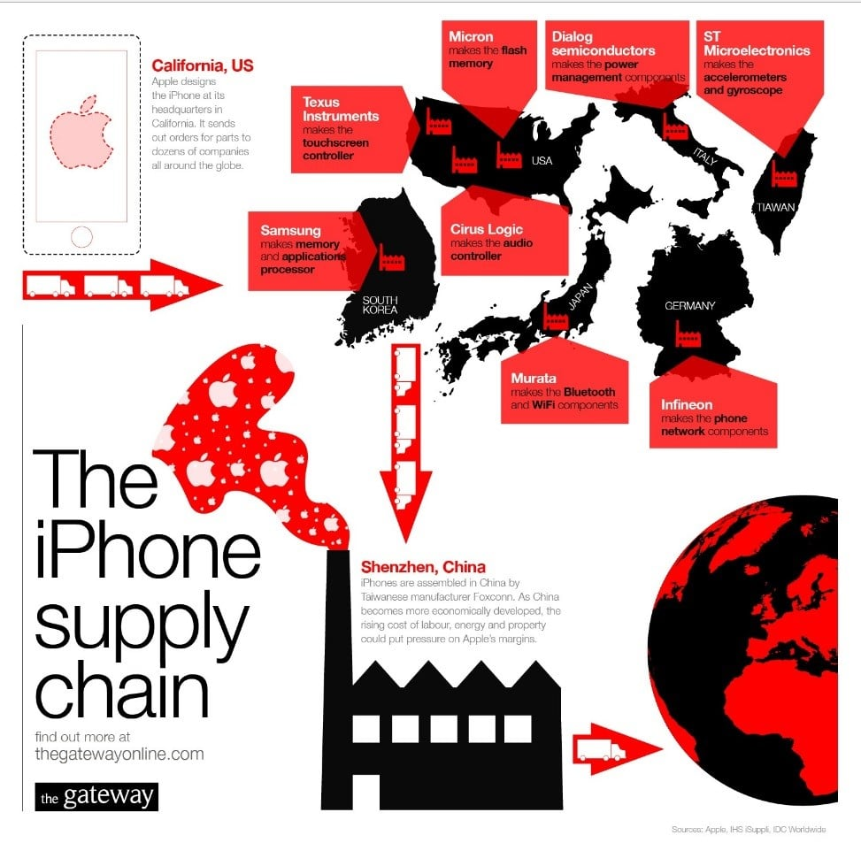

```{r}
#| label: setup
#| include: false

library(ggplot2)
library(dplyr)
library(scales)
library(knitr)
library(kableExtra)

# IU color palette
iu_crimson <- "#990000"
iu_cream <- "#EDEBEB"
iu_gray <- "#535054"
iu_light_gray <- "#7E7E7E"
iu_dark_text <- "#2C3E50"
iu_green <- "#1B5E3F"
iu_navy <- "#1F3A5F"

theme_ipe <- function(base_size = 20) {
  theme_minimal(base_size = base_size) +
    theme(
      plot.title = element_text(color = iu_crimson, face = "bold", size = rel(1.2),
                                margin = margin(t = 5, b = 5)),
      plot.subtitle = element_text(color = iu_gray, size = rel(0.9),
                                   margin = margin(b = 10)),
      plot.caption = element_text(color = iu_light_gray, size = rel(0.7),
                                  hjust = 0, margin = margin(t = 10)),
      axis.title = element_text(color = iu_dark_text, size = rel(0.9)),
      axis.title.x = element_text(margin = margin(t = 8)),
      axis.title.y = element_text(margin = margin(r = 8)),
      axis.text = element_text(color = iu_gray, size = rel(0.8)),
      panel.grid.minor = element_blank(),
      panel.grid.major = element_line(color = "#E5E5E5", linewidth = 0.4),
      legend.position = "bottom",
      legend.title = element_text(size = rel(0.85)),
      legend.text = element_text(size = rel(0.8)),
      plot.margin = margin(t = 8, r = 12, b = 20, l = 12)
    )
}
```

## Today's Plan

::: {.callout-important appearance="minimal" icon=false}
## Today's Big Question
[**Why do firms produce *inside* other countries instead of simply trading with them — and who wins when they do?**]{style="font-size: 1.4em; line-height: 1.4;"}
:::

```{r}
#| label: tbl-plan

plan <- data.frame(
  Section = c("1 · What Is a Multinational?",
              "2 · The Scale and Shape of Global FDI",
              "3 · Why Firms Go Multinational",
              "4 · Horizontal, Vertical, and the Value Chain",
              "5 · A Century of Foreign Investment",
              "6 · Multinationals and Host Countries"),
  Cover = c("FDI vs. trade, and the ladder from exporting to owning a foreign plant",
            "~90,000 firms, ~$1.5 trillion a year, and 80% of world trade",
            "Locational advantages, market imperfections, and the OLI framework",
            "Replicating plants vs. slicing the production chain into global value chains",
            "From colonial portfolio capital to today's security-driven fragmentation",
            "Does foreign investment help — or trap — the countries that host it?")
)

kable(plan, col.names = c("Section", "What we'll cover"),
      align = c("l", "l")) %>%
  kable_styling(font_size = 21, full_width = TRUE) %>%
  row_spec(0, bold = TRUE, color = "white", background = iu_crimson) %>%
  column_spec(1, bold = TRUE, color = iu_crimson, width = "38%") %>%
  column_spec(2, width = "62%")
```

::: {.notes}
A brief orientation. It's a Thursday, so we'll run the lecture and discussion and close with the in-class writing prompt. Today is the first of a two-day pair on the multinational corporation: Chapter 8, today, is the *economics* — what an MNC is, how big the phenomenon is, why a firm chooses to produce abroad rather than trade or license, and whether host countries are better or worse for it. Tomorrow, Chapter 9, is the *politics* — regulation, bargaining, expropriation, and the international rules that govern these firms. So today builds the analytical toolkit we'll spend tomorrow turning into a story about power. The arc has six moves. We define the MNC and place foreign direct investment on a ladder of ways to "go global." We size the phenomenon with the latest UNCTAD data. We get to the theoretical heart of the chapter — why firms internalize production across borders, the locational-advantage-plus-market-imperfection logic that Oatley builds and that the OLI framework formalizes. We distinguish horizontal from vertical investment and connect the latter to global value chains. We zoom out to a century of foreign investment to see how radically the map has been redrawn — which is exactly what today's McKinsey podcast documents in real time. And we end on the question that animates the whole development debate and sets up tomorrow: does foreign investment lift the countries that host it, or lock them into dependence? Hold the Big Question the entire way — why produce *inside* a country rather than sell *into* it — because the answer is the key that unlocks everything else.
:::


# What Is a Multinational? {background-color="#990000"}


## An iPhone Is Not "Made" in One Place

::: {.columns}
::: {.column width="58%"}

{width="100%" fig-alt="Infographic of the iPhone supply chain: Apple designs the iPhone in California and orders parts from dozens of firms worldwide — Samsung (South Korea) memory and processors; Texas Instruments, Micron, Cirrus Logic (USA); Dialog and Infineon (Germany); ST Microelectronics (Italy); Murata (Japan) — with final assembly by Foxconn in Shenzhen, China, before global sale."}

[Source: *The Gateway* (thegatewayonline.com); component data from Apple, IHS iSuppli, IDC.]{style="font-size:0.5em; color:#535054;"}

:::
::: {.column width="42%"}

A single product under one brand, yet its value is **distributed across dozens of countries** — held together not by trade alone, but by **ownership and control**.

::: {.callout-important appearance="minimal" icon=false}
Apple chose **neither** to make iPhones at home and export them, **nor** to license the design to a foreign manufacturer.

**Why build, own, and coordinate production across borders instead?** That decision *is* the multinational corporation — and the central puzzle of this chapter.
:::

:::
:::

::: {.callout-tip appearance="minimal" icon=false}
Multinational firms are now the **organizing units of the world economy.** To understand contemporary trade, technology, and development, one must first understand the firm that operates across borders.
:::

::: {.notes}
I want to start where the chapter's puzzle is most visible, with an object everyone in this room owns. Think about an iPhone. It carries one brand and is sold by one company, but there is no single place where it is "made." It's designed in Cupertino, the most sophisticated chips are fabricated by TSMC in Taiwan and Samsung in Korea, displays and sensors and dozens of components come from across East Asia and beyond, the rare-earth elements are refined mostly in China, and final assembly happens in plants in China, increasingly India and Vietnam. Now notice the two decisions Apple did *not* make. It did not choose to manufacture iPhones entirely in the United States and export them — the classic trade story from the first half of our course. And it did not simply license its designs to a foreign electronics firm and collect a royalty — the arm's-length market story. Instead it built and owns a globe-spanning system of design, branding, software, and tightly supervised contract production that it coordinates from the center. That choice — to produce *across* borders under unified ownership and control rather than to trade across them or sell the technology — is precisely what makes a firm a multinational, and explaining that choice is the analytical task of Chapter 8. And it matters enormously, because as we'll see in a moment, firms making this choice are now the organizing units of the entire world economy. You cannot understand modern trade, the diffusion of technology, or why some poor countries grow and others don't, without first understanding the firm that straddles borders.
:::


## Defining the Terms

```{r}
#| label: tbl-definitions

defs <- data.frame(
  term = c("Multinational corporation (MNC)",
           "Foreign direct investment (FDI)",
           "Portfolio investment",
           "Parent & affiliate"),
  def = c("A firm that owns and controls income-generating assets (production) in more than one country.",
          "Cross-border investment that gives a lasting interest and a measure of CONTROL — by convention, a stake of 10% or more in a foreign enterprise.",
          "Cross-border purchase of stocks or bonds for a financial return, with NO intent to control. (This is the line between Ch. 8 and the finance chapters.)",
          "The home-country PARENT owns the foreign AFFILIATE (subsidiary). FDI is the financial flow that builds and sustains that relationship.")
)

kable(defs, col.names = c("Term", "What it means"),
      align = c("l", "l")) %>%
  kable_styling(font_size = 21, full_width = TRUE) %>%
  row_spec(0, bold = TRUE, color = "white", background = iu_crimson) %>%
  row_spec(1:4, extra_css = "padding-top: 12px; padding-bottom: 12px; line-height: 1.35;") %>%
  column_spec(1, bold = TRUE, color = iu_crimson, width = "30%") %>%
  column_spec(2, width = "70%")
```

::: {.callout-tip appearance="minimal" icon=false}
The decisive word is **control.** Buy 5% of Toyota stock for the dividend → *portfolio* investment. Buy or build a plant you *run* → *direct* investment. Control is what turns a flow of money into a **multinational firm.**
:::

::: {.notes}
Let's pin down the vocabulary, because the distinctions do real analytical work. A multinational corporation — Oatley and UNCTAD also say transnational corporation, the terms are interchangeable — is a firm that owns and controls income-generating assets, meaning actual production, in more than one country. The financial act that creates and sustains that ownership is foreign direct investment. And the word that defines FDI is control. The international convention, used by the IMF and UNCTAD, is that an investment counts as "direct" when the investor acquires at least ten percent of a foreign enterprise — the threshold meant to capture a lasting interest and a meaningful voice in management. Contrast that with portfolio investment: if I buy a few shares of Toyota or some Mexican government bonds purely for the financial return, with no intention of running anything, that's portfolio investment, and it belongs to the finance half of our course, Chapters 10 through 16, not here. The same dollar crossing the same border is categorized entirely differently depending on whether it buys control. We call the home-country firm the parent and the foreign operation it owns the affiliate or subsidiary. So hold onto this: direct investment is not fundamentally about money moving — it's about control moving. That's what converts a capital flow into a multinational enterprise, and it's why the politics of these firms, which we take up tomorrow, is so fraught: control of production inside your borders by a foreign owner is a very different thing from a foreigner owning your bonds.
:::


## The Ladder of Going Global

Firms don't flip a switch from "domestic" to "multinational." They climb a ladder of rising **commitment, cost, and control.**

```{r}
#| label: fig-ladder
#| fig-width: 13
#| fig-height: 4.6
#| out-width: "94%"
#| fig-alt: "A left-to-right arrow of increasing commitment and control across five modes of serving a foreign market: exporting, licensing, franchising, joint venture, and wholly-owned greenfield or M&A. The last two are inside the FDI bracket."

modes <- data.frame(
  x = 1:5,
  lab = c("Export /\nImport", "Licensing", "Franchising", "Joint\nVenture", "Wholly-owned\nGreenfield / M&A"),
  sub = c("ship goods\nacross borders", "rent out your\nIP / patent", "rent out your\nbrand + rules", "shared equity\nwith a local firm", "build or buy &\nrun it yourself"),
  fdi = c(FALSE, FALSE, FALSE, TRUE, TRUE)
)

ggplot(modes) +
  annotate("segment", x = 0.6, xend = 5.4, y = 0.5, yend = 0.5, linewidth = 2,
           color = iu_light_gray, arrow = arrow(length = unit(0.32, "cm"), type = "closed")) +
  geom_point(aes(x, 1, color = fdi), size = 6) +
  geom_text(aes(x, 1.55, label = lab), fontface = "bold", size = 4.4,
            color = iu_dark_text, lineheight = 0.9) +
  geom_text(aes(x, 0.78, label = sub), size = 3.4, color = iu_gray, lineheight = 0.9,
            fontface = "italic") +
  annotate("rect", xmin = 3.55, xmax = 5.45, ymin = 0.25, ymax = 0.45,
           fill = iu_crimson, alpha = 0.12) +
  annotate("text", x = 4.5, y = 0.35, label = "FOREIGN DIRECT INVESTMENT (equity + control)",
           fontface = "bold", size = 4.2, color = iu_crimson) +
  annotate("text", x = 0.7, y = 1.92, label = "lower commitment, cost, control",
           hjust = 0, fontface = "italic", size = 3.8, color = iu_gray) +
  annotate("text", x = 5.3, y = 1.92, label = "higher commitment, cost, control",
           hjust = 1, fontface = "italic", size = 3.8, color = iu_gray) +
  scale_color_manual(values = c("FALSE" = iu_navy, "TRUE" = iu_crimson), guide = "none") +
  scale_x_continuous(limits = c(0.4, 5.6)) +
  scale_y_continuous(limits = c(0.2, 2.0)) +
  theme_void()
```

::: {.callout-tip appearance="minimal" icon=false}
**Non-equity modes** (export, license, franchise) are "asset-lite" — quicker and less costly, but they cede control. **Equity modes (FDI)** — greenfield, M&A, joint venture — are costlier and slower, but the firm *owns and operates* the activity. The chapter's question: **when is ownership worth its cost?**
:::

::: {.notes}
Going global isn't binary; it's a ladder, and the rungs are ordered by how much commitment, cost, and control each involves. At the bottom, the cheapest and most reversible option is simply to export — make it at home and ship it abroad. One step up, non-equity arrangements let a firm earn from a foreign market without owning anything there: licensing, where you rent out your intellectual property — a patent, a process — to a foreign firm for a fee; franchising, where you rent out your brand and business model under strict conditions, the way McDonald's or Marriott expand; and long-term subcontracting. These are commonly called "asset-lite," or non-equity, strategies — quick, inexpensive, and low-risk, but the firm surrenders control over how the product is made and who captures the value. Then the firm crosses a real threshold into foreign direct investment, the equity modes, where it takes an ownership stake and with it managerial control. A joint venture shares equity and risk with a local partner. A wholly-owned subsidiary represents full commitment, and it takes two forms that matter considerably for host countries: greenfield investment, building a brand-new facility from the ground up, which creates new productive capacity and jobs; and mergers and acquisitions, buying an existing local firm, which historically is actually the larger share of FDI by value and simply transfers ownership of assets that already exist. Notice the trade-off the ladder encodes: every step up buys you more control and more of the value, but costs more, moves slower, and exposes you to more risk. So the deep question the chapter is really asking — and we'll answer it in section three — is when is it worth climbing all the way to ownership? Why would a firm ever take on the cost and risk of building and running a plant in a foreign country instead of just exporting to it or licensing someone there to do the work?
:::


# The Scale and Shape of Global FDI {background-color="#990000"}


## Six Numbers That Define the Phenomenon

```{r}
#| label: tbl-stylized

facts <- data.frame(
  stat = c("~90,000", "~1 million", "~$1.5 trillion", "~1/3", "~1/2", "~80%"),
  what = c("multinational enterprises operating worldwide",
           "foreign affiliates they own across borders",
           "in new FDI inflows in 2024 (UNCTAD WIR 2025)",
           "of global output produced by MNCs + affiliates",
           "of world exports run through multinational firms",
           "of world trade flows through MNC-coordinated global value chains")
)

kable(facts, col.names = c("", "What it measures"),
      align = c("r", "l")) %>%
  kable_styling(font_size = 24, full_width = TRUE) %>%
  row_spec(0, bold = TRUE, color = "white", background = iu_crimson) %>%
  row_spec(1:6, extra_css = "padding-top: 12px; padding-bottom: 12px; line-height: 1.3;") %>%
  column_spec(1, bold = TRUE, color = iu_crimson, width = "24%") %>%
  column_spec(2, width = "76%")
```

::: {.callout-important appearance="minimal" icon=false}
This is the core stylized fact of modern IPE: **production itself has gone global.** Trade between independent national firms is no longer the main story — *intra-firm* and *MNC-coordinated* production is.
:::

::: {.notes}
Before we explain MNCs, let's grasp how big the phenomenon is, because the numbers reframe everything we've done so far. UNCTAD counts roughly ninety thousand multinational enterprises worldwide, owning on the order of a million foreign affiliates — and recall that in 1970 there were perhaps seven thousand such firms, so this is overwhelmingly a phenomenon of the last half-century. In 2024 these firms attracted about one and a half trillion dollars in new direct investment inflows, the figure from UNCTAD's World Investment Report 2025 — and we'll look at the trend in a second, because that headline number hides something important. The structural facts are the ones to internalize: multinationals and their affiliates account for something like a third of global output, roughly half of all world exports, and — the number I'd underline — about eighty percent of world trade now flows through the global value chains that these firms coordinate. Consider that last figure. For the first ten chapters' worth of trade theory, we implicitly imagined trade as exchange between independent firms in different countries — Ricardo's English cloth for Portuguese wine. That picture is now the exception. Most "trade" is actually production sliced into stages and distributed across countries inside or under the coordination of a single multinational — components crossing borders within Apple's or Toyota's or Samsung's own network. Production itself, not just exchange, has gone global. That's the central stylized fact of contemporary international political economy, and it's why the multinational firm is the unit of analysis for the rest of the course.
:::


## Biggest by Which Measure?

```{r}
#| label: fig-giants
#| fig-width: 15
#| fig-height: 5.4
#| out-width: "100%"
#| fig-alt: "Three horizontal bar charts of the world's largest companies by three measures. By revenue (2024): Walmart, Amazon, State Grid, Saudi Aramco, China National Petroleum, Sinopec, and UnitedHealth — retail, energy, and health firms from the US and China. By market capitalization (2026): Nvidia, Alphabet, Apple, Microsoft, Amazon, TSMC, and Broadcom — all technology firms. By total assets: ICBC, Agricultural Bank of China, China Construction Bank, Bank of China, JPMorgan Chase, Bank of America, and Mitsubishi UFJ — all banks. A different set of firms tops each ranking."

rev <- data.frame(
  firm = c("Walmart", "Amazon", "State Grid", "Saudi Aramco",
           "China Nat. Petroleum", "Sinopec", "UnitedHealth"),
  val = c(681, 638, 546, 480, 475, 429, 400),
  sector = c("Retail", "Retail", "Energy", "Energy", "Energy", "Energy", "Health")
)
mcap <- data.frame(
  firm = c("Nvidia", "Alphabet", "Apple", "Microsoft", "Amazon", "TSMC", "Broadcom"),
  val = c(5.2, 4.6, 4.5, 3.1, 2.9, 2.1, 2.0),
  sector = "Tech"
)
assets <- data.frame(
  firm = c("ICBC", "Agricultural Bank", "China Constr. Bank", "Bank of China",
           "JPMorgan Chase", "Bank of America", "Mitsubishi UFJ"),
  val = c(6.6, 5.6, 5.4, 4.6, 4.0, 3.4, 3.0),
  sector = "Bank"
)

seccols <- c(Retail = iu_navy, Energy = iu_gray, Health = iu_green,
             Tech = iu_crimson, Bank = "#1B5E3F")

barpanel <- function(df, title, sub, suffix, prefix = "$") {
  df$label <- paste0(prefix, df$val, suffix)
  ggplot(df, aes(val, reorder(firm, val), fill = sector)) +
    geom_col(width = 0.72) +
    geom_text(aes(label = label), hjust = -0.12, fontface = "bold",
              size = 4.4, color = iu_dark_text) +
    scale_fill_manual(values = seccols, guide = "none") +
    scale_x_continuous(expand = expansion(mult = c(0, 0.20))) +
    labs(title = title, subtitle = sub, x = NULL, y = NULL) +
    theme_ipe(base_size = 15) +
    theme(panel.grid.major.y = element_blank(),
          panel.grid.major.x = element_blank(),
          axis.text.x = element_blank(),
          axis.text.y = element_text(face = "bold", color = iu_dark_text, size = rel(0.98)),
          plot.title = element_text(size = rel(1.15)),
          plot.subtitle = element_text(size = rel(0.78)))
}

p_rev <- barpanel(rev, "By revenue", "2024 sales, US$ billions — retail & energy lead", "B")
p_mcap <- barpanel(mcap, "By market value", "2026 market cap, US$ trillions — all tech", "T")
p_assets <- barpanel(assets, "By total assets", "US$ trillions — all banks, mostly Chinese", "T")

gridExtra::grid.arrange(p_rev, p_mcap, p_assets, ncol = 3)
```

[Sources: revenue — Fortune Global 500 2025 (FY2024); market cap — company data via The Motley Fool, 2026; assets — S&P Global Market Intelligence (year-end 2024). Figures approximate.]{style="font-size:0.5em; color:#535054;"}

::: {.callout-important appearance="minimal" icon=false}
**Three rankings, almost no overlap.** By *sales*, retail and oil dominate (U.S. and China); by *market value*, the leaders are entirely U.S./Taiwan **tech**; by *assets*, they are **banks** (mostly Chinese). Only **Amazon** appears on two lists. "Largest" has no single meaning — each metric reveals a different face of the global economy.
:::

::: {.notes}
The question "what are the biggest companies in the world?" has no single answer, and the disagreement is itself the lesson — which is why I want three panels, not one. Rank firms by revenue, the Fortune Global 500 measure, and the top is retail and energy: Walmart first for the twelfth straight year at about six hundred eighty billion dollars in sales, then Amazon, then a cluster of Chinese state energy and grid giants — State Grid, Saudi Aramco, China National Petroleum, Sinopec — with UnitedHealth representing U.S. healthcare. These are firms that move enormous physical volume, and the list is a U.S.–China duopoly. Now rank by market capitalization, what investors think the future cash flows are worth, and the board changes completely: every one of the top seven is a technology company — Nvidia above five trillion dollars on the back of the AI boom, then Alphabet, Apple, Microsoft, Amazon, Taiwan's TSMC, Broadcom. Not a single oil company or retailer in sight near the top. Finally rank by total assets, the balance-sheet measure, and you get a third entirely different list: banks, and overwhelmingly Chinese ones — ICBC at roughly six and a half trillion in assets, the other three of China's "big four," then JPMorgan, Bank of America, Mitsubishi UFJ. Banks are asset-heavy by their very nature, since loans are assets, so they dominate this metric and almost no other. Look across the three panels and notice that only Amazon appears on more than one. Three measures, three nearly disjoint sets of firms, three different dominant sectors and geographies. The analytical point is to be skeptical whenever someone says a company is the "biggest" — biggest by what? Revenue rewards volume, market cap rewards expected profitability and growth, assets reward balance-sheet size. And each lens reveals a different structural feature of the world economy: American consumer scale, the U.S.–China technology race, and the sheer weight of the Chinese banking system. Keep that pluralism in mind for the rest of today, because when we ask whether these firms are "too powerful," the answer depends a great deal on which kind of bigness we mean.
:::


## FDI Flows: A Volatile, Plateauing Tide

```{r}
#| label: fig-fdi-flows
#| fig-width: 12.5
#| fig-height: 4.6
#| out-width: "92%"
#| fig-alt: "Global FDI inflows in current US dollars, 1990 to 2024. The series rises from about 200 billion in 1990 to peaks around 1.4 trillion in 2000, 2.0 trillion in 2007, and 2.0 trillion in 2015, falls to about 1.0 trillion in the 2020 COVID trough, rebounds in 2021, and drifts lower through 2024 to about 1.5 trillion."

fdi <- read.csv("data/fdi_inflows.csv")

peaks <- data.frame(
  year = c(2000, 2007, 2015),
  inflows = c(1357, 1976, 2034),
  lab = c("2000\ndot-com\npeak", "2007\npre-GFC\npeak", "2015\nrestructuring\nspike")
)

ggplot(fdi, aes(year, inflows)) +
  annotate("rect", xmin = 2019.5, xmax = 2020.5, ymin = -Inf, ymax = Inf, fill = "#7B1E1E", alpha = 0.10) +
  geom_line(color = iu_crimson, linewidth = 1.4) +
  geom_point(data = peaks, aes(year, inflows), color = iu_crimson, size = 2.6) +
  geom_text(data = peaks, aes(year, inflows, label = lab), vjust = -0.35, size = 3.2,
            color = iu_dark_text, fontface = "bold", lineheight = 0.95) +
  annotate("text", x = 2020, y = 690, label = "COVID\ntrough", color = "#7B1E1E",
           fontface = "bold", size = 3.2, lineheight = 0.95, vjust = 1.1) +
  annotate("text", x = 2024, y = 1509, label = "2024:\n~$1.5T", color = iu_dark_text,
           fontface = "bold", size = 3.2, lineheight = 0.95, hjust = -0.15) +
  scale_x_continuous(breaks = seq(1990, 2025, 5), limits = c(1990, 2029)) +
  scale_y_continuous(limits = c(0, 2750), labels = function(x) paste0("$", x, "B")) +
  labs(title = "A rising but increasingly volatile and plateauing tide",
       subtitle = "Global FDI inflows, current US$ billions, 1990–2024",
       x = NULL, y = NULL,
       caption = "Source: UNCTAD, World Investment Report 2025 and earlier editions (global FDI inflows). Figures are revised across vintages; recent years are inflated by volatile financial 'conduit' flows through a few European economies.") +
  theme_ipe(base_size = 15)
```

::: {.callout-tip appearance="minimal" icon=false}
**FDI is Flatlining:** 2024's nominal **+4% to ~$1.5T** masks a **second straight year of real decline** (≈ **−11%** stripping out conduit flows). FDI has *plateaued* since the mid-2010s — a casualty of geopolitics, trade fragmentation, and industrial-policy competition.

[🎧 **Today's podcast** — McKinsey Global Institute, *"Follow the Money: How FDI Is Redrawing the Global Economy."* We return to its argument in Section 5.]{style="font-size:0.85em; color:#535054;"}
:::

::: {.notes}
Here is the long view of FDI flows, and the shape tells a story that the single headline number conceals. From 1990, global FDI inflows climb from a couple hundred billion dollars to a series of dramatic peaks — the dot-com merger wave around 2000, the pre-financial-crisis peak near two trillion in 2007, and another spike around 2015 driven largely by corporate restructurings and tax-driven reorganizations rather than new factories. Then look at what happens after the mid-2010s: not continued growth but a volatile plateau. The COVID shock in 2020 cut flows to about a trillion; 2021 rebounded; and then 2022, 2023, and 2024 drift sideways and down. Now the crucial caveat, and it's a lesson in reading official statistics critically. UNCTAD's headline for 2024 was that FDI rose four percent to about one and a half trillion dollars. But they immediately flag that this increase is an artifact of volatile "conduit" flows — money routed through a handful of European pass-through economies like Luxembourg and the Netherlands that serve as financial way-stations and don't represent real productive investment anywhere. Strip those out, and FDI actually fell about eleven percent — the second consecutive year of decline in genuine, productive capital flows. So the real story of the present is not growth but stagnation: foreign direct investment has plateaued, and UNCTAD attributes that to exactly the forces we've been tracking all course — geopolitical tension, the fragmentation of trade into blocs, and intensifying industrial-policy competition, all of which make multinationals prioritize short-term risk management over long-horizon cross-border commitments. And that is the doorway to today's podcast, the McKinsey Global Institute piece "Follow the Money," whose whole argument is that FDI isn't just shrinking at the margin — it's being geographically redrawn. We'll come back to its findings in section five. One housekeeping note on the chart: I've marked the data as UNCTAD's, and flagged that the figures get revised across report vintages and that recent years are inflated by those conduit flows — when the 2026 World Investment Report lands in a few weeks, we'll drop in the updated series and the official 2025 number.
:::


## The Map Is Tilting Toward the Developing World

::: {.columns}
::: {.column width="52%"}

```{r}
#| label: fig-dev-share
#| fig-width: 7.6
#| fig-height: 4.4
#| out-width: "98%"
#| fig-alt: "Developing economies' share of global FDI inflows at benchmark years from 1990 to 2024, rising irregularly from about 17 percent in 1990 to roughly two-thirds by the 2020s, with a spike in 2020 when developed-country flows collapsed."

shares <- read.csv("data/fdi_shares.csv")

ggplot(shares, aes(year, developing_share)) +
  geom_hline(yintercept = 50, linetype = "dashed", color = iu_gray, linewidth = 0.5) +
  annotate("text", x = 1991, y = 52.5, label = "half of all global FDI", hjust = 0,
           color = iu_gray, size = 3.2, fontface = "italic") +
  geom_line(color = iu_crimson, linewidth = 1.4) +
  geom_point(color = iu_crimson, size = 2.4) +
  scale_x_continuous(breaks = seq(1990, 2025, 5), limits = c(1990, 2026)) +
  scale_y_continuous(limits = c(0, 75), labels = function(x) paste0(x, "%")) +
  labs(title = "The rise of the South",
       subtitle = "Developing economies' share of global FDI inflows",
       x = NULL, y = NULL,
       caption = "Source: UNCTAD WIR (developing-economy share of inflows), benchmark years; approximate.") +
  theme_ipe(base_size = 14)
```

:::
::: {.column width="48%"}

**But the 2024 picture is highly uneven:**

- **Developed economies −22%** — Europe collapsed **−58%**; North America rose **+23%** (US-led)
- **Developing Asia** stayed the top recipient (−3%); **China −29%**, but **ASEAN +$225B (+10%)**
- **Africa +75%** — but almost entirely *one* Egypt megaproject (≈ +12% without it)
- **LDCs** still receive a **tiny sliver**; the poorest economies are **largely excluded from the network**

:::
:::

::: {.callout-important appearance="minimal" icon=false}
Developing economies now attract the **majority** of FDI, yet those flows are **highly concentrated** in a small set of them. Foreign investment is **widely courted but unevenly received.**
:::

::: {.notes}
The second big shift in shape is geographic, and it cuts against an old assumption. For most of the postwar period, the overwhelming majority of FDI flowed among the rich countries — developed economies investing in each other, largely through mergers and acquisitions. The chart on the left tracks the developing world's share of global inflows, and the trend is unmistakable even through the noise: from roughly a sixth in 1990 to crossing the fifty-percent line in the 2010s to around two-thirds in recent years. Part of that is genuine catch-up — China, Southeast Asia, India becoming real destinations for productive investment — and part of it, especially the 2020 spike, is just arithmetic: when developed-country flows collapse, the developing share mechanically jumps. So read it as a real secular tilt with a lot of cyclical noise on top. But — and this is the political-economy point — the aggregate "rise of the South" hides extreme concentration, and the 2024 numbers on the right make that vivid. Flows to developed economies fell twenty-two percent, with Europe down a staggering fifty-eight percent, while North America actually rose twenty-three percent on the strength of the United States — so even within the rich world the map is fragmenting. Developing Asia stayed the single largest recipient despite a modest decline, but underneath that, China fell twenty-nine percent while Southeast Asia surged to two hundred twenty-five billion — investment visibly rerouting from China toward ASEAN, which is a preview of the friend-shoring story in section five. Africa's headline plus-seventy-five-percent looks like a breakthrough until you learn it's almost entirely a single enormous project in Egypt; set that aside and it's a more sober twelve percent. And the least developed countries — the bottom of the global income distribution — still receive a small fraction of the total, with even that concentrated in a few resource-rich states. So hold both facts together, because they are the tension the development debate turns on: the developing world as a whole now captures the majority of FDI, yet that FDI is highly concentrated in a relatively small set of middle-income success stories, while the poorest countries remain largely outside the network altogether. Foreign investment is widely courted, but unevenly received.
:::


# Why Firms Go Multinational {background-color="#990000"}


## First Question: Why Produce Abroad at All?

A firm could serve a foreign market by **exporting**. Producing there instead only makes sense if **location** itself confers an advantage.

```{r}
#| label: tbl-motivations

mot <- data.frame(
  type = c("Resource-seeking", "Market-seeking", "Efficiency-seeking", "Strategic-asset-seeking"),
  logic = c("Go where the inputs are — minerals, oil, land, cheap labor, agricultural commodities.",
            "Go where the customers are — jump tariff walls, beat transport costs, tailor to local tastes, meet regulation.",
            "Split production to exploit cost differences — labor-intensive stages in low-wage sites, capital-intensive stages elsewhere.",
            "Go where the know-how is — acquire technology, brands, R&D talent, or distribution by buying into advanced markets."),
  ex = c("Shell in Nigeria; mining in Chile",
         "Toyota plants in the US/EU",
         "Apparel assembly in Vietnam/Bangladesh",
         "Chinese firms buying EU robotics/auto brands")
)

kable(mot, col.names = c("Motive", "The locational logic", "Example"),
      align = c("l", "l", "l")) %>%
  kable_styling(font_size = 19, full_width = TRUE) %>%
  row_spec(0, bold = TRUE, color = "white", background = iu_crimson) %>%
  row_spec(1:4, extra_css = "padding-top: 11px; padding-bottom: 11px; line-height: 1.3;") %>%
  column_spec(1, bold = TRUE, color = iu_crimson, width = "22%") %>%
  column_spec(2, width = "52%") %>%
  column_spec(3, width = "26%")
```

::: {.callout-tip appearance="minimal" icon=false}
These are **locational advantages** — the fourfold typology developed by Dunning, which Oatley surveys. They explain *where* production locates. By themselves, however, they justify only *producing* abroad; they do not yet explain why the *foreign* firm should **own** the operation rather than a *local* firm.
:::

::: {.notes}
The chapter's explanation comes in two logical steps, and you have to keep them separate or the theory loses its precision. Step one: why locate production abroad at all, rather than make everything at home and export? The answer is that location itself can confer an advantage, and the literature sorts these locational motives into four families — this is the standard typology you'll see in Dunning and in my other courses. Resource-seeking investment goes where the inputs are: oil, minerals, agricultural land, or low-cost labor — Shell in the Niger Delta, copper mining in Chile. Market-seeking investment goes where the customers are, to get inside a market you'd otherwise have to export into — to leap a tariff wall, avoid transport costs, adapt to local tastes, or satisfy local-content rules; Toyota building assembly plants in Kentucky and the English Midlands is the classic case. Efficiency-seeking investment slices production up to exploit cost differences across locations — put the labor-intensive stages where labor is cheap, the capital- or skill-intensive stages where those are abundant — and it's the engine of the global value chains we'll discuss next. And strategic-asset-seeking investment goes where the know-how is, acquiring technology, brands, R&D capability, or distribution networks by buying into advanced economies — increasingly what we see from Chinese and Indian firms purchasing European engineering and auto companies. These are exactly what Oatley calls locational advantages, and they answer the "where" question. But notice the limit, because it's the hinge of the whole chapter: locational advantages explain why *production* should happen in a particular place. They do not, by themselves, explain why a *foreign* firm should own that production. If labor is cheap in Vietnam, that's an argument for making garments in Vietnam — but it could be a *Vietnamese* firm doing it and exporting, or a foreign firm licensing a local producer. So we need a second step.
:::


## Second Question: Why *Own* It? Market Imperfections

If markets worked perfectly, a firm could just **license** or **contract** a local producer. Firms internalize — they **own** — only when the **market for the transaction fails.**

::: {.columns}
::: {.column width="50%"}

### The "liability of foreignness"
Operating abroad is **costly**: unfamiliar consumer tastes, politics, law, language, culture. So firms *prefer* "asset-lite" licensing or exporting — **unless a market imperfection makes control worth the cost.**

:::
::: {.column width="50%"}

### When the market fails (internalize → FDI)
- **Intangible assets** (technology, brand, reputation) are hard to price and easy to steal — a license invites imitation
- **Transaction costs** of writing/enforcing contracts are high
- **Quality control** and the firm's reputation are on the line
- **Knowledge** is tacit — it travels inside a firm, not in a contract

:::
:::

::: {.callout-important appearance="minimal" icon=false}
**Internalization (Hymer; Buckley & Casson):** when arm's-length markets can't safely transfer an asset, the firm replaces the market with its own hierarchy — it does the foreign activity *in-house.* That in-house, cross-border activity **is** the MNC.
:::

::: {.notes}
Step two answers the ownership question, and the key idea is market imperfection — or, in the language of the theory, internalization. Start from the firm's point of view. Operating in a foreign country is genuinely costly; the literature calls this the "liability of foreignness." A local firm understands the consumer tastes, the politics, the legal system, the language and business culture; the foreign entrant has to learn all of it and will make expensive mistakes. So the default preference, all else equal, is to stay "asset-lite" — to export, or to license a local firm that already knows the terrain and collect a fee. Direct investment, owning and running the operation yourself, is the costly, high-commitment option. So when is it worth paying that cost? The answer: when the market for the transaction fails — when you cannot safely accomplish through a contract what you could accomplish through ownership. Several conditions produce that failure. First and most important, intangible assets — a proprietary technology, a trade secret, a brand, a reputation. These are notoriously hard to sell at arm's length: to license your technology you have to reveal enough that your licensee could simply copy it and become your competitor, the problem Kenneth Arrow identified at the heart of information markets. Second, the transaction costs of writing and enforcing a contract that anticipates every contingency can be prohibitive, especially across legal systems. Third, quality control: if a careless licensee degrades the product, it is the firm's global brand that suffers, so production stays in-house to protect it. Fourth, much valuable knowledge is tacit — it lives in the routines and people of an organization and can't be written into a contract at all; it can only be transferred inside the firm. When these conditions hold, the firm does something Ronald Coase would recognize: it replaces the market with its own hierarchy, internalizing the activity rather than contracting it out. Stephen Hymer first applied this to the multinational in the 1960s, and Buckley and Casson formalized it as internalization theory. And that is the central conclusion: the multinational corporation exists wherever it is more efficient to coordinate a cross-border economic activity *inside* a single firm than through arm's-length markets between separate firms. The firm is, in this view, a response to market failure.
:::


## Putting It Together: Dunning's OLI Framework

John Dunning's **eclectic paradigm** says a firm becomes a multinational only when **all three** conditions hold at once.

```{r}
#| label: tbl-oli

oli <- data.frame(
  letter = c("O — Ownership", "L — Location", "I — Internalization"),
  q = c("Do you have a firm-specific advantage?",
        "Is a foreign location the best place to use it?",
        "Should you exploit it yourself, not via the market?"),
  meaning = c("A proprietary edge worth carrying abroad: technology, brand, scale, management, patents.",
              "Locational advantages (Section above): resources, market access, cost, agglomeration.",
              "Market imperfections make owning safer than licensing or exporting.")
)

kable(oli, col.names = c("", "The question", "What it means"),
      align = c("l", "l", "l")) %>%
  kable_styling(font_size = 20, full_width = TRUE) %>%
  row_spec(0, bold = TRUE, color = "white", background = iu_crimson) %>%
  row_spec(1:3, extra_css = "padding-top: 14px; padding-bottom: 14px; line-height: 1.35;") %>%
  column_spec(1, bold = TRUE, color = iu_crimson, width = "24%") %>%
  column_spec(2, width = "36%") %>%
  column_spec(3, width = "40%")
```

::: {.callout-tip appearance="minimal" icon=false}
**Drop any one and FDI is the wrong choice.** No **O** → you can't compete abroad. **O** but no **L** → produce at home and **export.** **O + L** but no **I** → **license** a local firm. Only **O + L + I together** ⇒ the **multinational corporation.**
:::

::: {.notes}
John Dunning pulled these threads into the single most useful organizing device in the field, the eclectic paradigm, usually called OLI for its three conditions — and it's worth memorizing because it integrates everything we've just said. A firm will engage in foreign direct investment only when all three hold simultaneously. O is for ownership: the firm must possess some firm-specific advantage — a technology, a brand, superior management, economies of scale, a patent — something that lets it overcome the liability of foreignness and outcompete local firms on their own turf. L is for location: there must be a locational advantage to producing in the foreign country rather than at home — the resource, market-access, efficiency, or strategic-asset motives from two slides ago. And I is for internalization: it must be more profitable to exploit the ownership advantage in-house than to license or sell it through the market — the market-imperfection logic we just built. The reason OLI is so powerful pedagogically is that it doesn't just predict FDI; it predicts the *alternative* when FDI is the wrong call, and that's the bottom callout. If you lack an ownership advantage, you simply can't compete abroad and you stay home. If you have an ownership advantage but there's no locational reason to produce overseas, the right move is to produce at home and export. If you have both ownership and locational advantages but there's no internalization problem — the asset can be safely licensed — then you should license a local firm and pocket the fee rather than bear the cost of ownership. It is only when ownership, location, and internalization advantages line up together that the firm builds or buys and runs its own foreign operation — that it becomes a multinational. So OLI is really a decision tree for the "make, export, license, or own" question, and it's the analytical core of Chapter 8. Everything before it was setup; everything after it is consequences.
:::


# Horizontal, Vertical, and the Value Chain {background-color="#990000"}


## Two Ways to Be Multinational

```{r}
#| label: tbl-hv

hv <- data.frame(
  dim = c("What the firm does", "Driving motive", "Trade effect", "Typical sector", "Example"),
  horiz = c("Replicate the SAME production in another country",
            "Market-seeking — serve a local market from inside it",
            "SUBSTITUTES for trade (you make it there instead of shipping it)",
            "Often services & consumer goods that must be produced near the customer",
            "Toyota assembly in the US; a bank opening foreign branches"),
  vert = c("Fragment the production chain ACROSS countries by stage",
           "Efficiency-seeking — put each stage where it's cheapest",
           "CREATES trade — components cross borders again and again",
           "Manufacturing split into design / parts / assembly",
           "Apple: design (US) → chips (Taiwan) → assembly (China)")
)

kable(hv, col.names = c("", "Horizontal FDI", "Vertical FDI"),
      align = c("l", "l", "l")) %>%
  kable_styling(font_size = 19, full_width = TRUE) %>%
  row_spec(0, bold = TRUE, color = "white", background = iu_crimson) %>%
  row_spec(1:5, extra_css = "padding-top: 10px; padding-bottom: 10px; line-height: 1.3;") %>%
  column_spec(1, bold = TRUE, color = iu_crimson, width = "20%") %>%
  column_spec(2:3, width = "40%")
```

::: {.callout-important appearance="minimal" icon=false}
The defining shift of the last 40 years is the rise of **vertical** FDI — production divided into stages and dispersed across borders. This is what builds **global value chains** (GVCs), and it is why **80% of trade** now runs inside firm-coordinated networks.
:::

::: {.notes}
Once a firm is multinational, there are two fundamentally different ways it can organize itself across borders, and the distinction matters for whether FDI substitutes for or generates trade. Horizontal FDI replicates the same production process in another country — Toyota building essentially complete cars in Kentucky that it would otherwise have exported from Japan. The motive is market-seeking: you produce inside the market to serve it, and notice the consequence — horizontal FDI substitutes for trade. The car gets made there instead of being shipped there. It's especially common in services and in consumer goods that have to be produced close to the customer; a bank or a hotel chain or a retailer essentially has to replicate its operation in each market it enters. Vertical FDI does the opposite: it fragments the production chain by stage and distributes those stages across countries according to where each is cheapest to perform. The motive is efficiency-seeking, and the trade consequence is reversed — vertical FDI creates trade, often a lot of it, because intermediate components now cross borders repeatedly as the product moves from stage to stage. The iPhone we opened with is pure vertical organization: design in California, chips fabricated in Taiwan, components from across Asia, assembly in China and India, each border crossing showing up as a trade flow. And here's the historical headline: the great transformation of the last four decades is the explosion of vertical FDI, made possible by cheaper shipping, containerization, and above all information technology that let firms coordinate dispersed production in real time. That fragmentation is exactly what builds global value chains, and it's the mechanism behind the eighty-percent figure from earlier — most world trade is now intermediate goods moving through these firm-coordinated chains rather than finished products exchanged between independent national economies.
:::


## The Smile Curve: Where is Economic Value Created?

In a global value chain, the **value-added isn't spread evenly.** It's concentrated at the **ends** — and the middle, where developing countries often enter, is where it's **thinnest.**

```{r}
#| label: fig-smile
#| fig-width: 12
#| fig-height: 4.6
#| out-width: "84%"
#| fig-alt: "A stylized U-shaped 'smile curve' of value-added along the production chain. Value-added is high in pre-production stages such as R&D, design, and branding, drops to its lowest in the middle at manufacturing and assembly, and rises again in post-production stages such as marketing, distribution, and after-sales services."

x <- seq(0, 10, length.out = 200)
smile <- data.frame(x = x, y = 0.06 * (x - 5)^2 + 1.2)

segs <- data.frame(
  x = c(1.1, 5, 8.9),
  y = c(2.55, 1.05, 2.55),
  lab = c("R&D · Design\nBranding", "Manufacturing\n& Assembly", "Marketing · Distribution\nAfter-sales"),
  col = c(iu_navy, iu_crimson, iu_navy)
)

ggplot() +
  geom_line(data = smile, aes(x, y), color = iu_gray, linewidth = 1.6) +
  annotate("rect", xmin = 3.6, xmax = 6.4, ymin = 0.35, ymax = 1.0, fill = iu_crimson, alpha = 0.10) +
  annotate("text", x = 5, y = 0.68, label = "where many developing\ncountries enter the chain",
           color = iu_crimson, fontface = "italic", size = 3.5, lineheight = 0.9) +
  geom_point(data = segs, aes(x, 0.06 * (x - 5)^2 + 1.2), size = 3, color = segs$col) +
  geom_text(data = segs, aes(x, y, label = lab), fontface = "bold", size = 4.2,
            color = segs$col, lineheight = 0.9) +
  annotate("segment", x = 0.2, xend = 9.8, y = 0.2, yend = 0.2,
           color = iu_light_gray, linewidth = 1, arrow = arrow(length = unit(0.28, "cm"), type = "closed")) +
  annotate("text", x = 5, y = 0.02, label = "PRODUCTION SEQUENCE  (pre-production → production → post-production)",
           fontface = "bold", size = 3.6, color = iu_gray) +
  scale_x_continuous(limits = c(-0.2, 10.2)) +
  scale_y_continuous(limits = c(-0.1, 3.0)) +
  labs(title = "The smile curve: value-added along the value chain",
       subtitle = "Stylized, after Stan Shih / Gereffi — the ends capture the value, the middle the least",
       x = NULL, y = "Value-added →") +
  theme_ipe(base_size = 15) +
  theme(panel.grid = element_blank(), axis.text = element_blank())
```

::: {.callout-tip appearance="minimal" icon=false}
**The development stakes in one image.** Performing the *assembly* (earning the wage bill) is not the same as capturing the *value* (the rents). The central challenge for host countries is to **upgrade** — to move from assembly toward design and branding. Section 6 asks whether they can.
:::

::: {.notes}
There's one more idea from the value-chain literature that I want you to carry into the development debate, because it reframes the whole question of whether joining a global value chain is good for a poor country. It's called the smile curve — the name comes from Stan Shih, the founder of Acer, and Gary Gereffi has made it central to the academic literature. Plot the stages of production left to right, from pre-production through manufacturing to post-production, and on the vertical axis put the value-added captured at each stage. The curve is U-shaped — it smiles. The high value-added sits at the two ends: at the front, in research and development, design, and branding; and at the back, in marketing, distribution, and after-sales service and finance. The bottom of the smile — the lowest value-added — is the middle, the actual physical manufacturing and assembly. Now connect that to FDI and development. When a multinational fragments its chain and locates the labor-intensive assembly stage in a low-wage developing country, that country is entering the value chain precisely at its thinnest point, the bottom of the smile. The factory creates jobs and wages, which is real and not negligible — but the bulk of the value, the rents, is captured at the ends, which the lead firm typically retains at home: Apple's profit is in the design and the brand, not in the assembly margin that Foxconn earns. So the smile curve crystallizes the development stakes in a single image. Participating in a GVC is not automatically the same as capturing value from it. Performing the assembly yields the wage bill; it does not yield the rents. And that means the genuine objective for a host country is not merely attracting FDI — it is upgrading, climbing the curve from assembly toward the higher-value design and branding functions, the way Korea and Taiwan eventually did and most others have not. Whether FDI actually helps countries climb, or instead locks them into the bottom of the smile, is exactly the question we turn to in the final section.
:::


# A Century of Foreign Investment {background-color="#990000"}


## The Map Keeps Getting Redrawn

```{r}
#| label: fig-history
#| fig-width: 13.5
#| fig-height: 5.2
#| out-width: "97%"
#| fig-alt: "A left-to-right timeline of four eras of foreign investment: pre-1914 portfolio and colonial capital; the 1920s to 1970s of economic nationalism, restriction, and expropriation; the 1980s to 2015 of neoliberal liberalization and competition for FDI; and the post-2016 era of geopolitical fragmentation and security-driven investment."

eras <- data.frame(
  x = 1:4,
  title = c("Pre-1914", "1920s–1970s", "1980s–2015", "2016 → present"),
  body = c("Portfolio & banking flows,\nshaped by colonial ties:\nrailways, ports, and\nresource extraction",
           "Decolonization and economic\nnationalism; FDI restricted\nand foreign assets seized\n(oil, copper, plantations)",
           "Neoliberal turn —\nprivatization, deregulation,\ninvestment treaties; states\ncompete to attract FDI",
           "Geopolitical fragmentation:\ninvestment screening,\nindustrial policy, friend-\nshoring, digital clustering"),
  col = c(iu_navy, iu_gray, iu_green, iu_crimson)
)

ggplot(eras) +
  annotate("segment", x = 0.55, xend = 4.45, y = 1.5, yend = 1.5, linewidth = 2,
           color = iu_light_gray, arrow = arrow(length = unit(0.32, "cm"), type = "closed")) +
  geom_point(aes(x, 1.5), size = 5, color = eras$col) +
  geom_label(aes(x, 1.8, label = title), fill = eras$col, color = "white",
             fontface = "bold", size = 5.2, label.size = 0, label.padding = unit(0.3, "lines")) +
  geom_text(aes(x, 1.18, label = body), size = 3.7, color = iu_dark_text,
            lineheight = 1.1, fontface = "bold", vjust = 1) +
  scale_x_continuous(limits = c(0.4, 4.6)) +
  scale_y_continuous(limits = c(0.2, 2.05)) +
  theme_void()
```

::: {.callout-tip appearance="minimal" icon=false}
Three durable patterns: **(1)** most FDI has historically been **rich-country-to-rich-country** (and via M&A); **(2)** for developing hosts it shifted **resources → manufacturing → services**; **(3)** the **poorest** countries have stayed **outside the network** throughout.
:::

::: {.notes}
Step back from the firm to the system, because the geography of foreign investment has been redrawn repeatedly, and knowing the eras keeps you from mistaking the current arrangement for the natural one. Before 1914, in the first great globalization, cross-border capital was mostly portfolio and banking flows, not the managed direct investment we've been describing, and it was structured by colonial ties — British capital financing railways, ports, mines, and plantations across the empire, overwhelmingly to extract and move primary commodities. Then the long middle of the twentieth century reversed course. Decolonization, the rise of economic nationalism, and the statist development models we studied in Chapters 6 and 7 produced an era of restriction and outright expropriation — newly independent and revolutionary governments nationalized foreign oil companies, copper mines, and plantations, and the multinational was cast as an agent of imperialism. This is the era whose politics we study tomorrow in Chapter 9, and it's the backdrop to the New International Economic Order's demand for control over MNCs that we discussed on Tuesday. The third era, roughly 1980 to 2015, swung back sharply toward openness: the neoliberal turn, privatization, deregulation, the collapse of the Soviet bloc opening transition economies, and the signing of thousands of bilateral investment treaties, all of which turned the relationship around — now governments competed *for* FDI rather than restricting it, a world in which countries actively courted investment. And the era we are living in now, since roughly 2016, is swinging again — not back to expropriation, but toward fragmentation: investment screening on national-security grounds, industrial policy, export controls, and the redrawing of investment along geopolitical lines. Across all four eras three patterns hold up. First, contrary to intuition, most FDI has always flowed among the rich countries, and a large share is mergers and acquisitions — buying existing firms — rather than greenfield building. Second, for the developing countries that did receive it, the composition climbed over time, from resource extraction toward manufacturing and now increasingly services. And third, the poorest countries have remained largely outside the network in every era — the exclusion we saw in the LDC numbers is not new. The map changes; that particular feature doesn't.
:::


## Today's Frontier: FDI Is Following Geopolitics

::: {.columns}
::: {.column width="54%"}

🎧 **Our podcast — McKinsey Global Institute, *"Follow the Money."*** MGI tracked **200,000** cross-border investment announcements, 2015 → 2025:

- Since 2017, the **geopolitical distance** of greenfield FDI has shrunk **~2× faster than trade's** — firms increasingly invest on the soil of their **geopolitical allies**
- **Japanese & Korean** firms cut new China investment most, accelerating into the **US**
- Since 2022, **~75%** of greenfield announcements go to **"future-shaping"** sectors (chips, AI/data centers, pharma, defense, clean energy) — up from ~55% pre-2020

:::
::: {.column width="46%"}

::: {.callout-important appearance="minimal" icon=false}
The Chapter 5 thread returns. FDI is no longer driven by **efficiency alone** — it's being **reorganized by security and alliance.** "Follow the money" and you can read the **geopolitical map.**
:::

::: {.callout-tip appearance="minimal" icon=false}
This is why UNCTAD's productive FDI has *plateaued*: firms are trading some efficiency for **resilience and political safety.**
:::

:::
:::

::: {.notes}
Let's bring the podcast in directly, because it's the empirical capstone of this era and it ties back to the economic-security material from Chapter 5. The McKinsey Global Institute piece "Follow the Money," which you listened to for today, does something methodologically nice: instead of relying on the noisy official flow data we looked at earlier, they analyze two hundred thousand individual cross-border investment *announcements* from 2015 through 2025, which gives them a forward-looking read on where firms are planning to build. Their central finding is about what they call geopolitical distance — a measure of how far apart, in terms of alliance and bloc alignment, the investing country and the destination are. Since 2017, the geopolitical distance of greenfield FDI announcements has been shrinking about twice as fast as the geopolitical distance of trade. In plain terms: multinationals are increasingly choosing to build production on the soil of their geopolitical friends and pulling back from rivals, and they're doing it even faster in investment than in trade — which makes sense, because a factory is a hostage in a way a shipment isn't, a sunk, immovable, expropriable asset, so firms are even more cautious about where they plant one. The movement is led by Japanese and Korean firms, who have cut new investment into China most sharply while accelerating commitments into the United States — which is exactly the China-to-ASEAN-and-US rerouting we saw in the 2024 regional numbers. And the sectoral finding sharpens the Chapter 5 connection: since 2022 about three-quarters of greenfield announcements have gone to what MGI calls "future-shaping" industries — semiconductors, AI and data centers, pharmaceuticals, defense, clean energy and the critical minerals behind them — up from a bit over half before 2020. So the investment map is being redrawn by precisely the security and strategic-resilience logic we traced last week: firms are trading away some pure efficiency for resilience and political safety, building in allied jurisdictions even when it costs more. That, by the way, is a big part of why UNCTAD's productive FDI has plateaued — fragmentation has a price, and the price is showing up as flat or falling flows. "Follow the money," McKinsey says, and you can read the geopolitical map of the world right off it.
:::


# Multinationals and Host Countries {background-color="#990000"}


## Does FDI Help the Countries That Host It?

The development case rests on a chain of logic — and **each link is contested.**

::: {.columns}
::: {.column width="50%"}

::: {.callout-tip appearance="minimal" icon=false}
### The optimistic case
- Poor countries are **savings/capital-constrained** (Harrod-Domar) — FDI brings capital that growth cannot self-finance
- FDI transfers **technology, management, and know-how** the country lacks
- **Spillovers**: local firms learn, supply, and compete up
- FDI **creates jobs**, often at a **wage premium** (up to ~30% over local firms — Lipsey & Sjöholm 2004)
:::

:::
::: {.column width="50%"}

::: {.callout-important appearance="minimal" icon=false}
### The dependency critique
- MNCs **repatriate profits** — especially in resource extraction — returning value to the home country
- They can **displace** local firms and **stunt** indigenous capability (patents, rents)
- Host states risk **structural dependence** on footloose firms with no lasting local loyalty
- Value sticks at the **bottom of the smile** — assembly, not design
:::

:::
:::

::: {.callout-tip appearance="minimal" icon=false}
Notice the structure: the **same** investment can transfer technology **and** repatriate profit; create jobs **and** displace local firms. Whether the net is positive is **empirical and conditional** — not settled by ideology.
:::

::: {.notes}
Now the question that everything has been building toward, and the one that opens onto tomorrow's politics: is foreign direct investment good for the countries that host it? The optimistic case is a chain of logic, and it starts with the growth theory from my development course. Poor countries are capital-constrained — Harrod-Domar tells us growth requires investment, investment requires savings, and very poor countries can't generate enough domestic savings to fund the investment they need. FDI relaxes that constraint by bringing in capital the economy couldn't self-finance. But the modern case goes well beyond capital, because capital is now fairly mobile through other channels. The deeper argument is that FDI is a uniquely good *bundle*: it brings not just money but technology, management practices, and tacit know-how that a developing country can't easily buy on a market — recall the internalization point, that this knowledge travels inside firms, not in contracts, so hosting the firm may be the only way to get near the knowledge. From there come spillovers: local firms learn by supplying the multinational, by competing with it, by hiring away its trained workers. And FDI definitionally creates jobs, and the evidence is that foreign affiliates tend to pay a wage premium over comparable local firms — Lipsey and Sjöholm found premiums as high as thirty percent — and there's evidence, from Mosley and Uno, that FDI from rich democracies is associated with better collective labor rights. Now the pessimistic, dependency-theory case, which contests each link. Multinationals repatriate profits — the value created locally flows back to shareholders in the home country, and this worry is sharpest in resource extraction, where an enclave mine or oil field can generate enormous revenue with little benefit to the surrounding economy. They can displace local firms before those firms ever develop, smothering indigenous entrepreneurship and capturing the rents through patents. The host state can become structurally dependent on footloose firms that feel no lasting obligation to the country and can relocate when incentives shift. And the smile curve sharpens it: if you only ever get the assembly stage, you get the wage bill but never the rents, and you can be locked at the bottom of the curve indefinitely. The honest analytical move — and the one I want you to take away — is in the bottom callout: these aren't actually competing predictions about different worlds, they're competing emphases on the *same* investment. The very same factory transfers some technology and repatriates some profit; creates some jobs and displaces some competitors. So whether FDI is net positive isn't something ideology settles. It's empirical and conditional, and the next slide is about what the conditions are.
:::


## It Depends: Absorptive Capacity

The evidence converges on a frustrating-but-important answer: FDI helps **conditionally** — and the conditions are exactly what the poorest countries lack.

::: {.columns}
::: {.column width="58%"}

- FDI is **associated** with growth — but the benefit is **not automatic**
- Positive spillovers depend on **absorptive capacity**: a host's skills, education, infrastructure, and local-firm capability to *absorb* what the MNC brings
- So the countries best able to benefit are those **already** somewhat developed — and the poorest reap the **least**
- Whether local firms get pulled into the MNC's supply chain is **context-specific**

:::
::: {.column width="42%"}

::: {.callout-important appearance="minimal" icon=false}
**The cruel irony of FDI-led development:** the spillovers that make FDI valuable require **capabilities the poorest countries don't yet have.**

FDI can **amplify** a development trajectory; it rarely **starts** one from nothing.
:::

:::
:::

::: {.callout-tip appearance="minimal" icon=false}
This points toward **Chapter 9 (tomorrow): the *politics.*** If the benefits are conditional and depend on terms, then **bargaining, regulation, and policy** determine who captures what from the multinational. The economics frames the political contest.
:::

::: {.notes}
So what do the conditions turn out to be? The empirical literature, after decades of work, converges on a careful answer that is genuinely useful even though it refuses to give either side a clean win. FDI is robustly associated with growth, but the association is not automatic and not unconditional. The single most important conditioning variable is what the literature calls absorptive capacity — the host country's stock of human capital, education, infrastructure, financial development, and the capability of its local firms. Spillovers don't happen by magic; for local firms to learn from a multinational, they need engineers who can reverse-engineer the technology, workers who can be trained, suppliers competent enough to be brought into the chain. Where that capacity exists, FDI is powerfully complementary and the spillovers are large. Where it doesn't, the multinational operates as an isolated enclave — it employs some people and exports some goods, but the knowledge never diffuses into the wider economy. And here is the cruel irony you should carry out of this chapter: the very capabilities that let a country benefit from FDI are the capabilities that poverty is defined by lacking. So FDI tends to reward countries that are already on a development path — it amplifies an existing trajectory — and does much less for the poorest, which is the absorptive-capacity version of the exclusion we keep seeing in the data. The practical upshot, and the bridge to tomorrow, is that none of this is fixed by nature; it's shaped by policy and by terms. If the benefits of FDI are conditional and depend on what the host extracts — local-content requirements, technology-sharing, training obligations, joint-venture mandates, the terms of the tax deal — then the distribution of gains between the firm and the country is fundamentally a *political* outcome, set by bargaining and regulation. The economics we covered today defines what is at stake and who stands to gain. Chapter 9, tomorrow, is the contest over it: how host states attempt to regulate and bargain with multinationals, why they often lose, when they prevail, and what — if anything — governs these firms at the international level. The economics frames the politics. Let us turn to the writing prompt, and we will take up the politics tomorrow.
:::


## Student Presentation

::: {.callout-important appearance="minimal" icon=false}
## Over to today's presenter
**Pandya (2016)** — *"Political Economy of Foreign Direct Investment: Globalized Production in the Twenty-First Century"*  ·  *Annual Review of Political Science* 19
:::

[**Presenter:** ______________________  ·  Q&A and class discussion to follow]{style="font-size:0.85em; color:#535054;"}

::: {.callout-tip appearance="minimal" icon=false}
A field-defining review of **twenty years of FDI research.** Why have countries grown so **open** to multinationals — deregulation, **investment incentives**, treaties — even as the evidence that these policies attract FDI stays **contested**? And why does Pandya say the way forward is to **disaggregate** FDI by production activity — exactly the **horizontal/vertical** and **GVC** distinctions from today?
:::

::: {.notes}
Now the floor goes to today's presenter on the Pandya review article, and the fit with today's lecture could hardly be tighter. A quick setup. Sonal Pandya surveys two decades of political-economy research on foreign direct investment, and her organizing observation is the puzzle sitting under our whole afternoon: over exactly the period FDI exploded, countries didn't just passively receive it — they competed for it, liberalizing their investment regimes, offering generous financial incentives, and signing international investment agreements. Multinationals, the literature agrees, prefer strong property-rights protection — that's our obsolescing-bargain preview for tomorrow — but whether the incentives and treaties governments offer actually attract investment remains contested, which raises the political question of why governments keep offering them. And her methodological argument is one you're now equipped to appreciate: aggregate "FDI" is too blunt an object of study, because a horizontal market-seeking plant, a vertical cost-seeking assembly operation, and an extractive project differ completely in their sensitivity to property rights and in countries' scope to compete for them — so research has to disaggregate by production activity, which is precisely the horizontal-versus-vertical and value-chain toolkit we built today. Listen for how the presenter connects the review's threads to OLI and to the host-country debate from section six, and note the places where Pandya says the evidence is unsettled — those make good discussion questions. Q&A and class discussion after, then the writing prompt.
:::


## Recap: The Logic of the Multinational

::: {.callout-important appearance="minimal" icon=false}
**Today's Big Question —** Why do firms produce *inside* other countries instead of simply trading with them — and who wins when they do?
:::

::: {.columns}
::: {.column width="50%"}

### Why the firm goes abroad
- FDI = cross-border investment for **control** (≥10%); the MNC owns production in many countries
- **OLI:** FDI happens only when **O**wnership + **L**ocation + **I**nternalization line up — otherwise *export* or *license*
- **Vertical** FDI slices the chain into **global value chains** → 80% of trade; value sits at the **ends** of the smile

:::
::: {.column width="50%"}

### Why it's politically charged
- Production has **gone global**: ~90k firms, ~½ of exports, but the poorest stay **outside** the network
- FDI now follows **geopolitics**, not just efficiency (today's podcast)
- Host-country gains are **real but conditional** on absorptive capacity → the fight over terms is **Chapter 9**

:::
:::

::: {.callout-tip appearance="minimal" icon=false}
The multinational exists wherever it's cheaper to coordinate cross-border production **inside a firm** than through markets. That single insight explains the **shape of the world economy** — and sets the stage for the **politics of who captures the gains.**
:::

::: {.notes}
Let's consolidate, because the chapter has a tight internal logic worth seeing whole. The left side is the firm-level story. Foreign direct investment is, at bottom, about control — a lasting, controlling stake, by convention ten percent or more, that makes a firm the owner of production in more than one country. Why would a firm take on the cost and risk of that? Dunning's OLI answers it: only when an ownership advantage, a locational advantage, and an internalization advantage all line up at once — and when they don't, the firm should export or license instead. And once multinational, the transformative move of our era is vertical fragmentation: slicing the production chain across borders into global value chains, which is why eighty percent of trade now runs inside these networks, and why the smile curve matters — the value concentrates at the design and branding ends, not the assembly middle. The right side is why this is a matter of political economy and not merely business strategy. Production itself has gone global — ninety thousand firms, half of world exports — but unevenly, with the poorest countries excluded from the network. The investment map is increasingly drawn by geopolitics rather than efficiency alone, which is the lesson of today's podcast and the thread back to economic security. And the gains to host countries are real but conditional, dependent on absorptive capacity and on the terms a government can extract — which makes the division of those gains a political contest. So the one sentence to leave with: the multinational corporation exists wherever it is cheaper to coordinate cross-border production inside a single firm than through arm's-length markets — and that single insight explains both the shape of the modern world economy and why the politics of who captures its gains, which we take up tomorrow in Chapter 9, is so contested. Now let's do the writing prompt.
:::
