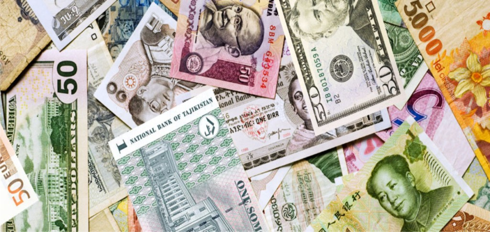
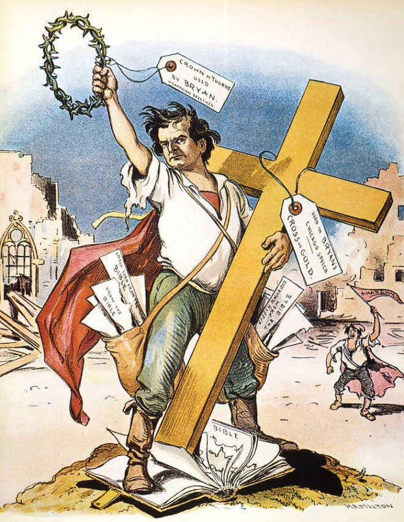
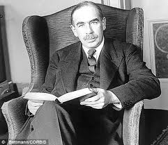

```{r}
#| label: setup
#| include: false

library(ggplot2)
library(dplyr)
library(scales)
library(knitr)
library(kableExtra)

# IU color palette
iu_crimson <- "#990000"
iu_cream <- "#EDEBEB"
iu_gray <- "#535054"
iu_light_gray <- "#7E7E7E"
iu_dark_text <- "#2C3E50"
iu_green <- "#1B5E3F"
iu_navy <- "#1F3A5F"
iu_gold <- "#B8860B"

theme_ipe <- function(base_size = 20) {
  theme_minimal(base_size = base_size) +
    theme(
      plot.title = element_text(color = iu_crimson, face = "bold", size = rel(1.2),
                                margin = margin(t = 5, b = 5)),
      plot.subtitle = element_text(color = iu_gray, size = rel(0.9),
                                   margin = margin(b = 10)),
      plot.caption = element_text(color = iu_light_gray, size = rel(0.7),
                                  hjust = 0, margin = margin(t = 10)),
      axis.title = element_text(color = iu_dark_text, size = rel(0.9)),
      axis.title.x = element_text(margin = margin(t = 8)),
      axis.title.y = element_text(margin = margin(r = 8)),
      axis.text = element_text(color = iu_gray, size = rel(0.8)),
      panel.grid.minor = element_blank(),
      panel.grid.major = element_line(color = "#E5E5E5", linewidth = 0.4),
      legend.position = "bottom",
      legend.title = element_text(size = rel(0.85)),
      legend.text = element_text(size = rel(0.8)),
      plot.margin = margin(t = 8, r = 12, b = 20, l = 12)
    )
}
```

## Today's Plan

::: {.callout-important appearance="minimal" icon=false}
## Today's Big Question
[**How does the international monetary system work? What are the political implications of technical choices and technical constraints?**]{style="font-size: 1.4em; line-height: 1.4;"}
:::

```{r}
#| label: tbl-plan

plan <- data.frame(
  Section = c("1 · Money Across Borders",
              "2 · The Menu of Exchange-Rate Systems",
              "3 · The Balance of Payments",
              "4 · The Trilemma: Why You Can't Have It All",
              "5 · Three Monetary Orders in 150 Years",
              "6 · The Future of Monetary Power"),
  Cover = c("The foreign exchange market, and what makes a currency \"hard\"",
            "Fixed, floating, managed — and the costs each one carries",
            "How a country's accounts must balance, and what forces adjustment",
            "Fixed rates, free capital, monetary autonomy: pick any two",
            "Gold standard, Bretton Woods, and today's float — who governs?",
            "Digital currencies, the digital RMB vs. the dollar, and \"is China a manipulator?\"")
)

kable(plan, col.names = c("Section", "What we'll cover"),
      align = c("l", "l")) %>%
  kable_styling(font_size = 24, full_width = TRUE) %>%
  row_spec(0, bold = TRUE, color = "white", background = iu_crimson) %>%
  column_spec(1, bold = TRUE, color = iu_crimson, width = "42%") %>%
  column_spec(2, width = "58%")
```

::: {.notes}
A quick orientation before we start. It's Monday, so we open with a short in-class writing prompt, then run the lecture and discussion. This week is the international monetary system, and it comes in two halves. Today, Chapter 10, is the *mechanics* — the plumbing. How do currencies actually trade? What does it mean to "fix" or "float" a currency? What is the balance of payments, and why must it balance? And the single most important analytical idea in the whole topic, the trilemma: the hard constraint that says a government simply cannot simultaneously have a fixed exchange rate, free movement of capital, and an independent monetary policy. Tomorrow, Chapter 11, is the *politics* — cooperation, conflict, and crisis — who wins and loses, and why countries fight over currencies. So today I'm building you the toolkit; tomorrow we use it. The arc has six moves. We start with the foreign exchange market itself and what makes some currencies "hard" and trusted. Then the menu of exchange-rate systems — fixed, floating, managed — and the fact that each is a genuine trade-off, not a free choice. Third, the balance of payments: the accounting identity that governs everything, and the painful adjustment it forces. Fourth, the trilemma, which is *why* fixing versus floating is a trade-off in the first place — keep that as the spine of the day. Fifth, we put it in motion historically: the gold standard, Bretton Woods, and the floating system we live in now, which is where most of the key terms live. And finally we bridge to the politics — and the future — with your reading, Huang and Mayer on digital currencies and monetary sovereignty, and the Trade Talks podcast asking whether China is a currency manipulator. Hold the Big Question the whole way through: every government wants both a stable currency and control over its own economy — and the deep lesson of today is that it generally cannot have both at once.
:::


## Before We Start: A Two-Minute Write

::: {.callout-important appearance="minimal" icon=false}
**Writing prompt.** You wake up and one U.S. dollar buys **150 yen** instead of yesterday's **100 yen**. The dollar has gotten *stronger*; the yen *weaker*.

**Name one group of people this helps and one it hurts** — and say why. Think about a U.S. tourist in Tokyo, a Toyota dealer in Indiana, an American soybean farmer who exports to Japan, and a Japanese family buying an iPhone.
:::

::: {.callout-tip appearance="minimal" icon=false}
No prep needed — write for two minutes from intuition. By the end of today you'll have the vocabulary to say it precisely. We'll come back to your answers in the discussion.
:::

::: {.notes}
Before any lecturing, take out a sheet and write for two minutes. Here's the scenario: you wake up tomorrow and the dollar has jumped from buying a hundred yen to buying a hundred and fifty yen. The dollar is stronger, the yen is weaker. Your job is just to name one group this helps and one it hurts, and say why. I've given you four characters to think with: a U.S. tourist in Tokyo, a Toyota dealer here in Indiana, an American soybean farmer selling to Japan, and a Japanese family shopping for an iPhone. Don't worry about getting the jargon right — write from intuition. The reason I open here is that the entire chapter is, underneath the accounting, a story about distribution: every movement in an exchange rate makes somebody better off and somebody worse off, and that's exactly why exchange rates are political. By the end of class you'll be able to state your answer precisely, using terms like appreciation, depreciation, current account, and the trilemma. Hold onto what you wrote — we'll return to it in discussion.
:::


# Money Across Borders Facilitates Trade {background-color="#990000"}

::: {style="text-align:center; margin-top:-0.2em;"}
[Section 1]{style="font-size:0.6em; color:#EDEBEB; letter-spacing:0.15em;"}
:::


## The Core Idea

::: {.columns}
::: {.column width="60%"}

::: {.callout-important appearance="minimal" icon=false}
An **exchange rate** is just a **price**: the price of one country's money expressed in another's.
:::

Every cross-border transaction — a vacation, an import, a factory investment — first requires **trading one currency for another.**

The alternative, **barter**, requires a **double coincidence of wants** — an Indiana soybean farmer would have to find a Japanese buyer who wants soybeans **and** offers exactly what the farmer wants in return. 

::: {.callout-tip appearance="minimal" icon=false}
Because it is a *price*, an exchange rate moves when **supply and demand** for a currency move — and a government that wants to *control* that price has to do something about the supply and demand. That "something" is what we're learning today.
:::

:::
::: {.column width="40%"}

::: {style="text-align:center; margin-top:0.4em;"}
{style="height:340px; width:auto; border:1px solid #ccc;"}

[Currencies trade against one another at a price — the starting point for every cross-border deal.]{style="font-size:0.5em; color:#535054;"}
:::

:::
:::

::: {.notes}
Let's start with the one idea everything else hangs on, and it's deliberately simple. An exchange rate is nothing more exotic than a price — the price of one country's money measured in another country's money. One dollar costs about a hundred and fifty yen; one euro about a dollar-ten. That's it. But step back and ask why we even need this price. The alternative to using money is barter — trading goods directly for other goods. The classic problem with barter is that it requires a *double coincidence of wants*: for any deal, I have to find someone who has exactly what I want *and* who wants exactly what I have, in the right amounts, at the right moment. Our Indiana soybean farmer would have to track down a Japanese buyer who both wants his soybeans and happens to be offering precisely the goods the farmer wants back — wildly inefficient, and basically impossible at the scale of a modern economy. Money solves that: it's a medium everyone accepts, so the farmer just sells soybeans for money and spends the money on anything. Across borders, though, there's a wrinkle — the farmer wants dollars, while his Japanese customer holds yen. So international trade and finance rest on converting one money into another, and the rate of that conversion is the exchange rate. That's why this price matters so much: almost nothing in the international economy — imports, foreign investment, buying foreign bonds — happens until one currency is traded for another. And here's the hook for the whole lecture, in the bottom callout: because an exchange rate is a price, it moves whenever supply and demand for the currency move. So a government that wants to *control* its exchange rate — to fix it, or nudge it — has to actively manage that supply and demand. Everything we do today, from reserves to interest rates to the trilemma, is really about what a government must give up to control this one price.
:::


## Where Currencies Trade

The **foreign exchange market** is the global, decentralized marketplace where currencies are bought and sold. It is the **largest financial market on earth** — turnover is on the order of **$7.5 trillion per day** (BIS, 2022).

```{r}
#| label: tbl-currency-types

ct <- data.frame(
  term = c("Hard currency", "Soft currency", "Key (vehicle) currency"),
  def = c("Deep, liquid markets; trusted to hold value; easily converted (US$, €, ¥, £)",
          "Thin markets; converted only through a hard currency; weak demand abroad",
          "A hard currency used as the world's default for trade, invoicing & reserves — above all the US dollar"),
  why = c("Issuer is trusted to keep inflation low and repay its debts",
          "Issuer's macro-stability is in doubt; others won't hold it",
          "~88% of all FX trades have the dollar on one side")
)

kable(ct, col.names = c("Type", "What it is", "Why"),
      align = c("l", "l", "l")) %>%
  kable_styling(font_size = 28, full_width = TRUE) %>%
  row_spec(0, bold = TRUE, color = "white", background = iu_crimson) %>%
  row_spec(1:3, extra_css = "padding-top: 11px; padding-bottom: 11px; line-height: 1.3;") %>%
  column_spec(1, bold = TRUE, color = iu_crimson, width = "20%") %>%
  column_spec(2, width = "52%") %>%
  column_spec(3, width = "28%")
```

::: {.callout-tip appearance="minimal" icon=false}
A currency is "hard" only because the **government behind it is trusted.** Money is, in the end, a political promise — which is why monetary power and state credibility travel together.
:::

::: {.notes}
So where does this trading happen? In the foreign exchange market — "forex" or "FX" for short — which is the global, decentralized, around-the-clock marketplace where currencies are bought and sold. Put one fact in your head about its scale: it is the single largest financial market in the world, with turnover on the order of seven and a half trillion dollars *every day*, according to the Bank for International Settlements. That dwarfs global stock markets. Now, not all currencies are equal in that market, and the table gives you the vocabulary. A hard currency trades in deep, liquid markets, is trusted to hold its value, and can be converted easily — the dollar, the euro, the yen, the pound. A soft currency trades in thin markets, can usually only be converted by going through a hard currency first, and faces weak demand from foreigners who don't want to hold it. And then a special subset of hard currencies are the key, or vehicle, currencies — the ones the world uses as its default for invoicing trade, denominating debt, and holding reserves. The dollar is the key currency above all others: it's on one side of roughly eighty-eight percent of all foreign-exchange trades, even when neither party is American. Here's the conceptual payoff in the bottom callout, and it previews tomorrow's politics: what actually makes a currency "hard" is not anything technical — it's that the government standing behind it is trusted to keep inflation low and pay its debts. Money is a political promise. That's why monetary power and the credibility of a state are bound together, and why the dollar's role is as much about confidence in the United States as about economics.
:::


## How Big Is the FX Market?

::: {.columns}
::: {.column width="40%"}

A market like no other. Daily turnover:

- **Global FX: ~\$7.5 trillion**
- New York Stock Exchange: **~\$80 billion** → FX is **~90× larger**
- Germany's Deutsche Börse (Xetra): **~\$5 billion** → FX is **~1,500× larger**

::: {.callout-tip appearance="minimal" icon=false}
*One day* of currency trading exceeds **a month** of the world's major stock exchanges combined.
:::

:::
::: {.column width="60%"}

```{r}
#| label: fig-fx-currencies
#| fig-width: 8.2
#| fig-height: 5.2
#| out-width: "99%"
#| fig-alt: "Horizontal bar chart of daily FX turnover involving each major currency in April 2022, in trillions of dollars: US dollar about 6.6 trillion (88% of trades), euro about 2.3 trillion (31%), Japanese yen about 1.3 trillion (17%), pound sterling about 1.0 trillion (13%), and renminbi about 0.5 trillion (7%)."

cur <- data.frame(
  ccy = c("US dollar (USD)", "Euro (EUR)", "Japanese yen (JPY)",
          "Pound sterling (GBP)", "Renminbi (CNY)"),
  share = c(88, 31, 17, 13, 7)
)
cur$vol <- cur$share / 100 * 7.5
cur$ccy <- factor(cur$ccy, levels = rev(cur$ccy))

ggplot(cur, aes(vol, ccy)) +
  geom_col(fill = iu_crimson, width = 0.66) +
  geom_text(aes(label = paste0("$", formatC(vol, format = "f", digits = 1), "T   (", share, "%)")),
            hjust = -0.06, size = 4.7, color = iu_dark_text, fontface = "bold") +
  scale_x_continuous(limits = c(0, 9.4), breaks = NULL) +
  labs(title = "The dollar sits on one side of ~88% of all FX trades",
       subtitle = "Daily turnover involving each currency, April 2022 ($ trillions)",
       x = NULL, y = NULL,
       caption = "Source: BIS Triennial Survey 2022. Each trade has two currencies, so shares sum to ~200%.") +
  theme_ipe(base_size = 15) +
  theme(panel.grid.major.y = element_blank())
```

:::
:::

::: {.notes}
Let me give you a feel for how staggeringly large this market is, because the scale is part of the political point. Global FX turnover is about seven and a half trillion dollars *a day*. To anchor that: the New York Stock Exchange — the largest stock exchange on earth — trades on the order of eighty billion dollars a day, so the currency market is roughly ninety times bigger. Germany's main exchange, the Deutsche Börse's Xetra platform, trades around five billion dollars a day, so FX is something like fifteen hundred times larger than that. Even if you add up every major stock exchange in the world, a single day of currency trading dwarfs them; FX in one day exceeds about a month of global equity trading. That's the first takeaway: the market that sets the price of money is by far the largest financial market that exists. The second takeaway is the bar chart, and it's the single most important fact about the structure of this market. Because every trade involves two currencies, the shares add up to two hundred percent rather than one hundred — so read these as "how often is this currency on one side of a trade." The U.S. dollar is on one side of about eighty-eight percent of all trades — call it six and a half trillion dollars a day. Nothing else is close: the euro is around thirty-one percent, the Japanese yen seventeen, the British pound thirteen. And notice the renminbi at the bottom — about seven percent. That sounds small, but China's currency was in eighth place at four percent in 2019 and jumped to fifth place by 2022, the fastest riser in the market. Hold that contrast for the end of today: the dollar utterly dominates global currency trading, the renminbi is a distant but fast-growing challenger, and that gap is exactly the terrain of the U.S.–China monetary competition our reading and podcast take up.
:::


## Key Vocabulary: Appreciation & Depreciation

::: {.columns}
::: {.column width="50%"}

### Appreciation
A currency gets **stronger** — buys *more* foreign money.

- *$1 → ¥100, then $1 → ¥150*: the dollar **appreciates**
- Imports get **cheaper**; your **exports get more expensive** abroad
- **Fixed-rate twin:** an official move *up* is a **revaluation**

:::
::: {.column width="50%"}

### Depreciation
A currency gets **weaker** — buys *less* foreign money.

- *$1 → ¥150, then $1 → ¥100*: the dollar **depreciates**
- Imports get **pricier**; your **exports get cheaper** abroad
- **Fixed-rate twin:** an official move *down* is a **devaluation**

:::
:::


::: {.callout-important appearance="minimal" icon=false}
Recall your initial writing prompt: A **stronger dollar** delights the U.S. tourist and the importer buying cheaper Japanese cars — but it **hurts the soybean farmer** whose exports just got pricier abroad (and the Japanese family, since the weak yen makes the dollar-priced iPhone *more* expensive). **Every exchange-rate move creates winners and losers.** That is why this is *political* economy.
:::

::: {.callout-tip appearance="minimal" icon=false}
*Which* groups then organize around those gains and losses — and how they shape policy — is the heart of **Ch 12 (Thursday).** Today we just need the mechanics.
:::

::: {.notes}
Two words you need to use precisely for the rest of the unit: appreciation and depreciation. A currency appreciates when it gets stronger — when one unit buys more foreign money than before. If the dollar goes from buying a hundred yen to a hundred and fifty, the dollar has appreciated. And notice the consequence: a stronger dollar makes foreign goods cheaper for Americans — imports become a bargain — but it makes American goods more expensive for foreigners, so our exports get harder to sell. Depreciation is the mirror image: the currency gets weaker, one unit buys less foreign money, imports become pricier at home, and your exports get cheaper and easier to sell abroad. Now, one more pair of terms — the fixed-rate twins of these two. Appreciation and depreciation are what we call it when a *floating* currency moves on its own in the market. But under a *fixed* exchange rate, the currency doesn't drift — the government changes its value deliberately by resetting the official peg. Resetting the peg upward, making the currency officially worth more, is a **revaluation**; resetting it downward is a **devaluation**. So it's the same two directions — stronger or weaker — but a different mechanism: appreciation and depreciation happen *to* a floating currency in the market, while revaluation and devaluation are something a government deliberately *does* to a pegged one. Keep that distinction, because when China or Bretton Woods countries "devalue," that's a policy decision, not a market move. Now connect it straight back to the two minutes you just wrote. The scenario — a dollar moving from a hundred to a hundred fifty yen — is exactly a dollar appreciation. Who did you say it helps? The American tourist in Tokyo, whose dollars now stretch further; the Japanese family buying an iPhone, since the strong dollar's flip side is a weak yen that... actually makes the dollar-priced iPhone *more* expensive for them — so watch the direction carefully, that family is hurt, while a U.S. consumer buying a Japanese TV is helped; and the Toyota dealer in Indiana importing cars that are now cheaper. And who's hurt? The soybean farmer in the Midwest, whose beans just got fifty percent more expensive for Japanese buyers, so his sales fall. The single most important takeaway from this slide, in the callout: every move in an exchange rate simultaneously creates winners and losers inside every country. There is no neutral exchange rate. That distributional fact is the reason currencies are fought over politically, and it's the thread that runs into tomorrow's chapter.
:::


# The Menu of Exchange-Rate Systems {background-color="#990000"}

::: {style="text-align:center; margin-top:-0.2em;"}
[Section 2]{style="font-size:0.6em; color:#EDEBEB; letter-spacing:0.15em;"}
:::


## A Government's First Design Choice: How Is the Currency Price Set?

A country's **exchange-rate system** is the rule it adopts for *how its currency's price gets determined* — by the **market**, by the **government**, or by some **blend** of the two.

```{r}
#| label: tbl-regimes

rg <- data.frame(
  sys = c("Floating exchange-rate system",
          "Fixed exchange-rate system (peg)",
          "Managed float (\"dirty float\")",
          "Fixed-but-adjustable system"),
  how = c("Price is set purely by market supply & demand; the government does not intervene",
          "Government picks a target value (a \"par value\") and buys/sells its own currency to hold it there",
          "Mostly market-determined, but the government intervenes when it dislikes the direction or speed",
          "Fixed in normal times, but the peg can be officially re-set when conditions fundamentally change"),
  ex = c("US$, €, ¥, £",
         "Hong Kong $, Gulf pegs, pre-2005 China",
         "Most emerging markets in practice",
         "The Bretton Woods system (1945–73)")
)

kable(rg, col.names = c("System", "How the price is set", "Example"),
      align = c("l", "l", "l")) %>%
  kable_styling(font_size = 28, full_width = TRUE) %>%
  row_spec(0, bold = TRUE, color = "white", background = iu_crimson) %>%
  row_spec(1:4, extra_css = "padding-top: 10px; padding-bottom: 10px; line-height: 1.28;") %>%
  column_spec(1, bold = TRUE, color = iu_crimson, width = "22%") %>%
  column_spec(2, width = "52%") %>%
  column_spec(3, width = "26%")
```

::: {.callout-tip appearance="minimal" icon=false}
These aren't four discrete but a **spectrum** from pure market to pure government control. Remember - an exchange rate has two sides, so a government can really only control one side of the transaction.
:::

::: {.notes}
Once a country has a currency, its government faces a first, foundational choice: what rule will determine the currency's price? That rule is the country's exchange-rate system, and the table lays out the menu — these are four of your key terms, so learn them as a set. A floating, or flexible, system lets the price be set purely by market supply and demand; the government keeps its hands off, and the dollar, euro, yen, and pound all float. A fixed, or pegged, system is the opposite: the government picks a target value — called the par value — and then actively buys and sells its own currency in the market to hold the price at that target, like Hong Kong pegging tightly to the dollar, or the Gulf states, or China before 2005. A managed float — sometimes called, a little pejoratively, a "dirty float" — is the hybrid that most emerging markets actually run: the price is mostly market-determined, but the central bank steps in to intervene whenever it dislikes where the currency is heading or how fast. And the fourth, fixed-but-adjustable, is the crucial historical category: the rate is fixed in normal times, giving you stability, but unlike a hard peg the government reserves the right to officially re-set the peg when economic conditions change fundamentally — that's the design Bretton Woods used, and we'll return to it. The thing to see, in the callout, is that these aren't four sealed boxes; they're a spectrum running from pure market determination on one end to pure government control on the other. The textbook pure cases are actually rare. Most countries in the real world live somewhere in the managed middle, which is exactly why the politics of "is that government manipulating its currency?" gets so murky — a question the podcast takes head-on.
:::


## The Fixed vs. Floating Spectrum

```{r}
#| label: fig-regime-spectrum
#| fig-width: 13
#| fig-height: 4.8
#| out-width: "96%"
#| fig-alt: "A horizontal spectrum from market-determined to government-determined exchange rates. From left to right: Floating (US dollar, euro, yen, pound), Managed float (most emerging markets), Fixed-but-adjustable (Bretton Woods), and Fixed peg (Hong Kong, Gulf states). The left end is labeled market determines the price; the right end government determines the price."

strip <- data.frame(x = seq(0, 1, length.out = 200))
nodes <- data.frame(
  x = c(0.06, 0.40, 0.66, 0.94),
  name = c("Floating", "Managed float", "Fixed-but-\nadjustable", "Fixed (peg)"),
  ex = c("US$, €, ¥, £", "most emerging\nmarkets", "Bretton Woods\n(1945–73)", "Hong Kong,\nGulf states")
)

ggplot() +
  geom_tile(data = strip, aes(x = x, y = 0, fill = x), height = 0.16) +
  scale_fill_gradient(low = iu_navy, high = iu_crimson, guide = "none") +
  geom_point(data = nodes, aes(x, 0), size = 5, color = "white") +
  geom_point(data = nodes, aes(x, 0), size = 3.2, color = iu_dark_text) +
  geom_text(data = nodes, aes(x, 0.34, label = name), fontface = "bold",
            size = 4.6, color = iu_dark_text, lineheight = 0.9) +
  geom_text(data = nodes, aes(x, -0.34, label = ex), size = 3.7,
            color = iu_gray, lineheight = 0.9, fontface = "italic") +
  annotate("text", x = 0, y = 0.66, label = "← Market determines the price",
           hjust = 0, fontface = "bold", size = 4.4, color = iu_navy) +
  annotate("text", x = 1, y = 0.66, label = "Government determines the price →",
           hjust = 1, fontface = "bold", size = 4.4, color = iu_crimson) +
  scale_x_continuous(limits = c(-0.02, 1.02)) +
  scale_y_continuous(limits = c(-0.6, 0.8)) +
  theme_void()
```

::: {.callout-tip appearance="minimal" icon=false}
The textbook "pure" cases — a perfectly free float, a rock-hard peg — are **rare.** Most real-world regimes live in the **managed middle**, which is precisely why the charge "that government is *manipulating* its currency" is so slippery.
:::

::: {.notes}
Before we leave the menu, I want you to stop seeing these four systems as separate boxes and start seeing them as points along a single spectrum — that's what this figure does. Run your eye from left to right. The left end is pure market control: the government keeps its hands off entirely and lets supply and demand set the price. That's the floating end, where the dollar, euro, yen, and pound live. The right end is pure government control: the state names a value and defends it absolutely — the hard peg, where you find Hong Kong and the Gulf states. And everything interesting happens in between. A managed float, where most emerging-market economies actually sit, is left-of-center: mostly market-driven, with the central bank stepping in when it dislikes the move. Fixed-but-adjustable, the Bretton Woods design, is right-of-center: pegged most of the time, but with an official escape valve to re-set the rate. The single most important thing to take from this picture, in the callout, is that the textbook pure cases are rare — almost no country sits exactly at either end. The real world is crowded into the managed middle, with governments intervening to varying degrees. And that's not a trivial observation: it's exactly why the accusation that a country is "manipulating" its currency is so hard to pin down. If almost everyone manages their float to some degree, where's the line between legitimate management and illegitimate manipulation? Hold that question — it's the crux of the China podcast at the end of today.
:::


## When Governments Wall Off the Market: Exchange Restrictions

::: {.columns}
::: {.column width="56%"}

Fixing a price is hard if money can flood in and out freely. So some governments use **exchange restrictions** — controls that limit the **convertibility** of the currency or the **cross-border movement of capital.**

- Limits on buying foreign currency or moving money abroad
- Caps on foreign investment in or out
- Requirements to surrender export earnings to the central bank

:::
::: {.column width="44%"}

::: {.callout-important appearance="minimal" icon=false}
By walling the market off, a government gains **more control over its currency's price** — it can defend a peg without being swamped by capital flows.

But control isn't free. The costs: a **less open, less liquid economy**, **less foreign investment**, and often **evasion, capital flight, and black-market exchange rates.**
:::

:::
:::

::: {.callout-tip appearance="minimal" icon=false}
Under Bretton Woods, such controls were the **norm**, not the exception — national financial systems were walled off from one another by design. Today China is the most important large economy that still restricts capital movement.
:::

::: {.notes}
There's one more tool on this menu, and it's the most heavy-handed. Holding a fixed exchange rate — or even just steering a managed one — is genuinely hard if money can rush into and out of your country freely, because those flows move the supply and demand for your currency faster than the government can counteract them. So governments reach for exchange restrictions — our next key term — controls that limit either the convertibility of the currency itself or, more often, the cross-border movement of capital. In practice that's limits on how much foreign currency citizens can buy or send abroad, caps on how much foreigners can invest in or pull out, and rules forcing exporters to hand their foreign-currency earnings to the central bank. The basic trade-off is the one in the right-hand callout. By walling the market off, a government buys itself far more control over its currency's price — it can defend a peg or hold a target without being swamped by speculative flows. But that control is not free, and the costs compound. The economy becomes less open and less liquid; it gets cut off from a lot of foreign investment and the cheaper capital that comes with it; and restrictions tend to breed evasion — people smuggle money out, and a black-market exchange rate springs up alongside the official one, so the "controlled" price becomes partly fictional. The deeper point: restrictions don't abolish market pressure on the currency, they suppress and displace it — and they do so at a real cost to growth and integration. Historically this matters enormously: under Bretton Woods, capital controls were the norm, not the exception — the architects deliberately walled national financial systems off from one another so countries could run fixed rates without being constantly battered by capital flows. And today the most important large economy that still significantly restricts capital movement is China, which is exactly how it manages its currency — the subject of your podcast.
:::


# The Balance of Payments {background-color="#990000"}

::: {style="text-align:center; margin-top:-0.2em;"}
[Section 3]{style="font-size:0.6em; color:#EDEBEB; letter-spacing:0.15em;"}
:::


## The Country's Ledger With the World

The **balance of payments (BoP)** is the complete record of **all economic transactions** between a country's residents and the rest of the world over a period — every export, import, investment, and loan.

```{r}
#| label: tbl-bop

bp <- data.frame(
  acct = c("Current account", "Capital account", "Financial account"),
  what = c("Trade in goods & services, plus income and transfers — money from selling/buying real things",
           "A small, specialized account: capital transfers and non-produced, non-financial assets",
           "Cross-border purchases of assets — FDI, stocks, bonds, bank loans, and official reserves"),
  ex = c("Exports − imports (X − M)",
         "Debt forgiveness, patents",
         "A Japanese fund buying U.S. Treasuries")
)

kable(bp, col.names = c("Account", "What it records", "Example"),
      align = c("l", "l", "l")) %>%
  kable_styling(font_size = 28, full_width = TRUE) %>%
  row_spec(0, bold = TRUE, color = "white", background = iu_crimson) %>%
  row_spec(1:3, extra_css = "padding-top: 11px; padding-bottom: 11px; line-height: 1.3;") %>%
  column_spec(1, bold = TRUE, color = iu_crimson, width = "22%") %>%
  column_spec(2, width = "54%") %>%
  column_spec(3, width = "24%")
```

::: {.callout-tip appearance="minimal" icon=false}
Heads-up on vocabulary: older texts (and Oatley) often fold the tiny **capital account** into the **financial account** and speak of just two big buckets — the **current account** and the **financial/capital account.** We'll do the same.
:::

::: {.notes}
Now the accounting heart of the chapter — and I promise the payoff is worth the bookkeeping. The balance of payments is the complete record of every economic transaction between a country's residents and the rest of the world over some period: every good exported and imported, every service, every dividend, every cross-border investment and loan. Think of it as the country's financial ledger with the entire outside world. It's divided into accounts, three of them formally, and these are all key terms. The current account records trade in goods and services plus income and transfers — basically the money flowing from buying and selling real things, and its core is exports minus imports, that X minus M term. The capital account is a small, technical account covering things like debt forgiveness and transfers of patents or other non-produced assets — honestly the least important of the three, and you can almost ignore it. The financial account is the big one alongside the current account: it records cross-border purchases of *assets* — foreign direct investment, stocks, bonds, bank loans, and the central bank's official reserves. The example to hold is a Japanese pension fund buying U.S. Treasury bonds: that's money flowing into the U.S. financial account. One important heads-up on vocabulary, in the callout, because it trips students up every year: the formal three-account split is recent, and older textbooks — including Oatley — often lump the tiny capital account in with the financial account and just talk about two big buckets, the current account and the financial account. For today, we'll follow Oatley and think in those two big buckets. Keep that simplification in mind, because the relationship between those two buckets is the next slide, and it's the engine of everything.
:::


## The National Income Identity is a Structural Constraint

::: {.columns}
::: {.column width="58%"}

**1 · National income identity** — output = all spending on it:
$$Y = C + I + G + (X - M)$$

**2 · Define national saving** — income not consumed (households + government):
$$S \equiv Y - C - G$$

**3 · Substitute (1) into (2)** — the $C$ and $G$ cancel:
$$S = \big[\,C + I + G + (X - M)\,\big] - C - G$$

**4 · Move investment across:**
$$\underbrace{\,S - I\,}_{\textbf{financial account}} \;=\; \underbrace{\,X - M\,}_{\textbf{current account}}$$

:::
::: {.column width="42%"}

::: {.callout-important appearance="minimal" icon=false}
A current-account **deficit** ($X < M$) must be **financed** by a financial-account **surplus** ($S < I$) — selling assets or borrowing abroad. The two are **mirror images** that sum to zero.
:::

::: {.callout-tip appearance="minimal" icon=false}
**In plain words:** if a country consumes more than it produces, the gap is borrowed from foreigners. The U.S. runs a current-account deficit *because* the world is eager to buy U.S. assets — an **identity**, not a coincidence.
:::

:::
:::

::: {.notes}
Here is the single relationship that makes the whole topic make sense, and this time I want to actually *prove* it to you in four lines, because seeing the algebra is what makes it click. Step one is the national income identity from intro macro: a country's output, Y, equals total spending on that output — consumption, plus investment, plus government spending, plus net exports, X minus M. Step two: define national saving. Saving, S, is just the income that is *not* consumed, either by households or by the government — so S equals Y minus C minus G. Step three is the move that does all the work: take that definition of saving and substitute the national income identity in for Y. So S equals the whole expression, C plus I plus G plus (X minus M), minus C minus G — and the C and the G cancel, leaving S equals I plus (X minus M). Step four: move investment to the other side, and you have S minus I equals X minus M. Now read what each side *means*. The left side, saving minus investment, is the financial account — a country that saves more than it invests at home sends the surplus abroad as net lending and asset purchases. The right side, exports minus imports, is the current account. So the algebra has *proven* that the financial account and the current account are mirror images: they must always sum to zero. This isn't a theory you can argue with — it's an accounting identity, true by construction. Now the payoff, in the important callout. If a country runs a current-account deficit — imports more than it exports, X less than M — then by this identity it *must* be running a financial-account surplus: it must be selling assets to foreigners or borrowing from them to pay for the excess imports. There's no other possibility. In plain words, the bottom callout: if a country consumes more than it produces, the gap is necessarily financed by foreigners. That reframes the most-argued-about number in U.S. politics — the trade deficit. Politicians treat it as foreigners "winning," but the identity says the U.S. current-account deficit is the flip side of the world's eagerness to buy American assets — Treasuries, stocks, real estate. The capital flowing in *is* the trade deficit, seen from the other side of the ledger; you can't change one without changing the other.
:::


## Global Imbalances

```{r}
#| label: fig-imbalances
#| fig-width: 13
#| fig-height: 4.6
#| out-width: "95%"
#| fig-alt: "A line chart of current-account balances as a percent of GDP from 1990 to 2023 for the United States, China, Germany, and Japan. The United States runs persistent deficits below zero; China, Germany, and Japan run surpluses above zero. The mirror-image pattern peaks around 2006 to 2008, when the U.S. deficit reaches nearly 6 percent of GDP and China's surplus reaches about 9 to 10 percent."

yrs <- c(1990, 1995, 2000, 2004, 2006, 2008, 2010, 2012, 2014, 2016, 2018, 2020, 2022, 2023)
imb <- data.frame(
  year = rep(yrs, 4),
  country = factor(rep(c("United States", "China", "Germany", "Japan"), each = length(yrs)),
                   levels = c("United States", "China", "Germany", "Japan")),
  ca = c(
    -1.3, -1.5, -4.0, -5.0, -5.9, -4.6, -2.9, -2.6, -2.1, -2.1, -2.1, -2.9, -3.9, -3.0,  # US
     3.0,  0.2,  1.7,  3.5,  8.4,  9.2,  3.9,  2.5,  2.2,  1.7,  0.2,  1.7,  2.5,  1.4,   # China
     2.9, -1.2, -1.8,  4.5,  6.3,  5.6,  5.7,  7.0,  7.5,  8.5,  8.0,  7.1,  4.4,  5.9,   # Germany
     1.5,  2.1,  2.6,  3.7,  4.0,  2.9,  3.9,  1.0,  0.8,  3.9,  3.5,  3.0,  2.1,  3.6)   # Japan
)

ggplot(imb, aes(year, ca, color = country)) +
  annotate("rect", xmin = 2006, xmax = 2008, ymin = -Inf, ymax = Inf, fill = "#7B1E1E", alpha = 0.07) +
  geom_hline(yintercept = 0, color = iu_gray, linewidth = 0.7) +
  geom_line(linewidth = 1.4) +
  geom_point(size = 1.7) +
  annotate("text", x = 2007, y = 10.4, label = "2006–08:\npeak imbalances", color = "#7B1E1E",
           fontface = "bold", size = 3.5, lineheight = 0.9) +
  annotate("text", x = 1991.5, y = -5.3, label = "U.S. deficits", color = iu_crimson,
           fontface = "bold", size = 3.8, hjust = 0) +
  annotate("text", x = 1991.5, y = 8.2, label = "China / Germany / Japan surpluses", color = iu_navy,
           fontface = "bold", size = 3.8, hjust = 0) +
  scale_color_manual(values = c("United States" = iu_crimson, "China" = iu_navy,
                                "Germany" = iu_gold, "Japan" = iu_gray), name = NULL) +
  scale_x_continuous(breaks = seq(1990, 2020, 5), limits = c(1990, 2024)) +
  scale_y_continuous(limits = c(-7, 11.5), breaks = seq(-5, 10, 5), labels = function(x) paste0(x, "%")) +
  labs(title = "One country's deficit is another's surplus",
       subtitle = "Current-account balance, % of GDP, 1990–2023",
       x = NULL, y = NULL,
       caption = "Source: IMF World Economic Outlook (current-account balance, % of GDP). Values approximate.") +
  theme_ipe(base_size = 15)
```

::: {.callout-important appearance="minimal" icon=false}
**This is the accounting identity, not a theory.** Thirty years of U.S. deficits are matched by surpluses in China, Germany, and Japan — one country's deficit *is* another's. *Who* should bear the cost of unwinding them is the central political fight of **Ch 11 (Day 10);** today we just establish that the imbalance exists by accounting necessity.
:::

::: {.notes}
The balance of payments is an accounting identity — savings minus investment equals exports minus imports, one country's deficit is necessarily another's surplus — and I don't want you to think that's just blackboard algebra, so here it is in real data. This is the most famous picture in international macroeconomics: global imbalances. On the vertical axis is each country's current-account balance as a share of GDP, 1990 to 2023, with zero in the middle. The crimson line, the United States, sits stubbornly *below* zero the whole period — three decades of persistent deficits, near six percent of GDP at the peak. Mirroring it above the line are the surplus countries: China, whose surplus spikes toward ten percent in the mid-2000s; Germany, with huge and persistent surpluses; and Japan, steadily in surplus. The shaded band marks the 2006–08 peak. The one point I want today is mechanical, not political: this is the accounting identity playing out in real data — the U.S. deficits and the surpluses elsewhere are the same fact seen from two sides, and they sum toward zero across the world. I'm deliberately *not* getting into who's right or who should fix it — that distributive fight, who bears the cost of adjustment, is the heart of Chapter 11 on Tuesday, and we'll bring this exact chart back then. For now: the identity guarantees the imbalance exists. Politics, next class, decides who has to close it.
:::


## When the Books Won't Balance: Adjustment & Reserves

The accounts *must* balance — so when they don't at the going exchange rate, something has to give. That something is **balance-of-payments adjustment.**

::: {.columns}
::: {.column width="52%"}

### How a country can adjust
- **Let the currency move** — depreciation makes exports cheaper, imports dearer, closing a deficit
- **Tighten policy** — higher interest rates / less spending cools imports
- **Use the buffer** — run down **foreign exchange reserves**

:::
::: {.column width="48%"}

::: {.callout-important appearance="minimal" icon=false}
**Foreign exchange reserves** are the stockpile of hard currency (and gold) a central bank holds to **defend its exchange rate** and pay foreign bills.

A fixed-rate country **spends reserves** to prop up its currency — but reserves are **finite.** When they run low, the peg is in danger.
:::

:::
:::

::: {.callout-tip appearance="minimal" icon=false}
The choice of adjustment tool decides **who bears the cost** — borrowers, exporters, consumers, or the unemployed. Adjustment is never neutral; it is distributive — which is why it becomes political tomorrow.
:::

::: {.notes}
The identity says the books must balance — but at any given exchange rate, the transactions people actually want to make might not balance. A country might be importing far more than the world wants to lend it, at today's exchange rate. When that happens, something has to give, and the process of closing that gap is balance-of-payments adjustment, another key term. There are essentially three ways to adjust, in the left column. First, let the currency move: if you allow your currency to depreciate, your exports get cheaper and your imports get more expensive, demand shifts, and the current-account deficit naturally shrinks — this is the floating-rate country's automatic shock absorber. Second, tighten domestic policy: raise interest rates and cut government spending to cool the economy, which reduces imports and can attract capital — but at the cost of slower growth and higher unemployment. Third, use the buffer: draw down your foreign exchange reserves, our next key term. Reserves are the stockpile of hard currency — dollars, euros — and gold that a central bank holds precisely to defend its exchange rate and pay the country's foreign bills. Here's the crucial mechanics, in the right callout: a country defending a *fixed* rate against downward pressure does it by selling reserves — using its dollars to buy up its own currency and prop the price up. But reserves are finite. You can do that for a while, but if the pressure persists, you watch the reserve stockpile drain toward zero, and everyone in the market can watch it too. When reserves get low, the peg is suddenly in mortal danger — and that's the setup for speculative attacks, which we'll hit in the next section. The deeper point, in the bottom callout, is the one that carries into tomorrow: which adjustment tool a government picks determines *who pays.* Depreciation hurts consumers and importers; high interest rates hurt borrowers and workers; running down reserves just postpones the reckoning. Adjustment is never neutral — it always lands on somebody — and that distributive fact is what turns this accounting into politics.
:::


# The Trilemma: Why You Can't Have It All {background-color="#990000"}

::: {style="text-align:center; margin-top:-0.2em;"}
[Section 4]{style="font-size:0.6em; color:#EDEBEB; letter-spacing:0.15em;"}
:::


## The Impossible Trinity

```{r}
#| label: fig-trilemma
#| fig-width: 11
#| fig-height: 5.6
#| out-width: "70%"
#| fig-alt: "A triangle illustrating the policy trilemma. The three corners are labeled Fixed Exchange Rate, Free Capital Movement, and Monetary Policy Autonomy. Each of the three sides represents a pair of goals a country can choose, while sacrificing the third corner."

# Triangle corners
corners <- data.frame(
  x = c(0, 1, 0.5),
  y = c(0, 0, 0.87),
  lab = c("FIXED\nEXCHANGE RATE", "FREE CAPITAL\nMOVEMENT", "MONETARY\nAUTONOMY")
)

ggplot() +
  geom_polygon(data = corners, aes(x, y), fill = iu_crimson, alpha = 0.10,
               color = iu_crimson, linewidth = 1.3) +
  geom_point(data = corners, aes(x, y), size = 4, color = iu_crimson) +
  geom_label(data = corners, aes(x, y, label = lab),
             fill = iu_crimson, color = "white", fontface = "bold",
             size = 5, label.size = 0, lineheight = 0.9,
             vjust = c(1.25, 1.25, -0.35)) +
  scale_x_continuous(limits = c(-0.28, 1.28)) +
  scale_y_continuous(limits = c(-0.42, 1.18)) +
  coord_equal() +
  theme_void()
```

::: {.callout-important appearance="minimal" icon=false}
A government can have **at most two** of these three. Wanting all three is the universal temptation — and the impossible one. 
:::

::: {.notes}
This is the most important slide in the chapter — if you take one analytical tool away from this course on money, make it this one. It's called the policy trilemma, or the impossible trinity, and it states a hard constraint that no government anywhere can escape. There are three things a country might want from its monetary system, the three corners of the triangle. One: a fixed exchange rate, for stability and predictability in trade and investment. Two: free movement of capital across its borders, so it can plug into global finance and attract investment. Three: an independent monetary policy — the ability to set its own interest rates to fight its own recessions and inflation, to run the economy for domestic needs. Here's the iron law: you can have any two of these, but never all three. Each *side* of the triangle is a viable pair, and each pair forces you to surrender the opposite corner. Walk around it. If you want a fixed rate *and* your own monetary policy — the bottom side — you must give up free capital movement; you have to wall off capital flows with exchange restrictions, which is exactly Bretton Woods and exactly China today. If you want a fixed rate *and* free capital flows — the right side — you must give up monetary autonomy; your interest rates are no longer yours, they're dictated by whatever it takes to hold the peg, which is the gold standard and, strikingly, the eurozone, where Greece and Germany share one monetary policy they don't individually control. And if you want free capital *and* your own monetary policy — the left side — you must let the exchange rate float; you give up the fixed rate, which is the choice the U.S., U.K., and Japan have all made. Why is this the spine of the whole topic? Because it explains *why* fixing versus floating was always a genuine trade-off and never a free lunch — the question from our Big Question. Every monetary order in history, which we're about to walk through, is just a different answer to which corner of this triangle to sacrifice. The gold standard sacrificed autonomy. Bretton Woods sacrificed capital mobility. We sacrifice the fixed rate. Three orders, three different corners given up — same triangle.
:::


## What Happens When a Government Tries to Cheat the Trilemma

When a fixed rate falls **out of line** with economic fundamentals, markets notice — and pounce.

::: {.columns}
::: {.column width="50%"}

### Fundamental disequilibrium
A peg set at the **wrong** value — one the country **can't sustain** without endlessly burning reserves or strangling its economy. The rate "should" move, but officially it's fixed.

:::
::: {.column width="50%"}

### Speculative attack
Seeing a peg that *must* eventually break, traders **sell the currency en masse** — betting on devaluation. The selling **drains reserves faster**, forcing the very collapse they bet on. A **self-fulfilling** stampede.

:::
:::

::: {.callout-important appearance="minimal" icon=false}
The fixed-but-adjustable design tried to solve this: **devalue officially** in cases of fundamental disequilibrium *before* a panic hits. But admitting your currency is overvalued can itself **trigger** the stampede — the trap at the center of currency crises.
:::

::: {.notes}
So what happens when a government tries to defy the trilemma — to hold a fixed rate it can't actually support? Two key terms describe the slow-motion crisis that follows. The first is fundamental disequilibrium, a term that comes straight out of the Bretton Woods rulebook. It means a peg that has been set at the wrong value — a value the country simply cannot sustain without either burning through its reserves forever or crushing its own economy with brutally high interest rates to defend the rate. The economic fundamentals say the currency should move, but officially it's pinned in place. That gap between what the rate is and what it should be is fundamental disequilibrium. And markets are not stupid — they can see it. Which brings the second term, the speculative attack. When traders look at an overvalued peg and conclude it *must* eventually break, the rational move is to sell that currency now, in bulk, before the devaluation, so you can buy it back cheap afterward. But here's the vicious mechanism: that very wave of selling drains the central bank's reserves even faster, because the bank has to buy up all the currency being dumped — which brings forward the exact collapse the speculators are betting on. The attack is self-fulfilling. Expecting devaluation *causes* devaluation. George Soros famously did this to the British pound in 1992, made a billion dollars, and broke the peg. Now, the fixed-but-adjustable design of Bretton Woods, in the callout, was actually an attempt to defuse this: the idea was that a country in genuine fundamental disequilibrium could devalue officially and in an orderly way, with the IMF's blessing, *before* a panic developed. But there's a cruel trap — the moment a government admits its currency is overvalued and needs devaluing, it hands speculators a signal and can trigger the very stampede it was trying to avoid. That trap, the tension between orderly adjustment and self-fulfilling panic, sits at the center of every currency crisis, and it's a big part of why the fixed-but-adjustable system eventually broke down — which is the history we turn to now.
:::


# Three Monetary Orders in 150 Years {background-color="#990000"}

::: {style="text-align:center; margin-top:-0.2em;"}
[Section 5]{style="font-size:0.6em; color:#EDEBEB; letter-spacing:0.15em;"}
:::


## Three Orders, Three Sides of the Trilemma

```{r}
#| label: fig-orders-triangle
#| fig-width: 11
#| fig-height: 6.0
#| out-width: "64%"
#| fig-alt: "An impossibility (trilemma) triangle. The three corners are Fixed Exchange Rate, Free Capital Movement, and Monetary Autonomy. Each side is colored and labeled with the monetary order that made that pair of choices: the bottom side (fixed rate plus free capital, giving up monetary autonomy) is the Classical Gold Standard 1870-1914; the left side (fixed rate plus monetary autonomy, giving up capital mobility) is Bretton Woods 1945-73; the right side (free capital plus monetary autonomy, giving up the fixed rate) is the floating era 1973 to today."

corners <- data.frame(
  x = c(0, 1, 0.5),
  y = c(0, 0, 0.87),
  lab = c("FIXED\nEXCHANGE RATE", "FREE CAPITAL\nMOVEMENT", "MONETARY\nAUTONOMY")
)
edges <- data.frame(
  x    = c(0,       0,       1),
  y    = c(0,       0,       0),
  xend = c(1,       0.5,     0.5),
  yend = c(0,       0.87,    0.87),
  col  = c("#8A6608", iu_navy, iu_crimson)   # bottom = gold std, left = Bretton Woods, right = float
)

ggplot() +
  geom_polygon(data = corners, aes(x, y), fill = iu_crimson, alpha = 0.05) +
  geom_segment(data = edges, aes(x = x, y = y, xend = xend, yend = yend, color = col),
               linewidth = 2.4) +
  scale_color_identity() +
  geom_point(data = corners, aes(x, y), size = 3.5, color = iu_dark_text) +
  geom_label(data = corners, aes(x, y, label = lab),
             fill = iu_dark_text, color = "white", fontface = "bold",
             size = 4.3, label.size = 0, lineheight = 0.9,
             vjust = c(1.3, 1.3, -0.35)) +
  annotate("text", x = 0.5, y = -0.36,
           label = "Classical Gold Standard  (1870–1914)\ngives up monetary autonomy",
           color = "#8A6608", fontface = "bold", size = 4.1, lineheight = 0.95, hjust = 0.5) +
  annotate("text", x = 0.10, y = 0.60,
           label = "Bretton Woods\n(1945–73)\ngives up capital\nmobility",
           color = iu_navy, fontface = "bold", size = 4.1, lineheight = 0.95, hjust = 1) +
  annotate("text", x = 0.90, y = 0.60,
           label = "Floating era\n(1973–today)\ngives up the\nfixed rate",
           color = iu_crimson, fontface = "bold", size = 4.1, lineheight = 0.95, hjust = 0) +
  annotate("text", x = 0.5, y = 0.30,
           label = "Interwar (1914–44)\nno stable regime —\ncompetitive devaluations\n& currency wars",
           color = iu_gray, fontface = "italic", size = 3.6, lineheight = 0.95, hjust = 0.5) +
  scale_x_continuous(limits = c(-0.55, 1.55)) +
  scale_y_continuous(limits = c(-0.56, 1.18)) +
  coord_equal() +
  theme_void()
```

::: {.callout-tip appearance="minimal" icon=false}
Each order keeps **two** goals and surrenders the **third**: gold gave up monetary autonomy, Bretton Woods gave up capital mobility, the float gives up the fixed rate. **No order escaped the triangle** — and the interwar years (in the figure) had no stable regime at all.
:::

::: {.notes}
Before we walk through the three monetary orders one at a time, here's the single map that organizes all of them — and it's the trilemma triangle from earlier, now doing historical work. Remember the three goals at the corners: a fixed exchange rate, free movement of capital, and an independent monetary policy. You can hold any two, never all three — so every monetary order in history lives on one *side* of this triangle, defined by the two goals it keeps and the one it gives up. Trace them. The bottom side is the Classical Gold Standard: from roughly 1870 to 1914, currencies were fixed to gold and capital flowed freely, so it sat on the bottom edge and sacrificed monetary autonomy — a country losing gold simply had to let its economy deflate, whatever the domestic pain. That order shattered in the First World War, and the interwar years were the cautionary breakdown between the two systems: failed attempts to rebuild gold, then competitive devaluations and beggar-thy-neighbor currency wars in the Depression. The left side is Bretton Woods: from 1944 to the early 1970s, currencies were fixed but adjustable against the dollar while capital was deliberately restricted — so it kept the fixed rate and bought back some monetary autonomy by giving up capital mobility. The right side is the floating era: since 1973 the major currencies float, so we keep free capital movement and independent monetary policy and give up the fixed rate. That's the whole arc in one figure — three orders, three sides, each a different sacrifice. Not one of them delivered all three goals at once. So as we now zoom into each era, keep asking the same question: which corner did they give up, and who at home paid for that choice?
:::


## The Classical Gold Standard (1870–1914)

::: {.columns}
::: {.column width="56%"}

Every currency fixed to **gold** — and therefore to every other currency. Self-regulating and automatic: a country losing gold saw its **money supply shrink** and prices fall until trade rebalanced.

- The corner sacrificed: **monetary autonomy.** Defending gold meant accepting **deflation, recession, and unemployment** at home
- Worked under **British hegemony** — but the costs fell on workers and farmers who couldn't vote those costs away
- William Jennings Bryan, 1896: *"You shall not crucify mankind upon a **cross of gold**"*

:::
::: {.column width="44%"}

::: {style="text-align:center;"}
{style="height:355px; width:auto; border:1px solid #ccc;"}

[Bryan's "Cross of Gold" speech (1896) attacked the gold standard's deflationary grip on farmers]{style="font-size:0.48em; color:#535054;"}
:::

::: {.callout-tip appearance="minimal" icon=false}
**Interwar interlude (1914–1944): no stable regime.** WWI ended the gold standard; 1920s attempts to rebuild it collapsed in the Depression into **competitive devaluations** and beggar-thy-neighbor currency wars that contributed to WWII.
:::

:::
:::

::: {.notes}
Take the gold standard first, the order of roughly 1870 to 1914. The mechanism was beautifully simple and almost entirely automatic. Every country fixed its currency to a quantity of gold, which meant every currency was fixed to every other one — a global system of fixed rates with no committee running it. And it was self-regulating: if a country ran a trade deficit, gold flowed out to pay for the excess imports; as gold left, the domestic money supply contracted; prices and wages fell; the country's goods became cheaper and more competitive; exports recovered and the deficit closed. Hume's price-specie-flow mechanism, working on its own. But run that through the trilemma and you see the catch immediately: with fixed rates and free capital, the sacrificed corner is monetary autonomy. A country hemorrhaging gold had no choice but to let its money supply shrink and its economy deflate into recession and unemployment — it could not cut interest rates to fight the downturn, because that would breach the gold link. The system delivered stability, but it did so on the backs of workers and farmers who bore the deflation, and who increasingly could vote. That's the political tension captured in the image: William Jennings Bryan's electrifying 1896 "Cross of Gold" speech, where he thundered that the country would not be crucified upon a cross of gold. He was speaking for indebted farmers being slowly ground down by gold-standard deflation — falling prices made their debts heavier every year. Hold onto that line, because it names the deep problem with fixed-rate orders: they ask ordinary people to absorb the adjustment, and once those people have the vote, the order becomes politically fragile. The gold standard finally died in the First World War — and, as the aside on the right notes, the interwar years were not a stable regime at all but an interlude of breakdown: failed attempts to rebuild gold in the 1920s, then competitive devaluations and beggar-thy-neighbor currency wars in the Depression. That chaos is exactly what the architects of the next order were determined never to repeat.
:::


## Bretton Woods (1944–1971): A Designed Order

::: {.columns}
::: {.column width="56%"}

In 1944, 44 nations met at **Bretton Woods, New Hampshire** to build a system that kept **fixed-rate stability** without gold-standard brutality.

- The U.S. dollar fixed to **gold at $35/oz**; every other currency **pegged to the dollar** — *fixed-but-adjustable*
- **Capital controls** were built in, so countries kept some **monetary autonomy** (the trilemma corner they protected)
- A new institution — the **IMF** — would manage the system

:::
::: {.column width="44%"}

::: {style="text-align:center;"}
{style="height:440px; width:auto; border:1px solid #ccc;"}

[John Maynard Keynes, architect of the Bretton Woods negotiations]{style="font-size:0.5em; color:#535054;"}
:::

:::
:::

::: {.callout-tip appearance="minimal" icon=false}
The **Bretton Woods system** chose differently from the gold standard: it sacrificed **capital mobility** instead of monetary autonomy — embedding markets in domestic political stability ("embedded liberalism").
:::

::: {.notes}
After two world wars and a depression — all of which the interwar monetary chaos helped cause — the Allied powers resolved to design the next order deliberately rather than let one emerge by default. In July 1944, delegates from forty-four nations gathered at a resort in Bretton Woods, New Hampshire, with John Maynard Keynes leading the British delegation and Harry Dexter White the American. Their goal was to capture the stability of fixed exchange rates while escaping the gold standard's cruelty — its demand that domestic economies be sacrificed to the external peg. The design had three pillars. First, the dollar was fixed to gold at thirty-five dollars an ounce, and then every other currency pegged to the dollar — so the dollar became the anchor of the whole system, the key currency by treaty. And crucially these pegs were fixed-but-adjustable: stable in normal times, but a country in genuine fundamental disequilibrium could, with IMF approval, formally devalue — the very mechanism we discussed two slides ago, built in on purpose to avoid gold-standard rigidity. Second, and this is the trilemma move, capital controls were baked into the system as legitimate and expected. By restricting capital flows, countries could hold their fixed dollar pegs *and* still run somewhat independent monetary policies to pursue full employment at home. They protected the autonomy corner by sacrificing the mobility corner — the opposite choice from the gold standard. Scholars call this "embedded liberalism": open international trade embedded in, and made safe for, domestic political stability and the welfare state. And third, a brand-new institution to manage it all, the IMF, which is our next slide. The thing to carry forward, in the callout: Bretton Woods and the gold standard both delivered fixed rates, but they sacrificed *different* corners of the triangle — and that design difference is why one asked workers to eat deflation while the other tried to protect them. Same goal, different victim.
:::


## The IMF: Referee and Emergency Lender

The **International Monetary Fund** was created to make fixed-but-adjustable rates *work* — supplying the cooperation the gold standard never had.

```{r}
#| label: tbl-imf

im <- data.frame(
  role = c("Stabilization fund", "Conditionality", "Adjustment referee"),
  what = c("A common pool of member-contributed currencies the IMF lends to countries facing a balance-of-payments / reserves crisis — a buffer against speculative attack",
           "Loans come with strings: the borrower must adopt policy reforms (austerity, devaluation, liberalization) to fix the underlying imbalance",
           "The IMF judged whether a country was in genuine fundamental disequilibrium and could approve an orderly change in its peg"),
  tens = c("Buys time so a country need not devalue or deflate overnight",
           "Lender protection — but deeply resented as outside interference in sovereignty",
           "Tried to make devaluation orderly rather than a panic")
)

kable(im, col.names = c("Tool", "What it does", "The tension"),
      align = c("l", "l", "l")) %>%
  kable_styling(font_size = 26, full_width = TRUE) %>%
  row_spec(0, bold = TRUE, color = "white", background = iu_crimson) %>%
  row_spec(1:3, extra_css = "padding-top: 10px; padding-bottom: 10px; line-height: 1.28;") %>%
  column_spec(1, bold = TRUE, color = iu_crimson, width = "20%") %>%
  column_spec(2, width = "54%") %>%
  column_spec(3, width = "26%")
```

::: {.callout-tip appearance="minimal" icon=false}
The IMF still does all three today — most visibly **conditionality**, which makes it one of the most powerful *and* most criticized institutions in the world economy.
:::

::: {.notes}
Bretton Woods needed a referee — someone to judge when devaluations were legitimate and to help countries through reserve crises so they didn't devalue in a panic or wall themselves off. That was the IMF, and the table gives three functions, two of which are key terms. First, the IMF is a stabilization fund — the actual term: members pay currencies into a common pool, and the Fund lends from it to any member in a balance-of-payments or reserves crisis. It's a buffer — if your reserves are draining and speculators are circling, the Fund lends you hard currency to defend the peg and buy time. Collective insurance against the speculative attacks we just discussed. Second, the controversial one, conditionality: the loans come with strings — to get the money, the borrower must adopt reforms (austerity, often devaluation, liberalization) to fix the underlying imbalance. From the Fund's side that's lender protection; from the borrower's side it's resented as outside interference in sovereignty — which is why the IMF is at once one of the most powerful and most resented institutions in the world economy, especially across the developing world after the 1980s–90s crises. Third, adjustment referee: it judged whether a country was in genuine fundamental disequilibrium — that term again — and could approve an orderly change in the peg. And per the callout, the IMF didn't vanish when Bretton Woods did; it still does all three today, conditionality most visibly, in every modern debt and currency crisis.
:::


## The Collapse and the Floating Era (1971–today)

::: {.columns}
::: {.column width="44%"}

::: {style="text-align:center;"}
{style="height:440px; width:auto; border:1px solid #ccc;"}

[Nixon ended dollar–gold convertibility on August 15, 1971]{style="font-size:0.5em; color:#535054;"}
:::

:::
::: {.column width="56%"}

By the late 1960s the U.S. had printed **more dollars than it held gold** to back. As confidence eroded, **speculative attacks** mounted. In **August 1971, Nixon closed the gold window** — and by 1973 the major currencies **floated.**

- We've lived in a **floating era** ever since: the dollar, euro, yen, and pound are priced by markets
- The sacrificed corner flipped to **the fixed rate** — bought with **free capital** + **monetary autonomy**
- But "floating" is messy: most countries **manage** their floats, and the dollar still anchors the system (which keeps it "strong")

:::
:::

::: {.callout-important appearance="minimal" icon=false}
The deep cause of collapse was the **adjustment problem**: neither the U.S. (unwilling to deflate) nor surplus Germany (unwilling to inflate) would bear the cost. **No one would adjust — so the system broke.**
:::

::: {.notes}
Bretton Woods worked impressively for about fifteen years, but it carried a flaw that eventually killed it. The dollar was the system's anchor, fixed to gold, and as the U.S. ran deficits through the 1960s — Vietnam, the Great Society, growing imports — it put more and more dollars into the world, far more than the gold sitting in Fort Knox could back at thirty-five an ounce. This is the "dollar overhang." Foreign governments holding all those dollars began to suspect the U.S. couldn't honor its promise to convert them to gold, and as confidence eroded, the speculative attacks on the dollar mounted — there's that key term again, now applied to the anchor currency itself. The endgame came in August 1971, when President Nixon unilaterally "closed the gold window" — suspended the dollar's convertibility into gold — to deal with the imbalances. A last attempt to patch the fixed-rate system failed, and by 1973 the major economies gave up and let their currencies float. We have lived in that floating era ever since: the dollar, euro, yen, and pound are all priced in the market. And read it through the trilemma one more time — the sacrificed corner flipped again, this time to the fixed rate itself, which buys us both free capital mobility and independent monetary policy. But notice the bottom bullet, because it's a theme of the chapter: "floating" is messy in practice. Most countries don't float purely; they run managed floats, intervening when they don't like where their currency is going — and the dollar, even with no formal role, still sits at the center as the key currency. Now the deepest point, the callout, and it's the bridge to tomorrow. Why did Bretton Woods *really* collapse? Not fundamentally because of speculation or the dollar overhang — those were symptoms. The root cause was the adjustment problem, the same one from our balance-of-payments section. Closing the imbalance required *someone* to bear a painful adjustment: either the deficit United States had to deflate — accept recession and unemployment — or surplus Germany had to inflate — accept rising prices. Neither would do it. Each insisted the other should adjust. And because no one would accept the cost, the system tore itself apart. Hold that sentence — "no one would adjust" — because the fight over who bears the cost of adjustment is the heart of tomorrow's politics.
:::


# The Future of Monetary Power {background-color="#990000"}

::: {style="text-align:center; margin-top:-0.2em;"}
[Section 6 · Bridge to the politics]{style="font-size:0.6em; color:#EDEBEB; letter-spacing:0.15em;"}
:::


## Student Presentation

::: {.callout-important appearance="minimal" icon=false}
## Over to today's presenter
**Huang & Mayer (2022)** — *"Digital currencies, monetary sovereignty, and U.S.–China power competition"*
:::

[**Presenter:** ______________________  ·  Q&A and class discussion to follow]{style="font-size:0.85em; color:#535054;"}

::: {.notes}
Hand the floor to today's student presenter on the Huang and Mayer article. I'll keep my own framing to a sentence — digital money cuts two ways: private cryptocurrencies pull monetary power away from states, while state-issued CBDCs like China's digital RMB pull it back — and then let the presenter lead, with class discussion afterward.
:::


## Writing Prompt: Is China a Currency Manipulator?

Drawing on the podcast — **Trade Talks #95, "Is China a Currency Manipulator?"** — and today's mechanics:

::: {.columns}
::: {.column width="50%"}

**Write an argued response (15–20 min):**

1. Using the reserves data, describe what China was doing to the yuan in **2000–2014** vs. **2015–2016** — pushing it **down**, or holding it **up**?
2. **Take a position:** is *"currency manipulator"* a fair label for China?
3. Use **at least two** terms from today — *managed float, foreign exchange reserves, the (S − I) = (X − M) identity, trade externalities* — and name the **strongest objection** to your view.

:::
::: {.column width="50%"}

```{r}
#| label: fig-reserves
#| fig-width: 7.6
#| fig-height: 4.7
#| out-width: "99%"
#| fig-alt: "An area chart of China's foreign exchange reserves in US dollar trillions from 2000 to 2023. Reserves climb steeply to a peak of about 4 trillion dollars in 2014, then fall by roughly 1 trillion to about 3 trillion by 2016, and hold near 3.2 trillion afterward."

res <- data.frame(
  year = c(2000, 2002, 2004, 2006, 2008, 2010, 2012, 2014, 2015, 2016, 2017, 2018, 2019, 2020, 2021, 2022, 2023),
  trn  = c(0.17, 0.29, 0.61, 1.07, 1.95, 2.85, 3.31, 3.84, 3.33, 3.01, 3.14, 3.07, 3.22, 3.36, 3.25, 3.13, 3.24)
)

ggplot(res, aes(year, trn)) +
  geom_area(fill = iu_navy, alpha = 0.12) +
  geom_line(color = iu_navy, linewidth = 1.6) +
  geom_point(color = iu_navy, size = 1.6) +
  annotate("text", x = 2013.4, y = 3.9, label = "~$4T peak\n(2014)", color = iu_dark_text,
           fontface = "bold", size = 3.7, lineheight = 0.9, hjust = 1) +
  annotate("text", x = 2018.5, y = 2.35, label = "sold ~$1T\ndefending the\nyuan, 2014–16", color = iu_crimson,
           fontface = "bold", size = 3.5, lineheight = 0.9, hjust = 0) +
  scale_x_continuous(breaks = seq(2000, 2020, 5), limits = c(2000, 2024)) +
  scale_y_continuous(limits = c(0, 4.2), labels = function(x) paste0("$", x, "T")) +
  labs(title = "China's reserve mountain — and its retreat",
       subtitle = "Foreign exchange reserves, US$ trillions",
       x = NULL, y = NULL,
       caption = "Source: PBoC / SAFE; IMF. Approximate.") +
  theme_ipe(base_size = 13)
```

:::
:::

::: {.callout-tip appearance="minimal" icon=false}
**Write for 15–20 minutes**, then we'll discuss. Credit / no-credit — I'm looking for correct use of the concepts and a clear, defended position.
:::

::: {.notes}
This is the day's main in-class writing activity, and I'm giving it real time — fifteen to twenty minutes. It does double duty: it forces students to actually *use* today's mechanics, and it sets up tomorrow's politics. Point them at the reserves chart and walk the two regimes once. From the early 2000s to 2014, China bought dollars and piled up nearly four trillion in reserves to hold the yuan *down* — a managed float defended with reserves, generating big surpluses and, by the identity, mirror-image U.S. deficits. Then from 2015 to 2016 the flows reversed and Beijing sold about a trillion in reserves to hold the yuan *up*. The trap I want them to notice is that the U.S. escalated the "manipulator" charge right when China was intervening in the opposite direction. There's no single correct answer — I'm grading credit/no-credit on whether they use the concepts correctly (managed float, reserves, the balance-of-payments identity, trade externalities) and defend a position while acknowledging the strongest counterargument. After they write, we discuss, and that discussion hands us directly into tomorrow's chapter on the politics of monetary cooperation and conflict.
:::


## Recap: The Mechanics Behind the Politics

::: {.callout-important appearance="minimal" icon=false}
**Today's Big Question —** How does the international monetary system work? And what are the **political implications** of its technical choices and constraints?
:::

::: {.columns}
::: {.column width="50%"}

### The toolkit we built
- An exchange rate is a **price**; currencies trade in the **FX market**, and "hard" means **trusted**
- Governments pick an **exchange-rate system**: fixed, floating, managed, fixed-but-adjustable
- The **balance of payments** must balance: **(S − I) = (X − M)** — surplus and deficit are mirror images

:::
::: {.column width="50%"}

### The politics of technical constraints
- The **trilemma**: fixed rate, free capital, monetary autonomy — **pick two**
- Three orders — **gold standard, Bretton Woods, the float** — each gave up a *different* corner
- The unsolved problem is **adjustment**: who bears the cost? That fight is **tomorrow's politics**
- **On the horizon:** digital currencies — crypto vs. **CBDCs** like the digital RMB — reopen the question of who controls money

:::
:::

::: {.callout-tip appearance="minimal" icon=false}
The trilemma is where the **technical becomes political:** it forces a choice — which goal to give up, and so **which groups bear the cost.** *That* choice — who pays — is the political-economy question the rest of this unit takes up.
:::

::: {.notes}
Let's gather the whole day around today's Big Question: how does the international monetary system actually work, and what are the political implications of its technical choices and constraints? The left column is the toolkit we built — the "how it works." An exchange rate is just a price — the price of one money in another — and currencies trade in the foreign-exchange market, the biggest market on earth, where a currency counts as "hard" only because the government behind it is trusted. Every government's first choice is an exchange-rate system: float, fix, manage, or fix-but-adjust, each a different point on the spectrum from market to state control. And underneath it all is the balance of payments, which must balance by accounting identity — savings minus investment equals exports minus imports — so that one country's surplus is mechanically another's deficit, with all the adjustment that forces. The right column is the central constraint and the history that flows from it. The constraint is the trilemma: fixed exchange rate, free capital movement, monetary autonomy — pick two, never three. The history is just that constraint playing out — the gold standard gave up monetary autonomy, Bretton Woods gave up capital mobility, our floating era gives up the fixed rate; three orders, three different sacrifices, none escaping the triangle. And the one problem none of them solved is adjustment: when the books won't balance, *someone* has to bear the cost — the deficit country through recession, the surplus country through inflation, workers through unemployment — and the fight over who that someone is, is exactly tomorrow's chapter. And we ended by looking over the horizon, where Huang and Mayer argue that digital currencies — private crypto pulling money away from states, state CBDCs like the digital RMB pulling it back — may reopen the trilemma itself, and with it the whole question of who controls money. So here's how I'd land the Big Question, in the closing callout. The technical half — how the system works — comes down to that one constraint: stability and domestic autonomy can't fully coexist once money moves freely across borders. But the constraint doesn't *answer* the political question, it *creates* it — choosing which corner of the triangle to give up means choosing which groups bear the cost. So the trilemma isn't the end of the mechanics; it's the opening question of the politics. Every monetary order is a different bargain over which goal — and which *people* — to sacrifice, and who wins that bargain is exactly where we go next. Now let's open it up — pull out what you wrote at the start, and let's talk about who your stronger dollar really helped and hurt.
:::
