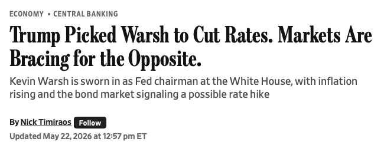

```{r}
#| label: setup
#| include: false

library(ggplot2)
library(dplyr)
library(scales)
library(knitr)
library(kableExtra)

# IU color palette
iu_crimson <- "#990000"
iu_cream <- "#EDEBEB"
iu_gray <- "#535054"
iu_light_gray <- "#7E7E7E"
iu_dark_text <- "#2C3E50"
iu_green <- "#1B5E3F"
iu_navy <- "#1F3A5F"
iu_gold <- "#B8860B"

theme_ipe <- function(base_size = 20) {
  theme_minimal(base_size = base_size) +
    theme(
      plot.title = element_text(color = iu_crimson, face = "bold", size = rel(1.2),
                                margin = margin(t = 5, b = 5)),
      plot.subtitle = element_text(color = iu_gray, size = rel(0.9),
                                   margin = margin(b = 10)),
      plot.caption = element_text(color = iu_light_gray, size = rel(0.7),
                                  hjust = 0, margin = margin(t = 10)),
      axis.title = element_text(color = iu_dark_text, size = rel(0.9)),
      axis.title.x = element_text(margin = margin(t = 8)),
      axis.title.y = element_text(margin = margin(r = 8)),
      axis.text = element_text(color = iu_gray, size = rel(0.8)),
      panel.grid.minor = element_blank(),
      panel.grid.major = element_line(color = "#E5E5E5", linewidth = 0.4),
      legend.position = "bottom",
      legend.title = element_text(size = rel(0.85)),
      legend.text = element_text(size = rel(0.8)),
      plot.margin = margin(t = 8, r = 12, b = 20, l = 12)
    )
}
```

## Today's Plan

::: {.callout-important appearance="minimal" icon=false}
## Today's Big Question
[**Who wants a strong currency, who wants a weak one — and whose preferences become policy?**]{style="font-size: 1.4em; line-height: 1.4;"}
:::

```{r}
#| label: tbl-plan

plan <- data.frame(
  Section = c("1 · From Mechanics to Preferences",
              "2 · Two Policy Choices: Level and Regime",
              "3 · The Preference Map",
              "4 · The Three Society-Centered Models",
              "5 · Case Workshop: Germany vs. Greece",
              "6 · Bridge to the State-Centered View"),
  Cover = c("Recall appreciation, regimes, the trilemma — and add real vs. nominal rates",
            "The strong-vs-weak question and the fixed-vs-floating question are distinct",
            "Which sectors want which currency, and why labor is not one bloc",
            "Electoral, partisan, and sectoral accounts of who gets their way",
            "Why one ECB policy produced opposite politics in two countries",
            "Why governments sometimes adopt policies no group seems to want")
)

kable(plan, col.names = c("Section", "What we'll cover"),
      align = c("l", "l")) %>%
  kable_styling(font_size = 24, full_width = TRUE) %>%
  row_spec(0, bold = TRUE, color = "white", background = iu_crimson) %>%
  column_spec(1, bold = TRUE, color = iu_crimson, width = "42%") %>%
  column_spec(2, width = "58%")
```

::: {.notes}
A brief orientation. It's Thursday, so we open with a short in-class writing prompt, then run the lecture and the student article presentation, with a case workshop in the middle. Where are we in the arc? Monday and Tuesday gave us the international monetary system — the mechanics on Monday, the international politics of cooperation and conflict on Tuesday. Today and Friday turn inward, to the *domestic* politics of monetary and exchange-rate policy. Today is the society-centered approach: we explain policy by tracing it back to the domestic groups it helps and hurts. Friday is the state-centered counterargument. This is the exact same analytical move we made for trade politics in Chapter 4, now applied to money — that parallel is the pedagogical point, and I want you to feel it. Monday's deck ended by establishing that every exchange-rate level creates winners and losers, and it explicitly handed off the question of which groups organize around those gains and losses to today. So today we pay that off. The plan has six moves. First, a tight terminology block to make sure the mechanics are loaded, plus one new concept — real versus nominal exchange rates. Second, a distinction students must hold onto: there are two separate policy questions, the level question and the regime question. Third, the preference map — who wants what. Fourth, the three models — electoral, partisan, sectoral — each a different account of how preferences become policy. Fifth, a case workshop on Germany and Greece in the eurozone. And sixth, the bridge to Friday. Hold the Big Question throughout: it is easy to say who *wants* a strong or weak currency; the hard part is whose preferences actually win.
:::


## Beginning reflection

::: {.callout-important appearance="minimal" icon=false}
[**Writing prompt.** Identify **one domestic group that benefits from a strong domestic currency** and **one that benefits from a weak one.** Explain *why* in each case.]{style="font-size:1.3em; color:#535054;"}
:::


::: {.notes}
Before any lecturing, take about ten minutes and write. The prompt is deliberately simple: name one domestic group that benefits from a strong currency and one that benefits from a weak one, and explain why in each case. Submit it via Canvas before we start. I want you working from Monday's mechanics — you already know that a stronger currency makes imports cheaper and exports dearer, and a weaker currency does the reverse. The trap I want you to avoid is the intuition that "strong" must be good and therefore popular. A strong currency is genuinely good for some groups and genuinely bad for others, and the whole point of today is to be precise about which is which and why. Don't worry about naming the formal models yet; just reason from who buys what and who sells what. We will come straight back to what you wrote when we build the preference map, because your answers are, in effect, the raw material of the society-centered approach.
:::


# From Mechanics to Preferences {background-color="#990000"}

::: {style="text-align:center; margin-top:-0.2em;"}
[Section 1]{style="font-size:0.6em; color:#EDEBEB; letter-spacing:0.15em;"}
:::


## Terminology

```{r}
#| label: tbl-terms

tm <- data.frame(
  term = c("Appreciation / depreciation",
           "Fixed / floating / managed",
           "The trilemma",
           "Real vs. nominal exchange rate"),
  what = c("A currency strengthens (buys more foreign money) / weakens (buys less). \"Strong currency\" = appreciation",
           "Price set by the government (peg), by the market (float), or a blend the central bank steers (managed)",
           "Fixed rate, free capital, monetary autonomy — a government can hold at most two of the three",
           "The nominal rate is the posted price; the real rate adjusts for relative inflation — what actually buys what")
)

kable(tm, col.names = c("Concept", "What you need to recall"),
      align = c("l", "l")) %>%
  kable_styling(font_size = 27, full_width = TRUE) %>%
  row_spec(0, bold = TRUE, color = "white", background = iu_crimson) %>%
  row_spec(1:4, extra_css = "padding-top: 11px; padding-bottom: 11px; line-height: 1.3;") %>%
  column_spec(1, bold = TRUE, color = iu_crimson, width = "34%") %>%
  column_spec(2, width = "66%")
```

::: {.callout-tip appearance="minimal" icon=false}
[The one term that trips people up: **"strong currency" sounds desirable, but it is appreciation** — and appreciation *hurts* exporters and import-competing producers. So, not everyone wants a strong currency]{style="font-size:1.3em; color:#535054;"}
:::

::: {.notes}
Most of you arrive shakier on exchange-rate mechanics than on trade, so let me load the vocabulary quickly and then we move. Appreciation and depreciation: a currency appreciates when it strengthens, meaning one unit buys more foreign money, and it depreciates when it weakens. The phrase "strong currency" just means appreciation — keep that link, because it is the single most common source of confusion. The regimes: a fixed rate, or peg, is set by the government, which buys and sells its own currency to hold the target; a floating rate is set by the market; and a managed float is the hybrid most countries actually run, where the market mostly sets the price but the central bank steps in. The trilemma, in one line, because it organizes the whole unit: a government can hold at most two of three goals — a fixed exchange rate, free movement of capital, and an independent monetary policy. We proved that on Monday and we will lean on it again in a moment when we separate the level question from the regime question. And then one genuinely new term, which I will give its own slide because it matters: the distinction between the nominal exchange rate and the real exchange rate. The callout names the trap to watch: "strong" sounds good, the way "winning" sounds good, but a strong currency is appreciation, and appreciation is precisely what hurts exporters and import-competing producers. Every time we talk about who wins and loses today, check the direction of the move before you decide who is happy.
:::


## The One New Term: Real vs. Nominal

::: {.columns}
::: {.column width="55%"}

The **nominal** exchange rate is the price you see posted: \$1 buys ¥150.

The **real** exchange rate adjusts that price for **relative inflation** at home vs. abroad — it tells you what your money *actually buys* in real goods.

::: {.callout-important appearance="minimal" icon=false}
A currency can be **stable in nominal terms yet steadily overvalued in real terms** if domestic prices rise faster than trading partners'.

**Domestic inflation drives a wedge** between the posted rate and the real, competitive rate.
:::

:::
::: {.column width="45%"}

::: {.callout-tip appearance="minimal" icon=false}
**Why this matters for the politics.** Exporters care about the *real* rate — their competitiveness. A government can hold a nominal peg while domestic inflation quietly erodes the real rate and squeezes the tradable sector. 

This also increases the real cost of debt service if borrowing is done in a third currency (usually USD).
:::

:::
:::

::: {.notes}
Here is the one concept I am adding to your toolkit today, because the society-centered story depends on it. The nominal exchange rate is the number you see quoted — one dollar buys a hundred and fifty yen. The real exchange rate takes that nominal price and adjusts it for relative inflation: how fast prices are rising at home versus abroad. The real rate is what tells you what your money actually commands in real goods and, crucially, how competitive your producers are. Why does the gap between them matter? Because domestic inflation drives a wedge between the two. Imagine a country holds its nominal exchange rate dead steady against the dollar — a hard peg — but its domestic inflation runs well above U.S. inflation year after year. On paper, nothing moves. In real terms, that country's goods are getting more and more expensive relative to American goods; the currency is becoming steadily overvalued in real terms even though the posted rate never budged. The exporters feel it directly: their costs rise in their own currency while the price they can charge abroad is pinned by the peg, so their margins get crushed. They care about the real rate, not the nominal one, because the real rate is their competitiveness. This is not an abstraction — it is the mechanism behind several of the fixed-rate crises we touched on Monday. A peg can look perfectly defensible on paper while the real exchange rate quietly prices the country's tradable sector out of world markets, and the political pressure that builds from that squeeze is part of what eventually breaks the peg. So when we talk about who wants a "weak" currency, what they really want, precisely stated, is a competitive real exchange rate.
:::


# Two Policy Choices: Level and Regime {background-color="#990000"}

::: {style="text-align:center; margin-top:-0.2em;"}
[Section 2]{style="font-size:0.6em; color:#EDEBEB; letter-spacing:0.15em;"}
:::


## Keep Two Questions Separate

**Monetary and exchange-rate policy reflect domestic distributional conflict.** Different groups want different things; coalitions decide who wins. But "what they want" splits into **two distinct questions**.

```{r}
#| label: tbl-two-questions

tq <- data.frame(
  q = c("The LEVEL question", "The REGIME question"),
  ask = c("Should the currency be strong or weak?",
          "Should the rate be fixed or floating?"),
  about = c("Competitiveness and purchasing power — who exports, who imports, who consumes",
            "Stability vs. monetary autonomy — who is hurt by volatility, who needs domestic policy room"),
  model = c("SECTORAL model",
            "ELECTORAL and PARTISAN models")
)

kable(tq, col.names = c("Question", "It asks", "It is really about", "Microfoundations"),
      align = c("l", "l", "l", "l")) %>%
  kable_styling(font_size = 24, full_width = TRUE) %>%
  row_spec(0, bold = TRUE, color = "white", background = iu_crimson) %>%
  row_spec(1:2, extra_css = "padding-top: 12px; padding-bottom: 12px; line-height: 1.3;") %>%
  column_spec(1, bold = TRUE, color = iu_crimson, width = "18%") %>%
  column_spec(2, width = "24%") %>%
  column_spec(3, width = "36%") %>%
  column_spec(4, width = "22%")
```

::: {.callout-tip appearance="minimal" icon=false}
[A group can want a **weak** currency (level) *and* a **fixed** rate (regime) at once — exporters often do.]{style="font-size:1.3em; color:#535054;"} 
:::

::: {.notes}
Before we get to the models, I need you to hold a distinction that students fuse every single year, and the fusion wrecks their analysis. The chapter's core claim is straightforward: monetary and exchange-rate policy reflect domestic distributional conflict — different groups want different things, and political coalitions decide whose preference becomes policy. But "what a group wants" is not one thing; it is two separate questions, and they do not have to move together. The first is the level question: should the currency be strong or weak? That question is about competitiveness and purchasing power — it pits exporters and import-competing producers, who want it cheap, against consumers and non-traded sectors, who want it strong so their money buys more. The second is the regime question: should the rate be fixed or floating? That is a different axis entirely — it is about the trade-off between stability and monetary autonomy. A group that is badly hurt by exchange-rate volatility wants a fixed rate for predictability; a group that needs the government to have room to run domestic policy wants a float. Now watch why these must stay separate: a single group can have preferences on both axes that point in directions that seem to conflict if you have collapsed them into one. Export-oriented producers are the cleanest example — they want a weak currency on the level question *and* a fixed rate on the regime question, because they want it cheap and they want it stable so volatility does not disrupt their contracts. If you have smashed level and regime into a single "what kind of currency policy do they want" question, that combination looks like a contradiction. It is not. As a rough map: the sectoral model speaks most directly to the level question, while the electoral and partisan models are built around the regime question and the monetary-autonomy it protects. Keep the two axes apart and the three models will slot into place cleanly.
:::


# The Preference Map {background-color="#990000"}

::: {style="text-align:center; margin-top:-0.2em;"}
[Section 3]{style="font-size:0.6em; color:#EDEBEB; letter-spacing:0.15em;"}
:::


## Who Wants What, and Why

```{r}
#| label: tbl-pref-map

pm <- data.frame(
  grp = c("Tradable sector (exporters, import-competing manufacturing)",
          "Non-tradable sector (services, retail, construction)",
          "Financial sector",
          "Wage earners"),
  pref = c("Weak / competitive currency",
           "Strong / appreciated currency",
           "Stable, predictable policy",
           "Depends on the employer's sector"),
  why = c("Competitiveness — cheaper exports abroad, costlier imports at home",
          "Purchasing power — cheaper imported inputs and consumer goods",
          "Investment certainty; inflation erodes the value of nominal claims",
          "Labor in steel wants what steel wants; labor in retail wants what retail wants")
)

kable(pm, col.names = c("Group", "Prefers", "Why"),
      align = c("l", "l", "l")) %>%
  kable_styling(font_size = 25, full_width = TRUE) %>%
  row_spec(0, bold = TRUE, color = "white", background = iu_crimson) %>%
  row_spec(1:4, extra_css = "padding-top: 11px; padding-bottom: 11px; line-height: 1.28;") %>%
  column_spec(1, bold = TRUE, color = iu_crimson, width = "34%") %>%
  column_spec(2, width = "24%") %>%
  column_spec(3, width = "42%")
```


::: {.notes}
This is the heart of the section, so slow down with me on the table. Four groups. The tradable sector — exporters and the manufacturers who compete against imports — wants a weak, competitive currency, because a cheaper currency makes their exports more affordable abroad and makes the imports they compete against more expensive at home. That is the competitiveness logic, and it is about the real exchange rate we just defined. The non-tradable sector — services, retail, construction, the parts of the economy that sell domestically — wants a strong, appreciated currency, because they do not export, so competitiveness is not their concern; what they care about is purchasing power, and a strong currency makes the imported inputs and consumer goods they buy cheaper. The financial sector wants, above all, stable and predictable policy — investment certainty — and it is hostile to inflation because inflation erodes the real value of the nominal claims, the loans and bonds, that are its stock in trade. We will see that finance is actually cross-pressured on the level question, but on stability it is clear. Now the row I most want you to sit with: wage earners. The instinct, every year, is to write down a single "labor" preference, as if all workers want the same currency policy. They do not, and resisting that instinct is the whole pedagogical payoff of this chapter. A worker's currency interest is inherited from the sector of their employer. A steelworker in an export-exposed mill has the same interest as the mill — a weak, competitive currency that keeps the firm selling and keeps them employed. A retail clerk works in a non-traded business and benefits from the strong currency that makes the goods on the shelves cheaper. Same factor of production, labor, opposite preferences. The tradable/non-tradable cut runs straight through the working class, not just through capital. So when a politician says they are acting "for workers," ask: which workers? The answer is usually a coalition of some workers and some firms in the same sector, against another cross-class sectoral coalition — and that is exactly the sectoral logic we build to in a few slides.
:::


## A Stronger Dollar: Winners and Losers

```{r}
#| label: fig-strong-dollar
#| fig-width: 12.5
#| fig-height: 4.8
#| out-width: "82%"
#| fig-alt: "Diverging bar chart of who is helped versus hurt by a dollar appreciation. Helped, to the right of zero: a U.S. tourist in Tokyo, a U.S. importer of cars and electronics, and a U.S. shopper buying imports. Hurt, to the left of zero: a U.S. soybean farmer who exports, and a U.S. factory competing with imports. The chart is illustrative of the direction of the effect, not a measured dataset."

gd <- data.frame(
  group = c("U.S. tourist in Tokyo", "U.S. importer (cars, electronics)", "U.S. shopper buying imports",
            "U.S. soybean farmer (exporter)", "U.S. factory competing with imports"),
  effect = c(2.4, 2.0, 1.6, -2.2, -1.8),
  sign = c("Helped by a strong dollar", "Helped by a strong dollar", "Helped by a strong dollar",
           "Hurt by a strong dollar", "Hurt by a strong dollar")
)
gd$group <- factor(gd$group, levels = gd$group[order(gd$effect)])

ggplot(gd, aes(effect, group, fill = sign)) +
  geom_col(width = 0.62) +
  geom_vline(xintercept = 0, color = iu_gray, linewidth = 0.7) +
  annotate("text", x = 2.9, y = 5.9, label = "imports cheaper →", color = iu_green,
           fontface = "bold", size = 4, hjust = 1) +
  annotate("text", x = -2.9, y = 5.9, label = "← exports pricier abroad", color = iu_crimson,
           fontface = "bold", size = 4, hjust = 0) +
  scale_fill_manual(values = c("Helped by a strong dollar" = iu_green,
                               "Hurt by a strong dollar" = iu_crimson), name = NULL) +
  scale_x_continuous(limits = c(-3.3, 3.3), breaks = NULL) +
  scale_y_discrete(expand = expansion(add = c(0.6, 1.4))) +
  labs(title = "A stronger dollar creates winners and losers at home",
       subtitle = "Direction of the effect of a dollar appreciation ($1: ¥100 → ¥150) — illustrative",
       x = NULL, y = NULL,
       caption = "Illustrative of the direction and rough magnitude of a dollar appreciation, not a measured dataset.") +
  theme_ipe(base_size = 16) +
  theme(panel.grid.major.y = element_blank(), legend.position = "bottom")
```


[🎧 **This week's podcast — *The Indicator* (Planet Money), "The Mighty US Dollar":** the same question in plain terms — who wins and who loses when the dollar is strong.]{style="font-size:0.7em; color:#535054;"}

::: {.notes}
This is the figure that connects your two-minute write to the framework, and it is the same scenario from Monday — a dollar appreciation, one dollar going from a hundred yen to a hundred and fifty. Read it as a map of winners and losers. To the right of the line, helped by the stronger dollar: the U.S. tourist in Tokyo, whose dollars now stretch further; the importer of cars and electronics, whose foreign goods just got cheaper; and the ordinary shopper buying imports. To the left, hurt: the soybean farmer who exports, whose beans just got far more expensive for Japanese buyers, and the domestic factory competing against imports that are now cheaper in the U.S. market. One caution on how to read the bars: they show the direction and rough relative magnitude of the effect — this is an illustrative chart of who gains and who loses, not a measured dataset, and the caption says so. The substantive point is in the callout, and it is the bridge to the sectoral model. Notice what actually sorts the winners from the losers. It is not capital versus labor, and it is not rich versus poor. It is which side of the tradable line you sit on. The losers are the tradable sector — the exporter and the import-competing producer — and that loss falls on the owners *and* the workers of those firms alike. The winners are the consumers and importers, the non-traded side. So this picture is already telling you the deep result of the chapter: currency politics cleaves the economy by sector, along the tradable/non-tradable seam, and that cleavage cuts across the usual class lines. Now I want to line these same groups up as two opposing coalitions, so the coalition structure becomes visible.
:::


## From a List to Two Coalitions

```{r}
#| label: fig-sector-2x2
#| fig-width: 11
#| fig-height: 5.4
#| out-width: "94%"
#| fig-alt: "Currency politics drawn as a tug-of-war between two cross-class coalitions. On the left, the tradable sector — exporters and import-competing firms and their workers — pulls the currency toward weak and competitive. On the right, the non-tradable sector — services and retail — together with consumers, pulls toward a strong currency with more purchasing power. In the center, above the contested exchange-rate level, the financial sector is the swing group: it wants stability and takes no fixed side on the level."

camps <- data.frame(
  xmin = c(0.2, 6.6), xmax = c(3.4, 9.8),
  ymin = c(0.6, 0.6), ymax = c(3.9, 3.9),
  fill = c("#F2E2E2", "#DEE7EE"),
  border = c(iu_crimson, iu_navy)
)

ggplot() +
  geom_rect(data = camps, aes(xmin = xmin, xmax = xmax, ymin = ymin, ymax = ymax,
                              fill = fill, color = border), linewidth = 1.3) +
  scale_fill_identity() +
  scale_color_identity() +
  annotate("segment", x = 3.45, xend = 6.55, y = 2.2, yend = 2.2, color = iu_gray, linewidth = 1.1) +
  annotate("point", x = c(3.45, 6.55), y = 2.2, color = iu_gray, size = 2.4) +
  annotate("text", x = 5, y = 2.6, label = "the exchange-rate level", size = 3.4,
           color = iu_gray, fontface = "italic") +
  annotate("text", x = 1.8, y = 3.4, label = "← PULL IT WEAK", color = iu_crimson, fontface = "bold", size = 5.6) +
  annotate("text", x = 1.8, y = 1.95, label = "Tradable sector —\nexporters & import-competing\nfirms, and their workers",
           color = iu_crimson, size = 4.0, lineheight = 0.95) +
  annotate("text", x = 1.8, y = 0.98, label = "(competitiveness)", color = iu_crimson, fontface = "italic", size = 3.5) +
  annotate("text", x = 8.2, y = 3.4, label = "PULL IT STRONG →", color = iu_navy, fontface = "bold", size = 5.6) +
  annotate("text", x = 8.2, y = 1.95, label = "Non-tradable sector —\nservices & retail,\nand consumers",
           color = iu_navy, size = 4.0, lineheight = 0.95) +
  annotate("text", x = 8.2, y = 0.98, label = "(purchasing power)", color = iu_navy, fontface = "italic", size = 3.5) +
  annotate("label", x = 5, y = 4.45,
           label = "FINANCE — the swing\nwants stability; no fixed side on the level",
           fill = "#EEEEEE", color = iu_gray, fontface = "bold", size = 3.6, label.size = 0, lineheight = 0.95) +
  scale_x_continuous(limits = c(0, 10)) +
  scale_y_continuous(limits = c(0.4, 5.2)) +
  theme_void()
```

::: {.callout-important appearance="minimal" icon=false}
A **tug-of-war between two cross-class coalitions:** the tradable sector pulls the currency **down**, non-tradable producers and consumers pull it **up**, and **finance is the swing.** The decisive cleavage is **sectoral, not class.**
:::


::: {.notes}
Now I take the same groups from the winners-and-losers chart and arrange them as what they really are — two opposing coalitions in a tug-of-war over the currency. On the left, pulling for a weak, competitive currency, is the tradable sector: exporters and import-competing firms, together with the workers in those firms. Notice it is cross-class by construction — owners and workers of a tradable firm are on the same side, because a cheaper currency keeps the firm selling and keeps them employed. On the right, pulling for a strong currency, is the non-tradable sector — services and retail — together with consumers, who want the purchasing power a strong currency buys. That is the opposing coalition, also cross-class. In the middle is finance, the swing: as the chapter stresses, finance is genuinely cross-pressured on the *level* — a strong currency lets it buy foreign assets cheaply, but a weak one raises the home-currency value of the foreign returns it holds, and it lends to the very tradable firms a strong currency would hurt. So on the level question finance is, in Oatley's phrase, close to agnostic; what it reliably wants is stability. The takeaway, in the callout: the fight over the currency is a contest between two cross-class sectoral coalitions — tradable-and-weak against non-tradable-and-strong — with finance able to tip it either way. The cleavage runs by sector, not by class. Hold this picture: the three models we turn to next are three different stories about which of these coalitions, or which channel of pressure, actually carries the day. And in a few slides we give this same cleavage its formal form — Frieden's two-by-two — which keeps these groups but adds a second axis, fixed versus floating.
:::


# The Three Society-Centered Models {background-color="#990000"}

::: {style="text-align:center; margin-top:-0.2em;"}
[Section 4]{style="font-size:0.6em; color:#EDEBEB; letter-spacing:0.15em;"}
:::


## The Political Business Cycle

::: {.columns}
::: {.column width="43%"}

Governments value **monetary autonomy** because the economy decides elections. Before a vote, incumbents have an incentive to **loosen policy** — more growth, lower unemployment — and let the **inflation** bill come due later.


::: {style="text-align:center; margin-top:0.6em;"}
{style="width:100%; border:1px solid #ccc;"}
:::

:::
::: {.column width="57%"}

```{r}
#| label: fig-nixon
#| fig-width: 7.6
#| fig-height: 4.9
#| out-width: "99%"
#| fig-alt: "A line chart of U.S. CPI inflation from 1969 to 1975, with a dashed vertical line at the November 1972 election. Inflation falls to about 3 percent in the 1972 election year, held down by wage-and-price controls and expansionary policy, then surges after the election to about 11 percent by 1974."

nx <- data.frame(
  year = 1969:1975,
  infl = c(5.5, 5.7, 4.4, 3.3, 6.2, 11.0, 9.1)
)

ggplot(nx, aes(year, infl)) +
  geom_vline(xintercept = 1972.85, linetype = "dashed", color = iu_navy, linewidth = 0.7) +
  geom_line(color = iu_crimson, linewidth = 1.7) +
  geom_point(color = iu_crimson, size = 2.4) +
  annotate("text", x = 1972.75, y = 12.4, label = "Nov 1972:\nNixon re-elected",
           color = iu_navy, fontface = "bold", size = 3.4, hjust = 1, lineheight = 0.9) +
  annotate("text", x = 1972, y = 1.6, label = "election-year low\n(wage–price controls\n+ expansion)",
           color = iu_gray, fontface = "italic", size = 3.1, lineheight = 0.9) +
  annotate("text", x = 1974, y = 11.0, label = "the bill comes due",
           color = iu_crimson, fontface = "bold", size = 3.6, hjust = 0.5, vjust = -1) +
  scale_x_continuous(breaks = 1969:1975) +
  scale_y_continuous(limits = c(0, 13), labels = function(x) paste0(x, "%")) +
  labs(title = "Loosen before the vote, pay after",
       subtitle = "U.S. CPI inflation, 1969–1975",
       x = NULL, y = NULL,
       caption = "Source: U.S. Bureau of Labor Statistics (annual CPI inflation).") +
  theme_ipe(base_size = 13)
```

:::
:::

::: {.callout-important appearance="minimal" icon=false}
**The same logic, now.** Through 2025 President Trump publicly pressured the Fed to cut rates and attacked Chair Powell; once Powell's term as chair ended he installed his own pick, **Kevin Warsh** (sworn in May 2026), expecting a more accommodative Fed. The political demand for cheap money is perennial — **Friday's chapter asks how central-bank independence is meant to resist it.**
:::

::: {.notes}
The first model is the electoral one, which the chapter also calls the institutional model. Its starting assumption is that governments value monetary autonomy above exchange-rate stability, and the reason is electoral: in democracies, domestic economic conditions — growth, unemployment — shape how voters judge incumbents, so governments want their hands on the monetary levers as elections approach. The prediction is a political business cycle. In the year or so before an election, the incumbent has an incentive to loosen monetary policy, juice growth, and bring unemployment down, accepting somewhat higher inflation or a weaker currency as the price. And critically for our chapter, when that domestic expansion collides with a fixed exchange rate, the electoral model says the incumbent will sacrifice the *peg* to protect the *boom* — they will let the currency go rather than tighten policy and risk a downturn on election day. The lever the incumbent is pulling has a name, and it is the one formal key term in this chapter: the short-run Phillips curve, the inflation–unemployment trade-off, which I will show you with real data on the next slide. Oatley's lead example is Nixon in 1971 and 1972, and it is a clean illustration. Nixon believed, rightly or not, that the 1960 recession had cost him the presidency against Kennedy, and he was determined not to face the voters in 1972 with rising unemployment. So his administration pushed expansionary monetary and fiscal policy into the run-up to the election. The problem was that this expansion was flatly inconsistent with the dollar's Bretton Woods peg to gold — the boom widened the deficit and provoked outflows. Forced to choose, Nixon closed the gold window and devalued the dollar in 1971. Read through the electoral model, the most consequential exchange-rate decision of the postwar era — the collapse of dollar convertibility — was driven by the domestic electoral calendar. That is the model's signature claim: the timing of elections explains the timing of exchange-rate choices. The figure shows the inflation side of the same episode. With wage-and-price controls imposed in 1971 and the Fed running easy, measured inflation was actually pushed *down* into the 1972 election year — to about three percent — precisely when it was most useful politically. Then, after the vote, the controls came off and inflation surged into double digits by 1974: loosen before the election, pay the bill after. One honest caveat to give the students: the 1973 oil embargo did much of the 1974 work, so this illustrates the electoral logic rather than proving it — the cleaner evidence is what Bearce and Tuxhorn bring at the individual level. Then bring it to the present, in the bottom callout, because the model is playing out in real time. Through 2025 President Trump leaned hard on the Fed to cut rates and publicly berated Chair Powell, and when Powell's term as chair ended Trump replaced him with his own nominee, Kevin Warsh — confirmed by the Senate in May 2026 and sworn in that month — chosen in the expectation of an easier, rate-cutting Fed. That is the electoral model live: an elected leader who wants the monetary lever loose and is willing to remake the central bank to get it. And it sets up Friday exactly, because the state-centered chapter's central answer — central-bank independence — exists precisely to insulate that lever from this kind of electoral pressure. So the question I'll leave hanging into Friday is what happens to inflation expectations, and to the currency, when markets begin to doubt that the insulation will hold.
:::


## The Short-Run Phillips Curve (Key Term)

::: {.columns}
::: {.column width="42%"}

::: {.callout-important appearance="minimal" icon=false}
**Phillips Curve** (A. W. Phillips, 1958): a **short-run trade-off** between unemployment and inflation — a government can push unemployment down only by accepting higher inflation.
:::

In a democracy this trade-off means that incumbent politicians can "juice" the economy before an election to make people feel better off, and then deal with inflation later. 

::: {.callout-tip appearance="minimal" icon=false}
**Friday's preview:** the *long-run* curve is **vertical** — the trade-off vanishes over time. Today we use only the short-run version.
:::

:::
::: {.column width="58%"}

```{r}
#| label: fig-phillips
#| fig-width: 7.8
#| fig-height: 5.6
#| out-width: "98%"
#| fig-alt: "Scatter plot of the short-run Phillips curve for the United States in the 1960s. The horizontal axis is the unemployment rate in percent and the vertical axis is the CPI inflation rate in percent. Nine annual points from 1961 to 1969 trace a clean downward-sloping curve: 1961 at 6.7 percent unemployment and 1.0 percent inflation in the upper left, descending to 1969 at 3.5 percent unemployment and 5.5 percent inflation in the lower right. A fitted curve runs through the points."

ph <- data.frame(
  year = 1961:1969,
  unemp = c(6.7, 5.5, 5.6, 5.2, 4.5, 3.8, 3.8, 3.6, 3.5),
  infl  = c(1.0, 1.1, 1.2, 1.3, 1.6, 2.9, 3.1, 4.2, 5.5)
)

ggplot(ph, aes(unemp, infl)) +
  geom_smooth(method = "lm", formula = y ~ poly(x, 2), se = FALSE,
              color = iu_crimson, linewidth = 1.2, linetype = "22") +
  geom_point(color = iu_navy, size = 3.4) +
  geom_text(aes(label = year), vjust = -0.9, hjust = 0.5,
            size = 3.9, color = iu_dark_text, fontface = "bold") +
  scale_x_continuous(limits = c(3, 7.2), breaks = 3:7,
                     labels = function(x) paste0(x, "%")) +
  scale_y_continuous(limits = c(0, 6.4), breaks = seq(0, 6, 2),
                     labels = function(x) paste0(x, "%")) +
  labs(title = "Lower unemployment bought with higher inflation",
       subtitle = "U.S. short-run Phillips curve, 1961–1969",
       x = "Unemployment rate", y = "CPI inflation rate",
       caption = "Source: U.S. Bureau of Labor Statistics (annual civilian unemployment rate; CPI inflation, year-over-year).") +
  theme_ipe(base_size = 15)
```

:::
:::

::: {.notes}
Here is the key term, with real data, because the chapter's own Figure 12.1 makes exactly this point and I want you to see it cleanly. The Phillips curve is named for the British economist A. W. Phillips, who in 1958 first documented a negative relationship between unemployment and the rate of wage change. The version we use is the short-run trade-off between unemployment and inflation: a government can push unemployment lower, but only by accepting higher inflation, and conversely it can wring out inflation only by tolerating more unemployment. The 1960s United States traces this almost perfectly, which is why it is the textbook case. Walk the points with me. In 1961, unemployment sat at six point seven percent with inflation near one percent — upper left, slack economy, quiet prices. Through the decade the economy ran hotter: by 1966 unemployment was down to three point eight and inflation up near three; by 1969, unemployment had fallen to three and a half percent while inflation had climbed to five and a half — lower right. Nine years, a clean downward-sloping curve. The data are annual figures from the Bureau of Labor Statistics — the civilian unemployment rate and year-over-year CPI inflation — and the dashed line is just a fitted curve through the points. Now connect this back to the models. For the electoral model, this curve is the incumbent's lever: in an election year, slide down and to the right, trading a little inflation for lower unemployment and a stronger economy at the polls. For the partisan model, which is next, this same curve is a *menu*: left and right parties simply prefer different points on it. One caution, and it is the bridge to Friday: this clean trade-off is a short-run phenomenon. Chapter 13 will show you that in the long run the curve goes vertical — you cannot buy permanently lower unemployment with inflation, you only ratchet inflation up. But that is Friday. Today the short-run curve is exactly the right tool, because elections and partisan terms are short-run horizons.
:::


## The Partisan Model

::: {.columns}
::: {.column width="52%"}

Parties represent **different social bases**, so they choose **different points on the Phillips curve.**

- **Left parties** (Labour, Social Democrats, U.S. Democrats) — tied to organized labor, weight **unemployment**: looser policy, tolerate inflation, accept a **weaker / floating** currency
- **Right parties** (Conservatives, the financial sector, wealth-holders) — weight **inflation / price stability**: tighter policy, a **stronger, more stable** currency

:::
::: {.column width="48%"}

::: {.callout-important appearance="minimal" icon=false}
**Empirically, left governments have often pursued stability over inflation:** 

- **Mitterrand's** Socialist government adopted the hard-currency *franc fort* in 1983
- Parts of the **German left** supported an independent, inflation-averse Bundesbank
:::

::: {.callout-tip appearance="minimal" icon=false}
The lesson: 

- **sectoral coalitions, not monolithic parties, drive outcomes.** 
- Stating preferences is easy; the hard problem is **aggregating** competing preferences into a single policy.
:::

:::
:::

::: {.notes}
The partisan model keeps the Phillips curve but reads it as a menu that different parties order from differently, because they answer to different social bases. Left parties — the British Labour Party, continental Social Democrats, the U.S. Democrats — have historically been tied to organized labor, and labor's central concern is employment and weekly wages, not the real value of accumulated financial wealth. So left governments weight unemployment heavily: they run looser monetary policy, tolerate more inflation, and are correspondingly more willing to let the currency weaken or float to keep that domestic room. Right parties — the Conservatives, parties close to the financial sector and to wealth-holders — weight inflation and price stability, because inflation erodes the value of the financial assets their base holds. So they run tighter policy and favor a stronger, more stable currency. That is the clean version, and the chapter shows it has real empirical support across postwar democracies. But — and this is where I want you to engage critically — the clean version breaks on its most famous cases, and the breaks are instructive. Take Mitterrand. A Socialist, elected in 1981, who immediately did exactly what the model predicts: expansionary policy, reflation, devalue the franc three times to protect the boom. Textbook left behavior. And then, in 1983, the same Socialist government reversed course completely and adopted the *franc fort* — the "strong franc" — a hard-currency policy of defending the franc's place in the European Monetary System through austerity. A left government choosing the quintessential right-wing currency policy. Or take the German left: significant parts of the SPD came to support the fiercely independent, inflation-averse Bundesbank. Why do these happen? Because parties are not monoliths that mechanically translate an ideology into policy. They sit atop coalitions of sectoral interests, and they operate inside international constraints — Mitterrand's choice in 1983 was driven by the bind of the EMS and capital mobility, the trilemma biting, plus a French export sector and financial sector that could not tolerate continued devaluation. The lesson in the callout is the one I most want you to carry: preferences are the easy part. Every group's preference is fairly predictable. The hard, genuinely political part is aggregation — how a welter of sectoral preferences gets bundled into a coalition that actually captures the government and gets its policy adopted. Parties are one channel for that aggregation, but they are porous, and when sectoral pressure and international constraint cut against partisan ideology, the sectors and the constraints usually win.
:::


## The Sectoral Model

::: {.columns}
::: {.column width="40%"}

Exchange-rate policy reflects **competition among sectors sorted by their exposure to trade** — firms *and* their workers together. Each sector has a preference on **both** axes. (Frieden 2014)

This is the formal version of the **preference map** from earlier — the same cleavage, now with the **fixed-vs-floating** axis added.

::: {.callout-important appearance="minimal" icon=false}
**Oatley's caveats:**

1. Firms can **hedge** currency risk with forward markets — so volatility is less damaging than the model assumes
2. In **global value chains**, many "exporters" rely on **imported inputs** — a weak currency *raises* their costs
:::

:::
::: {.column width="60%"}

```{r}
#| label: fig-frieden-2x2
#| fig-width: 7.6
#| fig-height: 6.4
#| out-width: "98%"
#| fig-alt: "A two-by-two table of sectoral exchange-rate preferences after Frieden. Columns are preferred exchange-rate stability, high on the left (a fixed rate) and low on the right (floating). Rows are preferred currency level, high at top (strong) and low at bottom (weak). Top-left fixed-and-strong is empty. Top-right floating-and-strong holds the non-tradable and financial sectors. Bottom-left fixed-and-weak holds export-oriented producers. Bottom-right floating-and-weak holds import-competing producers."

cells <- data.frame(
  x = c(1, 2, 1, 2),
  y = c(2, 2, 1, 1),
  text = c("(empty)\nno sector wants\nstrong + fixed",
           "NON-TRADABLE\n& FINANCIAL\n(strong; floating\nfor policy room)",
           "EXPORT-\nORIENTED\n(weak + fixed:\ncompetitive\n& stable)",
           "IMPORT-\nCOMPETING\n(weak; floating\nfor policy room)"),
  col = c(iu_light_gray, iu_navy, iu_crimson, iu_gold)
)

ggplot(cells) +
  geom_tile(aes(x, y), fill = "white", color = iu_gray, linewidth = 1.0, width = 0.98, height = 0.98) +
  geom_text(aes(x, y, label = text, color = col), fontface = "bold", size = 4.5, lineheight = 0.95) +
  scale_color_identity() +
  annotate("text", x = 1.5, y = 2.74, label = "Preferred exchange-rate stability",
           fontface = "bold", size = 4.4, color = iu_dark_text) +
  annotate("text", x = 1, y = 2.56, label = "High (fixed)", size = 3.9, color = iu_gray) +
  annotate("text", x = 2, y = 2.56, label = "Low (floating)", size = 3.9, color = iu_gray) +
  annotate("text", x = 0.30, y = 1.5, label = "Preferred level",
           fontface = "bold", size = 4.4, color = iu_dark_text, angle = 90) +
  annotate("text", x = 0.45, y = 2, label = "Strong", size = 3.9, color = iu_gray, angle = 90) +
  annotate("text", x = 0.45, y = 1, label = "Weak", size = 3.9, color = iu_gray, angle = 90) +
  scale_x_continuous(limits = c(0.25, 2.6)) +
  scale_y_continuous(limits = c(0.45, 2.85)) +
  coord_equal() +
  labs(title = "The sectoral model (Frieden)") +
  theme_void() +
  theme(plot.title = element_text(color = iu_crimson, face = "bold", hjust = 0.5,
                                  size = rel(1.3), margin = margin(b = 4)))
```

:::
:::

::: {.notes}
The third model is the sectoral one, and Jeffry Frieden's *Currency Politics* is the anchor text. Unlike the electoral and partisan models, the sectoral model does not assume every government values monetary autonomy above all; instead, it takes the four sectors and gives each a preference on *both* of our axes — stability and level — and reads exchange-rate policy as the outcome of competition among them. The two-by-two is Frieden's, reproduced as the chapter's Figure 12.2, and it is worth walking cell by cell. Columns are preferred stability — fixed on the left, floating on the right. Rows are preferred level — strong on top, weak on the bottom. Top-left, strong and fixed, is empty: no major sector wants both a strong currency and a hard peg. The export-oriented sector sits bottom-left — weak and fixed — because they want a competitive currency to sell abroad *and* stability to keep their international contracts predictable; they are deeply enough engaged in trade that they will surrender monetary autonomy to get the fixed rate. Import-competing producers sit bottom-right — they also want it weak, to beat back imports, but they are more domestically oriented, so they keep a preference for floating and the policy room it brings. And top-right, strong and floating, holds the non-tradable sector and, with caveats, financial services: they want a strong currency for purchasing power and a float so the government retains monetary autonomy to manage the domestic economy. This is the cleanest, most predictive of the three models for exchange-rate policy specifically. But Oatley raises two caveats that I want you to take seriously, because they dilute the simple story, and they are in the callout. First, the model may overstate how much exporters fear volatility, because firms can hedge currency risk in forward markets — they can lock in exchange rates contractually, so day-to-day volatility hurts less than the model implies. Second, and more important in a modern economy, the model may overstate how much the tradable sector wants a weak currency, because in global value chains many so-called exporters are also heavy importers of intermediate inputs. If you assemble a product from imported components, a weak currency raises your input costs even as it helps your export price — the two effects partly cancel, and a firm's net preference becomes ambiguous. As production fragments across borders, this caveat bites harder. Finally, the empirical frontier: Bearce and Tuxhorn, 2017, in the American Journal of Political Science, take the sectoral logic down to the individual level and find support for it — people whose employers are export-oriented show a measurably reduced preference for domestic monetary autonomy, which is exactly what the sectoral model predicts at the micro level. That is a candidate for your reading, and it is the kind of evidence that tells us the sectoral story is not just a story.
:::


# Case Workshop: Germany vs. Greece {background-color="#990000"}

::: {style="text-align:center; margin-top:-0.2em;"}
[Section 5]{style="font-size:0.6em; color:#EDEBEB; letter-spacing:0.15em;"}
:::


## One Monetary Policy, Opposite Politics

::: {.callout-important appearance="minimal" icon=false}
## The puzzle
Germany and Greece share **one currency and one ECB monetary policy.** Yet through the 2010–2015 crisis, the same policy generated **opposite political pressures** in the two countries. **Why?**
:::

::: {.columns}
::: {.column width="50%"}

### Work in small groups
1. For **each** country, name **3–4 domestic groups** and assign each a currency preference (level *and* regime).
2. Where does each country sit in the **tradable / non-tradable** and **supply-chain** structure?
3. Use that to explain why one ECB policy felt **too tight** in one place and **too loose** in the other.

:::
::: {.column width="50%"}

### Society-centered hints
- Germany: a large, competitive **export** sector inside a shared currency it cannot revalue away — the euro is *weak* for German exporters
- Greece: a smaller tradable base, more **non-traded** and import-reliant — the same euro is *strong* in real terms, and austerity falls on domestic groups
- The euro **removed each country's national monetary lever** (trilemma: members trade away autonomy)

:::
:::

::: {.notes}
This is the workshop slide, and I will set it up and then hand it to you in small groups for about fifteen minutes before we debrief. The puzzle is genuinely sharp. Germany and Greece use the same currency, the euro, and are governed by a single monetary policy set by the European Central Bank. By the logic of "one policy," you might expect their currency politics to look similar. They looked opposite. Through the 2010–2015 crisis, the same ECB stance generated very different domestic political pressures in the two countries — Germans experienced the euro and ECB policy as broadly comfortable, even advantageous, while Greeks experienced it as a vise. Your job in groups is to explain that with the society-centered toolkit, not with national stereotypes. Three tasks: first, for each country, name three or four real domestic groups and assign each a preference on both axes, level and regime. Second, locate each country in the tradable/non-tradable structure and in the European supply chain — who exports, who imports, who produces non-traded services. Third, use that structure to explain why one shared policy felt too tight in one country and too loose in the other. Let me seed the intuition without doing the work for you. Germany has a large, highly competitive export sector, and here is the key insight: inside the euro, Germany cannot let its currency appreciate to reflect that competitiveness, the way a free-floating Deutsche Mark surely would have. So the euro is, in effect, a permanently *weak* currency for German exporters — a structural gift to the tradable coalition that dominates German political economy. Greece is the mirror image: a smaller tradable base, a larger non-traded and import-reliant economy, and wages and prices that had risen faster than Germany's. For Greece, the same euro is *strong* in real terms — recall our real-versus-nominal wedge from the first section — so Greek producers are uncompetitive at a rate they cannot devalue, and because the trilemma means euro members have surrendered the national monetary lever entirely, the only adjustment channel left is internal devaluation: austerity, wage cuts, unemployment, falling on Greek domestic groups. So the deep answer is that the same nominal monetary policy maps onto two completely different domestic sectoral structures, and therefore lands on different coalitions with different force. This is the society-centered approach doing real explanatory work on the defining European crisis of the decade — and it is also a preview of why Friday's state-centered chapter asks what happens when no domestic coalition can deliver the adjustment a fixed commitment requires.
:::


# Bridge to the State-Centered View {background-color="#990000"}

::: {style="text-align:center; margin-top:-0.2em;"}
[Section 6 · Looking ahead to Friday]{style="font-size:0.6em; color:#EDEBEB; letter-spacing:0.15em;"}
:::


## Student Presentation

::: {.callout-important appearance="minimal" icon=false}
## Over to today's presenter
**Bearce & Tuxhorn (2017)** — *"When Are Monetary Policy Preferences Egocentric? Evidence from American Surveys and an Experiment"*  ·  *AJPS* 61(1)
:::

[**Presenter:** ______________________  ·  Q&A and class discussion to follow]{style="font-size:0.85em; color:#535054;"}

::: {.callout-tip appearance="minimal" icon=false}
The micro-level test of the **sectoral model:** Bearce & Tuxhorn find that Americans whose **employers are export-oriented** show a measurably **reduced preference for monetary autonomy** — individual preferences tracking sectoral exposure, exactly as the model predicts.
:::

::: {.notes}
Hand the floor to today's student presenter on the Bearce and Tuxhorn article, which is the ideal empirical companion to this chapter. In a sentence: it takes the sectoral logic we just built — that exposure to trade shapes what people want from currency policy — and tests it at the level of individual Americans, using surveys and a survey experiment. Their central finding is that people whose employers are export-oriented show a measurably reduced preference for domestic monetary autonomy, which is exactly what the sectoral model predicts once you push it down from firms and sectors to individual workers. So it is the evidence that the sectoral account is not just a plausible story but something detectable in how ordinary people actually answer. I will ask the presenter to lead and to tie the piece back explicitly to the three models — above all the sectoral one — so the presentation reinforces today's framework rather than running parallel to it. Class discussion after. It also pairs with this week's podcast, The Indicator's "The Mighty US Dollar," which makes the same winners-and-losers point in plain terms.
:::


## Recap: Preferences Are Easy, Aggregation Is Hard

::: {.callout-important appearance="minimal" icon=false}
**Today's Big Question —** Who wants a strong currency, who wants a weak one, and **whose preferences end up as policy?**
:::

```{r}
#| label: tbl-models

m <- data.frame(
  model  = c("Electoral", "Partisan", "Sectoral (Frieden)"),
  actor  = c("The incumbent and voters",
             "Parties — left vs. right",
             "Sectors by trade exposure — firms and their workers together"),
  driver = c("Re-election; the macroeconomy decides votes — a political business cycle",
             "Left weights jobs (looser, weaker currency); right weights prices (tighter, stronger)",
             "Tradable (export & import-competing) want it weak; non-traded and finance want it strong"),
  caveat = c("About timing, not which groups; evidence is mixed",
             "Coalitions, not parties, often decide (the franc fort)",
             "Hedging; imported inputs; consumers cut across sectors")
)

kable(m, col.names = c("Model", "Key actor", "Preference driven by", "Watch out for"),
      align = c("l", "l", "l", "l")) %>%
  kable_styling(font_size = 23, full_width = TRUE) %>%
  row_spec(0, bold = TRUE, color = "white", background = iu_crimson) %>%
  row_spec(1:3, extra_css = "padding-top: 9px; padding-bottom: 9px; line-height: 1.25;") %>%
  column_spec(1, bold = TRUE, color = iu_crimson, width = "15%") %>%
  column_spec(2, width = "21%") %>%
  column_spec(3, width = "38%") %>%
  column_spec(4, width = "26%")
```

::: {.callout-tip appearance="minimal" icon=false}
**Next Up:** why adopt policies *no* group is demanding, handing money to unelected central bankers?
:::

::: {.notes}
Let me gather the day around the Big Question — who wants a strong currency, who a weak one, and whose preference becomes policy — using this comparison table of the three society-centered models. Read across the rows. The electoral model puts the action with the incumbent and the voters: governments pull the short-run Phillips curve before elections, a political business cycle, as with Nixon in 1971 — its limit is that it explains timing, not which groups win, and the evidence is mixed. The partisan model moves the actor to parties: the left leans toward jobs and a looser, weaker currency, the right toward price stability and a stronger one — but we complicated that hard with Mitterrand's franc fort and the German left backing the Bundesbank, so the lesson is that coalitions, not party labels, decide. The third is the sectoral model, Frieden's, and here is the one clarification I want to nail down, because we saw it in two pictures and they are the *same* model. The early preference map sorted groups by trade exposure and currency level; Frieden's two-by-two adds the fixed-versus-floating axis — same actors, same logic, two views. And the defining feature of that model, the answer to "where is labor in all this," is that the sectoral model already runs *through* labor: in the specific-factors logic, the owners and the workers of a tradable firm share an interest in a competitive currency, so the cleavage is tradable-versus-non-tradable, not capital-versus-labor. That is why "the workers want X" is the wrong sentence — name the sectoral coalition instead. Its caveats: firms can hedge, global-value-chain "exporters" also import their inputs, and consumers, who want a strong currency for purchasing power, cut across all sectors rather than forming one of their own. And the honest limit of all three, in the callout: each is a theory of interests — of who wants what. None gives us a clean theory of aggregation, the process that turns competing preferences into one adopted policy. Stating preferences is easy; explaining whose wins, and through what institutions, is the hard part this approach leaves open. That gap is Friday's doorway: the state-centered chapter asks why governments adopt policies no domestic group is demanding — above all, why democracies hand monetary policy to unelected, inflation-averse central bankers insulated from precisely the pressures we traced today. For now, let's open it up — pull out what you wrote at the start and place your strong-currency and weak-currency groups onto the map.
:::
