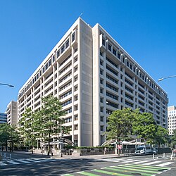

```{r}
#| label: setup
#| include: false

library(ggplot2)
library(dplyr)
library(scales)
library(knitr)
library(kableExtra)

# IU color palette
iu_crimson <- "#990000"
iu_cream <- "#EDEBEB"
iu_gray <- "#535054"
iu_light_gray <- "#7E7E7E"
iu_dark_text <- "#2C3E50"
iu_green <- "#1B5E3F"
iu_navy <- "#1F3A5F"
iu_gold <- "#B8860B"

theme_ipe <- function(base_size = 20) {
  theme_minimal(base_size = base_size) +
    theme(
      plot.title = element_text(color = iu_crimson, face = "bold", size = rel(1.2),
                                margin = margin(t = 5, b = 5)),
      plot.subtitle = element_text(color = iu_gray, size = rel(0.9),
                                   margin = margin(b = 10)),
      plot.caption = element_text(color = iu_light_gray, size = rel(0.7),
                                  hjust = 0, margin = margin(t = 10)),
      axis.title = element_text(color = iu_dark_text, size = rel(0.9)),
      axis.title.x = element_text(margin = margin(t = 8)),
      axis.title.y = element_text(margin = margin(r = 8)),
      axis.text = element_text(color = iu_gray, size = rel(0.8)),
      panel.grid.minor = element_blank(),
      panel.grid.major = element_line(color = "#E5E5E5", linewidth = 0.4),
      legend.position = "bottom",
      legend.title = element_text(size = rel(0.85)),
      legend.text = element_text(size = rel(0.8)),
      plot.margin = margin(t = 8, r = 12, b = 20, l = 12)
    )
}
```

## Today's Plan

::: {.callout-important appearance="minimal" icon=false}
## Today's Big Question
[**Foreign capital is supposed to finance development — so why does it so often end in crisis, and who decides who pays when it does?**]{style="font-size: 1.4em; line-height: 1.4;"}
:::

```{r}
#| label: tbl-plan

plan <- data.frame(
  Section = c("1 · The Development Financing Problem",
              "2 · Institutions as the Answer",
              "3 · Crises, Bailouts, and Conditionality",
              "4 · Imbalances, Adjustment, and Power",
              "5 · Synthesis and Looking Ahead"),
  Cover = c("Why poor countries borrow abroad, and why lending to sovereigns is hard",
            "The World Bank and the IMF: lending where private markets won't",
            "Latin America 1982 and Asia 1997 — who is rescued, on what terms",
            "Reserve hoards, Bretton Woods II, and who adjusts today",
            "The three themes together, the student presentation, and a bridge to coercion")
)

kable(plan, col.names = c("Section", "What we'll cover"),
      align = c("l", "l")) %>%
  kable_styling(font_size = 22, full_width = TRUE) %>%
  row_spec(0, bold = TRUE, color = "white", background = iu_crimson) %>%
  column_spec(1, bold = TRUE, color = iu_crimson, width = "32%") %>%
  column_spec(2, width = "68%")
```

::: {.notes}
A quick orientation, because today's format is unusual. This is a combined session: Chapters 14 and 15 together. Oatley wrote them as a pair — developing countries and international finance, parts one and two — and rather than marching through them chapter by chapter, we are going to organize the day around three themes that run across both. Theme one: the IMF and the World Bank exist to help developing countries grow by solving a commitment problem that would otherwise keep investment capital away from the places that need it most. Theme two: when booms end in crisis, bailouts follow, and bailouts create a distributive fight over who is rescued and on what terms — that is where conditionality lives, and where the Latin American crisis of the 1980s and the Asian crisis of 1997 come in as evidence. Theme three: the crises left behind durable global imbalances, and those imbalances raise the question we ended on last Tuesday — when accounts must eventually balance, who bears the cost of adjustment?

Hold the Big Question the whole way through. Foreign capital should be developmentally good: it lets a poor country invest more than it can save. And yet the history of developing-country finance is a history of crises. Why? And when the crisis comes, who decides whether creditors take losses or citizens absorb austerity? Notice that second half of the question is political, and it is the half the three themes keep answering in different ways.

It is Monday, so we open with the usual in-class writing prompt and there is no quiz today — the last quiz was Friday, and the next assessment is the final. The reading pairing for today is the Ballard-Rosa, Mosley, and Wellhausen article, which one of you is presenting at the end of class, and the Planet Money episode about a hedge fund, a country, and a sailboat. Both will surface repeatedly before we get there.
:::


## Before We Start: A Ten-Minute Write

::: {.callout-important appearance="minimal" icon=false}
**Writing prompt.** You advise the finance minister of a lower-middle-income country. Global interest rates are low, and foreign lenders are eager to extend credit on easy terms. The minister wants to borrow heavily to build ports, power, and rail.

**Do you recommend borrowing? Name three things you would want to know before deciding. And if the loans go bad in five years, who do you expect will bear the cost — the lenders, the government, or the country's citizens?**
:::

::: {.callout-tip appearance="minimal" icon=false}
Write for about **ten minutes** from intuition and from the reading. We will return to your answers when we discuss conditionality — and again in the closing discussion.
:::

::: {.notes}
Before any lecturing, take out a sheet and write for about ten minutes. The scenario: you are advising a finance minister in a lower-middle-income country. World interest rates are low, lenders are enthusiastic, and the minister sees a chance to finance a generation of infrastructure with foreign money. Three tasks. First, make a recommendation: borrow or hold back. Second, and this is where I want most of your effort, name the three things you would want to know before deciding. Push yourself past the obvious. The interest rate matters, yes — but think about what the money will be spent on, whether those projects will earn the foreign exchange needed to service foreign-currency debt, what happens if world interest rates rise, and how long the lenders' enthusiasm is likely to last. Third, the question that will follow us all day: if it goes wrong, who pays? Foreign banks? The government? Taxpayers and wage earners who never signed the loan documents?

The reason I open here is that this is precisely the decision Mexican, Brazilian, and Argentine officials faced in the mid-1970s, and Thai and Korean officials in the early 1990s. In hindsight we know how those episodes ended. But the decision did not look reckless at the time — the money was cheap, the projects looked productive, and refusing foreign capital has real costs too, measured in schools not built and growth foregone. I want you to feel that the choice is hard before we study the wreckage. Keep what you write; we will pressure-test it against the chapters in the conditionality section, and I will ask a few of you to share.
:::


# The Development Financing Problem {background-color="#990000"}

::: {style="text-align:center; margin-top:-0.2em;"}
[Section 1]{style="font-size:0.6em; color:#EDEBEB; letter-spacing:0.15em;"}
:::


## The Savings Gap

::: {.columns}
::: {.column width="46%"}

Rising incomes require **investment** — and investment must be financed out of **savings.**

- Poor countries save little: least-developed countries saved about **13.4%** of national income (1970–2006), against **21.7%** in high-income OECD countries
- Low income → low savings → low investment → low income: a trap
- Foreign capital lets a country **invest more than it saves at home** — each dollar of inflow adds roughly a dollar of investment (Bosworth & Collins 1999)

::: {.callout-tip appearance="minimal" icon=false}
**The record.** Private capital never arrives in a steady stream. Markets swing between excessive caution and exuberance — flooding a country one year, shutting it out the next.
:::

:::
::: {.column width="54%"}

```{r}
#| label: fig-savings-growth
#| fig-width: 8.2
#| fig-height: 5.7
#| out-width: "99%"
#| fig-alt: "A scatter plot of 20 developing economies. The horizontal axis shows gross domestic savings as a percent of GDP, averaged 1990 to 2019; the vertical axis shows average annual real GDP growth over the same period. A dashed fitted line slopes upward. High-savings economies such as China, South Korea, Malaysia, Thailand, and Indonesia sit in the upper right with growth of roughly 4 to 9 percent; low-savings economies such as Kenya, Senegal, and Pakistan sit in the lower left; Mexico, Brazil, Argentina, and South Africa cluster near 18 to 20 percent savings and 2 to 3 percent growth."

sav <- read.csv("data/day13_savings_annual.csv")
gro <- read.csv("data/day13_growth_annual.csv")

sg <- sav %>%
  group_by(country) %>%
  summarise(savings = mean(gds_pct_gdp, na.rm = TRUE), .groups = "drop") %>%
  left_join(gro %>% group_by(country) %>%
              summarise(growth = mean(gdp_growth, na.rm = TRUE), .groups = "drop"),
            by = "country")

nud <- data.frame(
  country = c("South Korea", "Thailand", "Indonesia", "China", "Mexico", "Brazil",
              "Argentina", "South Africa", "Kenya", "Ghana", "Senegal"),
  nx = c(0.5, 0.5, -0.5, -0.5, 0.5, -0.5, 0.4, -0.5, 0.4, 0.4, 0.4),
  ny = c(0.3, -0.25, 0.4, -0.4, -0.3, 0.25, 0.35, -0.35, 0.3, 0.3, -0.35),
  hj = c(0, 0, 1, 1, 0, 1, 0, 1, 0, 0, 0)
)
sg <- left_join(sg, nud, by = "country")

ggplot(sg, aes(savings, growth)) +
  geom_smooth(method = "lm", se = FALSE, color = iu_light_gray,
              linetype = "dashed", linewidth = 0.8) +
  geom_point(data = subset(sg, is.na(nx)), color = iu_gray, size = 2.6, alpha = 0.7) +
  geom_point(data = subset(sg, !is.na(nx)), color = iu_crimson, size = 3.4) +
  geom_text(data = subset(sg, !is.na(nx)),
            aes(x = savings + nx, y = growth + ny, label = country, hjust = hj),
            color = iu_dark_text, size = 3.5, fontface = "bold") +
  scale_x_continuous(labels = function(x) paste0(x, "%")) +
  scale_y_continuous(labels = function(x) paste0(x, "%")) +
  labs(title = "Where savings are high, growth has been fast",
       subtitle = "20 developing economies, averages over 1990–2019",
       x = "Gross domestic savings, % of GDP",
       y = "Real GDP growth, % per year",
       caption = "Source: World Bank, World Development Indicators (gross domestic savings, % of GDP; NY.GDS.TOTL.ZS) and IMF World\nEconomic Outlook via Our World in Data (real GDP growth); annual values averaged over 1990–2019. Retrieved July 2026.") +
  theme_ipe(base_size = 14)
```

:::
:::

::: {.notes}
Start with why a developing country exposes itself to foreign capital at all, because the rest of the day is about the costs, and the benefit has to be clear first. Development requires investment — factories, ports, power grids, schools — and investment has to be financed out of savings. Poor countries, almost by definition, generate little saving: when incomes are low, most income goes to consumption. Oatley reports the comparison from the World Development Indicators: over 1970 to 2006, the least-developed countries saved about thirteen percent of national income, against nearly twenty-two percent in the high-income OECD. That gap is a trap. Low income means low savings, low savings mean low investment, low investment keeps income low. Foreign capital is the escape hatch: if savings can be imported, a country can invest more than it saves domestically and move to a higher growth trajectory.

The chart puts the underlying association in front of the students: each dot is a developing economy, plotting its average savings rate against its average growth rate over 1990 to 2019. The pattern runs upward. China, Korea, Malaysia, Thailand, and Indonesia — the high savers — are also the fast growers; Kenya, Senegal, and Pakistan, saving around ten percent of GDP, grew far more slowly; Mexico, Brazil, Argentina, and South Africa sit in the middle on both dimensions. Walk the logic: if savings finance investment and investment drives growth, this is what you would expect to see — and it is why the savings gap motivates borrowing abroad. Be honest about the limits: this is an association, not a law. Ghana grew respectably on very low measured savings; Korea's savings are partly a consequence of its growth as well as a cause. The correlation does not settle causation. What matters for today is that a finance minister looking at this picture will conclude that scarce domestic savings are a binding constraint — and that foreign capital offers a way to relax it.

And the promise is quantitatively real. Bosworth and Collins found that a dollar of capital inflow produces roughly a dollar of additional investment — foreign capital adds to the savings pool rather than displacing it — and both IMF and World Bank studies from the early 2000s found that countries participating in international financial markets grew faster on average. Rodrik and others add an important caution: foreign capital does not guarantee higher growth. What it provides is the opportunity.

Then the bottom callout, which is the day's whole problem in two sentences. Private capital never flows to developing countries in a steady stream. Markets swing between excessive concern about risk and excessive enthusiasm, so a country is flooded with capital one year and shut out the next. When you hear the case histories later, keep asking: was the problem that these countries used foreign capital, or the rhythm with which it arrived and left? Oatley's answer, and mine, is that the rhythm is at least half the story — and that rhythm is set largely outside the borrowing country.
:::


## Four Channels of Foreign Capital

::: {.columns}
::: {.column width="55%"}

- **Foreign aid** — official development assistance: grants and concessional loans from donor governments and multilateral agencies. In 2020: **$114B bilateral + $47B multilateral**
- **Commercial bank lending** — syndicated loans at market (often floating) rates; the dominant channel in the 1970s
- **FDI and portfolio investment** — ownership of productive assets vs. tradable stocks and bonds; two-thirds to three-quarters of all postwar flows were private
- **Remittances** — money migrants send home to their families: nearly **$702B in 2021**, about **four times** all DAC foreign aid combined

:::
::: {.column width="45%"}

::: {.callout-important appearance="minimal" icon=false}
[**Composition matters as much as volume.** FDI is hard to withdraw; bank loans and portfolio flows can leave in an afternoon.]{style="font-size:0.85em;"}
:::

::: {.callout-tip appearance="minimal" icon=false}
[**Remittances bypass the state entirely** — household to household, and far less volatile than private capital flows.]{style="font-size:0.85em;"}
:::

```{r}
#| label: fig-capital-flows
#| fig-width: 6.6
#| fig-height: 3.5
#| out-width: "98%"
#| fig-alt: "A stacked area chart of capital flows to low- and middle-income countries from 1990 to 2021, in US dollar billions. Four layers: FDI, remittances, portfolio flows (equity plus bonds), and official development assistance. Total flows grow from under 150 billion in 1990 to roughly 1.8 trillion in 2021. FDI and remittances are the largest layers by the 2000s; aid grows slowly and becomes the smallest share; portfolio flows swing widely and briefly turn negative in 2008."

cf <- read.csv("data/day13_capital_flows.csv")
cf_long <- data.frame(
  year = rep(cf$year, 4),
  channel = rep(c("FDI", "Remittances", "Portfolio flows", "Official aid (ODA)"),
                each = nrow(cf)),
  usd_bn = c(cf$fdi_bn, cf$remittances_bn, cf$equity_bn + cf$bonds_bn, cf$oda_bn)
)
cf_long$channel <- factor(cf_long$channel,
                          levels = c("FDI", "Remittances", "Portfolio flows", "Official aid (ODA)"))

ggplot(cf_long, aes(year, usd_bn, fill = channel)) +
  geom_area(alpha = 0.85, color = "white", linewidth = 0.2) +
  scale_fill_manual(values = c("FDI" = iu_crimson, "Remittances" = iu_navy,
                               "Portfolio flows" = iu_gold, "Official aid (ODA)" = iu_green),
                    name = NULL) +
  scale_x_continuous(breaks = c(1990, 2000, 2010, 2021)) +
  scale_y_continuous(labels = function(x) paste0("$", comma(x), "B")) +
  labs(title = "Private flows dwarf aid",
       subtitle = "Capital flows to low- & middle-income countries, US$B, 1990–2021",
       x = NULL, y = NULL,
       caption = "Source: World Bank, World Development Indicators / International Debt Statistics, low- & middle-income aggregate:\nFDI net inflows; personal remittances received; portfolio equity net inflows + bond net flows; net ODA and official aid\nreceived (available through 2021). Commercial bank lending not shown (no comparable series). Retrieved July 2026.") +
  theme_ipe(base_size = 10.5) +
  theme(legend.position = "bottom",
        legend.text = element_text(size = rel(0.85)),
        plot.caption = element_text(size = rel(0.62)))
```

:::
:::

::: {.notes}
Foreign capital comes through four channels, and the differences among them do real analytical work today. First, foreign aid — the formal term is official development assistance — grants and below-market loans from donor governments and from multilateral agencies. The 2020 numbers: about a hundred fourteen billion dollars in bilateral aid from the advanced countries plus forty-seven billion through multilaterals. The United States is the largest donor in absolute terms at roughly thirty-five billion, but among the least generous relative to income — about two-tenths of one percent of national income, compared with three to six times that share for the smaller northern European donors. Keep that pattern in mind for the institutions section, because aid has never been a purely charitable enterprise.

Second, commercial bank lending — syndicated loans, frequently at floating rates, which matters enormously later. This was the channel that dominated the 1970s. Third, foreign direct investment and portfolio investment. You know FDI from Chapters 8 and 9: a firm builds or buys productive assets it controls, which makes it hard to withdraw quickly. Portfolio investment is financial claims — stocks and bonds — which can be sold in an afternoon. Across the postwar period, private flows of these kinds have made up two-thirds to three-quarters of all capital reaching the developing world; aid is the smaller share, contrary to most students' intuitions.

Fourth, remittances, which students consistently underrate. Nearly seven hundred two billion dollars in 2021 — roughly four times all DAC foreign aid combined. India received eighty-three billion, China fifty-nine, with the Philippines, Mexico, Egypt, and Pakistan close behind. Two features make remittances distinctive. They flow household to household, bypassing governments and firms — which means they bypass most of the political economy in this lecture. And they are far less volatile than private capital flows. So notice the callout on composition: because these channels behave so differently under stress, two countries taking in identical totals can face completely different crisis risks. That point is the hinge between this section and everything that follows.

The chart puts thirty years of these channels in one picture, for the developing world as a whole. Three observations to draw out. First, scale: total flows grew from under a hundred fifty billion dollars in 1990 to roughly one point eight trillion in 2021. Second, composition: FDI and remittances are the two big layers from the 2000s onward, and official aid — the green sliver — is the smallest of the four, confirming the point that most capital reaching the developing world is private. Third, behavior: watch the gold layer, portfolio flows. It swings hard year to year and actually turns negative in 2008, when investors pulled equity out of emerging markets during the global crisis — a preview of the volatility argument in section three. One honest caveat for the curious: commercial bank lending, the channel that dominates the 1970s story we tell next, is missing from this chart because no comparable aggregate series exists for the full period; the four channels shown are the ones the World Bank measures consistently, and the aid series currently ends in 2021.
:::


## Petrodollars and the Borrowing Boom

::: {.columns}
::: {.column width="52%"}

How the 1970s made bank lending the main channel of sovereign borrowing:

- 1973 oil shock: Saudi Arabia's surplus jumped from **$2.5B to $23B** in one year
- Exporters deposited the earnings — **petrodollars** — in Western banks
- Banks lent the deposits to developing-country governments: **petrodollar recycling**
- Oil importers borrowed rather than compress imports (~**$260B** in added costs over the decade)

::: {.callout-tip appearance="minimal" icon=false}
[**Debt-service capacity** — the ability to meet principal and interest payments out of export earnings — deteriorated: loans financed projects that earned no foreign exchange. By 1978, debt service took **38%** of Latin America's export revenue.]{style="font-size:0.85em;"}
:::

:::
::: {.column width="48%"}

```{r}
#| label: fig-debt-by-region
#| fig-width: 7.0
#| fig-height: 4.6
#| out-width: "98%"
#| fig-alt: "A stacked area chart of developing-country external debt by region from 1970 to 1990, in US dollar billions. Total debt rises from about 64 billion in 1970 to roughly 1.1 trillion by 1990. Latin America and the Caribbean is the largest layer, climbing steeply through the 1970s to about 273 billion by 1982 and 374 billion by 1990. East Asia and Pacific and Sub-Saharan Africa each grow to roughly 180 to 220 billion by 1990; other developing regions make up the remainder."

dr <- read.csv("data/day13_debt_by_region.csv")
dr$grp <- ifelse(dr$region %in% c("Latin America & Caribbean", "East Asia & Pacific",
                                  "Sub-Saharan Africa"), dr$region, "Other developing")
dr2 <- dr %>%
  group_by(grp, year) %>%
  summarise(debt_usd_bn = sum(debt_usd_bn), .groups = "drop")
dr2$grp <- factor(dr2$grp, levels = c("Latin America & Caribbean", "East Asia & Pacific",
                                      "Sub-Saharan Africa", "Other developing"))

ggplot(dr2, aes(year, debt_usd_bn, fill = grp)) +
  geom_area(alpha = 0.85, color = "white", linewidth = 0.2) +
  geom_vline(xintercept = 1982, color = iu_dark_text, linewidth = 0.7, linetype = "longdash") +
  annotate("text", x = 1981.6, y = 1000, label = "Aug 1982:\nMexico", color = iu_dark_text,
           fontface = "bold", size = 3.0, hjust = 1, lineheight = 0.9) +
  scale_fill_manual(values = c("Latin America & Caribbean" = iu_crimson,
                               "East Asia & Pacific" = iu_navy,
                               "Sub-Saharan Africa" = iu_gold,
                               "Other developing" = iu_light_gray),
                    name = NULL) +
  scale_x_continuous(breaks = c(1970, 1975, 1980, 1985, 1990)) +
  scale_y_continuous(labels = function(x) paste0("$", comma(x), "B")) +
  labs(title = "The borrowing boom, region by region",
       subtitle = "External debt stocks of developing countries, US$B, 1970–1990",
       x = NULL, y = NULL,
       caption = "Source: World Bank, International Debt Statistics (external debt stocks, total; DT.DOD.DECT.CD), regional aggregates\nexcluding high income; retrieved July 2026. \"Other\" = Middle East & N. Africa, South Asia, and Europe & Central Asia.\nCurrent-vintage totals run somewhat below the older figures in Oatley's Table 14.3; the trajectory is the same.") +
  theme_ipe(base_size = 11) +
  theme(legend.position = "bottom",
        legend.text = element_text(size = rel(0.8)),
        plot.caption = element_text(size = rel(0.6)))
```

::: {.callout-important appearance="minimal" icon=false}
[Developing-world foreign debt rose from **$72.7B in 1970 to $586.7B in 1980** (Oatley, Table 14.3). The seven largest Latin American borrowers saw their debt increase **tenfold** by 1982.]{style="font-size:0.85em;"}
:::

:::
:::

::: {.notes}
Now the mechanism that turned commercial bank lending into the dominant channel and set up the first great crisis. It begins with oil. When OPEC quadrupled prices in 1973, the exporters earned surpluses far beyond what they could spend at home — Saudi Arabia's current-account surplus jumped from two and a half billion dollars in 1973 to twenty-three billion in 1974, and averaged around fourteen billion for the next three years. Those earnings, deposited in Western commercial banks, are the petrodollars — a key term. The banks then had to do something with an enormous pool of deposits, and they lent it on to developing-country governments. That intermediation — oil earnings deposited in London and New York, then re-lent to Mexico City, Brasília, and Buenos Aires — is petrodollar recycling, also a key term.

The demand side mattered just as much. The same oil shock that enriched the exporters hit oil-importing developing countries hard — about two hundred sixty billion dollars in extra import costs over the decade, by Cline's estimate. Governments committed to import-substituting industrialization would not compress imports and could not quickly raise exports, so they borrowed to cover the gap. And ISI itself generated appetite for capital: Latin American governments accounted for a third to half of total capital formation, ran state enterprises, and subsidized credit; by decade's end the region's budget deficits averaged nearly seven percent of GDP. The result is in the callout: developing-world debt went from about seventy-three billion dollars in 1970 to nearly five hundred eighty-seven billion in 1980, and the seven biggest Latin American borrowers saw a tenfold increase by 1982.

The chart shows the buildup region by region, in World Bank debt data. Two things to point out. First, the crimson layer: Latin America and the Caribbean took on far more of the new debt than any other region — its stock roughly septupled between 1970 and 1980 and kept climbing right up to the dashed line in August 1982, when Mexico told the U.S. Treasury it could not pay. Second, the debt did not stop growing after 1982 — the stack keeps rising through 1990 — because rescheduling stretched payments without forgiving principal, and arrears compounded; that is the lost-decade arithmetic we will see shortly. Note for precision: the current World Bank series totals somewhat less than the figures Oatley reports from an older data vintage — about sixty-four billion in 1970 versus his seventy-three, and about four hundred fifty versus his five hundred eighty-seven in 1980 — because country coverage and definitions have been revised; the shape of the boom is identical.

For a while it worked — Latin America grew five and a half percent a year through the late seventies. But watch the third key term: debt-service capacity, the ability to make principal and interest payments, conventionally measured against export earnings. It deteriorated steadily, because so much borrowed money went into projects that earned no foreign exchange — hydroelectric megaprojects serving domestic markets, military purchases, consumer subsidies. By 1978, debt service was already consuming thirty-eight percent of Latin America's export revenue. The debt was payable only so long as new lending kept arriving. Hold that thought.
:::


## The Obstacle: Lending to a Sovereign

::: {.columns}
::: {.column width="54%"}

Sovereign lending is contracting without a court:

- A government that borrows has an incentive **not to repay** once it holds the money
- Lenders have no bankruptcy court and no sheriff — **no way to compel a sovereign** to honor the contract
- So the borrower faces a **commitment problem:** it cannot credibly promise repayment, and it has incentives to overstate its ability to pay
- Anticipating this, lenders lend less, at higher rates, or never

:::
::: {.column width="46%"}

::: {.callout-important appearance="minimal" icon=false}
**The hold-up problem.** If lenders expect to be stiffed, the developmentally useful capital never flows — everyone is worse off. Political risk of this kind is a principal reason sub-Saharan Africa attracts so little private capital.
:::

::: {.callout-tip appearance="minimal" icon=false}
Same **credible-commitment** logic as central banks in Chapter 13 — now on the borrower's side of the table.
:::

[🎧 **Today's podcast** — *Planet Money* ep. 689, *"A Hedge Fund, A Country, and A Big Sailboat."* A creditor tries to enforce a sovereign contract — by seizing a navy tall ship in Ghana.]{style="font-size:0.85em; color:#535054;"}

:::
:::

::: {.notes}
Before the institutions make sense, you need the obstacle they exist to solve. Sovereign lending is contracting without a court. Walk the chain. A government that borrows has an incentive, once the money is in hand, to stop paying — repayment is costly and the funds are already spent. In ordinary lending, that temptation is held in check by law: a creditor can sue, seize collateral, force bankruptcy. Against a sovereign state there is no bankruptcy court and no sheriff. So the borrower faces a commitment problem — it cannot credibly promise to repay, because everyone understands the temptation it will face later — and it also holds private information, with every incentive to look more creditworthy than it is. Lenders anticipate all of this, and they respond by lending less, demanding higher rates, or staying away entirely.

That is the hold-up problem, and notice what it costs. The deal both sides want — capital flows in, projects get built, loans get repaid, everyone gains — fails to happen because the borrower cannot bind itself. The chapters make the development stakes concrete: default risk and political risk are a principal reason sub-Saharan Africa attracts so little private capital. The tragedy is capital that never arrives. This is the same credible-commitment logic we used for central banks on Friday, relocated to the borrower's side of the table.

Now, today's podcast belongs exactly here, because it shows what enforcement looks like when a creditor refuses to accept that there is no court. After Argentina's default, the hedge fund NML Capital spent a decade pursuing repayment through litigation, and in 2012 persuaded a court in Ghana to detain the ARA Libertad, an Argentine navy training ship, when it docked there. A three-masted tall ship, held in an African port, as a debt-collection device. I assigned the episode because it makes the abstraction vivid: when your counterparty is a sovereign, seizing a sailboat is close to the outer limit of what a private lender can do. Keep the episode in mind — the holdout creditors will return when we discuss who bears crisis costs, because they are the distributive conflict in miniature.
:::


# Institutions as the Answer {background-color="#990000"}

::: {style="text-align:center; margin-top:-0.2em;"}
[Section 2 · Theme 1]{style="font-size:0.6em; color:#EDEBEB; letter-spacing:0.15em;"}
:::


## The World Bank Family

::: {.columns}
::: {.column width="52%"}

Public institutions lend where private markets won't — to borrowers markets would not touch:

- The **International Bank for Reconstruction and Development (IBRD)**, 1944: close-to-commercial rates, productive projects
- The **International Development Association (IDA)**, 1960: the concessional window for countries that cannot borrow on IBRD terms
- Together they anchor the **World Bank**, the center of multilateral development finance
- **Regional development banks** — Inter-American, African, Asian — extended the model region by region

:::
::: {.column width="48%"}

```{r}
#| label: fig-wb-family
#| fig-width: 7.4
#| fig-height: 4.5
#| out-width: "98%"
#| fig-alt: "A box diagram of the multilateral lending institutions. A large container labeled the World Bank Group holds two boxes: the IBRD, founded 1944, lending at near-commercial rates, and the IDA, founded 1960, the concessional window. Beside the container sits the IMF, the sibling Bretton Woods institution and crisis lender. A bottom row shows the parallel regional development banks: the Inter-American (1959), African (1964), and Asian (1966) Development Banks, the EBRD (1991), and the China-led AIIB (2016)."

boxes <- data.frame(
  xmin = c(0.2, 0.6, 0.6, 5.5, 0.2, 2.2, 4.2, 6.2, 8.2),
  xmax = c(5.1, 4.7, 4.7, 9.9, 2.0, 4.0, 6.0, 8.0, 10.0),
  ymin = c(4.2, 6.8, 4.6, 4.6, 1.0, 1.0, 1.0, 1.0, 1.0),
  ymax = c(9.8, 8.9, 6.5, 8.9, 3.1, 3.1, 3.1, 3.1, 3.1),
  fill = c(iu_cream, iu_crimson, iu_crimson, iu_navy,
           "#E2E2E2", "#E2E2E2", "#E2E2E2", "#E2E2E2", iu_gold),
  border = c(iu_crimson, iu_crimson, iu_crimson, iu_navy,
             iu_gray, iu_gray, iu_gray, iu_gray, iu_gold)
)
labs_df <- data.frame(
  x = c(2.65, 2.65, 2.65, 7.7, 1.1, 3.1, 5.1, 7.1, 9.1, 5.1),
  y = c(9.3, 7.85, 5.55, 6.75, 2.05, 2.05, 2.05, 2.05, 2.05, 3.6),
  label = c("THE WORLD BANK GROUP\n(\"the World Bank\")",
            "IBRD · 1944\nnear-commercial rates,\nproductive projects",
            "IDA · 1960\nconcessional window\nfor the poorest members",
            "IMF · 1944\nthe sibling Bretton Woods\ninstitution: crisis lender\nto sovereigns (next slide)",
            "IADB\n1959", "AfDB\n1964", "ADB\n1966", "EBRD\n1991", "AIIB\n2016\nChina-led",
            "Parallel lenders, region by region"),
  col = c(iu_crimson, "white", "white", "white",
          iu_dark_text, iu_dark_text, iu_dark_text, iu_dark_text, "white", iu_gray),
  size = c(3.3, 3.0, 3.0, 3.0, 2.8, 2.8, 2.8, 2.8, 2.6, 3.0)
)

ggplot() +
  geom_rect(data = boxes, aes(xmin = xmin, xmax = xmax, ymin = ymin, ymax = ymax),
            fill = boxes$fill, color = boxes$border, linewidth = 0.7) +
  annotate("segment", x = 5.1, xend = 5.5, y = 6.75, yend = 6.75,
           color = iu_gray, linewidth = 0.7, linetype = "dashed") +
  geom_text(data = labs_df, aes(x = x, y = y, label = label),
            color = labs_df$col, size = labs_df$size, fontface = "bold", lineheight = 0.95) +
  coord_cartesian(xlim = c(0, 10.2), ylim = c(0.6, 10.2), expand = FALSE) +
  theme_void()
```

::: {.callout-tip appearance="minimal" icon=false}
[**Always Geostrategic** The U.S. backed the IDA to preempt a rival UN agency; Kennedy's Alliance for Progress used aid against Communism. In 2016 China launched the **AIIB** — and the U.S. declined to join.]{style="font-size:0.85em;"}
:::

:::
:::

::: {.notes}
Theme one begins here: both of today's institutions exist to help developing countries grow by working around the hold-up problem — by supplying capital that private markets, for the reasons we just covered, will not supply. Start with the development-finance side. The International Bank for Reconstruction and Development, founded at Bretton Woods in 1944, lends at close-to-commercial rates to finance productive projects; in its first decade it mostly financed European reconstruction. The World Bank, as we use the term now, is the IBRD together with its affiliates. The problem, visible by the late 1950s, was that decolonization produced dozens of new states that could not borrow on private markets and would not qualify under the Bank's normal terms either. The institutional answer was the International Development Association, created in 1960 — the concessional window, offering long maturities and near-zero interest to the poorest members. Alongside it came the regional development banks — the Inter-American, African, and Asian Development Banks — replicating the model closer to the borrowers. Multilateral aid quadrupled between 1956 and 1970, and bilateral aid more than doubled.

Use the diagram to fix the institutional map before the names start flying. The container on the left is the World Bank Group; the two boxes inside it — the IBRD and the IDA — are what people mean when they say "the World Bank": one balance sheet lending at near-commercial rates, one lending on concessional terms, same building. The navy box beside it is the IMF, created at the same 1944 conference; students constantly conflate the two, so draw the line now — the Bank finances development projects, the Fund lends to governments in balance-of-payments crises, and the Fund is the institution the rest of today runs through. The bottom row shows the same model replicated region by region: the Inter-American, African, and Asian Development Banks during the Cold War decades, the EBRD after 1991 for the post-communist transition (the EBRD is my addition for completeness; Oatley does not discuss it), and, in gold, the AIIB — the China-led bank from 2016 that the callout picks up.

But keep the second callout in view, because the aid regime was never purely a technical fix. The United States championed a concessional window inside the World Bank in part to preempt a proposed UN agency where developing countries would have held more influence. Kennedy's Alliance for Progress directed aid to Latin America explicitly to forestall Cuban-style revolutions. Aid was a Cold War instrument as much as a development instrument, and where it flowed tracked donor interests. That doubleness — institutions that solve a real market failure and serve their principal shareholders' politics — is going to follow us all day, and it has a sharp contemporary edition: in 2016 China launched the Asian Infrastructure Investment Bank. The United States declined to join and urged its European allies to stay out; most joined anyway. Oatley describes the episode as one more sign of economic power shifting toward Asia. The institutional form endures; the question of whose interests it serves gets renegotiated.
:::


## The IMF: Lender of Last Resort

::: {.columns}
::: {.column width="52%"}

The Fund's role is **crisis lending** — emergency credit to governments that have lost access to private finance.

- Members contribute **quotas** scaled to economic size; quotas set votes and borrowing access
- Major decisions need **85%** — the U.S. share (~17%) is an effective **veto**
- **Conditionality:** credit is disbursed in stages, against agreed policy changes — the substitute for the enforcement no court can provide
- Commercial-bank debt is rescheduled in parallel through the **London Club**, the private association of the large creditor banks

:::
::: {.column width="48%"}

::: {.callout-important appearance="minimal" icon=false}
**The IMF polices both sides.** In the 1980s it refused to advance credit until commercial banks pledged new loans — solving the *creditors'* free-rider problem, not only the borrower's commitment problem.
:::

::: {.callout-tip appearance="minimal" icon=false}
**The design is two-edged.** Weighted voting makes the Fund well-capitalized and decisive — but also makes it answerable to its largest shareholders.
:::

::: {style="text-align:right; margin-top:0.35em;"}

<br/>[IMF headquarters, Washington, DC. Photo: Wikimedia Commons.]{style="font-size:0.5em; color:#7E7E7E;"}
:::

:::
:::

::: {.notes}
The second institution, and for today the more important one. The IMF's role in developing-country finance is crisis lending: emergency credit to a government that has lost access to private capital, extended so the country can stabilize and eventually re-enter markets. Its governance shapes everything about how that lending works. Members contribute quotas scaled to the size of their economies; the quota determines contributions, voting weight, and how much a member can draw. The design is explicitly weighted — those who pay more decide more — and the practical consequence is that major decisions require an eighty-five percent supermajority, which the United States, holding roughly seventeen percent, can block alone. Remember that when we come to the complaints about whose interests conditionality serves.

The Fund's operating tool is conditionality. Credit is not handed over as a lump sum; it is disbursed in stages, each contingent on the borrower meeting agreed policy targets. In the language of our first section, conditionality is the substitute for the enforcement that no court can provide: it converts an unenforceable promise to repay into a monitored, staged exchange — money for verified policy change. Whether the required policies are the right ones is a separate question, and section three is largely about it.

Two more pieces. First, sovereign debt to commercial banks gets restructured in a parallel private forum: the London Club, the standing association of the large creditor banks. In the 1980s the London Club rescheduled payments — stretched maturities — but never forgave principal, and access to rescheduling required a prior IMF agreement. Second, the callout: the Fund polices both sides of the market. In 1983 and 1984 it refused to advance its own credit until the commercial banks pledged twenty-nine billion dollars in new lending. Each bank preferred that others put in the new money; the IMF forced them to move together. So the institution solves the borrower's commitment problem and the creditors' free-rider problem at once — which is exactly why it sits at the center of every episode we are about to study.
:::


## Fifty Years of Crisis Lending

```{r}
#| label: fig-imf-credit
#| fig-width: 13
#| fig-height: 5.0
#| out-width: "95%"
#| fig-alt: "An area chart of developing countries' outstanding obligations to the IMF in US dollar billions from 1970 to 2024. The line rises through the Latin American debt crisis of the 1980s to about 38 billion, climbs to 53 billion during the Asian and Russian crises of 1998, peaks near 111 billion in 2003 with Argentina, Brazil, and Turkey in programs, falls to about 30 billion by 2007, jumps above 119 billion in 2009 with the global financial crisis, and steps up to roughly 370 to 386 billion in the 2020s with COVID-era lending, the 2021 SDR allocation, and programs for Argentina, Egypt, Pakistan, and Sri Lanka."

imf <- read.csv("data/day13_imf_credit.csv")

ggplot(imf, aes(year, credit_usd_bn)) +
  geom_area(fill = iu_crimson, alpha = 0.12) +
  geom_line(color = iu_crimson, linewidth = 1.4) +
  geom_point(color = iu_crimson, size = 1.7) +
  annotate("text", x = 1984.5, y = 70, label = "Latin American\ndebt crisis", color = iu_dark_text,
           fontface = "bold", size = 3.6, lineheight = 0.9) +
  annotate("text", x = 1996.5, y = 95, label = "Asia 1997–98\n+ Russia", color = iu_dark_text,
           fontface = "bold", size = 3.6, lineheight = 0.9) +
  annotate("text", x = 2003, y = 145, label = "2003 peak: Argentina,\nBrazil, Turkey", color = iu_dark_text,
           fontface = "bold", size = 3.6, lineheight = 0.9) +
  annotate("text", x = 2007.5, y = 12, label = "2007: early repayments\nleave the Fund nearly idle", color = iu_gray,
           fontface = "bold", size = 3.4, lineheight = 0.9) +
  annotate("text", x = 2012.5, y = 175, label = "Global financial crisis:\nemerging-Europe programs\n+ 2009 SDR allocation", color = iu_dark_text,
           fontface = "bold", size = 3.6, lineheight = 0.9) +
  annotate("text", x = 2016.5, y = 320, label = "2020s: COVID lending, the 2021 SDR\nallocation — and Argentina, Egypt,\nPakistan, Sri Lanka in programs", color = iu_crimson,
           fontface = "bold", size = 3.6, lineheight = 0.9) +
  scale_x_continuous(breaks = seq(1970, 2020, 10)) +
  scale_y_continuous(limits = c(0, 415), labels = function(x) paste0("$", x, "B")) +
  labs(title = "The IMF keeps being needed",
       subtitle = "Developing countries' outstanding obligations to the IMF, US$ billions, 1970–2024",
       x = NULL, y = NULL,
       caption = "Source: World Bank, International Debt Statistics — use of IMF credit (DT.DOD.DIMF.CD), low- & middle-income\ncountries aggregate; retrieved July 2026. Includes concessional lending; from 2009 onward the series also counts\nSDR allocations, which raise the 2009 and 2021 steps. Advanced-economy borrowers (e.g., Greece 2010) are outside\nthis series.") +
  theme_ipe(base_size = 15)
```

::: {.notes}
Here is the Fund's modern history in one picture: what the developing world owes the IMF, in dollars, every year from 1970 to last year. These are actual World Bank debt statistics — the sum of outstanding IMF obligations across all low- and middle-income countries — so the levels are real, with two definitional notes I will give you as we go. The shape is a record of every crisis we will discuss today. Obligations rise steeply after 1982, when Mexico's near-default opens the Latin American crisis, and stay elevated through the decade. They climb again in 1997 and 1998, when Thailand, Indonesia, and Korea — and then Russia — draw the largest packages the Fund had ever assembled, and peak around 2003 at about a hundred ten billion dollars, when Argentina, Brazil, and Turkey are all in programs at once.

Then look at the mid-2000s trough, which Oatley flags in Chapter 15. The early 2000s were calm for emerging markets; big borrowers like Brazil and Argentina repaid early to get out from under conditionality; and by 2007 there was serious discussion about whether the Fund still had a purpose. First definitional note: Oatley's figure — credit outstanding below ten billion dollars by 2008 — refers to the Fund's ordinary, non-concessional lending alone; this broader series also counts concessional loans to the poorest countries, so its trough sits near thirty billion. Same story, different denominator. Within four years the Fund was lending more than ever: the 2009 surge is emerging Europe — Hungary, Romania, Ukraine, Pakistan — plus, second definitional note, the 2009 SDR allocation, which this series counts as an obligation to the Fund. The euro-crisis loans to Greece, Ireland, and Portugal, the development almost nobody predicted, sit outside this chart entirely because those are advanced economies — the Fund's total book in those years was even larger than what you see. And the story does not end there: the 2020s step is COVID emergency lending and the record 2021 SDR allocation, on top of the wave of programs we keep returning to — Argentina again, on its largest program ever, plus Egypt, Pakistan, and Sri Lanka.

Two lessons to carry forward. First, the institution keeps being needed; every generation's confident announcement that capital markets have matured beyond crises has been followed by a new spike. Second, the pattern in the peaks: each one follows a period when private capital surged into the eventual borrowers. The Fund arrives after the private capital cycle has already done its damage. What that cycle looks like, and what determines its timing, is section three.
:::


# Crises, Bailouts, and Conditionality {background-color="#990000"}

::: {style="text-align:center; margin-top:-0.2em;"}
[Section 3 · Theme 2]{style="font-size:0.6em; color:#EDEBEB; letter-spacing:0.15em;"}
:::


## The Capital Flow Cycle

[The **capital flow cycle** — a two-phase global rhythm: capital floods into emerging markets, then investors sell and return to dollar assets. **U.S. monetary policy drives borrowing costs for the developing world:** low U.S. rates push capital toward emerging markets in search of yield; Fed tightening raises borrowing costs and pulls capital home.]{style="font-size:0.9em;"}

```{r}
#| label: fig-cycle-timeline
#| fig-width: 13.5
#| fig-height: 3.3
#| out-width: "97%"
#| fig-alt: "A horizontal timeline from the early 1970s to the mid-2020s. Navy bands above the axis mark four boom phases: petrodollar recycling 1973 to 1979, the early-1990s inflow boom, the 2000s boom associated with Bretton Woods II, and QE-era inflows 2009 to 2013. Markers below the axis show the turns: Volcker tightening 1979 to 82, Mexico's August 1982 default and the Latin American bust, the 1989 Brady Plan write-downs, the December 1994 peso crisis, the 1997 to 98 Asian and Russian crises, the 2008 global financial crisis, the 2013 taper tantrum, the 2022 Fed tightening, and the 2020s distress wave in Sri Lanka, Egypt, Pakistan, and Argentina."

booms <- data.frame(
  start = c(1973, 1990, 2002, 2009.5),
  end   = c(1979, 1997, 2008, 2013.3),
  lab_x = c(1976, 1993.5, 2005, 2011.4),
  label = c("Petrodollar\nrecycling", "Early-1990s\ninflow boom",
            "2000s boom:\n\"Bretton Woods II\"", "QE-era\ninflows")
)
events <- data.frame(
  year  = c(1979.8, 1982.6, 1989, 1994.9, 1997.5, 2008.7, 2013.4, 2022, 2024.3),
  depth = c(-0.35, -0.85, -0.35, -0.85, -0.35, -0.85, -0.35, -0.35, -0.85),
  type  = c("policy", "bust", "resolution", "bust", "bust", "bust", "policy", "policy", "bust"),
  label = c("1979–82:\nVolcker tightening",
            "Aug 1982: Mexico;\nlending to Latin\nAmerica stops",
            "1989: Brady Plan\nwrite-downs",
            "Dec 1994:\npeso crisis",
            "1997–98: Asia,\nthen Russia",
            "2008: global\nfinancial crisis",
            "2013: taper\ntantrum",
            "2022: Fed\ntightening",
            "2020s distress:\nSri Lanka, Egypt,\nPakistan, Argentina")
)
ev_cols   <- c(policy = iu_dark_text, bust = iu_crimson, resolution = iu_green)
ev_shapes <- c(policy = 17, bust = 18, resolution = 16)
events$col <- ev_cols[events$type]
events$shp <- ev_shapes[events$type]

ggplot() +
  geom_rect(data = booms, aes(xmin = start, xmax = end), ymin = 0.06, ymax = 0.42,
            fill = iu_navy, alpha = 0.22) +
  geom_text(data = booms, aes(x = lab_x, label = label), y = 0.62, vjust = 0,
            color = iu_navy, fontface = "bold", size = 3.5, lineheight = 0.9) +
  geom_hline(yintercept = 0, color = iu_gray, linewidth = 0.7) +
  geom_segment(data = events, aes(x = year, xend = year, yend = depth + 0.05),
               y = 0, color = iu_light_gray, linewidth = 0.4) +
  geom_point(data = events, aes(x = year, shape = type), y = 0,
             color = events$col, size = 3.6) +
  geom_text(data = events, aes(x = year, y = depth, label = label),
            vjust = 1, color = events$col, fontface = "bold", size = 3.2, lineheight = 0.9) +
  scale_shape_manual(values = ev_shapes, guide = "none") +
  scale_x_continuous(breaks = seq(1975, 2025, 10), limits = c(1971, 2028.5)) +
  scale_y_continuous(limits = c(-1.5, 1.1)) +
  labs(title = NULL, x = NULL, y = NULL,
       caption = "Booms (navy bands), U.S. monetary-policy turns (dark triangles), busts (crimson diamonds), and debt relief (green). Dates from Oatley, chs. 14–15.") +
  theme_ipe(base_size = 14) +
  theme(axis.text.y = element_blank(), panel.grid = element_blank(),
        plot.margin = margin(t = 2, r = 12, b = 2, l = 12))
```

::: {.columns}
::: {.column width="50%"}

::: {.callout-important appearance="minimal" icon=false}
[**Hot money.** Bond, equity, and short-term bank flows that can be withdrawn at the first hint of trouble. Volatile flows are associated with *lower* long-run growth — the opposite of the promise.]{style="font-size:0.72em;"}
:::

:::
::: {.column width="50%"}

::: {.callout-tip appearance="minimal" icon=false}
[**Today's article, previewed.** Ballard-Rosa, Mosley & Wellhausen find that when global liquidity is abundant, investors largely stop pricing borrowers' domestic institutions. The boom phase suspends market discipline exactly when borrowing is easiest.]{style="font-size:0.72em;"}
:::

:::
:::

::: {.notes}
Theme two starts with the pattern that produces the crises, and the timeline is the whole argument on one slide. Oatley calls the pattern the global capital flow cycle, and it is a key term with two components. Component one is the rhythm itself: a phase in which capital floods into emerging markets — strengthening their currencies, inflating stock and property prices, financing booms — followed by a phase in which investors sell emerging-market assets and return to dollar-denominated safety, which depresses asset prices, drives up interest rates, and creates the conditions for banking and currency crises. Component two is what drives the transition between phases, and it sits in Washington: American monetary policy is the main determinant of borrowing costs for the developing world. When U.S. rates are low, yield-seeking capital pours outward and borrowing is cheap; when the Fed tightens, borrowing costs rise and the capital comes home.

Now walk the timeline, left to right, and let the students see the repetition. Navy band one: petrodollar recycling, 1973 to 1979 — the boom from section one. Dark triangle: the Volcker tightening of 1979 to 1982 raises the cost of every floating-rate loan Latin America holds. Crimson diamond: August 1982, Mexico, and lending to the whole region stops. Green dot: it takes until 1989 and the Brady write-downs to close that episode. Navy band two: the early-1990s inflow boom, ending in the peso crisis of December 1994 and then Asia and Russia in 1997–98. Navy band three: the 2000s boom that becomes Bretton Woods II — we get there in section four. Crimson diamond: 2008. Navy band four: the QE years, when near-zero U.S. rates pushed investors back into emerging markets — and then the May 2013 taper announcement, when merely the prospect of higher U.S. rates sent emerging-market currencies and stock markets falling within days, in what got called the taper tantrum; central bankers like Raghuram Rajan in India publicly asked whether the Fed owed the rest of the world any consideration at all. And the rightmost pair: the Fed's 2022 tightening raised borrowing costs across the developing world, and Sri Lanka, Egypt, Pakistan, and Argentina — the countries on the IMF chart from section two — landed in distress. Five decades, one mechanism: the price of capital for the periphery is set by the center.

The first callout names what makes the cycle so damaging: hot money, another key term — bond, equity, and short-term bank flows that can be withdrawn at the first hint of trouble. Recall the composition point from section one. When the inflow phase is dominated by hot money, the outflow phase is fast and violent, and the research Oatley cites associates volatile flows with lower long-run growth. The cycle converts the promise of foreign capital into its opposite.

And here is your first preview of today's article. Ballard-Rosa, Mosley, and Wellhausen study a quarter-million sovereign bond issues and find that when global liquidity is abundant — the boom phase — investors largely stop pricing borrowers' domestic institutions. Weak governments and strong ones borrow on similar terms. Sit with what that implies: the market discipline that is supposed to restrain over-borrowing stops operating precisely when the money is most available. The over-borrowing that looks so foolish in retrospect happened when nobody was checking.
:::


## The Lost Decade

::: {.columns}
::: {.column width="58%"}

```{r}
#| label: fig-lost-decade
#| fig-width: 8.8
#| fig-height: 5.4
#| out-width: "99%"
#| fig-alt: "A line chart of GDP per capita in constant 2011 international dollars for Mexico, Brazil, Argentina, and South Korea at selected years from 1968 to 2002. The three Latin American economies rise strongly through 1981. A shaded band marks 1981 to 1990, in which Mexico falls from about 10,500 to 9,700, Argentina falls from about 12,100 to 10,300, and Brazil stays flat near 7,700 to 7,800. South Korea starts poorest, at about 2,500 in 1968, but climbs without interruption: about 6,400 in 1981, 13,900 in 1990, and 25,300 by 2002, passing all three Latin American economies during the 1980s."

ld <- read.csv("data/day13_latam_lost_decade.csv")
ld$country <- factor(ld$country, levels = c("Mexico", "Brazil", "Argentina", "South Korea"))

ggplot(ld, aes(year, gdppc, color = country)) +
  annotate("rect", xmin = 1981, xmax = 1990, ymin = -Inf, ymax = Inf,
           fill = iu_crimson, alpha = 0.08) +
  annotate("text", x = 1985.5, y = 24800, label = "1981–1990:\nthe lost decade", color = iu_crimson,
           fontface = "bold", size = 3.8, lineheight = 0.95) +
  annotate("text", x = 1975.5, y = 17500,
           label = "South Korea enters the period poorer\nthan all three — and leaves the 1980s\nricher than any of them",
           color = iu_green, fontface = "bold", size = 3.4, lineheight = 0.95, hjust = 0.5) +
  geom_line(linewidth = 1.4) +
  geom_point(size = 2.4) +
  scale_color_manual(values = c("Mexico" = iu_crimson, "Brazil" = iu_navy,
                                "Argentina" = iu_gold, "South Korea" = iu_green), name = NULL) +
  scale_x_continuous(breaks = c(1968, 1975, 1981, 1990, 1995, 2002)) +
  scale_y_continuous(labels = dollar_format(), limits = c(2000, 26500)) +
  labs(title = "A decade of income growth, surrendered",
       subtitle = "GDP per capita, constant 2011 international $, selected years",
       x = NULL, y = NULL,
       caption = "Source: Maddison Project Database 2023 (Bolt & van Zanden), via Our World in Data; retrieved July 2026. Selected years shown.") +
  theme_ipe(base_size = 15)
```

:::
::: {.column width="42%"}

- **August 1982:** Mexico informs the U.S. it cannot make a scheduled payment; lending to the whole region stops
- Forced adjustment: Argentina **−6%** (1981); Brazil **−4%** (1981); Mexico **−3%** (1983)
- Net transfers for the 17 most indebted countries swung from **+$12.8B** (1976) to **−$26.4B per year** (1982–86)
- Real wages fell about **30%** over the decade
- **The contrast:** South Korea faced the same interest-rate shock and grew straight through the 1980s — high savings, and debt that had financed export capacity

:::
:::

::: {.notes}
Here is what the downswing of the cycle did to living standards, in real data. The lines are GDP per person for the region's three largest debtors — Mexico, Brazil, Argentina — plus South Korea, in constant international dollars from the Maddison Project. Through the 1970s all four climb steeply; this is the borrowing boom doing what it promised. Then the shaded band, 1981 to 1990. Mexico ends the decade about eight percent poorer per person than it started. Argentina, fifteen percent poorer. Brazil, essentially flat. A decade of income growth, surrendered — which is why Latin Americans call the 1980s the lost decade. And notice Argentina's later path: a strong recovery through the 1990s under convertibility, then the 2001 collapse takes it right back down. The cycle turned twice for Argentina, which is worth remembering when it appears on the IMF's books again in 2018.

Now the green line, because the comparison is the analytical payoff. South Korea starts this chart as the poorest of the four — about twenty-five hundred dollars per person in 1968, less than half of Mexico's level. It faced the same Volcker interest-rate shock and the same world recession at the start of the 1980s. And it simply kept growing: by 1990 it had passed all three Latin American economies, and by 2002 it was roughly twice as rich per person as any of them. Why the difference? Two answers the students already have the tools for. First, savings: recall the scatter from section one — Korea saved close to forty percent of GDP, so it depended far less on foreign capital in the first place. Second, composition of investment: Korean borrowing had financed export industries that earned the foreign exchange to service debt, while so much Latin American borrowing went into nontraded projects. The lost decade was a regional catastrophe, and this chart shows it was a contingent one — the same global shock produced divergence, and the divergence ran through domestic choices about savings and what borrowed money bought. Keep Korea in mind: it returns in 1997 on the other side of the ledger.

The trigger, in the right column. Three external shocks arrived together at the turn of the decade: the Volcker interest-rate shock, transmitted directly because two-thirds of Latin American debt carried floating rates; a rich-world recession that cut export demand; and the 1979 oil price spike. Debt service reached nearly half the region's export earnings. In August 1982, Mexico informed the United States that it could not make a scheduled payment — and within weeks the banks stopped lending to the entire region, solvent and insolvent alike. The buildup took a decade; the stop took a month.

Then the adjustment numbers, which I want you to connect to the writing prompt's question about who pays. Output collapsed across the region in 1981 through 1983. Real wages fell roughly thirty percent over the decade. And the starkest figure: net transfers — new lending minus debt service — swung from positive thirteen billion dollars in 1976 to negative twenty-six billion per year from 1982 to 1986. For half a decade, some of the poorest countries in the hemisphere were net exporters of capital to some of the richest banks in the world. Hold that image — and now let's slow down and walk through exactly how one country, Mexico, got to August 1982 in the first place, before we turn to the bargain that followed.
:::


## Case in Point: Mexico, 1976–1982

[One country's path through the cycle — buildup and trigger; the bargain and its resolution follow on the next slides.]{style="font-size:0.62em; color:#7E7E7E;"}

```{r}
#| label: fig-mexico-timeline
#| fig-width: 13
#| fig-height: 3.2
#| out-width: "96%"
#| fig-alt: "A horizontal timeline of Mexico's debt buildup and crisis from 1976 to 1982. A navy band from 1976 to about 1981 marks the oil boom, labeled: Pemex borrows 12.6 billion dollars, 37 percent of Mexico's debt, and GDP grows about 8 percent a year. Debt figures of 20 billion dollars near 1976 and 80 billion dollars near 1982 are marked near the axis. Below the axis three markers show: 1976, the discovery of the Cantarell oil field; 1981, falling oil prices and Volcker interest-rate hikes; and August 1982, Finance Minister Silva Herzog telling the Federal Reserve and IMF that Mexico cannot pay."

boom <- data.frame(start = 1976, end = 1981.6, lab_x = 1978.8)

debt_labs <- data.frame(
  year  = c(1976, 1982.5),
  y     = c(0.14, 0.14),
  label = c("$20B", "$80B")
)

mx_events <- data.frame(
  year  = c(1976, 1981.2, 1982.6),
  depth = c(-0.4, -0.9, -0.4),
  type  = c("start", "policy", "bust"),
  label = c("1976: Cantarell\noil field discovered",
            "1981: oil prices fall,\nVolcker raises U.S. rates",
            "Aug 1982: Silva Herzog tells\nFed/IMF Mexico can't pay")
)
mx_cols   <- c(start = iu_navy, policy = iu_dark_text, bust = iu_crimson)
mx_shapes <- c(start = 15, policy = 17, bust = 18)
mx_events$col <- mx_cols[mx_events$type]

ggplot() +
  geom_rect(data = boom, aes(xmin = start, xmax = end), ymin = 0.05, ymax = 0.34,
            fill = iu_navy, alpha = 0.16) +
  geom_text(data = boom, aes(x = lab_x), y = 0.62,
            label = "Oil boom: Pemex borrows $12.6B\n(37% of debt); GDP ~8%/yr",
            color = iu_navy, fontface = "bold", size = 3.6, lineheight = 0.95) +
  geom_hline(yintercept = 0, color = iu_gray, linewidth = 0.7) +
  geom_text(data = debt_labs, aes(x = year, y = y, label = label),
            color = iu_dark_text, fontface = "bold", size = 3.6) +
  geom_segment(data = mx_events, aes(x = year, xend = year, yend = depth + 0.05),
               y = 0, color = iu_light_gray, linewidth = 0.4) +
  geom_point(data = mx_events, aes(x = year, shape = type), y = 0,
             color = mx_events$col, size = 3.8) +
  geom_text(data = mx_events, aes(x = year, y = depth, label = label),
            vjust = 1, color = mx_events$col, fontface = "bold", size = 3.3, lineheight = 0.92) +
  scale_shape_manual(values = mx_shapes, guide = "none") +
  scale_x_continuous(breaks = c(1976, 1978, 1980, 1982), limits = c(1975.2, 1983.4)) +
  scale_y_continuous(limits = c(-1.3, 0.85)) +
  labs(title = NULL, x = NULL, y = NULL) +
  theme_ipe(base_size = 14) +
  theme(axis.text.y = element_blank(), panel.grid = element_blank(),
        plot.margin = margin(t = 2, r = 12, b = 2, l = 12))
```

::: {.callout-tip appearance="minimal" icon=false}
[**The twist:** Mexico was an oil *exporter*, not an importer. The region's shock in 1979 was a price spike that hurt importers; Mexico's, in 1981, was a price collapse that hurt an exporter who had borrowed against future oil wealth. Same crisis, opposite channel — the cycle pulled in economies from more than one direction at once.]{style="font-size:0.78em;"}
:::

[Sources: Gavin, "The Mexican Oil Boom, 1977–1985" (IADB); Federal Reserve History, "Latin American Debt Crisis of the 1980s"; Federal Reserve Bank / BFI, "The Case of Mexico"; Kraft (1984). Debt figures rounded.]{style="font-size:0.48em; color:#7E7E7E;"}

::: {.notes}
We spent the last slide at the regional level — averages, aggregates, a whole continent's lost decade. Now let's slow down and walk this timeline left to right, because "petrodollar recycling" and "three external shocks" can sound abstract until you see how they played out on the ground in one country.

Mexico's story starts with genuine good news: in 1976, geologists confirmed Cantarell, off the coast of Campeche, as one of the largest offshore oil fields ever found — proven reserves jumped a hundred fifty percent in just two years. President López Portillo's government did something that felt rational at the time and looks reckless in hindsight: it borrowed heavily against oil still in the ground. Pemex, the state oil company, took in twelve point six billion dollars in international credit between 1977 and 1980 alone — over a third of the country's entire foreign debt — using proven reserves as effective collateral. The borrowed money, plus the oil revenue itself, financed a spending boom: GDP grew around eight percent a year from 1978 to 1981. Mexico's external debt quadrupled, from twenty billion dollars in 1976 to eighty billion by 1982.

Then 1981 arrived, and the same global forces we just discussed hit Mexico through a different door. World oil prices softened just as Paul Volcker's Fed was raising U.S. interest rates to break domestic inflation. For Mexico, that is a double blow delivered from opposite directions at once: the revenue side of the balance sheet shrinks — oil is the main export — at the exact moment the cost side rises, because most of that debt was dollar-denominated and floating-rate. By August 1982, Finance Minister Jesús Silva Herzog had no choice: he told the Fed chairman, the Treasury secretary, and the IMF's managing director that Mexico could not make its scheduled payments on roughly eighty billion dollars of debt. Commercial banks, seeing one major borrower default, immediately stopped lending — not just to Mexico, but to the entire region, solvent governments included. That is the moment on last slide's timeline; now you know exactly how Mexico got there.

Point students to the callout on the twist, because it complicates the tidy regional story we told two slides ago. The textbook's general account — oil-*importing* countries borrowing to cover higher import costs after the 1979 price spike — describes most of Latin America, but not Mexico. Mexico is an oil *exporter*. Its vulnerability came from betting its borrowing capacity on oil prices staying high, then getting caught by a price *collapse*, not a spike. Same regional crisis, same eventual result — default, forced adjustment, the bargain — but arriving through the opposite door. That is worth dwelling on: a systemic crisis can pull in very differently exposed economies at the same time, for almost opposite proximate reasons, and still produce the same collective outcome once private lenders panic.

Hold Mexico in mind by name for the next two slides: the "hard questions" about fairness and diagnosis, and the Brady Plan that finally resolved this, are this country's story specifically, not just a regional abstraction.
:::


## The Bailout Bargain

::: {.columns}
::: {.column width="54%"}

The creditors' regime: new loans and rescheduling **in exchange for** policy reform. The diagnosis set the prescription:

- **Liquidity problem** (1982–85 diagnosis): debt service temporarily exceeds capacity to pay, but the borrower is fundamentally sound → prescription: **macroeconomic stabilization** — cut the deficit, devalue, compress consumption and imports
- **Structural problem** (the 1985 rediagnosis): ISI economies export too little and govern too much → prescription: **structural adjustment** — trade and FDI liberalization, privatization, deregulation

:::
::: {.column width="46%"}

::: {.callout-important appearance="minimal" icon=false}
[**Hard question 1 — fairness.** Debtors demanded "equity in the distribution of the costs of adjustment." They lost: creditors solved their collective-action problem, debtors never did — despite Mexico's debt equaling **44%** of the top nine U.S. banks' capital.]{style="font-size:0.85em;"}
:::

::: {.callout-tip appearance="minimal" icon=false}
[**Hard question 2 — diagnosis.** Liquidity or insolvency: mistake one for the other and you either throw good money after bad or impose a needless depression. The creditors made the call — about their own loans.]{style="font-size:0.85em;"}
:::

::: {style="background:#FFFFFF; border:1px solid #B9B4AD; border-left:6px solid #990000; box-shadow:2px 2px 6px rgba(0,0,0,0.18); padding:6px 12px 8px 12px; margin-top:0.3em; font-family:'Courier New', Courier, monospace; font-size:0.46em; color:#2C3E50; line-height:1.3;"}
**THE TERMS ON PAPER — MEXICO'S 1982–83 EFF**

"As the key compromise, the fiscal deficit was to be reduced (from the latest estimate for 1982, 16½ percent) to 8½ percent of GDP in 1983." — "[T]he $5 billion increase in bank exposure in 1983 was so crucial to the program that [Managing Director de Larosière] could not take the EFF to the Executive Board until he had agreement from the banks to provide that amount."

[Boughton, *Silent Revolution: The IMF 1979–1989* (IMF, 2001), ch. 7, pp. 305–306. Mexico's 1982 Letter of Intent was released to the Mexican press, not published by the IMF online.]{style="color:#7E7E7E;"}
:::

:::
:::

::: {.notes}
Now the bargain at the center of theme two. The crisis was managed inside a creditor-designed regime that Oatley describes as a simple, somewhat unbalanced exchange: debtors received new loans and rescheduling; in return they adopted policy reforms. Everything turned on the diagnosis, and the diagnosis changed. From 1982 to about 1985, creditors treated the crisis as a liquidity problem — a key term: high interest rates and collapsed export earnings had temporarily pushed debt service above the capacity to pay, but the borrowers were fundamentally sound. The matching prescription was macroeconomic stabilization, another key term: cut the budget deficit, devalue, compress consumption and imports until the books balance. When recovery had not arrived by 1985, the creditors rediagnosed: the problem was structural. ISI economies had too little export capacity, too much state, uncompetitive industry. The new prescription was structural adjustment — the third key term — trade liberalization, opening to FDI, privatization of state enterprises, deregulation. A far more invasive program, reaching deep into how these economies were organized. This is where the neoliberal turn you studied in Chapters 6 and 7 was actually implemented: through crisis conditionality.

Two hard questions, in the callouts, and they organize everything that follows. First, fairness. The debtors explicitly demanded, in Tussie's phrase, equity in the distribution of the costs of adjustment. They did not get it — recall the net-transfer numbers. Why not? Power, of a specific kind: the creditors solved their collective-action problem and the debtors never solved theirs. The IMF forced reluctant banks to lend together; large banks disciplined small ones. The debtors had a real threat available — Mexico's debt alone equaled forty-four percent of the top nine American banks' capital, so a coordinated default would have been devastating — but each debtor believed it could cut a better deal alone, and the creditors encouraged exactly that belief with special terms for defectors. A prisoner's dilemma, played to the creditors' advantage.

Second, diagnosis. Whether a debtor is illiquid or insolvent determines everything: lend more to an insolvent borrower and you deepen the hole; impose austerity on a merely illiquid one and you cause avoidable suffering. Notice who made the call in the 1980s — the creditors, about their own loans. Whatever you conclude about their sincerity, the incentive problem is plain, and it took until 1989, as we will see, for anyone to admit the debt itself had to shrink.

Point students to the document panel in the right column, under the two hard-question callouts, because the abstraction "conditionality" becomes concrete when you see the terms. Mexico's 1982 agreement required cutting the fiscal deficit from about sixteen and a half percent of GDP to eight and a half percent in a single year — a fiscal contraction of eight points of GDP, which the IMF's own historian calls unprecedented. And the second quotation shows the other half of the bargain we discussed on the IMF slide: de Larosière refused to take the program to his own Executive Board until the commercial banks committed five billion dollars in new lending. Both sides were being coerced — the debtor into austerity, the creditors into concerted lending. One transparency note: the 1982 Letter of Intent itself was released to the Mexican press but has never been posted by the IMF, so these lines are quoted from the Fund's official history of the period, Boughton's Silent Revolution, which reproduces the program terms; the 1990s-era documents on the Asia slide are the originals.
:::


## Asia 1997: Same Bargain, New Diagnosis

::: {.columns}
::: {.column width="54%"}

The crisis countries were the **miracle economies** — high growth, high savings, sound budgets:

- 1990s liberalization let domestic banks borrow abroad: short-term, in dollars — then lend long-term, in local currency
- **Moral hazard:** banks believed governments would rescue them, so they made riskier loans — a one-way bet. Close bank–state ties made the belief rational
- Spring 1997: Thailand's Finance One proves insolvent; the panic consumes the baht, then spreads — **$60B** pulled from the region in six months
- IMF rescues: Thailand **$16B**, Indonesia **$23B**, Korea **$57B** — **$117.7B** to the four hardest-hit

:::
::: {.column width="46%"}

::: {.callout-important appearance="minimal" icon=false}
[**Conditionality reached deep.** In Indonesia the IMF required deregulating agriculture, privatizing 13 state firms, and suspending the national car and aircraft projects — terms many saw as serving American interests.]{style="font-size:0.85em;"}
:::

::: {.callout-tip appearance="minimal" icon=false}
[**The costs landed on citizens.** Indonesian output fell more than **13%** in 1998; poverty rose from 11% to nearly **20%**; Korea's poverty rate more than doubled. Foreign creditors were substantially repaid.]{style="font-size:0.85em;"}
:::

:::
:::

::: {style="background:#FFFFFF; border:1px solid #B9B4AD; border-left:6px solid #990000; box-shadow:2px 2px 6px rgba(0,0,0,0.18); padding:8px 18px 10px 18px; margin-top:0.4em; font-family:'Courier New', Courier, monospace; font-size:0.56em; color:#2C3E50; line-height:1.35;"}
**FROM THE DOCUMENT — INDONESIA'S LETTER OF INTENT TO THE IMF, JAKARTA, JANUARY 15, 1998**

"[T]he government has canceled 12 major infrastructure projects … The government has also decided to discontinue immediately any special tax, customs, or credit privileges granted to the National Car. … It has also decided to discontinue immediately any budgetary and extrabudgetary support and credit privileges granted to IPTN [national aircraft] projects." (¶13) — "[A]ll of the existing formal and informal restrictive marketing arrangement[s] — including those for cement, paper, and plywood — will be dissolved, as of February 1, 1998." (¶40) — "BULOG's monopoly will be limited to rice." (¶43)

[Government of Indonesia, Memorandum of Economic and Financial Policies (Letter of Intent to the IMF), January 15, 1998; imf.org/external/np/loi/011598.htm]{style="color:#7E7E7E;"}
:::

::: {.notes}
Fifteen years later the cycle turned again, and the evidence this time is East Asia. Emphasize first what these countries were: the miracle economies — Thailand, Indonesia, South Korea, Malaysia — with the fastest sustained growth in world history, high savings rates, and, unlike 1970s Latin America, responsible budgets. The vulnerability was in the plumbing. Financial liberalization in the late eighties and early nineties allowed domestic banks to borrow abroad — Thailand built a facility in 1992 expressly to make Bangkok a regional banking hub — and the banks borrowed short-term in dollars at, say, nine percent and lent long-term in local currency at twelve. Profitable, as long as the dollars kept rolling over and the pegs held.

Why did banks run such risks? The chapters' answer is moral hazard, a key term: the banks believed their governments would rescue them if loans went bad, so risky lending became a one-way bet — keep the gains, hand over the losses. And the belief was rational, grounded in observed behavior and dense bank–state ties. In Indonesia, seven state-owned banks controlled half of banking assets, and when Bank Duta — which held deposits of Suharto's political foundations — lost five hundred million dollars in currency markets, it was quietly rescued and its rescuers rewarded. Thailand rescued the Bangkok Bank of Commerce in 1996 at a cost of seven billion dollars. Regulators who tried to enforce prudential rules in Indonesia lost their jobs. Keep those details; they return on the next slide.

The unraveling: in spring 1997, examiners discovered that Finance One, one of Thailand's largest financial houses, was insolvent — and close inspection showed banks across the region in similar shape. The panic consumed Thailand's reserves, forced the baht off its peg in July, and spread — the Philippines, Malaysia, Indonesia, Hong Kong, and by November, South Korea. Sixty billion dollars left the region in the second half of 1997, roughly two-thirds of what had entered the year before. The IMF assembled its largest rescues ever: sixteen billion for Thailand, twenty-three for Indonesia, fifty-seven for Korea — nearly a hundred eighteen billion in all. And the bargain looked familiar: stabilization, financial-sector reform, and structural conditions that reached remarkably deep. In Indonesia, the Fund required deregulating agricultural trade, breaking the state marketing board's monopoly, privatizing thirteen enterprises, and suspending the national car and aircraft projects. Critics across Asia — and plenty of American economists — argued those terms had little to do with the crisis and much to do with what American firms and the U.S. Treasury wanted. Meanwhile the costs landed the way they had in Latin America: Indonesian output contracted thirteen percent in 1998, poverty nearly doubled there and in Korea, and foreign creditors were substantially repaid. Citizens paid; lenders mostly did not. Your writing-prompt prediction is now testable against two continents.

The panel at the bottom is the primary source itself — Indonesia's Letter of Intent of January 15, 1998, the document Suharto's government signed with the Fund, posted in full on imf.org. Read the three excerpts aloud and let the specificity register. Paragraph 13 cancels twelve infrastructure projects by name and strips the privileges of the National Car and the IPTN aircraft program — Suharto family and crony ventures, ended by treaty with an international institution. Paragraph 40 dissolves the private marketing cartels in cement, paper, and plywood, with a date attached. Paragraph 43 reduces BULOG, the state commodity board, to rice alone. Ask the class: which of these conditions addresses the actual mechanics of the currency crisis — the unhedged short-term dollar debt of the banking system? That is the critics' whole argument in one question, and it is also worth saying that reformers inside Indonesia wanted several of these measures for their own reasons and could never have gotten them without the crisis. The famous photograph of the signing — the IMF's Michel Camdessus standing, arms crossed, over Suharto's shoulder — dates from exactly this document, and across Asia it became the image of what rescue on others' terms looks like.
:::


## Lending to Autocrats

::: {.columns}
::: {.column width="54%"}

Many bailout recipients are not democracies — and the lending logic is often geopolitical:

- **Zaire under Mobutu:** repeated IMF programs through the 1970s–80s. In 1982, Erwin Blumenthal — the IMF-appointed director at Zaire's central bank — reported there was *"no (repeat: no) prospect"* creditors would ever be repaid. New arrangements followed anyway: Zaire was a Cold War ally
- **Pakistan:** more than **twenty IMF arrangements since 1958**, under military and civilian governments alike — a strategically indispensable borrower rarely allowed to fail

:::
::: {.column width="46%"}

::: {.callout-important appearance="minimal" icon=false}
**The chapters' own cases.** Brazil's *military* government attempted austerity, lost its coalition, and fell. Suharto's crony banking system *created* the moral hazard behind 1997 — and the crisis ended his 32-year rule.
:::

::: {.callout-tip appearance="minimal" icon=false}
**Article preview, part two.** If markets price domestic institutions only when liquidity is scarce, then for long stretches *nothing* — neither markets nor lenders with geopolitical motives — disciplines how borrowed money is used.
:::

:::
:::

::: {.notes}
Now a fact about bailouts that the fairness debate often skips: many recipients are not democracies, and the record shows official lending flowing to governments whose repayment prospects were poor but whose geopolitical value was high. Two documented cases. First, Zaire under Mobutu Sese Seko — as clear a kleptocracy as the twentieth century produced. The IMF lent to Zaire repeatedly through the 1970s and 1980s. In 1978 the Fund installed a Bundesbank official, Erwin Blumenthal, inside Zaire's central bank; his 1982 report concluded that corruption was so thorough there was, in his words, no — repeat: no — prospect that creditors would ever recover their money. New IMF arrangements followed within the year, and more after that. The lending logic was not commercial and it was not developmental; Zaire bordered Angola, where a Soviet-aligned government held power, and Mobutu was Washington's ally. Second, Pakistan: more than twenty IMF arrangements since 1958 — under field marshals, generals, and elected civilians alike — a cycle of program, partial compliance, exit, and return that is still running; Pakistan was back again in the 2020s wave we saw on the lending chart. It is hard to study that record without concluding that a strategically indispensable borrower is rarely allowed to fail, whatever its policies.

The chapters themselves supply two cases that complicate any simple story about regime type. Brazil's crisis government in the early 1980s was a military dictatorship — and it could not impose austerity. Capitalists, organized labor, and the urban middle class all demanded relief; their defection brought the civilian opposition to power, and the new government abandoned the program. Authoritarian rule provided no insulation from distributive conflict. And Suharto's Indonesia shows non-democratic governance as a cause of crisis: the crony ties between the regime and the banks are precisely what created the moral hazard we just discussed — and the crisis then ended his thirty-two-year rule, after the military killed four students at Trisakti University and Jakarta erupted in May 1998.

So connect this to the article one more time. Ballard-Rosa and coauthors show markets price domestic institutions only when global liquidity is scarce. Official lenders, we now see, sometimes lend against their own repayment analysis when strategy demands it. Put the two together and ask: for long stretches, what exactly disciplines how a Mobutu — or any government — uses borrowed money? Keep that question for the presenter.
:::


## Exit Paths: Heterodoxy, Brady, Debt Relief

::: {.columns}
::: {.column width="50%"}

**Escaping the 1980s:**

- **Heterodox strategies** — wage and price freezes, new currencies, fixed exchange rates as an alternative to IMF orthodoxy (Argentina, Brazil, Peru). Inflation fell for about six months; every program collapsed within a year
- **Brady Plan** (1989) — bank loans converted into bonds with **reduced face value**, principal guaranteed by $30B in official money. Mexico first; by 1994, ~80% of commercial-bank debt was covered — the creditors finally conceded this was *insolvency*

:::
::: {.column width="50%"}

**Escaping unpayable official debt:**

- **Heavily Indebted Poor Countries (HIPC)**, 1996 — the first program to reduce debt owed to *multilateral* lenders; conditional, two-stage relief tied to poverty-reduction plans
- **Multilateral Debt Relief Initiative (MDRI)**, 2006 — full cancellation of eligible multilateral debt, ~$50B financed by advanced countries. By 2017: **$101.4B** relieved for 36 countries; their debt-to-GDP fell from **114% to 22%**

:::
:::

[🎧 **Podcast, part two** — Brady converted bank loans into *bonds* held by thousands of dispersed creditors. That is what made holdouts like NML possible: a creditor who refuses the restructuring and presses the full claim — all the way to seizing a ship.]{style="font-size:0.85em; color:#535054;"}

::: {.notes}
How do debt crises actually end? Four exits, and each is a key term. First, the exit that failed: heterodox strategies. In the mid-1980s Argentina, Brazil, and Peru tried to stabilize without IMF orthodoxy — wage and price freezes, brand-new currencies, fixed exchange rates. The Austral Plan, the Cruzado Plan. Inflation fell sharply for about six months, and then every one of these programs collapsed, because none of the governments could cut the underlying deficits; the freezes treated symptoms. By decade's end Argentina's inflation averaged nearly eight hundred percent a year, Brazil's six hundred, and Bolivia's peaked above twenty thousand.

Second, the exit that worked: the Brady Plan, announced by U.S. Treasury Secretary Nicholas Brady in March 1989. Commercial bank loans were converted into bonds with reduced face value — actual forgiveness, with the remaining principal guaranteed by about thirty billion dollars of official money. Understand what this conceded: after seven years of insisting the problem was liquidity, the creditors accepted that it was insolvency and that the debt itself had to shrink. The logic of debt overhang explains why reduction helped: with an unpayable burden, any gains from reform flow to creditors, so why reform? Cut the debt and reform pays domestically again. Mexico signed first in July 1989 — its net transfers fell by about four billion dollars a year, roughly two percent of GDP — and by 1994 Brady agreements covered some eighty percent of commercial bank debt. The crisis was declared over in the mid-1990s.

Third and fourth, the poorest countries, whose debt was owed mostly to official creditors — governments and the multilaterals themselves. By the late 1990s roughly two hundred billion dollars was outstanding, service costs exceeded a fifth of government revenue in many countries, and in at least ten, income per person was below its 1960 level. Under sustained pressure from the Jubilee movement of churches and NGOs, the World Bank and IMF launched the Heavily Indebted Poor Countries initiative in 1996 — the first program ever to reduce debt owed to multilateral lenders, conditional and two-staged, tied to poverty-reduction strategies. Critics said it was too slow and too small, and in 2006 the Multilateral Debt Relief Initiative went further: full cancellation of eligible multilateral debt, financed by the advanced countries at about fifty billion dollars. By 2017 the two programs had relieved thirty-six countries of just over a hundred one billion dollars, cutting their average debt-to-GDP ratio from a hundred fourteen percent to twenty-two. Freed resources went substantially to health and education.

One more thread, and it ties back to the podcast. Brady's conversion of loans into bonds changed who the creditors are: instead of a dozen banks in the London Club, thousands of dispersed bondholders. Most accept a restructuring when it comes. But a holdout can refuse, buy the debt at a discount, and litigate for the full claim — which is exactly what NML Capital did to Argentina, sailboat and all. The holdout is theme two in a single actor: a creditor pressing to shift the entire cost of adjustment onto the debtor, and finding courts that sometimes let it.
:::


# Imbalances, Adjustment, and Power {background-color="#990000"}

::: {style="text-align:center; margin-top:-0.2em;"}
[Section 4 · Theme 3]{style="font-size:0.6em; color:#EDEBEB; letter-spacing:0.15em;"}
:::


## "Never Again": Reserves as Self-Insurance

::: {.columns}
::: {.column width="58%"}

```{r}
#| label: fig-reserves
#| fig-width: 8.8
#| fig-height: 5.4
#| out-width: "99%"
#| fig-alt: "A line chart on a logarithmic scale of year-end foreign-exchange reserves in US dollar billions for China, South Korea, India, and Thailand from 1990 to 2024. A vertical marker at 1997 shows the Asian crisis. After 1997 all four accelerate sharply: China rises from about 140 billion in 1997 to over 3,800 billion by 2014; South Korea from 20 billion in 1997 to over 400 billion; India from under 30 billion to over 600 billion; Thailand from 27 billion to over 200 billion."

rv <- read.csv("data/day13_em_reserves.csv")
rv$country <- factor(rv$country, levels = c("China", "India", "South Korea", "Thailand"))

ggplot(rv, aes(year, reserves_usd_bn, color = country)) +
  geom_vline(xintercept = 1997, color = iu_gray, linewidth = 0.8, linetype = "longdash") +
  annotate("text", x = 1996.6, y = 2400, label = "Asian crisis\n(1997)", color = iu_gray,
           fontface = "bold", size = 3.6, hjust = 1, lineheight = 0.9) +
  geom_line(linewidth = 1.4) +
  geom_point(size = 2.2) +
  scale_color_manual(values = c("China" = iu_crimson, "India" = iu_navy,
                                "South Korea" = iu_gold, "Thailand" = iu_gray), name = NULL) +
  scale_x_continuous(breaks = c(1990, 1997, 2005, 2014, 2024)) +
  scale_y_log10(labels = function(x) paste0("$", comma(x), "B")) +
  labs(title = "After 1997, reserves became self-insurance",
       subtitle = "Foreign-exchange reserves, year-end, US$ billions (log scale)",
       x = NULL, y = NULL,
       caption = "Source: IMF International Financial Statistics and national central bank releases; values hand-entered and rounded. Log scale; India includes gold.") +
  theme_ipe(base_size = 15)
```

:::
::: {.column width="42%"}

The lesson East Asia drew from 1997: never again be at the mercy of market sentiment — or of the IMF.

- East Asian governments accumulated **over $4 trillion** in reserves between 1998 and 2009 — half of global holdings
- The method: persistent current-account **surpluses**, dollar pegs at competitive rates, **sterilized intervention**
- The reserves were invested overwhelmingly in **U.S. government securities**

::: {.callout-important appearance="minimal" icon=false}
[**Sterilization.** When a central bank buys foreign currency to hold its exchange rate down — accumulating reserves — it simultaneously sells domestic bonds to absorb the money it created. The intervention builds reserves without raising the domestic money supply, and so without raising inflation.]{style="font-size:0.85em;"}
:::

:::
:::

::: {.notes}
Theme three begins with the most consequential legacy of 1997, and you can see it in this chart — note the log scale, chosen so you can watch all four countries at once. Before the crisis, reserve holdings across emerging Asia were modest; Korea went into November 1997 with about twenty billion dollars, much of it already committed, which is why it needed the largest rescue in IMF history. Then look at what happens after the dashed line. Korea: from twenty billion to more than four hundred. Thailand: from twenty-seven to over two hundred fifty at the 2020 mark. India, watching from next door: from under thirty billion to more than six hundred. And China, the crimson line, from about a hundred forty billion in 1997 to nearly four trillion at the 2014 peak — the largest stock of foreign assets any government has ever held.

Oatley reports the aggregate: East Asian governments accumulated more than four trillion dollars in reserves between 1998 and the end of 2009 — slightly more than half of all reserves on earth. The motive was the lesson of 1997, and the watchword across the region was, in Oatley's telling, "never again." Never again dependent on the mercy of market sentiment during a sudden stop; never again forced to accept IMF conditions that were widely experienced in Asia as intrusive, inappropriate, and written to serve American interests. Reserves are self-insurance: a country holding several hundred billion dollars can meet an outflow itself, on its own terms, without calling Washington.

The method matters for everything on the next two slides. You cannot simply wish reserves into existence; you accumulate them by running persistent current-account surpluses — selling the world more than you buy — and these countries did it deliberately, holding their currencies at competitive, arguably undervalued rates through sterilized intervention: buying dollars while offsetting the effect on the domestic money supply. Unpack the mechanics in the callout, because sterilization is what made the strategy sustainable. When the People's Bank of China bought dollars to keep the renminbi from appreciating, it paid with newly created renminbi — and left unchecked, that new money would have expanded the domestic money supply and produced inflation, which would have eroded the very price competitiveness the peg was protecting. So the central bank simultaneously sold bonds to Chinese banks, pulling the new renminbi back out of circulation. That is how China could add hundreds of billions of dollars to its reserves year after year through the 2000s without inflation undoing the undervaluation. The scale of the bond-selling operation was enormous, and its costs — interest paid on sterilization bonds, banks required to hold them — were a quiet tax on the domestic financial system, absorbed as the price of self-insurance. Before 1997, most of these economies ran deficits, importing capital the way developing countries are supposed to. After 1998, surpluses, year upon year. And the dollars they earned were parked overwhelmingly in U.S. government securities. Sit with the strangeness of that: the response to a crisis of too much foreign capital was to become massive exporters of capital — from the developing world to the richest country on earth. What that inversion did to the global system is the next slide.
:::


## Bretton Woods II and the Chiang Mai Initiative

::: {.columns}
::: {.column width="50%"}

::: {.callout-important appearance="minimal" icon=false}
**"Bretton Woods II"** (Dooley, Folkerts-Landau & Garber 2004). East Asian surpluses, held in U.S. securities, finance the U.S. deficit; U.S. consumption powers East Asian growth. Stable *so long as* surplus governments willingly accumulate claims on the U.S. — as Europe once accumulated claims on U.S. gold.
:::

The savings glut fed cheap U.S. credit — and, arguably, the bubbles that burst in **2007–08.** Crisis-avoidance abroad helped build a larger crisis at the center.

:::
::: {.column width="50%"}

::: {.callout-important appearance="minimal" icon=false}
**Chiang Mai Initiative** (2000). After the U.S. blocked Japan's 1997 proposal for an **Asian Monetary Fund**, the ASEAN+3 states built a **$120B network of bilateral swap lines** — China and Japan $38B each, Korea ~$19B — a regional alternative to running to the IMF.
:::

Self-insurance and regional pooling both answer the same grievance: **the terms of rescue were set by others.**

:::
:::

::: {.notes}
Two institutional consequences of "never again," and both are key terms. First, the system the reserve strategy created, which Dooley, Folkerts-Landau, and Garber named Bretton Woods II. The claim behind the label: the arrangement that emerged in the 2000s reproduced the logic of the original postwar order. Then, Europe grew by exporting to the United States and accumulated claims on American gold; now, East Asia grows by exporting to the United States and accumulates claims on the American government — Treasuries instead of gold. The U.S. trade deficit is the engine of East Asian growth, and East Asian reserve accumulation is what finances the deficit. Like the original, the system is stable exactly as long as the surplus countries willingly keep accumulating the claims. The original broke when Europeans stopped wanting dollars. The question hanging over the sequel is what happens if East Asia stops wanting Treasuries — a question we took up with China's creditor position last week.

And notice the system's unintended product. East Asian societies after 1997 saved at extraordinary rates — approaching half of income in China — and that saving, the "global savings glut" in the American policy phrase, poured into U.S. debt markets, pushing interest rates down and credit conditions loose through the mid-2000s. Cheap credit fed the housing and asset bubbles that burst in 2007 and 2008. Oatley draws the connection carefully but draws it: policies East Asian governments adopted to prevent another crisis at home contributed to a larger one at the center of the system. Crisis-prevention in one region became crisis-generation in another. That is theme three in one sentence: the imbalances that self-insurance requires do not eliminate risk; they move it.

Second consequence: regional institution-building. In the fall of 1997, Japan proposed an Asian Monetary Fund — a regional crisis lender that would have largely displaced the IMF in Asia. The United States strongly opposed it, China withheld support, and Japan stepped back. But the idea survived, and in May 2000, in Chiang Mai, Thailand, the ASEAN states plus China, Japan, and Korea announced the Chiang Mai Initiative: a hundred-twenty-billion-dollar network of bilateral currency-swap arrangements — China and Japan contributing thirty-eight billion each, Korea about nineteen — that member states can draw on in a crisis instead of, or before, calling the Fund. Self-insurance and regional pooling are answers to the same grievance: in 1997 the terms of rescue were set by others. Both are devices for making sure that next time, they will not be.
:::


## Global Imbalances Now

```{r}
#| label: fig-imbalances-now
#| fig-width: 13
#| fig-height: 4.8
#| out-width: "95%"
#| fig-alt: "A line chart of current-account balances in US dollar billions from 1995 to 2024 for the United States, China, and Germany. The United States runs persistent deficits, deepening to about minus 805 billion in 2006, narrowing after the 2008 crisis, then deepening again to roughly minus 1,130 billion by 2024. China's surplus rises to about 420 billion in 2008, moderates in the 2010s, and returns to roughly 420 billion by 2024. Germany's surplus grows from near zero in 2000 to around 300 billion through the late 2010s."

gi <- read.csv("data/day13_global_imbalances.csv")
gi$country <- factor(gi$country, levels = c("United States", "China", "Germany"))

ggplot(gi, aes(year, bca_usd_bn, color = country)) +
  geom_hline(yintercept = 0, color = iu_gray, linewidth = 0.6) +
  geom_line(linewidth = 1.4) +
  geom_point(size = 1.7) +
  annotate("text", x = 1997, y = -700, label = "U.S. deficits", color = iu_crimson,
           fontface = "bold", size = 3.8, hjust = 0) +
  annotate("text", x = 1997, y = 380, label = "China / Germany surpluses", color = iu_navy,
           fontface = "bold", size = 3.8, hjust = 0) +
  scale_color_manual(values = c("United States" = iu_crimson, "China" = iu_navy,
                                "Germany" = iu_gold), name = NULL) +
  scale_x_continuous(breaks = seq(1995, 2024, 5)) +
  scale_y_continuous(labels = function(x) paste0("$", comma(x), "B")) +
  labs(title = "The imbalances the crises built are still with us",
       subtitle = "Current-account balance, US$ billions, 1995–2024",
       x = NULL, y = NULL,
       caption = "Source: IMF World Economic Outlook (April 2026) via IMF DataMapper for China and Germany; U.S. series hand-entered from BEA / IMF WEO and rounded.") +
  theme_ipe(base_size = 15)
```

::: {.callout-important appearance="minimal" icon=false}
The Day 10 question returns at global scale. These imbalances must eventually narrow, so **who adjusts** — deficit countries facing market pressure, or surplus countries facing none? And U.S. monetary policy remains the main driver of borrowing costs for the rest of the world.
:::

::: {.notes}
This chart anchors theme three in the present, and it should look familiar: it is the who-adjusts problem from Day 10, now with the developing world's crisis history visibly baked into it. Current-account balances in dollars, 1995 to 2024. The crimson line is the United States, in deficit every single year — deepening through the Bretton Woods II era to about eight hundred billion in 2006, narrowing after the 2008 crisis, and then deepening again to roughly one point one trillion dollars by 2024. Above the line, the surpluses that mirror it: China's, rising with the reserve strategy we just traced, moderating in the 2010s as its economy rebalanced somewhat, then swelling again — back above four hundred billion in 2024 on the strength of its export machine. And Germany, which we discussed in the euro context, running surpluses around three hundred billion through the late 2010s. The China and Germany series here are actual IMF World Economic Outlook data; the U.S. series is hand-entered from BEA figures and rounded.

Now apply the tools from last week without repeating the whole lecture. These imbalances cannot widen forever; eventually they narrow, gradually or violently. The distributive question is who moves. A deficit country under market pressure adjusts because it must — that was Greece, and that was every crisis country today. A surplus country faces no equivalent pressure — that was Germany in the eurozone, and it is China and Germany globally. The Plaza Accord was the rare case where the major players negotiated the adjustment; nothing like it has been achieved since, and the G20 communiqués about "rebalancing" after 2009 changed little. Meanwhile, the driver we identified in section three has not moved: U.S. monetary policy still determines borrowing costs for the rest of the world, and when the Fed tightened in 2013 and again in 2022, the pressure landed on emerging-market borrowers from Cairo to Colombo — several of whom promptly appeared on the IMF chart from section two.

So notice what the three themes look like stacked together in this one picture. The institutions exist because capital would not otherwise flow. The crises taught the periphery to self-insure. The self-insurance built imbalances that put the adjustment burden question — who pays, the debtor or the creditor, the deficit country or the surplus country — at the center of the system, permanently unresolved. Oatley's closing line for the unit is the right one: reducing the amplitude of this cycle would require closer macroeconomic cooperation than the world has managed in thirty years.
:::


# Synthesis and Looking Ahead {background-color="#990000"}

::: {style="text-align:center; margin-top:-0.2em;"}
[Section 5]{style="font-size:0.6em; color:#EDEBEB; letter-spacing:0.15em;"}
:::


## Three Themes, Two Crises, One System

```{r}
#| label: tbl-synthesis

sy <- data.frame(
  theme = c("Institutions as the answer",
            "Bailouts & conditionality",
            "Imbalances & adjustment"),
  latam = c("IMF + World Bank organize concerted lending; London Club reschedules",
            "Stabilization, then structural adjustment; costs fall on debtors; Brady write-downs end it",
            "Net transfers run *from* poor to rich, 1982–86; creditors coordinate, debtors don't"),
  asia = c("$117.7B in IMF rescues; AMF blocked; Chiang Mai built instead",
           "Deep structural conditions; poverty spikes; Suharto falls; \"never again\"",
           "Reserve self-insurance → persistent surpluses → Bretton Woods II"),
  today = c("Record IMF credit: Argentina, Egypt, Pakistan, Sri Lanka",
            "Same conditionality debates — fairness, diagnosis, geopolitics",
            "U.S. deficits vs. China/Germany surpluses; U.S. monetary policy still drives global borrowing costs")
)

kable(sy, col.names = c("Theme", "Latin America (1980s)", "Asia (1997)", "Today"),
      align = c("l", "l", "l", "l")) %>%
  kable_styling(font_size = 20, full_width = TRUE) %>%
  row_spec(0, bold = TRUE, color = "white", background = iu_crimson) %>%
  row_spec(1:3, extra_css = "padding-top: 12px; padding-bottom: 12px; line-height: 1.3;") %>%
  column_spec(1, bold = TRUE, color = iu_crimson, width = "20%") %>%
  column_spec(2, width = "27%") %>%
  column_spec(3, width = "27%") %>%
  column_spec(4, width = "26%")
```

::: {.callout-tip appearance="minimal" icon=false}
Oatley's bottom line: these cycles are driven by the **interaction** of international conditions (the capital flow cycle, U.S. monetary policy) and domestic politics (how borrowed money is used, who blocks reform). Blaming either alone misses the mechanism.
:::

::: {.notes}
Before the presentation, let me compress the day into this table, because the comparison is what I want you to carry into the final. Rows are the three themes; columns are the two great crises and the present. Theme one, institutions. In Latin America, the IMF and World Bank organized concerted lending and the London Club rescheduled — institutions substituting for the commitment and coordination that markets could not supply. In Asia, the same institutions assembled the largest rescues in history, and when Japan proposed a regional alternative, American opposition killed it — so Asia built the Chiang Mai Initiative instead. Today the Fund's book of business is at record size. The institutions endure because the hold-up problem endures.

Theme two, bailouts and conditionality. In Latin America the diagnosis moved from liquidity to structure, costs fell overwhelmingly on debtor populations, and the crisis ended only when the Brady Plan conceded that the debt itself had to shrink. In Asia the conditions reached even deeper into domestic arrangements, poverty spiked, a thirty-year dictatorship fell, and the region concluded that the price of rescue was too high to ever pay again. Today the same three arguments — is conditionality fair, is the diagnosis right, and whose geopolitics shape the terms — run through every program on the books, from Buenos Aires to Islamabad. Notice that the Zaire and Pakistan material belongs in this row: the politics of who gets rescued has never been separable from the politics of who is useful.

Theme three, imbalances and adjustment. The 1980s version was net transfers flowing from poor countries to rich banks because creditors could coordinate and debtors could not. The 1997 version was self-insurance: surpluses, reserves, Bretton Woods II. Today's version is the standing configuration of American deficits against Chinese and German surpluses, with U.S. monetary policy still driving borrowing costs for everyone else. Same question every time — who bears the cost of adjustment — answered every time by power rather than by principle.

And hold Oatley's bottom line, in the callout, because it is the honest analytical position: these cycles are driven by the interaction of international conditions and domestic politics. The capital flow cycle and U.S. monetary policy set when the money floods in and when it flees; domestic politics determine how much gets borrowed, what it buys, and whether reform is possible. An account that blames only Wall Street and Washington, or only profligate borrowers, misses the mechanism. Both chapters end on that point, and so will the final exam.
:::


## Student Presentation

::: {.callout-important appearance="minimal" icon=false}
## Over to today's presenter
**Ballard-Rosa, Mosley & Wellhausen (2021)** — *"Contingent Advantage? Sovereign Borrowing, Democratic Institutions and Global Capital Cycles"*  ·  *British Journal of Political Science* 51(1)
:::

[**Presenter:** ______________________  ·  Q&A and class discussion to follow]{style="font-size:0.85em; color:#535054;"}

::: {.callout-tip appearance="minimal" icon=false}
Do democracies borrow more cheaply? Only **sometimes.** Using **245,000 bond issues** by 131 sovereigns (1990–2016), the authors show the "democratic advantage" depends on the **global capital cycle**: when liquidity is **scarce**, investors reward executive constraints and transparency; when money is **flush**, they largely stop pricing domestic politics. The finding speaks directly to today's question of whether creditworthiness is ever fully within a government's control.
:::

::: {.notes}
Now I hand the floor to today's presenter, and the article could not fit the day better — you have already met it twice. Let me frame it. The older literature claimed a "democratic advantage" in sovereign borrowing: democracies, with executive constraints and transparent policymaking, can make more credible repayment promises — our hold-up problem again — and so should enjoy cheaper, easier market access. Ballard-Rosa, Mosley, and Wellhausen test that claim against roughly two hundred forty-five thousand government bond issues in primary markets, across a hundred thirty-one sovereigns, from 1990 to 2016. The finding: the advantage is real but conditional on the global capital cycle we built in section three. When global liquidity is tight and investors are choosy, domestic institutions matter — constrained, transparent governments issue more and pay less. When the world is awash in cheap money, investors essentially stop pricing domestic politics, and institutionally weak borrowers issue almost as freely as strong ones.

Listen for three connections as you present and discuss. First, to the over-borrowing story: if discipline evaporates in the boom phase, then the debt that later becomes a crisis was accumulated precisely when no one was checking — Latin America in the seventies, Asia in the mid-nineties, frontier-market bonds in the 2010s. Second, to the non-democracies discussion: if markets only sometimes price politics, and official lenders sometimes lend for geopolitical reasons against their own analysis, then the disciplining mechanisms we usually rely on are intermittent at best — which helps explain how a Mobutu keeps borrowing. Third, to the Big Question's second half: a finance minister can build institutions, publish budgets, and constrain the executive, and still find that the price of credit is set mostly by conditions in Washington and New York. Creditworthiness, on this evidence, is only partly within a government's control. I will ask the class afterward whether that finding makes you more sympathetic to crisis countries, more worried about moral hazard, or both at once. Presenter, it's yours.
:::


## Recap: Development, Debt, and Who Pays

::: {.callout-important appearance="minimal" icon=false}
**Today's Big Question —** Foreign capital is supposed to finance development — so why does it so often end in crisis, and who decides who pays when it does?
:::

::: {.columns}
::: {.column width="50%"}

### The three themes
- **Institutions:** the World Bank and IMF lend where hold-up problems keep markets out — and police creditors as well as debtors
- **Bailouts:** rescues come with conditionality, and the costs have fallen mostly on citizens — in democracies and dictatorships alike
- **Imbalances:** "never again" built the reserve hoards and surpluses that keep the who-adjusts question open today

:::
::: {.column width="50%"}

### Carry with you
- Liquidity vs. solvency decides whether rescheduling or write-downs are the honest remedy — and the diagnosers have interests
- The capital flow cycle is set largely in Washington; borrowers ride it
- [🎧 The sailboat, one last time: enforcement against sovereigns is so weak that a single holdout chasing a navy ship through a Ghanaian court counts as leverage. That weakness is why every institution in today's lecture exists.]{style="font-size:0.9em;"}

::: {.callout-tip appearance="minimal" icon=false}
**Looking ahead:** tomorrow we leave the textbook. Farrell & Newman and Drezner ask how states turn networks of interdependence — finance included — into instruments of coercion.
:::

:::
:::

::: {.notes}
Let me gather the day around the Big Question. Why does capital meant for development so often end in crisis? Because the same openness that lets a poor country import savings exposes it to a global cycle whose rhythm it does not control: money floods in when U.S. rates are low and investors are unselective, and it flees when conditions turn — and the composition of what came in, especially the share of hot money, decides how violent the exit is. And who decides who pays? In the cases we studied, the creditors' side largely decided, because it could coordinate and the debtors could not. The costs fell on citizens — Latin American workers whose real wages dropped thirty percent, Indonesian families pushed below the poverty line — while lenders were substantially made whole, whether the government in question was elected or wore a uniform.

The three themes, one last time. Institutions: the World Bank family and the IMF exist because sovereign borrowers cannot bind themselves; they solve real problems, and they answer to their largest shareholders — both facts are true at once, and Zaire and Pakistan show what the second one buys. Bailouts: the bargain is money for policy change, and its two permanent controversies — fairness and diagnosis — are as live in this decade's programs as they were in 1983. Imbalances: the periphery's self-protection created the surpluses and reserve hoards that finance American deficits, and the question of who adjusts now sits between the world's largest economies with no umpire. And the sailboat one final time: the reason a hedge fund chasing a tall ship through a Ghanaian court is even a story is that enforcement against sovereigns is nearly nonexistent. Every institution we discussed today — the IMF, conditionality, the London Club, Brady bonds, HIPC — is machinery built around that missing court.

Tomorrow we leave Oatley behind. Today's system ran on interdependence: trade, finance, and payment networks binding economies together. Farrell and Newman, and the Drezner review, ask what happens when powerful states deliberately use those same networks — dollar clearing, SWIFT, chokepoint technologies — to coerce. Do the reading before class; it connects to today more directly than you might expect, because the dollar's centrality in this lecture is exactly the leverage tomorrow's authors have in mind. See you then.
:::
